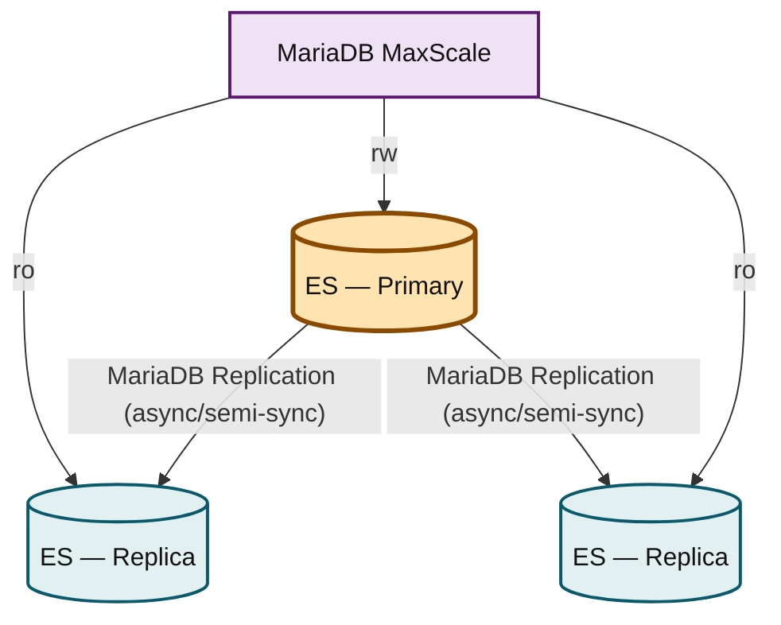
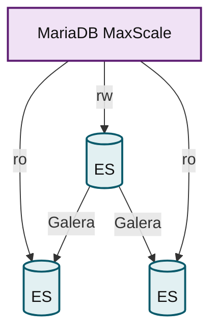
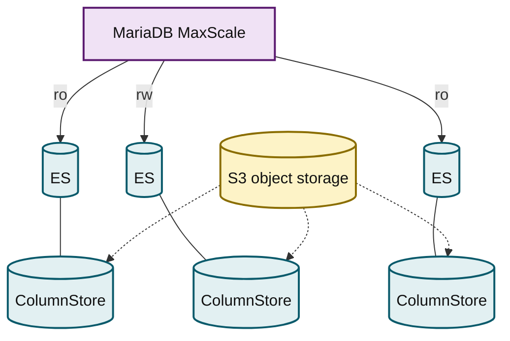
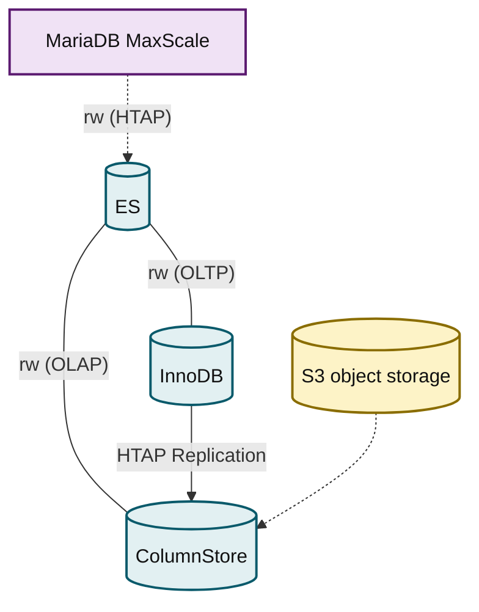

# Topologies Overview

MariaDB products can be deployed in many different topologies. The topologies described in this section are representative of the overall structure. MariaDB products can be deployed to form other topologies, leverage advanced product capabilities, or combine the capabilities of multiple topologies.

Topologies are the arrangements of nodes and links to achieve a purpose. This documentation describes a few of the many topologies that can be deployed using MariaDB database products.

We group topologies by workload (transactional, analytical, or hybrid) and technologies (Enterprise Spider). Single-node topologies are listed separately.

To help you select the correct topology:

* Each topology is named, and this name is used consistently throughout the documentation.
* A thumbnail diagram provides a small-scale summary of the topology's architecture.
* Finally, we provide a list of the benefits of the topology.

Although multiple topologies are listed on this page, the listed topologies are not the only options. MariaDB products are flexible, configurable, and extensible, so it is possible to deploy different topologies that combine the capabilities of multiple topologies listed on this page. The topologies listed on this page are primarily intended to be representative of the most commonly requested use cases.

## Transactional (OLTP)

### Primary/Replica Topology

_MaxScale routes reads to two replicas and writes to one primary, which replicates to both._

<strong>MariaDB Replication</strong>

<ul><li>Highly available</li><li>Asynchronous or semi-synchronous replication</li><li>Automatic failover via MaxScale</li><li>Manual provisioning of new nodes from backup</li><li>Scales read via MaxScale.</li><li>Enterprise Server 10.3+, MaxScale 2.5+</li></ul>

### Galera Cluster Topology

_MaxScale routes to three Galera Cluster nodes that replicate virtually synchronously with each other._

<strong>Galera Cluster Topology Multi-Primary Cluster Powered by Galera for Transactional/OLTP Workloads</strong>

<ul><li>InnoDB Storage Engine</li><li>Highly available</li><li>Virtually synchronous, certification-based replication</li><li>Automated provisioning of new nodes (IST/SST)</li><li>Scales reads via MaxScale Enterprise Server 10.3+, MariaDB Enterprise Cluster (powered by Galera), MaxScale 2.5+</li></ul>

## Analytical (OLAP, Data Warehousing, DSS)

### ColumnStore Shared Local Storage Topology

| Diagram                                                                   | Features                                                                                                                                                                                                                                                                                                                                                               |
| ------------------------------------------------------------------------- | ---------------------------------------------------------------------------------------------------------------------------------------------------------------------------------------------------------------------------------------------------------------------------------------------------------------------------------------------------------------------- |
| .png>) | 
<strong>Columnar storage engine with shared local storage</strong>
<ul><li>Highly available</li><li>Automatic failover via MaxScale and CMAPI</li><li>Scales reads via MaxScale</li><li>Bulk data import</li><li>Enterprise Server, ColumnStore, MaxScale</li><li>Optional <a href="columnstore-read-replicas.md">Read Replica topology</a></li></ul> |

### ColumnStore Object Storage Topology

_MaxScale routes to three ColumnStore nodes that all read and write the same S3 object storage._

<strong>Columnar storage engine with S3-compatible object storage</strong>

<ul><li>Highly available</li><li>Automatic failover via MaxScale and CMAPI</li><li>Scales reads via MaxScale</li><li>Bulk data import</li><li>Enterprise Server, ColumnStore, MaxScale</li></ul>

## Hybrid Workloads

### HTAP Topology

_MaxScale routes HTAP traffic to one server that replicates from InnoDB to S3-backed ColumnStore._

<ul><li>Single-stack hybrid transactional/analytical workloads</li><li>ColumnStore for analytics with scalable S3-compatible object storage</li><li>InnoDB for transactions• Cross-engine JOINs</li><li>Enterprise Server, ColumnStore, MaxScale</li></ul>




