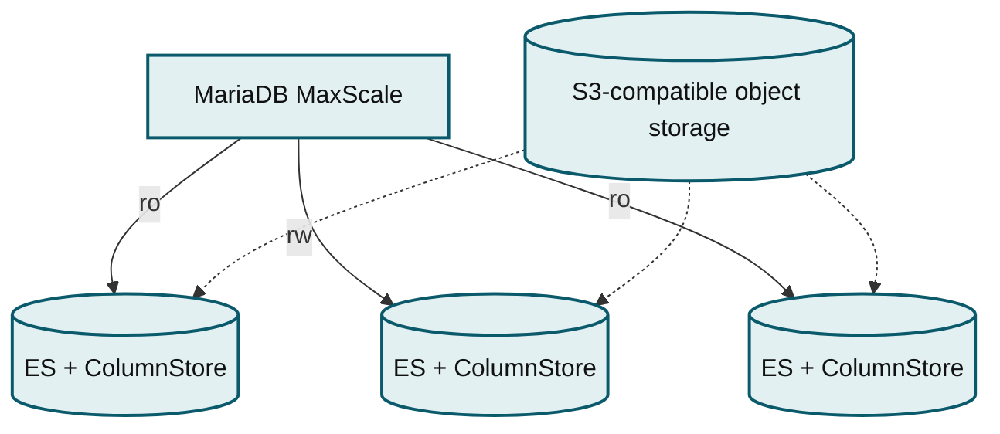
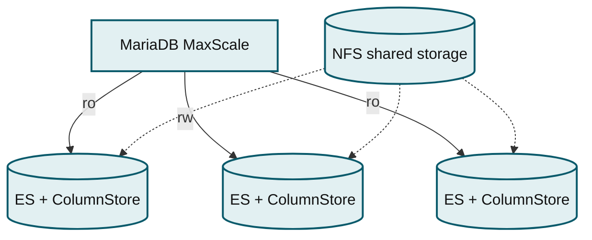

# Backup and Restore Overview

## Overview

MariaDB ColumnStore supports backup and restore.

## System of Record

Before you determine a backup strategy for your ColumnStore deployment, it is a good idea to determine the **system of record** for your ColumnStore data.

A system of record is the authoritative data source for a given piece of information. Organizations often store duplicate information in several systems, but only a single system can be the authoritative data source.

ColumnStore is designed to handle analytical processing for OLAP, data warehousing, DSS, and hybrid workloads on very large data sets. Analytical processing does not generally happen on the system of record. Instead, analytical processing generally occurs on a specialized database that is loaded with data from the separate system of record. Additionally, very large data sets can be difficult to back up. Therefore, it may be beneficial to only backup the system of record.

If ColumnStore is not acting as the system of record for your data, you should determine how the system of record affects your backup plan:

* If your system of record is another database server, you should ensure that the other database server is properly backed up and that your organization has procedures to reload ColumnStore from the other database server.
* If your system of record is a set of data files, you should ensure that the set of data files is properly backed up and that your organization has procedures to reload ColumnStore from the set of data files.

## Full Backup and Restore

MariaDB ColumnStore supports full backup and restore for all storage types. A full backup includes:

* ColumnStore's data and metadata

With S3: an S3 snapshot of the [S3-compatible object storage](../../architecture/columnstore-architectural-overview.md#s3-compatible-object-storage-1) and a file system snapshot or copy of the [Storage Manager directory](../../architecture/columnstore-storage-architecture.md#storage-manager-directory) Without S3: a file system snapshot or copy of the [DB Root directories](../../architecture/columnstore-storage-architecture.md#db-root-directories).

* The MariaDB data directory from the primary node

To see the procedure to perform a full backup and restore, choose the storage type:

**[ColumnStore with Object Storage](mariadb-enterprise-columnstore-backup-and-restore-with-object-storage.md)**

_MaxScale routes read/write traffic to three ES + ColumnStore nodes backed by S3-compatible object storage._

**[ColumnStore with Shared Local Storage](../../architecture/columnstore-architectural-overview.md#enterprise-columnstore-with-shared-local-storage)**

_MaxScale routes read/write traffic to three ES + ColumnStore nodes backed by NFS shared storage._




