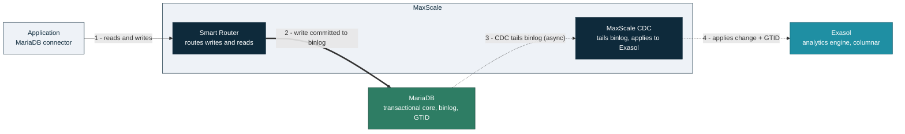
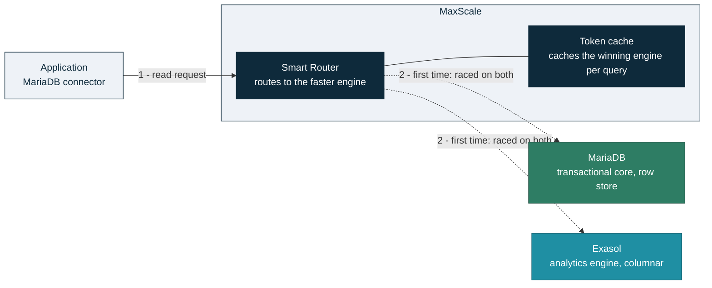
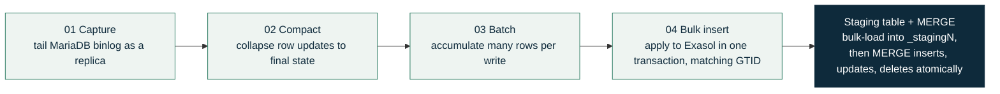

# Architecture

## Overview

MariaDB Exa combines three core components into a single Hybrid Transactional and Analytical Processing (HTAP) system:

| Role | Component | Purpose |
| --- | --- | --- |
| **Router** | MariaDB MaxScale with CDC | Intelligent query routing (SmartRouter + Exasolrouter) and Change Data Capture that synchronizes data from MariaDB to Exasol. |
| **Storage** | MariaDB Enterprise Server | The primary system of record for transactional workloads (OLTP), ensuring data integrity and consistency. |
| **Insights** | Exasol | A high-performance, in-memory, MPP engine purpose-built for extreme OLAP query performance. |

Applications use a single MariaDB connection endpoint for both OLTP and analytics. MaxScale decides, per query, whether MariaDB or Exasol answers faster, and keeps Exasol in sync through asynchronous Change Data Capture (CDC).


MaxScale-native CDC to Exasol requires **MaxScale 25.10.3 or later**. Earlier integrations based on Debezium and Kafka are superseded and no longer used.


## Data flow (write path)

Writes always go to MariaDB. MaxScale CDC connects to MariaDB as a replica, tails the binary log, and applies committed changes to Exasol in GTID order, so Exasol reflects committed writes with minimal lag. Replication is asynchronous.

_Solid arrows show the synchronous write path; dotted arrows show asynchronous CDC replication._

## Query flow (read path)

For reads, the SmartRouter learns which engine answers each query faster and routes accordingly:



**Read request**

The application sends a read to the single MaxScale endpoint.



**First time: race both engines**

When SmartRouter first sees a query (in its canonical form, with constants replaced by placeholders), it runs it on both MariaDB and Exasol simultaneously.



**Fastest wins**

The first engine to respond returns the result; the slower query is cancelled.



**Winner cached**

SmartRouter caches the winning engine, so future reads of the same canonical query route straight to it. The decision is re-measured on an escalating schedule (2, 5, 10, then 20 minutes), so routing stays correct as data volume and distribution change.



## Deployment topologies

MariaDB Exa supports four topologies, differing in scale and how analytics clients reach Exasol:

| Topology | MariaDB / MaxScale / Exasol | Routing strategy | Typical use |
| --- | --- | --- | --- |
| **Micro** | 1 / 1 / 1 | HTAP SmartRouter | Development and functional testing |
| **Standard** | Primary + replicas / 2 / cluster + standby | HTAP SmartRouter | Production HTAP: one endpoint for OLTP and OLAP |
| **Exasol Router** | Primary + replicas / 2 / cluster + standby | Exasolrouter over the MariaDB wire protocol | BI tools querying Exasol through MaxScale's MariaDB endpoint |
| **Exasol Direct** | Primary + replicas / 2 / cluster + standby | Direct via the Exasol connector | BI tools connecting straight to Exasol with its native connector |

In every topology, MaxScale CDC keeps Exasol synchronized from the MariaDB binary log. The **Micro** topology collapses everything to single nodes for testing; **Standard** adds MariaDB replicas, an Exasol cluster with a standby node, and a second MaxScale for high availability. The **Exasol Router** and **Exasol Direct** topologies change only how analytics clients reach Exasol — through MaxScale or directly.

## Change data capture pipeline

MaxScale CDC uses the `binlogrouter` module to read the MariaDB binary log and bulk-load changes into Exasol over the Exasol ODBC driver. Internally each batch runs through four stages before it is applied to Exasol through a staging table and a `MERGE`:

For the full configuration procedure, see the [MariaDB MaxScale Exasolrouter Tutorial](https://app.gitbook.com/s/0pSbu5DcMSW4KwAkUcmX/mariadb-maxscale-tutorials/mariadb-maxscale-exasolrouter). Pipeline tuning parameters are covered in [Performance & Benchmarking](performance-and-benchmarking.md).




