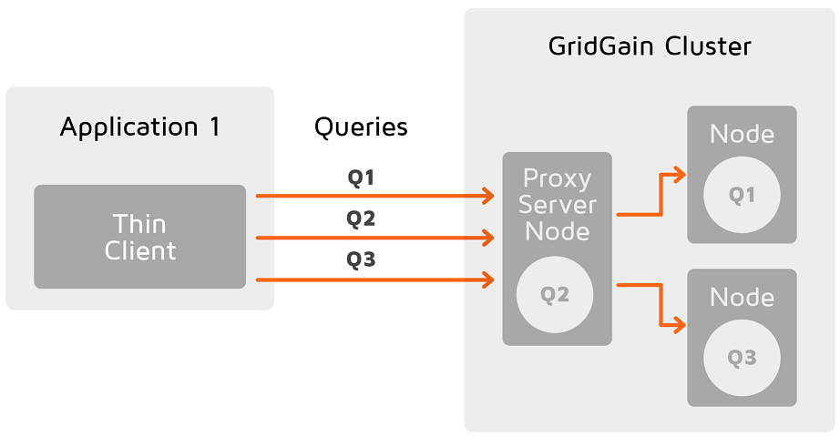
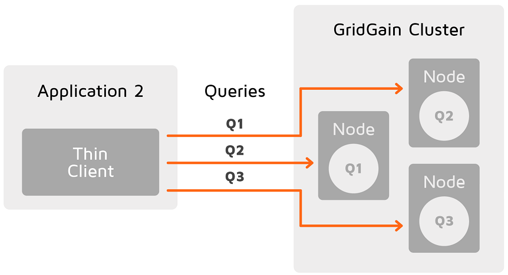

# .NET Thin Client

## Prerequisites

- Supported runtimes: .NET 4.0+, .NET Core 2.0+
- Supported OS: Windows, Linux, macOS (any OS supported by .NET Core 2.0+)

## Installation

The .NET thin client API is provided by the GridGain.NET API library, which is located in the `{GRIDGAIN_HOME}/platforms/dotnet` directory of the GridGain distribution package.
The API is located in the `Apache.Ignite.Core` assembly.

## Connecting to Cluster

The thin client API entry point is the `Ignition.StartClient(IgniteClientConfiguration)` method.
The `IgniteClientConfiguration.Endpoints` property is mandatory; it must point to the host where the server node is running.

```csharp
var cfg = new IgniteClientConfiguration
{
    Endpoints = new[] {"127.0.0.1:10800"}
};

using (var client = Ignition.StartClient(cfg))
{
    var cache = client.GetOrCreateCache<int, string>("cache");
    cache.Put(1, "Hello, World!");
}

```

### Failover

You can provide multiple node addresses. In this case thin client connects to a random node in the list, and the failover mechanism is enabled: if a server node fails, client tries other known addresses and reconnects automatically.
Note that `IgniteClientException` can be thrown if a server node fails while client operation is being performed -
user code should handle this exception and implement retry logic accordingly.

### Automatic Server Node Discovery

Thin clients connect to one or more servers. The set of endpoints is defined in `ClientConfiguration` and cannot change after a client starts. However, clusters can change their topology dynamically: nodes can start and stop, IP addresses can change, etc. To account for that, thin clients can discover server nodes automatically when connected to any of them, and maintain an up to date list of servers at all times.

The automatic node discovery is enabled by default. To disable this behavior, set the `IgniteClientConfiguration.EnableClusterDiscovery` property to "false".

The client performs the discovery as follows:

1. Connects to one or more endpoints from `IgniteClientConfiguration.Endpoints`.
2. Retrieves the current topology.
3. Connects to every server from Step 2 it hasn't connected to before:
   1. Uses node UUID to make sure it doesn't connect to the same node twice.
   2. Drops the connection in case of a UUID mismatch.
4. For every response to every operation, compares the topology version from the header to the topology version from Step 2.
5. Connects to the newly discovered servers, removes connections to the removed servers.
6. Repeats Step 4.

Server discovery is an asynchronous process - it happens in the background. Moreover, thin client receives topology updates only when it performs operations (to minimize server load and network traffic from idle connections).

You can observe the discovery process by enabling logging and/or calling `IIgniteClient.GetConnections`:

```csharp
var cfg = new IgniteClientConfiguration
{
    Endpoints = new[] {"127.0.0.1:10800"},
    EnablePartitionAwareness = true,

    // Enable trace logging to observe discovery process.
    Logger = new ConsoleLogger { MinLevel = LogLevel.Trace }
};

var client = Ignition.StartClient(cfg);

// Perform any operation and sleep to let the client discover
// server nodes asynchronously.
client.GetCacheNames();
Thread.Sleep(1000);

foreach (IClientConnection connection in client.GetConnections())
{
    Console.WriteLine(connection.RemoteEndPoint);
}
```


We recommend disabling server node discovery if servers reside on a different subnet (behind a NAT server or a proxy, in a different cloud, etc.).
Server nodes provide their addresses and ports to the client, but when the client is in a different subnet, those addresses won't work.


#### Host Names and TLS

By default, server nodes advertise their IP addresses during discovery.
If clients must connect using host names (for example, when TLS is enabled and certificates contain host names),
configure each server node to advertise its host name by setting `IgniteConfiguration.Localhost` on the **server** side.

```csharp
var cfg = new IgniteConfiguration
{
    Localhost = "my-server1-hostname",
    // ...
};
```

### Connection Timeouts

You can configure two independent timeouts:

- **Handshake timeout** — the maximum time to establish a connection to a server node, including the
socket connection, the SSL/TLS handshake, and protocol negotiation. Set it with the
`IgniteClientConfiguration.HandshakeTimeout` property.
- **Request timeout** — the maximum time to complete an individual operation on an established
connection. Set it with the `IgniteClientConfiguration.RequestTimeout` property.

Both timeouts defaults to `5` seconds. A `0` or negative value means an infinite timeout.

```csharp
var cfg = new IgniteClientConfiguration
{
    Endpoints = new[] {"127.0.0.1:10800"},
    HandshakeTimeout = TimeSpan.FromSeconds(10),
    RequestTimeout = TimeSpan.FromSeconds(5)
};
```

The handshake timeout applies to each address separately: if the client cannot complete the
handshake with one server node in time, it tries the remaining addresses. When none of them
succeed, the client throws an `AggregateException` that contains one error per address it tried. An
operation that exceeds the request timeout fails with a `SocketError.TimedOut`.


The `IgniteClientConfiguration.SocketTimeout` property is deprecated. Setting it applies the same
value to both the handshake and the request timeout, so existing configurations keep working. Migrate to `HandshakeTimeout` and `RequestTimeout` to tune the
two phases independently.


## Partition Awareness

Partition awareness allows the thin client to send query requests directly to the node that owns the queried data.

Without partition awareness, an application that is connected to the cluster via a thin client executes all queries and operations via a single server node that acts as a proxy for the incoming requests.
These operations are then re-routed to the node that stores the data that is being requested.
This results in a bottleneck that could prevent the application from scaling linearly.



Notice how queries must pass through the proxy server node, where they are routed to the correct node.

With partition awareness in place, the thin client can directly route queries and operations to the primary nodes that own the data required for the queries.
This eliminates the bottleneck, allowing the application to scale more easily.



To enable partition awareness, set the `IgniteClientConfiguration.EnablePartitionAwareness` property to `true`.
This enables [server discovery](#automatic-server-node-discovery) as well.
If the client is behind a NAT or a proxy, automatic server discovery may not work.
In this case provide addresses of all server nodes in the client's connection configuration.

## Using Key-Value API

### Getting Cache Instance

The `ICacheClient` interface provides the key-value API. You can use the following methods to obtain an instance of `ICacheClient`:

- `GetCache(cacheName)` — returns an instance of an existing cache.
- `CreateCache(cacheName)` — creates a cache with the given name.
- `GetOrCreateCache(CacheClientConfiguration)` — gets or creates a cache with the given configuration.

```csharp
var cacheCfg = new CacheClientConfiguration
{
    Name = "References",
    CacheMode = CacheMode.Replicated,
    WriteSynchronizationMode = CacheWriteSynchronizationMode.FullSync
};
var cache = client.GetOrCreateCache<int, string>(cacheCfg);
```

Use `IIgnite​Client.GetCacheNames()` to obtain a list of all existing caches.

### Basic Operations

The following code snippet demonstrates how to execute basic cache operations on a specific cache.

```csharp
var data = Enumerable.Range(1, 100).ToDictionary(e => e, e => e.ToString());

cache.PutAll(data);

var replace = cache.Replace(1, "2", "3");
Console.WriteLine(replace); //false

var value = cache.Get(1);
Console.WriteLine(value); //1

replace = cache.Replace(1, "1", "3");
Console.WriteLine(replace); //true

value = cache.Get(1);
Console.WriteLine(value); //3

cache.Put(101, "101");

cache.RemoveAll(data.Keys);
var sizeIsOne = cache.GetSize() == 1;
Console.WriteLine(sizeIsOne); //true

value = cache.Get(101);
Console.WriteLine(value); //101

cache.RemoveAll();
var sizeIsZero = cache.GetSize() == 0;
Console.WriteLine(sizeIsZero); //true
```

### Asynchronous Execution

The thin client is I/O-bound: every operation is sent to the cluster over the network. To avoid blocking the calling thread while waiting for network I/O, most public APIs have an asynchronous counterpart that returns a `Task`.

This includes key-value operations such as `PutAsync`, `GetAsync`, `GetAllAsync`, `RemoveAllAsync`, cache lifecycle methods such as `GetOrCreateCacheAsync`, `CreateCacheAsync`, `DestroyCacheAsync`, queries (`QueryAsync`, `QueryContinuousAsync`), and cluster, atomic, and service APIs.

```csharp
// Every cache operation has an async counterpart that returns a Task
// and does not block the calling thread while waiting on network I/O.
var cache = await client.GetOrCreateCacheAsync<int, string>("cache");

await cache.PutAsync(1, "Hello, World!");

var value = await cache.GetAsync(1);
Console.WriteLine(value); // Hello, World!
```

### Closing a Data Streamer Asynchronously

The thin-client data streamer (`IDataStreamerClient`) implements `IAsyncDisposable` in addition to `IDisposable`. Use an `await using` block to dispose of the streamer asynchronously: the buffered entries are flushed to the cluster without blocking the calling thread.

```csharp
await using (var streamer = client.GetDataStreamer<int, string>("myCache"))
{
    for (var i = 0; i < 1000; i++)
        streamer.Add(i, i.ToString());
}
// DisposeAsync calls CloseAsync(cancel: false): the buffered entries are
// flushed to the cluster without blocking the calling thread.
```

### Closing a Transaction Asynchronously

A thin-client transaction (`ITransactionClient`) implements `IAsyncDisposable` in addition to `IDisposable`. Use an `await using` block so that, if the transaction is disposed without being committed, the rollback is sent to the cluster without blocking the calling thread.

```csharp
await using (var tx = client.GetTransactions().TxStart())
{
    cache.Put(1, cache.Get(1) - 100);
    cache.Put(2, cache.Get(2) + 100);

    tx.Commit();
}
// Commit() is synchronous - the thin-client transaction has no async commit.
// The benefit of "await using" is disposal: if the block exits without
// Commit() (for example, on an exception), DisposeAsync rolls the
// transaction back without blocking the calling thread.
```

### Closing a Continuous Query Asynchronously

The handle returned by a continuous query (`IContinuousQueryHandleClient`) implements `IAsyncDisposable` in addition to `IDisposable`. Use an `await using` block to stop the query and release its server-side resources asynchronously. You can also start the query with the `QueryContinuousAsync` overload, as shown below.

```csharp
var query = new ContinuousQueryClient<int, string>(new MyCacheEntryListener());

await using (var handle = await cache.QueryContinuousAsync(query))
{
    // The listener receives updates while the handle is open.
    await Task.Delay(TimeSpan.FromSeconds(10));
}
// DisposeAsync stops the continuous query and releases the server-side
// resources without blocking the calling thread.
```

### Working With Binary Objects

The .NET thin client supports the Binary Object API described in the [Working with Binary Objects](https://www.gridgain.com/docs/gridgain8/latest/developers-guide/key-value-api/binary-objects) section. Use `ICacheClient.WithKeepBinary()` to switch the cache to binary mode and start working directly with binary objects avoiding serialization/deserialization. Use `IIgniteClient.GetBinary()` to get an instance of `IBinary` and build an object from scratch.

```csharp
var binary = client.GetBinary();

var val = binary.GetBuilder("Person")
    .SetField("id", 1)
    .SetField("name", "Joe")
    .Build();

var cache = client.GetOrCreateCache<int, object>("persons").WithKeepBinary<int, IBinaryObject>();

cache.Put(1, val);

var value = cache.Get(1);
```

## Scan Queries

Use a scan query to get a set of entries that satisfy a given condition.
The thin client sends the query to the cluster node where it is executed as a normal scan query.

The query condition is specified by an `ICacheEntryFilter` object that is passed to the query constructor as an argument.

Define a query filter as follows:

```csharp
class NameFilter : ICacheEntryFilter<int, Person>
{
    public bool Invoke(ICacheEntry<int, Person> entry)
    {
        return entry.Value.Name.Contains("Smith");
    }
}
```

Then execute the scan query:

```csharp
var cache = client.GetOrCreateCache<int, Person>("personCache");

cache.Put(1, new Person {Name = "John Smith"});
cache.Put(2, new Person {Name = "John Johnson"});

using (var cursor = cache.Query(new ScanQuery<int, Person>(new NameFilter())))
{
    foreach (var entry in cursor)
    {
        Console.WriteLine("Key = " + entry.Key + ", Name = " + entry.Value.Name);
    }
}

```

A query cursor implements `IAsyncEnumerable<T>`, so you can execute the query with `QueryAsync` and stream the results with `await foreach`. Each page of results is fetched from the cluster asynchronously as you iterate, without blocking the calling thread:

```csharp
// QueryAsync returns the cursor without blocking; the cursor implements
// IAsyncEnumerable, so each page is fetched over the socket as you iterate.
var cursor = await cache.QueryAsync(new ScanQuery<int, Person>(new NameFilter()));

await foreach (var entry in cursor)
{
    Console.WriteLine("Key = " + entry.Key + ", Name = " + entry.Value.Name);
}
```


A cursor can be enumerated only once. Calling `GetAll()` and then iterating the same cursor (or iterating it twice) throws an `InvalidOperationException`. Pass a `CancellationToken` with `.WithCancellation(token)` to stop iteration early.


## Executing SQL Statements

The thin client provides a SQL API to execute SQL statements. SQL statements are declared using `SqlFieldsQuery` objects and executed through the `ICacheClient.Query(SqlFieldsQuery)` method.
Alternatively, SQL queries can be performed via GridGain LINQ provider.

```csharp
var cache = client.GetOrCreateCache<int, Person>("Person");
cache.Query(new SqlFieldsQuery(
        $"CREATE TABLE IF NOT EXISTS Person (id INT PRIMARY KEY, name VARCHAR) WITH \"VALUE_TYPE={typeof(Person)}\"")
    {Schema = "PUBLIC"}).GetAll();

var key = 1;
var val = new Person {Id = key, Name = "Person 1"};

cache.Query(
    new SqlFieldsQuery("INSERT INTO Person(id, name) VALUES(?, ?)")
    {
        Arguments = new object[] {val.Id, val.Name},
        Schema = "PUBLIC"
    }
).GetAll();

var cursor = cache.Query(
    new SqlFieldsQuery("SELECT name FROM Person WHERE id = ?")
    {
        Arguments = new object[] {key},
        Schema = "PUBLIC"
    }
);

var results = cursor.GetAll();

var first = results.FirstOrDefault();
if (first != null)
{
    Console.WriteLine("name = " + first[0]);
}

```

To run the query asynchronously and stream the rows as they arrive, use `QueryAsync` together with `await foreach`:

```csharp
var cursor = await cache.QueryAsync(
    new SqlFieldsQuery("SELECT name FROM Person")
    {
        Schema = "PUBLIC"
    });

await foreach (var row in cursor)
{
    Console.WriteLine("name = " + row[0]);
}
```

`SqlFieldsQuery` supports a `Label` property that identifies the query in system views and long-running query warnings. See [SQL Query Labels](https://www.gridgain.com/docs/gridgain8/latest/perf-troubleshooting-guide/sql-tuning#sql-query-labels) for details.

## Calling Services

Use [`IIgniteClient.GetServices()`](https://www.gridgain.com/sdk/gridgain8/latest/dotnetdoc/api/Apache.Ignite.Core.Client.IIgniteClient.html#Apache_Ignite_Core_Client_IIgniteClient_GetServices) to obtain an `IServicesClient` instance, then call `GetServiceProxy<T>(serviceName)` to get a proxy for a deployed service. `T` here is an interface that declares the service methods you want to call. See [Services](https://www.gridgain.com/docs/gridgain8/latest/developers-guide/services/services) for how services are deployed.


Service proxies are not sticky by default: there is no guarantee that consecutive calls reach the same remote service instance. To route calls to the same instance, create the proxy with `sticky: true`.


### Calling Services Asynchronously

When a proxy method returns `Task`, `Task<TResult>`, `ValueTask`, or `ValueTask<TResult>`, the thin client invokes the service asynchronously: the calling thread is not blocked, and the returned task completes when the result arrives from the cluster. Methods with any other return type are invoked synchronously.

The return type is a property of the interface you declare on the client, not of the service itself. A synchronous service, including one written in Java, can be called asynchronously by declaring the method with a task return type:

```csharp
interface IMyServiceAsyncClient
{
    // The deployed service is synchronous; only the client-side
    // signatures are asynchronous.
    Task<int> ComputeValue(int arg);

    Task Refresh();
}
```

```csharp
var svc = client.GetServices().GetServiceProxy<IMyServiceAsyncClient>("myService");

// The request is sent to the cluster without blocking the calling
// thread; the task completes when the result arrives.
int value = await svc.ComputeValue(42);

await svc.Refresh();
```


Task return types are also accepted by the thick client's `IIgnite.GetServices()` proxy, but there the call is executed synchronously and the result is returned as an already-completed task. Use the thin client for non-blocking service invocation.


## Enabling Logging

You can enable logging of thin client's events with the a logger implementation of your choice:

```csharp
var cfg = new IgniteClientConfiguration("127.0.0.1:10800")
{
    Logger = new ConsoleLogger { MinLevel = LogLevel.Info },
};
using var client = Ignition.StartClient(cfg);
```

## Security

### SSL/TLS

To use encrypted communication between the thin client and the cluster, you have to enable SSL/TLS in both the cluster configuration and the client configuration. Refer to the [Enabling SSL/TLS for Thin Clients](getting-started-with-thin-clients.md#enabling-ssl-tls-for-thin-clients) section for the instruction on the cluster configuration.

The following code example demonstrates how to configure SSL parameters in the thin client.

```csharp
var cfg = new IgniteClientConfiguration
{
    Endpoints = new[] {"127.0.0.1:10800"},
    SslStreamFactory = new SslStreamFactory
    {
        CertificatePath = ".../certs/client.pfx",
        CertificatePassword = "password",
    }
};
using (var client = Ignition.StartClient(cfg))
{
    //...
}

```

### Authentication

Configure [authentication on the cluster side](https://www.gridgain.com/docs/gridgain8/latest/administrators-guide/security/authentication) and provide a valid user name and password in the client configuration.

```csharp
var cfg = new IgniteClientConfiguration
{
    Endpoints = new[] {"127.0.0.1:10800"},
    UserName = "gridgain",
    Password = "gridgain"
};
using (var client = Ignition.StartClient(cfg))
{
    //...
}

```

### Authorization

For information about authorizing thin client connections, see the [Client Authorization](authorization.md) page.

## Data Center Replication

### Sender Groups

Configure sender groups for [sender nodes](https://www.gridgain.com/docs/gridgain8/latest/administrators-guide/data-center-replication/configuring-replication#sender-nodes) by using the ClientCacheDrSenderConfiguration.

The below example adds the node to the `group1` sender group:

```csharp
using IIgniteClient client = Ignition.StartClient(
    new IgniteClientConfiguration("localhost"));

var cacheCfg = new CacheClientConfiguration
{
    Name = "dr-cache",
    PluginConfigurations = new[]
    {
        new GridGainCacheClientPluginConfiguration
        {
            DrSenderConfiguration = new ClientCacheDrSenderConfiguration
            {
                SenderGroup = "group1"
            }
        }
    }
};

ICacheClient<int,int> cache = client.CreateCache<int, int>(cacheCfg);
```
