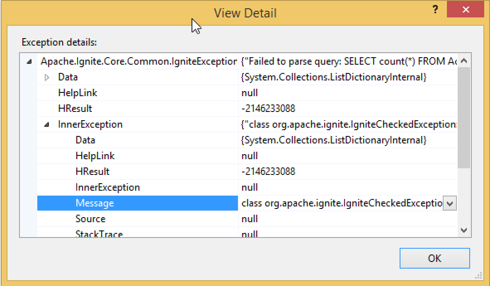

# GridGain.NET Troubleshooting

## Overview

This page covers several troubleshooting techniques and commonly-known issues you can come across while building and
using your GridGain.NET applications in production.

## Troubleshooting With Console

Ignite produces console output (stdout): information, metrics, warnings, error details. If your app does not open console, you may redirect the console output to a string or a file:

```csharp
var sw = new StringWriter();
Console.SetOut(sw);

// Examine output:
sw.ToString();
```

## Getting More Insights On Exceptions

When you are getting an `IgniteException`, always make sure to examine the `InnerException` property that often contains
more details on the root cause of the issue. You can do that in Visual Studio debugger or by calling `ToString()` on the exception object:



```csharp
try {
    IQueryCursor<List> cursor = cache.QueryFields(query);
}
catch (IgniteException e) {
    // Printing out the whole exception message.
    Console.WriteLine(e.ToString());
}
```

## Commonly-Known Issues

The following section covers several issues you can come across while designing your GridGain.NET applications.

### Failed to load jvm.dll

Make sure that Java Development Kit is installed, and the `JAVA_HOME` variable is set and points to a JDK installation directory.

The `errorCode=193` code is `ERROR_BAD_EXE_FORMAT`, which is often caused by x64/x86 mismatch. Make sure that the installed
JDK and your application have the same x64/x86 platform target. Ignite detects proper JDK automatically when `JAVA_HOME` is not set,
so if you have x86 AND x64 JDK installed, it will work in any mode.

The `126 ERROR_MOD_NOT_FOUND` code can occur due to missing dependencies:

- JDK 8 requires Microsoft Visual C++ 2010 Redistributable Package
- Later JDK versions require Microsoft Visual C++ 2015 Redistributable Package or later

### Java class is not found

Check your the `IGNITE_HOME` environment variable, `IgniteConfiguration.IgniteHome` and `IgniteConfiguration.JvmClasspath` properties.
Refer to [Deployment](net-deployment-options.md) section for more details. ASP.NET/IIS scenarios require additional steps.

### Freeze on Ignition.Start

Examine console output. Most often this is caused by a topology join failure:

- Ignite `DiscoverySpi` settings are incorrect
- `ClientMode` is true, but there are no servers nodes that form the cluster.

### Failed to start manager : GridManagerAdapter

Examine console output. Most often this is caused by an invalid or incompatible configuration:

- Some configuration property has an invalid value (out of range and the like).
- Some configuration property is incompatible with a value in other cluster nodes. In particular, `BinaryConfiguration` properties,
such as `CompactFooter`, `IdMapper`, and `NameMapper` should be the same on all nodes.

The latter problem often arises when building a mixed cluster (Java + .NET nodes), because default configuration on these
platforms is different. .NET only supports `BinaryBasicIdMapper` and `BinaryBasicNameMapper`. Java configuration has to
be fixed the following way to enable .NET nodes connectivity:

```xml
<property name="binaryConfiguration">
    <bean class="org.apache.ignite.configuration.BinaryConfiguration">
        <property name="compactFooter" value="true"/>
        <property name="idMapper">
            <bean class="org.apache.ignite.binary.BinaryBasicIdMapper">
                <constructor-arg value="true"/>
            </bean>
        </property>
        <property name="nameMapper">
            <bean class="org.apache.ignite.binary.BinaryBasicNameMapper">
                <constructor-arg value="true"/>
            </bean>
        </property>
    </bean>
</property>
```

### Could not load file or assembly 'MyAssembly' or one of its dependencies. The system cannot find the file specified.

This exception can occur due to missing assemblies on remote nodes.
See [Standalone Nodes: Loading User Assemblies](net-standalone-nodes.md#load-user-assemblies) for details.

### Stack smashing detected: dotnet terminated

This happens on Linux with .NET Core when `NullReferenceException` occurs in user code. The reason is that both .NET and
Java use `SIGSEGV` to handle certain exceptions, including `NullPointerException` and `NullReferenceException`, and when
JVM runs in the same process as .NET, it overrides that handler, breaking .NET exception handling
(see [1](https://github.com/dotnet/coreclr/issues/25945), [2](https://github.com/dotnet/coreclr/issues/25166)).

The fix for this issue exists in .NET Core 3.0 ([#25972](https://github.com/dotnet/coreclr/pull/25972)), by setting the `COMPlus_EnableAlternateStackCheck` environment variable to `1`.

### Zombie processes on Linux

On Linux, both .NET and Java install `SIGCHLD` handler to deal with child process termination.

- Handlers are installed lazily (when a `Process` is first started)
- Only one handler can exist at a time

Therefore, it is possible that Java overwrites .NET handler, or vice versa,
making it impossible to clean up child processes on one of the platforms,
resulting in [zombie processes](https://en.wikipedia.org/wiki/Parent_process).

**GridGain uses child processes on Java side in one particular case: when Persistence is enabled and `direct-io` module is used.**
In this case .NET `System.Diagnostics.Process` API should not be used.

#### Workaround

To work around the issue, make sure that child processes are created either only on Java side, or only on .NET side.

For example, when `direct-io` is used, and .NET code requires starting a child process,
move the process handling logic to Java side and invoke it with
[Compute](https://www.gridgain.com/docs/gridgain8/latest/developers-guide/distributed-computing/distributed-computing) `ExecuteJavaTask` API.
Alternatively, use Services API to call Java service from .NET.

### DllNotFoundException: Unable to load shared library 'libcoreclr.so' or one of its dependencies

Occurs on .NET 5 in a single-file publish mode (e.g. `dotnet publish --self-contained true -r linux-x64 -p:PublishSingleFile=true`).

#### Workaround

Add the following code before starting the Ignite node:

```csharp
NativeLibrary.SetDllImportResolver(
typeof(Ignition).Assembly,
(lib, _, _) => lib == "libcoreclr.so" ? (IntPtr) (-1) : IntPtr.Zero);
```

### .NET 9: Process exited with code -1073740791 (0xc0000409)

Caused by Intel CET (Control-flow Enforcement Technology) being [enabled by default for .NET 9 assemblies](https://learn.microsoft.com/en-us/dotnet/core/compatibility/interop/9.0/cet-support).
Ignite starts a JVM in-process, which is incompatible with CET.

More details:

- [Breaking changes in .NET 9](https://learn.microsoft.com/en-us/dotnet/core/compatibility/9.0)
- [CET Internals in Windows](https://windows-internals.com/cet-on-windows/)
- [Blog: Ignite on .NET 9](https://ptupitsyn.github.io/Ignite-on-NET-9/)

#### Workaround

Disable CET for the application by adding the following to the main project file (csproj, vsproj, etc):

```xml
<PropertyGroup>
  <CETCompat>false</CETCompat>
</PropertyGroup>
```

## .NET Diagnostics in GridGain 8

When you run a .NET server node or thick client in GridGain 8, the JVM and the .NET CLR run inside a single system process. This has two main implications:

- You must use Java tools (for example, [`jcmd`](https://docs.oracle.com/javase/8/docs/technotes/tools/windows/jcmd.html)) and .NET tools (for example, [`dotnet-stack`](https://learn.microsoft.com/en-us/dotnet/core/diagnostics/dotnet-stack)) against the same PID.
- Call chains can cross runtime boundaries in both directions:
  - `.NET cache.get` → Java `cache.get`
  - A .NET compute job is wrapped in a Java job: a Java worker executes the job wrapper and delegates the final step back to .NET.


If a Java stack trace ends with `PlatformCallbackUtils`, the rest of the call chain is in the corresponding .NET stack trace of the same process. If a Java stack trace starts with `PlatformTargetProxyImpl`, the call originates from .NET.


### .NET Diagnostic Tools

For .NET diagnostics use the standard Microsoft tools:

- `dotnet-stack` – thread stacks
- `dotnet-dump` – process memory dumps
- `dotnet-trace` – EventPipe tracing
- `dotnet-counters` – runtime counters
- `dotnet-gcdump` – GC heap snapshots

For the full list and details, see the following [documentation](https://learn.microsoft.com/en-us/dotnet/core/diagnostics/tools-overview).

After successful installation, run these tools against the GridGain process PID:

- `jcmd <pid>` for JVM state
- `dotnet-stack --process-id <pid>` for CLR state

#### Diagnostics in Docker and Kubernetes

When GridGain runs inside containers, follow Microsoft’s container diagnostics [guidance](https://learn.microsoft.com/en-us/dotnet/core/diagnostics/diagnostics-in-containers).

Keep in mind that:

- The diagnostics tools must be available inside the target container or in a temporary debug/sidecar container.
- For minimal or distroless images, you must inject the diagnostics runtime and tools according to the Microsoft documentation.

For more details refer to Microsoft's [tutorials](https://learn.microsoft.com/en-us/dotnet/core/diagnostics/diagnostics-in-containers).

#### Combined JVM and .NET Troubleshooting

Because both runtimes share one process:

- Use `jcmd` for JVM threads and Java call stacks.
- Use `dotnet-stack` (and other tools) for CLR threads and .NET call stacks.
- Correlate results when investigating hangs or high CPU:
  - If Java threads are blocked in interop frames such as PlatformCallbackUtils, inspect the corresponding .NET threads and their stacks for the actual cause.
</content>
