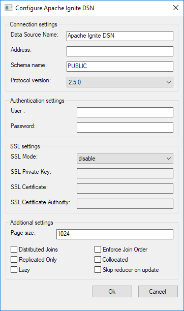

# Connection String and DSN

## Connection String Format

The ODBC Driver supports standard connection string format. Here is the formal syntax:

```text
connection-string ::= empty-string[;] | attribute[;] | attribute; connection-string
empty-string ::=
attribute ::= attribute-keyword=attribute-value | DRIVER=[{]attribute-value[}]
attribute-keyword ::= identifier
attribute-value ::= character-string
```

In simple terms, an ODBC connection URL is a string with parameters of the choice separated by semicolon.

## Supported Arguments

The ODBC driver supports and uses several connection string/DSN arguments. All parameter names are case-insensitive - `ADDRESS`, `Address`, and `address` all are valid parameter names and refer to the same parameter. If an argument is not specified, the default value is used. The exception to this rule is the `ADDRESS` attribute. If it is not specified, `SERVER` and `PORT` attributes are used instead.

| Attribute keyword | Description | Default Value |
|-------------------|-------------|---------------|
| `ADDRESS` | Address of the remote node to connect to. The format is: `<host>[:<port>][,<host>[:<port>]...]`. For example: localhost, example.com:12345, 127.0.0.1, 192.168.3.80:5893. If this attribute is specified, then `SERVER` and `PORT` arguments are ignored. | None. |
| `SERVER` | Address of the node to connect to. This argument value is ignored if ADDRESS argument is specified. | None. |
| `PORT` | Port on which `OdbcProcessor` of the node is listening. This argument value is ignored if `ADDRESS` argument is specified. | `10800` |
| `USER` | Username for SQL Connection. This parameter is required if authentication is enabled on the server. See [Authentication](https://www.gridgain.com/docs/gridgain8/latest/administrators-guide/security/authentication) and [CREATE](https://www.gridgain.com/docs/gridgain8/latest/sql-reference/ddl#create-user) user docs for more details on how to enable authentication and create user, respectively. | Empty string |
| `PASSWORD` | Password for SQL Connection. This parameter is required if authentication is enabled on the server. See [Authentication](https://www.gridgain.com/docs/gridgain8/latest/administrators-guide/security/authentication) and [CREATE](https://www.gridgain.com/docs/gridgain8/latest/sql-reference/ddl#create-user) user docs for more details on how to enable authentication and create user, respectively. | Empty string |
| `SCHEMA` | Schema name. | `PUBLIC` |
| `DSN` | DSN name to connect to. | None. |
| `PAGE_SIZE` | Number of rows returned in response to a fetching request to the data source. Default value should be fine in most cases. Setting a low value can result in slow data fetching while setting a high value can result in additional memory usage by the driver, and additional delay when the next page is being retrieved. | `1024` |
| `DISTRIBUTED_JOINS` | Enables the [non-colocated distributed joins](https://www.gridgain.com/docs/gridgain8/latest/developers-guide/SQL/distributed-joins#non-colocated-joins) feature for all queries that are executed over the ODBC connection. | `false` |
| `ENFORCE_JOIN_ORDER` | Enforces a join order of tables in SQL queries. If set to `true`, the query optimizer does not reorder tables in the join. | `false` |
| `PROTOCOL_VERSION` | Used to specify ODBC protocol version to use. Currently, there are following versions: `2.1.0`, `2.1.5`, `2.3.0`, `2.3.2`, `2.5.0`. You can use earlier versions of the protocol for backward compatibility. | `2.3.0` |
| `REPLICATED_ONLY` | Set this property to `true` if the query is to be executed over fully replicated tables. This can enforce execution optimizations. | `false` |
| `COLLOCATED` | Set this parameter to `true` if your SQL statement includes a GROUP BY clause that groups the results by either primary or affinity key. Whenever GridGain executes a distributed query, it sends subqueries to individual cluster members. If you know in advance that the elements of your query selection are colocated together on the same node and you group by a primary or affinity key, then GridGain makes significant performance and network optimizations by grouping data locally on each node participating in the query. | `false` |
| `LAZY` | Lazy query execution.<br><br>With `lazy=false`, GridGain fetches the entire query result set to memory and sends it upstream. For small and medium result sets, this provides optimal performance and minimizes duration of internal database locks, thus increasing concurrency.<br><br>With `lazy=true` (by default), query result sets are processed in a streaming manner, and are sent upstream page-by-page, thus minimizing memory consumption at the cost of moderate performance reduction. This is the preferred option for large result sets because, if a result set does not fit in the available memory, the processing leads to excessive GC pauses and [Out of Memory (OOM) errors](https://docs.oracle.com/javase/8/docs/technotes/guides/troubleshoot/memleaks002.html).<br><br>• `SELECT * FROM Table` or `SELECT col1, col2 FROM Table` - the data is fetched page-by-page, which precludes OOM.<br>• `SELECT * FROM Table WHERE col>10` or `SELECT col1, col2 FROM Table WHERE col>10` (any predicate as long as it's not a nested subquery) - the data is fetched page-by-page, which precludes OOM.<br><br>If the system does not have an index that corresponds to the query, `lazy=true` might not prevent OOM errors in the following cases:<br><br>• `SELECT col1 FROM Table GROUP BY col1` - grouping without aggregation; `lazy=true` doesn't help if the aggregating node runs out of memory.<br>• `SELECT col1, AVG(col2) FROM Table GROUP BY col1` - same as the previous case.<br>• `SELECT DISTINCT(col1)` or `SELECT COUNT(DISTINCT(col1))` or `SELECT DISTINCT(col1) ... LIMIT` - the entire result set must be fetched. However, the data is retrieved page-by-page. Therefore, if the aggregating node is the same as the node containing the data, these two nodes share the available memory, so `lazy=true` will reduce memory utilization, thus reducing the probability of OOM errors.<br>• `SELECT ... JOIN` - same outcome as in the previous case.<br>• `SELECT .. OFFSET/LIMIT ORDER BY` - aggregates the entire result set on a node and passes on a chunk (page). Same result as in the previous case.<br>• Subqueries - the result depends on what a specific subquery is interpreted into. It is safe to assume that `lazy=true` brings no benefit (even if the system has an index that corresponds to the query). | `true` |
| `SKIP_REDUCER_ON_UPDATE` | Enables server side update feature. When Ignite executes a DML operation, first, it fetches all the affected intermediate rows for analysis to the query initiator (also known as reducer), and only then prepares batches of updated values that will be sent to remote nodes. This approach might affect performance, and saturate the network if a DML operation has to move many entries over it. Use this flag to tell Ignite to do all intermediate rows analysis and updates "in-place" on corresponding remote data nodes. Defaults to `false`, meaning that intermediate results will be fetched to the query initiator first. | `false` |
| `SSL_MODE` | Determines whether the SSL connection should be negotiated with the server. Use `require` or `disable` mode as needed. | None. |
| `SSL_KEY_FILE` | Specifies the name of the file containing the SSL server private key. | None. |
| `SSL_CERT_FILE` | Specifies the name of the file containing the SSL server certificate. | None. |
| `SSL_CA_FILE` | Specifies the name of the file containing the SSL server certificate authority (CA). | None. |

## Connection String Samples

You can find samples of the connection string below. These strings can be used with `SQLDriverConnect` ODBC call to establish connection with a node.



```text
DRIVER={Apache Ignite};
ADDRESS=localhost,example.com:12345,127.0.0.1,192.168.3.80:5893;
SCHEMA=somecachename;
USER=yourusername;
PASSWORD=yourpassword;
SSL_MODE=[require|disable];
SSL_KEY_FILE=<path_to_private_key>;
SSL_CERT_FILE=<path_to_client_certificate>;
SSL_CA_FILE=<path_to_trusted_certificates>
```



```text
DRIVER={Apache Ignite};ADDRESS=localhost:10800;CACHE=yourCacheName
```



```text
DRIVER={Apache Ignite};ADDRESS=localhost:10800
```



```text
DSN=MyIgniteDSN
```



```text
DRIVER={Apache Ignite};ADDRESS=example.com:12901;CACHE=MyCache;PAGE_SIZE=4096
```



## Configuring DSN

The same arguments apply if you prefer to use [DSN](https://en.wikipedia.org/wiki/Data_source_name) (Data Source Name) for connection purposes.

To configure DSN on Windows, you should use a system tool called `odbcad32` (for 32-bit [x86] systems) or `odbc64` (for 64-bit systems) which is an ODBC Data Source Administrator.

When installing the DSN tool, _if you use the pre-built msi file_, make sure you've installed Microsoft Visual C++ 2010.

Launch this tool, via `Control panel->Administrative Tools->Data Sources (ODBC)`. Once the ODBC Data Source Administrator is launched, select `Add...->Apache Ignite` and configure your DSN.



To do the same on Linux, you have to locate the `odbc.ini` file. The file location varies among Linux distributions and depends on a specific Driver Manager used by the Linux distribution. As an example, if you are using unixODBC then you can run the following command which will print system wide ODBC related details:

```text
odbcinst -j
```

Use the `SYSTEM DATA SOURCES` and `USER DATA SOURCES` properties to locate the `odbc.ini` file.

Once you locate the `odbc.ini` file, open it with the editor of your choice and add the DSN section to it, as shown below:

```text
[DSN Name]
description=<Insert your description here>
driver=Apache Ignite
<Other arguments here...>
```
