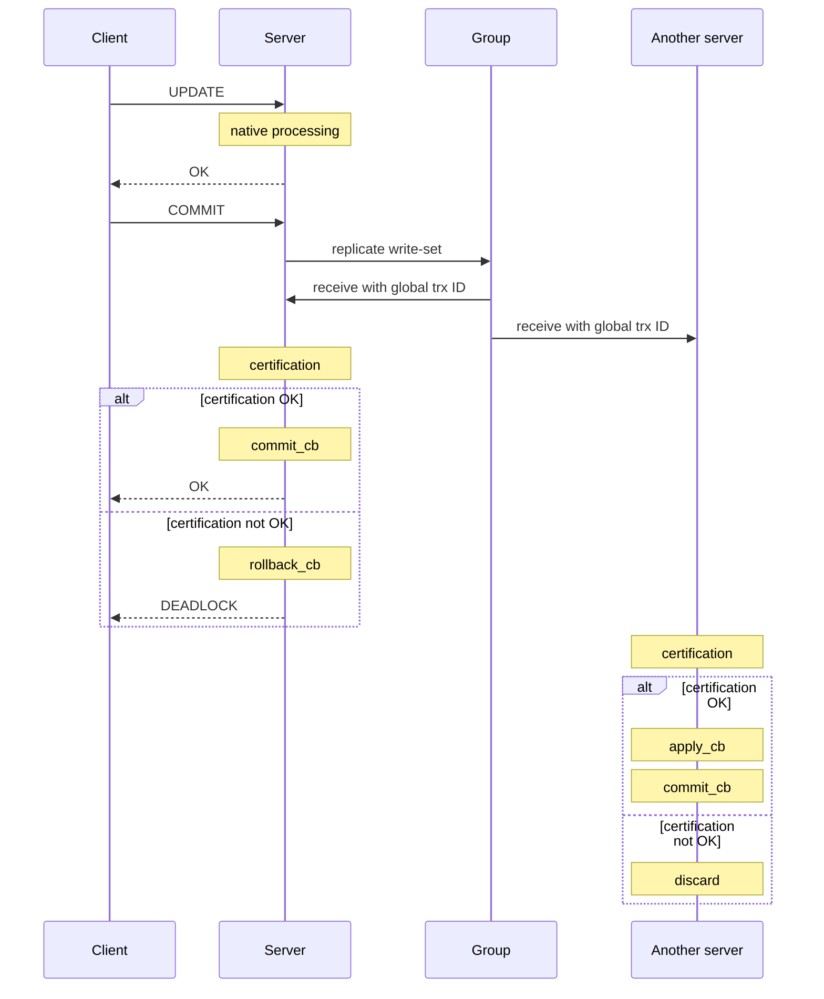

# Certification-Based Replication

Certification-based replication uses [group communication](introduction-to-galera-architecture.md#group-communication-gcomm-framework) and transaction ordering techniques to achieve synchronous replication.

Transactions execute optimistically in a [single node](../high-availability/monitoring-mariadb-galera-cluster.md#understanding-galera-node-states), or replica, and then at commit time, they run a coordinated certification process to enforce global consistency. It achieves global coordination with the help of a broadcast service that establishes a global total order among concurrent transactions.

## Requirements for Certification-Based Replication

It is not possible to implement certification-based replication for all database systems. It requires certain features of the database in order to work:

* Transactional Database: The database must be transactional. Specifically, it has to be able to roll back uncommitted changes.
* Atomic Changes: Replication events must be able to change the database atomically. All of a series of database operations in a transaction must occur, or nothing occurs.
* Global Ordering: Replication events must be ordered globally. Specifically, they are applied on all instances in the same order.

## How the Process Works

_Certification-based replication: the origin server replicates the write-set to the group, which delivers it in global order to every node; each node certifies independently, committing on success or rolling back / discarding on failure._

The main idea in certification-based replication is that a transaction executes conventionally until it reaches the commit point, assuming there is no conflict. This is called optimistic execution.

When the client issues a `COMMIT` command, but before the actual commit occurs, all changes made to the database by the transaction and the primary keys of the changed rows are collected into a write-set. The database then sends this write-set to all of the other nodes.

The write-set then undergoes a deterministic certification test, using the primary keys. This is done on each node in the cluster, including the node that originates the write-set. It determines whether or not the node can apply the write-set.

If the certification test fails, the node drops the write-set and the cluster [rolls back](../galera-management/performance-tuning/using-streaming-replication-for-large-transactions.md#limitations-and-performance-considerations) the original transaction. If the test succeeds, however, the transaction commits and the write-set is [applied to the rest of the cluster](../galera-management/performance-tuning/flow-control-in-galera-cluster.md#common-causes-and-solutions).

## Implementation in Galera Cluster

The implementation of certification-based replication in Galera Cluster depends on the [global ordering of transactions](introduction-to-galera-architecture.md#global-transaction-id-gtid).

Galera Cluster assigns each transaction a global ordinal sequence number, or [seqno](introduction-to-galera-architecture.md#global-transaction-id-gtid), during replication. When a transaction reaches the commit point, the node checks the sequence number against that of the last successful transaction. The interval between the two is the area of concern, given that transactions that occur within this interval have not seen the effects of each other. All transactions in this interval are checked for primary key conflicts with the transaction in question. The certification test fails if it detects a conflict.

The procedure is deterministic and all [replicas](../galera-management/configuration/configuring-mariadb-galera-cluster.md#mandatory-options) receive transactions in the same order. Thus, all nodes reach the [same decision](../high-availability/understanding-quorum-monitoring-and-recovery.md) about the outcome of the transaction. The node that started the transaction can then notify the client application whether or not it has committed the transaction.

_This page is licensed: CC BY-SA / Gnu FDL_
