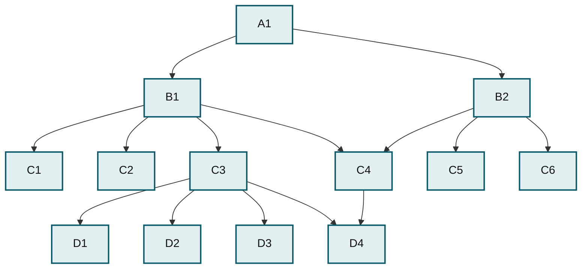

# Understanding the Network Database Model

The network database model was a progression from the [hierarchical database model](understanding-the-hierarchical-database-model.md) and was designed to solve some of that model's problems, specifically the lack of flexibility. Instead of only allowing each child to have one parent, this model allows each child to have multiple parents (it calls the children _members_ and the parents _owners_). It addresses the need to model more complex relationships such as the orders/parts many-to-many relationship mentioned in the [hierarchical article](understanding-the-hierarchical-database-model.md). As you can see in the figure below, _A1_ has two members, _B1_ and _B2_. _B1._ is the owner of _C1_, _C2_, _C3_ and _C4_. However, in this model, _C4_ has two owners, _B1_ and _B2_.

_In the network model, a record such as C4 or D4 can have more than one owner._

Of course, this model has its problems, or everyone would still be using it. It is more difficult to implement and maintain, and, although more flexible than the hierarchical model, it still has flexibility problems, Not all relations can be satisfied by assigning another owner, and the programmer still has to understand the data structure well in order to make the model efficient.

_This page is licensed: CC BY-SA / Gnu FDL_


