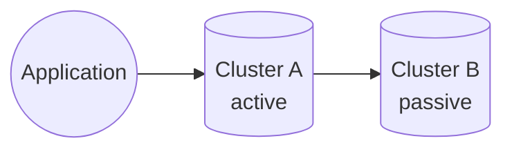
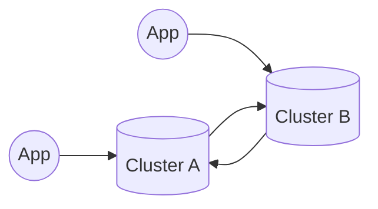
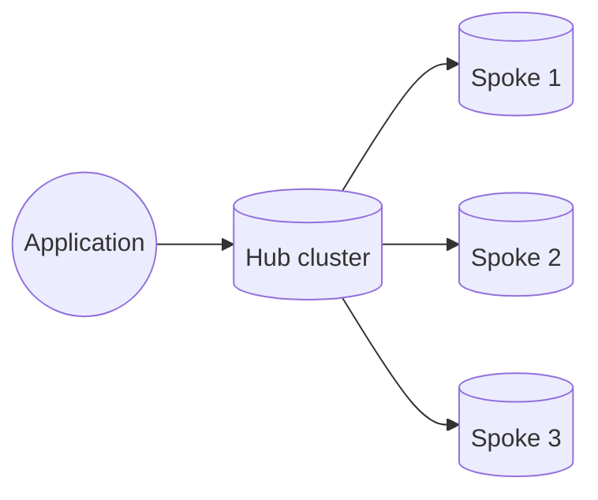
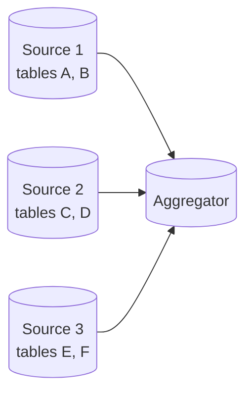
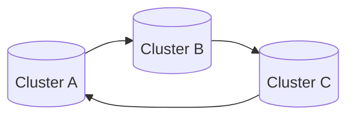

# Data Center Replication


This feature is only available as a part of GridGain 9 Enterprise and Ultimate editions.


_Data center replication_ (DCR) keeps tables in sync across multiple GridGain clusters.

A DCR setup connects two clusters: the *source cluster* holds the data being replicated, and the *replica cluster* receives a copy of that data. The same cluster can act as both a source for one replication and a replica for another. See [Supported Topologies](#supported-topologies) for more information on available replication topologies.

When data center replication is turned on, GridGain continuously synchronizes data from the source to the replica. As this is a continuous process, make sure that both clusters have enough throughput to keep up.

## How Replication Works

Replication is configured on the *replica cluster*. The replica cluster then opens a connection to the source cluster's client port and pulls changes from there. The source cluster does not initiate any outgoing connection.

Replication then progresses in two phases:

- First, a *full state transfer* is performed. GridGain copies the existing data from the source to the replica.
- Then, GridGain switches to *continuous replication*. GridGain keeps applying changes on the source to the replica as they happen.


When a replication restarts or fails over to another worker node, GridGain resumes continuous replication from the last replicated point instead of repeating the full state transfer. GridGain falls back to a full state transfer only when it cannot resume from that point, automatically resolving any conflicts that arise.


Each replication runs on a single elected node on the replica cluster, called the *worker node*. If the worker node leaves the cluster, GridGain automatically reassigns the role to another eligible node and resumes the replication. You can restrict the set of nodes eligible to be the worker by listing them in `--replication-nodes` when creating the replication.

### What Gets Sent to the Replica

For each replicated table, the source cluster delivers a stream of row-level events to the replica:

- Inserts and updates carry the full row contents, not just the changed columns, plus the source cluster's commit timestamp.
- Deletes are sent as tombstone events that remove the row on the replica.

DCR replicates the *latest committed value* of every change, not the full version history of a row.

## Replication Lag

Data center replication is *asynchronous*. A write on the source cluster commits and returns to the application without waiting for the replica cluster to acknowledge it; GridGain then propagates the write to the replica in the background. The time between a successful commit on the source and the moment the change is visible on the replica is the *replication lag*.

GridGain exposes the current replication lag in milliseconds as a metric called `ReplicationLag`. The metric is computed on the replica as the difference between the replica's local clock and the timestamp of the slowest partition's watermark. Because it is local-clock-relative, the metric's accuracy depends on clock synchronization between the participating clusters; see [Conflict Resolution](conflict-resolution.md) for details.

## What DCR Replicates

DCR replicates *table row data only*. Schema, configuration, and operational state on each cluster are independent and must be set up identically before replication starts.

| Item | Replicated by DCR? | Notes |
|---|---|---|
| Records (inserts, updates, deletes) | Yes | The core of DCR. Includes tombstones for deletes. |
| Tables (`CREATE TABLE`) | No | The replica must already have a table of the same name with a compatible schema before `dcr start`. Otherwise the start fails. |
| Schema changes (`ALTER TABLE`) | No | Schemas are checked once when replication starts. Apply schema changes to both clusters separately. See [Schema Changes](#schema-changes). |
| Indexes | No | Create indexes on each cluster as needed. |
| Distribution zones | No | Create the same zones on each cluster. |
| Schemas (`CREATE SCHEMA`) | No | Create schemas on each cluster as needed. |
| Sequences | No | Create on each cluster as needed. |
| Users, roles, and permissions | No | Configure security separately on each cluster. |
| Continuous queries / change subscriptions submitted by applications | No | Subscriptions are local to the cluster on which they were created. |
| Compute jobs and tasks | No | Submit independently on each cluster. |

Because DCR replicates only data, every other artifact that your application relies on – tables, indexes, distribution zones, schemas, users, configuration – has to exist on the replica cluster before you start replication. A typical setup automates the creation of these artifacts so that all participating clusters are brought up identically.

### Schema Changes

Schemas are validated once, at the moment a replication starts. After replication is running, GridGain does not propagate schema changes between clusters. To change a schema on a running replication, plan a coordinated procedure that applies the change to both clusters. The exact steps depend on the kind of change; consult GridGain support if you are unsure.

## Supported Topologies

Because each replication is a one-way pull from one source cluster into one replica cluster, complex topologies are built by composing multiple replications. The following topologies are supported:

### Active-Passive

One source, one replica. Applications write only to the source; the replica holds an up-to-date copy.

### Active-Active

Two clusters, each replicating from the other. Applications write to both clusters. When the same row is changed on both clusters, GridGain resolves the conflict using the timestamp on each write – the later write wins on both clusters. See [Conflict Resolution](conflict-resolution.md).

### Hub-and-Spoke

One central source replicates to several other clusters. Each replica cluster has its own replication that pulls from the central cluster.

### Fan-In

Several source clusters replicate to one aggregating replica. Configure each replication to cover a different set of tables — no table on the aggregator should have more than one source. This keeps the lineage of each table clear and avoids having to coordinate schema changes across multiple sources.

### Ring

Each cluster replicates from its neighbour in a ring. Like active-active, ring topologies converge through timestamp-based conflict resolution. Expect higher per-write propagation time and break the ring at any cluster that becomes unreachable until it returns.

## Avoiding Unintended Transitive Updates

When a cluster acts as both a replica for one cluster and a source for another, changes propagate transitively. A write committed on cluster A travels through B and is then re-replicated from B to C, even if there is no direct A → C replication. DCR has no built-in filter that suppresses re-export of replicated writes – the continuous query that captures changes on the source observes every write to the table, regardless of how it got there.

Transitive updates are *correctness-safe*. By the time a redundant copy reaches a cluster that already has the row, the timestamps match and the write is treated as a duplicate. See [Conflict Resolution](conflict-resolution.md). They do, however, consume network bandwidth, worker-node CPU, and continuous-query capacity, so it is worth structuring topologies to minimize them.

In topologies that contain cycles, transitive updates multiply the number of replication offers per write. For example, in a three-cluster mesh where each cluster replicates from every other cluster, a single write on one cluster is offered to two other clusters directly and to each of them a second time via the third – six replication offers per write, of which only two carry new data. The duplicates are correctly absorbed but still cost resources at every hop.

To keep transitive replication under control:

- *Prefer hub-and-spoke over chains.* If clusters B, C, and D all need data from A, replicate A → B, A → C, and A → D directly rather than chaining A → B → C → D. Direct replications scale linearly in cluster count; chains compound replication lag at every hop.
- *Limit topology complexity.* Full meshes scale quadratically in the number of replications; star or hub-and-spoke layouts scale linearly. Choose the simplest topology that satisfies your availability requirements.
- *Use disjoint table scopes when a cluster is both replica and source.* If cluster B receives table `T1` from A and forwards table `T2` to C, no transitive update on `T1` ever reaches C. Routing different tables through different replication links is the most direct way to break a transitive path you do not want.
- *Account for transitive load when sizing worker nodes.* Each replication adds load to one node on each cluster it touches. In topologies where transitive paths exist, the same write contributes to the load on multiple worker nodes; size accordingly and monitor `ReplicationLag` on every replica involved in the path.

## Replication Status

You can query the status of any replication on the replica cluster with `dcr status --name <name>`. A replication is in one of the following states:

- `REPLICATING` – healthy. The worker is actively applying changes from the source.
- `STOPPED` – created but not running. Either the replication was just created and not started yet, or it was stopped explicitly. Existing replicated data on the replica is preserved.
- `FAILED` – the replication encountered an error that GridGain could not recover from automatically. The status entry contains details about the failure. Recovery typically requires removing and recreating the replication; see [Configuring Replication](configuring-replication.md).
- `WORKER_NODE_OUT` – every node eligible to run this replication is currently outside the cluster topology. The replication automatically returns to `REPLICATING` when an eligible node rejoins.

In an active-active or other multi-replication topology, make sure to query each cluster separately – the replication state on cluster A is independent of the replication state on cluster B.

## Network and Security

The replica cluster opens connections to the source cluster's client port. If the source cluster has authentication or SSL/TLS enabled, supply credentials and key/trust stores when creating the replication. The credentials are used to connect from the replica to the source; users and roles are *not* replicated, so any application that talks to the replica cluster has to authenticate against credentials configured on the replica cluster itself.

DCR is licensed: every operation on a replication checks the GridGain license on the cluster where the operation is invoked. The license is per cluster and is not replicated.
