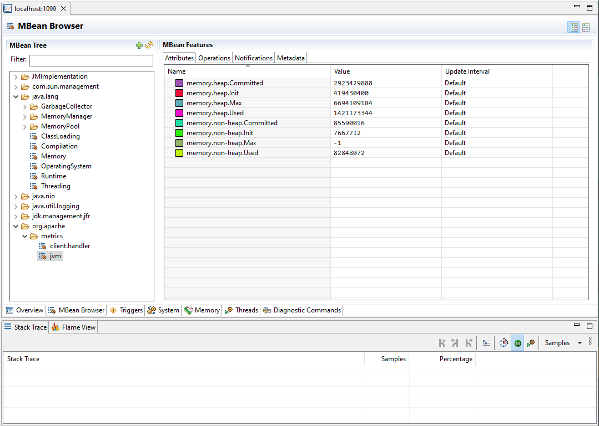

# Configuring Metrics

Metric management is performed through the [GridGain CLI tool](../../ignite-cli-tool.md).

## Listing Metric Sources

You can list all available metric sources for a node or for the entire cluster.

```bash
node metric source list
cluster metric source list
```

## Listing Metrics

You can list all metrics for a node.


To see the list of metrics, you need to enable the relevant metric sources - see [Enabling Metric Sources](#enabling-metric-sources).


```bash
node metric list
```

The above command returns the list of all currently available metrics organized with their exporters.

## Enabling Metric Sources

Metric collection might affect the performance of an application. Therefore, by default, all metric sources are disabled.

Metric sources can be enabled:

* On per-node basis - you can specify the node to interact with by using the `-u` parameter to specify node URL or `-n` parameter to specify node name.
* For the entire cluster.

For example:

```bash
node metric source enable -n=defaultNode jvm
cluster metric source enable jvm
```

## Disabling Metric Sources

Metric sources can be disabled:

* On per-node basis - you can specify the node to interact with by using the `-u` parameter to specify node URL or `-n` parameter to specify node name.
* For the entire cluster.

For example:

```bash
node metric source disable -n=defaultNode jvm
cluster metric source disable jvm
```

## Configuring Metrics Exporters

To access the collected metrics with external tools, you need to configure metrics exporters.

### JMX

The JMX exporter provides information about GridGain nodes in JMX(Java Management Extensions) format. When the exporter is enabled, the node exposes the metrics to monitoring tools.

You can enable the JMX exporter in the following way:

```bash
cluster config update ignite.metrics.exporters.myJmxExporter.exporterName=jmx
```

After you do, JMX monitoring tools will be able to collect enabled metrics from the specified nodes:



You can also open internal JDK modules required for JMX, enable the remote JMX agent, configure the connection port, authentication, and SSL.
Add the following options to the `GRIDGAIN9_EXTRA_JVM_ARGS` variable in `vars.env` file if you are using Linux or macOS, or to `vars.bat` for Windows:

```bash
--add-opens=jdk.management/com.sun.management.internal=ALL-UNNAMED

-Dcom.sun.management.jmxremote
-Dcom.sun.management.jmxremote.port=<PORT_NUMBER>
-Dcom.sun.management.jmxremote.authenticate=true|false
-Dcom.sun.management.jmxremote.ssl=true|false
```

### LogPush Exporter

LogPush exporter writes metrics data to the dedicated log file, so they can be consumed by log collectors or inspected manually. To configure it, use the following parameters:

| Name | Description | Default value |
| --- | --- | --- |
| periodMillis | Export interval for the metrics, in milliseconds. | 30000 |
| oneLinePerMetricSource | Define whether to print all metrics from one metric source on a single log line. | true |
| enabledMetrics | List of enabled metric sources. If this list is non-empty, only the listed sources are printed; all others are skipped. Each entry has one of the following forms:<br><br>• `sourceName` — log all metrics from this source (for example, `jvm`).<br>• `prefix*` — log all metrics from every source whose name starts with the given prefix (for example, `raft*`). The trailing `*` is the only wildcard supported and must come at the end of the source name.<br>• `sourceName:metric1,metric2,…` — log only the listed metrics from this source (for example, `thread.pools*:ActiveCount,QueueSize`). The trailing `*` wildcard is allowed on the source-name part. An empty metric list (`sourceName:`) is equivalent to `sourceName` and logs every metric.<br><br>Pass an empty list to disable every default. Use `"*"` to log every metric from every source. | "client.handler", "clock.service", "index.builder", "jvm", "metastorage", "os", "placement-driver", "raft", "raft.snapshots", "resource.vacuum", "sql.plan.cache", "storage.aipersist", "storage.aipersist.checkpoint", "thread.pools\*:ActiveCount,IdleCount,QueueSize", "topology\*", "transactions" |


GridGain registers the `raft.fsmcaller`, `raft.logmanager`, `raft.node`, and `raft.readonlyservice` metric sources separately for every Raft group on the node, so a node that hosts many partitions exposes a large number of these sources. The default list includes only `raft` and `raft.snapshots`. If you replace it with the `raft*` prefix, every per-group source is written on each export interval.


You can also configure additional configuration properties in the `etc/gridgain.java.util.logging.properties` file.

### Enable Metrics

To add logPush exporter to cluster exporters list, run the following command and define all the metrics to print in `enabledMetrics` list:

```bash
cluster config update ignite.metrics.exporters.logPush '{"exporterName":"logPush","periodMillis":30000,"oneLinePerMetricSource":true,"enabledMetrics":[jvm, system]}'
```

Updated exporters configuration should look like this:

```
metrics {
        exporters=[
            {
                enabledMetrics=[
                    jvm,
                    system
                ]
                exporterName=logPush
                name=logPush
                oneLinePerMetricSource=true
                periodMillis=30000
            }
        ]
    }
```

### OpenTelemetry

The [OpenTelemetry](https://opentelemetry.io/) exporter connects to an OpenTelemetry service that is provided in configuration and sends cluster information to it. Each node sends metrics independently, and requires access to the specified endpoint.


Metric source names are exported as OpenTelemetry scope information, not as data point attributes. See [Metric Source Names and Prometheus Labels](#metric-source-names-and-prometheus-labels).


The example below shows the basic OpenTelemetry configuration. As OpenTelemetry services require different URL formats and may require headers, this example may not work for your environment.

```bash
cluster config update ignite.metrics.exporters.test: {exporterName:otlp, endpoint:"http://localhost:9090/api/v1/otlp/v1/metrics", protocol:"http/protobuf"}
```

OpenTelemetry exporter created by this command will look like this:

```
{
        compression=gzip
        endpoint="http://localhost:9090/api/v1/otlp/v1/metrics"
        exporterName=otlp
        headers=[]
        name=test
        periodMillis=30000
        protocol="http/protobuf"
        ssl {
            ciphers=""
            clientAuth=none
            enabled=false
            keyStore {
                password="********"
                path=""
                type=PKCS12
            }
            trustStore {
                password="********"
                path=""
                type=PKCS12
            }
        }
    },
```

Below are the descriptions of configuration parameters:

| Name | Description | Default value |
| --- | --- | --- |
| compression | How the payload is compressed. Possible values: `none`, `gzip`. | `gzip` |
| endpoint | The OpenTelemetry endpoint. Each node resolves the endpoint individually. | |
| exporterName | Exporter name. Must be `otlp` to use OpenTelemetry. | |
| headers | Request headers, if any. | |
| name | User-defined exporter name, used to refer to it in GridGain. | |
| periodMillis | Export interval for the metrics, in milliseconds. | 30000 |
| protocol | The protocol that is used to send OpenTelemetry data. Possible values: `grpc`, `http/protobuf`. | `grpc` |
| ssl.ciphers | List of ciphers to enable, comma-separated. Empty for automatic cipher selection. | |
| ssl.clientAuth | Whether the SSL client authentication is enabled and whether it is mandatory. | |
| ssl.enabled | Defines if SSL is enabled. | `false` |
| ssl.keyStore.password | SSL keystore password. | |
| ssl.keyStore.path | Path to the SSL keystore. | |
| ssl.keyStore.type | Keystore type. | `PKCS12` |
| ssl.trustStore.password | Truststore password. | |
| ssl.trustStore.path | Path to the truststore. | |
| ssl.trustStore.type | Truststore type. | `PKCS12` |

#### Connection to Grafana

When connecting to Grafana Cloud, you need to use the protobuf protocol and pass the authorization header in the configuration:

```bash
cluster config update ignite.metrics.exporters.test: {exporterName:otlp, endpoint:"https://otlp-gateway-prod-eu-west-2.grafana.net/otlp", protocol:"http/protobuf", headers {Authorization.header="Basic myBasicAuthKey"}}
```

#### Connection to Prometheus

When connecting to Prometheus, you need to use the protobuf protocol and send metrics to the `/api/v1/otlp/v1/metrics` after the otlp metrics receiver is enabled as described in [Prometheus documentation](https://prometheus.io/docs/guides/opentelemetry/):

```bash
cluster config update ignite.metrics.exporters.test: {exporterName:otlp, endpoint:"http://localhost:9090/api/v1/otlp/v1/metrics", protocol:"http/protobuf"}
```

For more detailed explanation follow our [guide](https://www.gridgain.com/docs/tutorials/gg9-grafana-integration/gg9-grafana-integration) on collecting metrics with Prometheus and Grafana.

#### Metric Source Names and Prometheus Labels

When GridGain 9 pushes metrics directly to Prometheus through OTLP, the metric source name is not available as a Prometheus label. GridGain 9 sends the source name as the OpenTelemetry instrumentation scope, and Prometheus builds labels from data point attributes rather than from scope information. Prometheus receives the metric values with node-level labels such as `job` and `instance`, but without the GridGain metric source name as a label.

As a result, metrics that share a short name across several sources cannot be told apart in Prometheus and Grafana. This affects every metric source that GridGain 9 registers per object, for example:

* `tables.{table_name}`, which exposes `RoReads`, `RwReads`, and `Writes`.
* `caches.{cache_name}`, which exposes `Gets`, `Hits`, `Misses`, `Puts`, and `Removals`.
* `storage.aipersist.tables.{table_name}`, which exposes the per-table storage metrics.

Enabling these sources works as expected, and metric values are exported. However, the source identity is not available as a Prometheus label, so Prometheus cannot separate the series by table or cache.


The JMX exporter registers a separate MBean for each metric source, so source identity is preserved there. This limitation applies only to the OpenTelemetry exporter.


To preserve the source identity, place an [OpenTelemetry Collector](https://opentelemetry.io/docs/collector/) between GridGain 9 and Prometheus, and copy the scope name into a data point attribute before the metrics are forwarded. Set the GridGain 9 exporter `endpoint` to the collector address instead of the Prometheus address. With this mapping in place, the table or cache name is available as a Prometheus label, and you can filter and group by it in Prometheus and Grafana. A validated collector configuration example will be added separately.

### Monitoring GridGain 9 with Zabbix

[Zabbix](https://www.zabbix.com/manuals) can collect GridGain 9 metrics directly over JMX without external scripts. Use the preconfigured [template](../../../.gitbook/assets/gg9-administrators-guide-zabbix_gg9.yaml).

Follow these steps:

- Make sure JMX is enabled on each GridGain 9 node (host, port, authentication if required).

- Import the `yaml` file in **Configuration → Templates → Import**.

- Link the template to the target host.
