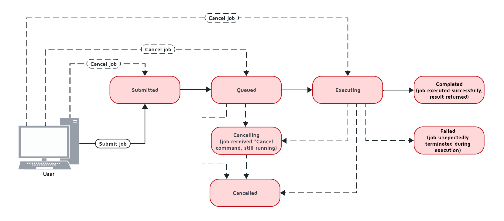

# Distributed Computing

GridGain 9 lets you run your own code on the cluster in a distributed, balanced, and fault-tolerant way.

Tasks can run on a single node, multiple nodes, or across the entire cluster, and you can choose between synchronous and asynchronous execution.


GridGain 9 compute engine supports jobs implemented in Java, in .NET, and WebAssembly. As Wasm and .NET compute jobs require a bit of extra setup, see the [.NET Compute Jobs](#net-compute-jobs) subsection and [Wasm Compute Jobs](wasm.md) for more details.


In addition to standard compute tasks, GridGain 9 supports [Colocated Execution](#colocated-execution). This means your tasks can run directly on the nodes that store the required data, reducing network overhead and improving performance.
The cluster also supports [MapReduce Tasks](#mapreduce-tasks), allowing for efficient processing of large datasets. In this case, tasks will be executed on nodes that hold the data required for them.

When sending code and data between nodes, objects are converted into a transferable format so they can be accurately rebuilt. GridGain 9 automatically handles marshalling for common types like tuples, POJOs, and native types, but for more complex or custom objects, you may need to implement your own [marshalling](serialization.md) logic.


The Java examples on this page use the thin client, which requires the `ignite-client` module. For repository and dependency configuration, see [Project Setup and Required Modules](../project-setup.md).


## Compute Job Code Deployment

Before submitting your compute job, ensure that the required code is [deployed](../code-deployment/code-deployment.md) to the nodes where it will execute.

If you are using [embedded nodes](../../quick-start/embedded-mode.md), any code that is included in the project classpath will also be available to your compute jobs.

## Configuring Jobs

In GridGain 9, compute job's execution is defined by two key components: `JobTarget` and `JobDescriptor`. These components determine on which nodes the job will run and how it will be structured, including input and output types, marshallers, and the deployed class that represents the job.

### Job Target

Before submitting a job, you must create a `JobTarget` object that specifies which nodes will execute the job. Job target can point to a specific node, any node on the cluster, or start a [colocated](#colocated-execution) compute job, that will be executed on nodes that hold a specific key. The following methods are available:

- `JobTarget.anyNode()` - the job will be executed on any of the specified nodes.
- `JobTarget.node()` - the job will be executed on the specific node.
- `JobTarget.colocated()` - the job will be executed on a node that holds the specified key.


Use the `BroadcastJobTarget` object instead in case you want to execute a job across [multiple nodes](#multiple-node-execution).


### Job Descriptor

The `JobDescriptor` object contains all the details required for job execution. The following arguments must be provided:

- The job descriptor is created using a builder that specifies the input type for the job arguments, the expected output type, and the fully qualified name of the job class to execute.
- `units` takes your deployment unit. You create it with the unit's name and specify `Version.LATEST` so that your job always runs the most recently deployed version.
- `resultClass` sets the expected result type so the system can correctly process the job's output.
- `argumentMarshaller` and `resultMarshaller` defines how to serialize the job's input argument and output result. For common types, you can omit the marshallers and pass `null` to the builder since GridGain 9 automatically handles marshalling.

Examples below assumes that the `NodeNameJob` class has been deployed to the node by using [code deployment](../code-deployment/code-deployment.md).

- If you are working with common types, you don't need to define custom marshallers. GridGain will handle them automatically. The following example shows a simpler job descriptor that uses built-in marshalling:

```java
JobDescriptor<String, Integer> job = JobDescriptor.builder(WordCountJob.class)
        .units(new DeploymentUnit(DEPLOYMENT_UNIT_NAME, DEPLOYMENT_UNIT_VERSION))
        .build();

JobTarget jobTarget = JobTarget.anyNode(client.cluster().nodes());


String phrase = "Count characters using callable";

System.out.println("\nExecuting compute job for the phrase '" + phrase + "'...");

Integer wordCnt = client.compute().execute(jobTarget, job, phrase);
```

- This example shows how to create a custom job descriptor for a job that takes a user-defined `MyJobArgument`, runs on a random cluster node, and returns a `MyJobResult` object using custom marshallers:

```java
JobDescriptor<String, WordInfoResult> job = JobDescriptor.builder(WordInfoJob.class)
        .resultMarshaller(new WordInfoResultMarshaller())
        .units(new DeploymentUnit(DEPLOYMENT_UNIT_NAME, DEPLOYMENT_UNIT_VERSION))
        .build();

JobTarget jobTarget = JobTarget.anyNode(client.cluster().nodes());

ArrayList<WordInfoResult> results = new ArrayList<>();

String phrase = "Count characters using compute job";

for (String word : phrase.split(" ")) {

    System.out.println("\nExecuting compute job for the word '" + word + "'...");

    WordInfoResult result = client.compute().execute(jobTarget, job, word);

    results.add(result);
}
```

For more details on configuring jobs refer to the corresponding [API](https://www.gridgain.com/sdk/gridgain9/latest/javadoc/org/apache/ignite/compute/JobDescriptor.html) section.

### Deployment Unit Information

The `JobExecutionContext` object contains the information about the deployment units the job is using as a collection of `DeploymentUnitInfo` for each deployment unit involved in the job.

- `deploymentUnits()` - the collection of `DeploymentUnitInfo` objects for the deployment units the job is using.
- `partition()` - the partition this job instance is bound to (non-null only when the job was submitted via `BroadcastJobTarget.table()`).
- `cancellationToken()` - a `CancellationToken` that is canceled when the job itself is canceled. Pass it to SQL queries or to nested compute jobs to propagate cancellation downstream (see [Propagating Cancellation From a Job](#propagating-cancellation-from-a-job)).
- `isCancelled()` - flag that becomes `true` once the job has been canceled.

Each `DeploymentUnitInfo` object provides the following information:

- `name()` - The name of the deployment unit
- `version()` - The version of the deployment unit
- `path()` - The filesystem path to the deployment unit contents

```java
public class DiagnosticJob implements ComputeJob<Void, String> {
    @Override
    public CompletableFuture<String> executeAsync(JobExecutionContext context, Void input) {
        // Access deployment unit information
        String deploymentInfo = context.deploymentUnits().stream()
            .map(unit -> String.format("%s:%s at %s",
                unit.name(),
                unit.version(),
                unit.path()))
            .collect(Collectors.joining(", "));

        return CompletableFuture.completedFuture(deploymentInfo);
    }
}
```

## Executing Jobs

GridGain compute jobs can run on a specific node, any node, or using a colocated approach when job is executed on the node holding the relevant data key.

### Single Node Execution

Often, you need to perform a job on one node in the cluster. In this case, there are multiple ways to start job execution:

- `submitAsync()` - sends the job to the cluster and returns a future that will be completed with the `JobExecution` object when the job is submitted for execution.
- `executeAsync()` - sends the job to the cluster and returns a future that will be completed when job execution result is ready.
- `execute()` - sends the job to the cluster and waits for the result of job execution.



```java
try (IgniteClient client = IgniteClient.builder()
        .addresses("127.0.0.1:10800")
        .build()
) {

    System.out.println("\nConfiguring compute job...");


    JobDescriptor<String, Void> job = JobDescriptor.builder(WordPrintJob.class)
            .units(new DeploymentUnit(DEPLOYMENT_UNIT_NAME, DEPLOYMENT_UNIT_VERSION))
            .build();

    JobTarget jobTarget = JobTarget.anyNode(client.cluster().nodes());


    for (String word : "Print words using runnable".split(" ")) {

        System.out.println("\nExecuting compute job for word '" + word + "'...");

        client.compute().execute(jobTarget, job, word);
    }
}
```



```csharp
ICompute compute = Client.Compute;
IList<IClusterNode> nodes = await Client.GetClusterNodesAsync();

IJobExecution<string> execution = await compute.SubmitAsync(
    JobTarget.AnyNode(nodes),
    new JobDescriptor<string, string>("org.example.NodeNameJob"),
    arg: "Hello");

string result = await execution.GetResultAsync();
```



```cpp
using namespace ignite;

compute comp = client.get_compute();
std::vector<cluster_node> nodes = client.get_nodes();

// Unit `unitName:1.1.1` contains NodeNameJob class.
auto job_desc = job_descriptor::builder("org.company.package.NodeNameJob")
	.deployment_units({deployment_unit{"unitName", "1.1.1"}})
	.build();

job_execution execution = comp.submit(job_target::any_node(nodes), job_desc, {std::string("Hello")}, {});
std::string result = execution.get_result()->get<std::string>();
```



### Multiple Node Execution

To execute the compute task on multiple nodes, you use the same methods as for single node execution, except instead of creating a `JobTarget` object to designate execution nodes you use the `BroadcastJobTarget` and specify the list of nodes that the job must be executed on.

The `BroadcastJobTarget` object can specify the following:

- `BroadcastJobTarget.nodes()` - the job will be executed on all nodes in the list.
- `BroadcastJobTarget.table()` - the job will be executed on all nodes that hold partitions of the specified table.

You can control what nodes the task is executed on by setting the list of nodes:



```java
JobDescriptor<String, Void> job = JobDescriptor.builder(HelloMessageJob.class)
        .units(new DeploymentUnit(DEPLOYMENT_UNIT_NAME, DEPLOYMENT_UNIT_VERSION))
        .build();

BroadcastJobTarget target = table("Person");


System.out.println("\nExecuting compute job...");

client.compute().execute(target, job, "John");
```



```csharp
ICompute compute = Client.Compute;
IList<IClusterNode> nodes = await Client.GetClusterNodesAsync();

IBroadcastExecution<string> execution = await compute.SubmitBroadcastAsync(
  BroadcastJobTarget.Nodes(nodes),
  new JobDescriptor<object, string>("org.example.NodeNameJob"),
  arg: "Hello");

foreach (IJobExecution<string> jobExecution in execution.JobExecutions)
{
  string jobResult = await jobExecution.GetResultAsync();
  Console.WriteLine($"Job result from node {jobExecution.Node}: {jobResult}");
}
```



```cpp
using namespace ignite;

compute comp = client.get_compute();
std::vector<cluster_node> nodes = client.get_nodes();

// Unit `unitName:1.1.1` contains NodeNameJob class.
auto job_desc = job_descriptor::builder("org.company.package.NodeNameJob")
	.deployment_units({deployment_unit{"unitName", "1.1.1"}})
	.build();

broadcast_execution execution = comp.submit_broadcast(broadcast_job_target::nodes(nodes), job_desc, {std::string("Hello")}, {});
for (auto &exec: execution.get_job_executions()) {
    std::string result = exec.get_result()->get<std::string>();
}
```



### Colocated Execution

In GridGain 9, you can execute colocated computations by specifying a job target that directs the task to run on the node holding the required data.

In the example below, the job runs on the node that owns the partition for the row in the `accounts` table identified by the primary key `accountNumber`.
We pass the key both to `JobTarget.colocated()` to select the node and as the
job argument, so the job knows which record to read.



```java
try (IgniteClient client = IgniteClient.builder()
        .addresses("127.0.0.1:10800")
        .build()
) {

    client.sql().executeScript(
            "CREATE TABLE accounts ("
                    + "accountNumber INT PRIMARY KEY,"
                    + "name          VARCHAR)"
    );


    RecordView<Tuple> view = client.tables().table("accounts").recordView();


    System.out.println("\nCreating account records...");

    for (int i = 0; i < ACCOUNTS_COUNT; i++) {
        view.insert(null, account(i));
    }


    System.out.println("\nConfiguring compute job...");

    JobDescriptor<Integer, Void> job = JobDescriptor.builder(PrintAccountInfoJob.class)
            .units(new DeploymentUnit(DEPLOYMENT_UNIT_NAME, DEPLOYMENT_UNIT_VERSION))
            .build();

    int accountNumber = ThreadLocalRandom.current().nextInt(ACCOUNTS_COUNT);

    JobTarget jobTarget = JobTarget.colocated("accounts", accountKey(accountNumber));


    System.out.println("\nExecuting compute job for the accountNumber '" + accountNumber + "'...");

    client.compute().execute(jobTarget, job, accountNumber);


    QualifiedName customSchemaTable = QualifiedName.parse("CUSTOM_SCHEMA.MY_QUALIFIED_TABLE");
    client.compute().execute(
            JobTarget.colocated(customSchemaTable, accountKey(accountNumber)),
            JobDescriptor.builder(PrintAccountInfoJob.class).build(),
            null
    );


    System.out.println("\nDropping the table...");

    client.sql().executeScript("DROP TABLE accounts");
}
```



```csharp
string table = "Person";
string key = "John";

IJobExecution<string> execution = await Client.Compute.SubmitAsync(
    JobTarget.Colocated(table, key),
    new JobDescriptor<string, string>("org.example.NodeNameJob"),
    arg: "Hello");

string result = await execution.GetResultAsync();
```



```cpp
using namespace ignite;

compute comp = client.get_compute();
std::string table{"Person"};
std::string key{"John"};

// Unit `unitName:1.1.1` contains NodeNameJob class.
auto job_desc = job_descriptor::builder("org.company.package.NodeNameJob")
	.deployment_units({deployment_unit{"unitName", "1.1.1"}})
	.build();

job_execution execution = comp.submit(job_target::colocated(table, key), job_desc, {std::string("Hello")}, {});
std::string result = execution.get_result()->get<std::string>();
```



Alternatively, you can execute the compute job on all nodes in the cluster that hold partitions for the specified table by creating a `BroadcastJobTarget.table()` target. In this case, GridGain will automatically find all nodes that hold data partitions for the specified table and execute the job on all of them.

### Partition-Local Queries with BroadcastJobTarget.table()

When using `BroadcastJobTarget.table()`, each job instance is routed to a node holding one partition of the table. Inside the job, call `context.partition()` to discover the assigned partition, then filter rows with the `__PARTITION_ID` virtual SQL column. This guarantees the query reads only local data — no cross-node data movement occurs.


```java
JobDescriptor<Void, Long> partitionQueryJob = JobDescriptor.builder(PartitionQueryJob.class)
        .units(new DeploymentUnit(DEPLOYMENT_UNIT_NAME, DEPLOYMENT_UNIT_VERSION))
        .build();

Collection<Long> partitionCounts = client.compute().execute(table("Person"), partitionQueryJob, null);

long totalPersons = partitionCounts.stream().mapToLong(Long::longValue).sum();

System.out.println("\nTotal person count across all partitions: " + totalPersons);
```


The `PartitionQueryJob` class uses `context.partition()` to obtain its assigned partition and filters rows with `__PARTITION_ID`:


```java
/**
 * Job that counts persons in a single table partition using the {@code __PARTITION_ID} virtual SQL column.
 *
 * <p>Designed for use with {@link BroadcastJobTarget#table}: one instance runs per partition,
 * {@code context.partition()} is always non-null, and the SQL query reads only local data.
 */
public static class PartitionQueryJob implements ComputeJob<Void, Long> {
    /** {@inheritDoc} */
    @Override
    public CompletableFuture<Long> executeAsync(JobExecutionContext context, Void arg) {
        Partition partition = context.partition();

        assert partition != null : "Partition must be non-null when using BroadcastJobTarget.table()";

        long count = 0;

        try (ResultSet<SqlRow> rs = context.ignite().sql().execute(
                (Transaction) null,
                "SELECT COUNT(*) FROM Person WHERE __PARTITION_ID = ?",
                partition.id()
        )) {
            if (rs.hasNext()) {
                count = rs.next().longValue(0);
            }
        }

        return completedFuture(count);
    }
}
```



`context.partition()` is always non-null when the job is invoked via `BroadcastJobTarget.table()`, so local execution is guaranteed regardless of partition reassignments.


## .NET Compute Jobs

When working with compute jobs written in .NET, resulting binaries (DLL files) should be deployed to server nodes and invoked by the assembly-qualified type name. Every deployment unit combination is loaded into a separate [AssemblyLoadContext](https://learn.microsoft.com/en-us/dotnet/core/dependency-loading/understanding-assemblyloadcontext).

You can have multiple versions of the same job (assembly) deployed to the cluster as GridGain 9 supports deployment unit isolation. One job can consist of multiple deployment units. Assemblies and types are looked up in the order you list them.


.NET compute jobs are executed in a separate process ([Sidecar](https://learn.microsoft.com/en-us/azure/architecture/patterns/sidecar)) on the server node. The process is started on the first .NET job call and then reused for subsequent jobs.


Compute job classes may implement `IDisposable` and `IAsyncDisposable` interfaces. GridGain will call `Dispose` or `DisposeAsync` after job execution whether it succeeds or fails.

### .NET Compute Requirements

- .NET 8 Runtime or later (not SDK) is required on each server node (depending on the SDK used to build compute job assemblies).
- When using ZIP, DEB, RPM installation, you have to install .NET runtime yourself. GridGain provides Docker images with .NET 8 (default) and .NET 10 (images with `-dotnet10` postfix) runtimes, so you can run .NET jobs in Docker out of the box.

### Configuring the .NET Compute Executor

You can tune the .NET sidecar process through the `ignite.compute.dotnet` section of the [node configuration](../../administrators-guide/config/node-config.md#compute-configuration). The settings are applied as environment variables when the sidecar process is started:

- `serverGc` (default `true`) — enables .NET Server GC mode (`DOTNET_gcServer`).
- `gcHeapHardLimit` — absolute hard memory limit for the sidecar process, as a number followed by a `k`, `m`, or `g` suffix (`DOTNET_GCHeapHardLimit`). Empty by default, meaning no limit.
- `gcHeapHardLimitPercent` — hard memory limit as a percentage (1–100) of total physical memory (`DOTNET_GCHeapHardLimitPercent`). `0` by default, meaning no limit.
- `executorPath` — path to the directory with the .NET compute executor binaries. Empty by default, which resolves the location automatically relative to the GridGain installation; set it only when automatic resolution fails (for example, in a fat JAR or other non-standard deployment).
- `env.<NAME>` — additional environment variables passed to the sidecar process.

The example below caps the sidecar heap at 25% of physical memory:

```bash
node config update "ignite.compute.dotnet.gcHeapHardLimitPercent=25"
```


Changes take effect the next time the sidecar process starts. Because the process is started on the first .NET job call and then reused, restart the node (or ensure no .NET jobs are running) for new settings to apply.


### Implementing .NET Compute Jobs

Below is an example on implementing a .NET compute job:

1. First, prepare a "class library" project for the job implementation using `dotnet new classlib`.


In most cases, it is better to use a separate project for compute jobs to reduce deployment size.


```bash
dotnet new classlib -n MyComputeJobs
cd MyComputeJobs
dotnet add package Apache.Ignite
```

2. Add a reference to `Apache.Ignite` package to the class library project:

```bash
dotnet add package Apache.Ignite
```

3. Then create a class that implements `IComputeJob<TArg, TRes>` interface, for example:

```csharp
public class HelloJob : IComputeJob<string, string>
{
    public ValueTask<string> ExecuteAsync(IJobExecutionContext context, string arg, CancellationToken cancellationToken) =>
        ValueTask.FromResult("Hello " + arg);
}
```

4. Publish the project by using the `dotnet publish -c Release` command:

```bash
dotnet publish -c Release
mkdir deploy
cp bin/Release/net8.0/MyComputeJobs.dll deploy/
# Exclude Ignite assemblies; no subdirectories allowed
ignite cluster unit deploy --name MyDotNetJobsUnit --path ./deploy
```

5. Copy the resulting dll file and any extra dependencies to a separate directory, *excluding* GridGain dlls.


The directory with the dll must not contain any subdirectories.


6. Use the GridGain CLI command `cluster unit deploy command` to [deploy](../code-deployment/code-deployment.md) the directory to the cluster as a deployment unit. The deployed code will be available on the cluster.

### Running .NET Compute Jobs

You can execute .NET compute jobs from any client (.NET, Java, C++, etc) as long as you created a `JobDescriptor` with the assembly-qualified job class name and set `JobExecutionOptions` with `JobExecutorType.DotNetSidecar`.

- For example, this is how to run your job on a single node from .NET:

```csharp
var jobTarget = JobTarget.AnyNode(await client.GetClusterNodesAsync());
var jobDesc = new JobDescriptor<string, string>(
JobClassName: typeof(HelloJob).AssemblyQualifiedName!,
DeploymentUnits: [new DeploymentUnit("MyDeploymentUnit")],
Options: new JobExecutionOptions(ExecutorType: JobExecutorType.DotNetSidecar));

IJobExecution<string> jobExec = await client.Compute.SubmitAsync(jobTarget, jobDesc, "world");
```

Alternatively, use the `JobDescriptor.Of` shortcut method to create a job descriptor from a job instance:

```csharp
JobDescriptor<string, string> jobDesc = JobDescriptor.Of(new HelloJob())
with { DeploymentUnits = [new DeploymentUnit("MyDeploymentUnit")] };
```

- Explicit usage of `IMapper<T>` in `JobTarget.Colocated` method allows you to compute the key hash for object keys without reflection.

```csharp
public sealed class PocoMapper : IMapper<Poco>
{
    public void Write(Poco obj, ref RowWriter rowWriter, IMapperSchema schema) =>
        rowWriter.WriteLong(obj.Key);

    public Poco Read(ref RowReader rowReader, IMapperSchema schema) =>
        new() { Key = rowReader.ReadLong()!.Value };
}

var key = new Poco { Key = 42L };

IJobTarget<Poco> target = JobTarget.Colocated("PUBLIC.MY_TABLE", key, new PocoMapper());
IJobExecution<string> exec = await client.Compute.SubmitAsync(target, new JobDescriptor<string, string>("org.example.NodeNameJob"), "Hello");

string result = await execution.GetResultAsync();
```

- You can call [Java computing jobs](compute.md) from your .NET code, for example:

```csharp
IList<IClusterNode> nodes = await client.GetClusterNodesAsync();
IJobTarget<IEnumerable<IClusterNode>> jobTarget = JobTarget.AnyNode(nodes);

var jobDesc = new JobDescriptor<string, string>(JobClassName: "org.foo.bar.MyJob", DeploymentUnits: [new DeploymentUnit("MyDeploymentUnit")]);

IJobExecution<string> jobExecution = await client.Compute.SubmitAsync(jobTarget, jobDesc, "Job Arg");

string jobResult = await jobExecution.GetResultAsync();
```

- You can also run .NET compute jobs from Java client, for example:

```java
try (IgniteClient client = IgniteClient.builder().addresses("127.0.0.1:10800")
.build()
) {

JobDescriptor<String, String> jobDesc = JobDescriptor.<String, String>builder().jobClassName("MyNamespace.HelloJob, MyComputeJobsAssembly").deploymentUnits(new DeploymentUnit("MyDeploymentUnit")).executionOptions(new JobExecutionOptions().executorType(JobExecutorType.DotNetSidecar)).build();

JobTarget jobTarget = JobTarget.anyNode(client.cluster().nodes());
    for (String word : "Print words using runnable".split(" ")) {

    System.out.println("\nExecuting compute job for word '" + word + "'...");

    client.compute().execute(jobTarget, job, word);
    }
}
```

### Logging from .NET Compute Jobs

Compute jobs and data streamer receivers written in .NET can write to the server node log through the standard `Microsoft.Extensions.Logging.ILogger` API. Messages are forwarded to the Ignite node that runs the job and appear in the node log under the category name passed to `CreateLogger`, so per-category level filtering is controlled by the server's logging configuration.

Inside a compute job, use `IJobExecutionContext.LoggerFactory`:

```csharp
public sealed class HelloJob : IComputeJob<string, string>
{
    public ValueTask<string> ExecuteAsync(IJobExecutionContext context, string arg, CancellationToken cancellationToken)
    {
        ILogger logger = context.LoggerFactory.CreateLogger<HelloJob>();

        if (logger.IsEnabled(LogLevel.Information))
            logger.LogInformation("Processing {Arg}", arg);

        return ValueTask.FromResult("Hello " + arg);
    }
}
```

Inside a data streamer receiver, use `IDataStreamerReceiverContext.LoggerFactory` the same way:

```csharp
public sealed class LoggingReceiver : IDataStreamerReceiver<IIgniteTuple, object?, object>
{
    public ValueTask<IList<object>?> ReceiveAsync(
        IList<IIgniteTuple> page,
        object? arg,
        IDataStreamerReceiverContext context,
        CancellationToken cancellationToken)
    {
        ILogger logger = context.LoggerFactory.CreateLogger<LoggingReceiver>();

        logger.LogInformation("Received batch of {Count} items", page.Count);

        return ValueTask.FromResult<IList<object>?>(null);
    }
}
```

Behavior notes:

- The category name (`CreateLogger("...")` or `CreateLogger<T>()`) is the logger name on the server, so it is resolved against the server's logging configuration. A category that is disabled on the server is also reported as disabled by `ILogger.IsEnabled` — guard expensive message construction with `IsEnabled` as you would with any logger.
- `ILogger.BeginScope` is supported. The active scope is prepended to every message written within it.

## Using Qualified Table Names

If you do not specify the table schema, the `PUBLIC` schema will be used. To use a different schema, specify a fully qualified table name. You can provide it in a string or by creating the `QualifiedName` object:



```java
QualifiedName customSchemaTable = QualifiedName.parse("CUSTOM_SCHEMA.MY_QUALIFIED_TABLE");
client.compute().execute(
        JobTarget.colocated(customSchemaTable, accountKey(accountNumber)),
        JobDescriptor.builder(PrintAccountInfoJob.class).build(),
        null
);
```



Not supported.



Not supported.



Just like with execution on a single node, you can use the `QualifiedName` object to specify a qualified table name and run a job on multiple nodes using `BroadcastJobTarget`:


```java
QualifiedName customSchemaTable = QualifiedName.parse("CUSTOM_SCHEMA.MY_QUALIFIED_TABLE");
String executionResult = client.compute().execute(BroadcastJobTarget.table(customSchemaTable),
        JobDescriptor.builder(HelloMessageJob.class).build(), null
);

System.out.println(executionResult);
```


You can also use the `of` method to instead specify the table name and the schema separately:


```java
QualifiedName customSchemaTableName = QualifiedName.of("PUBLIC", "MY_TABLE");
client.compute().execute(BroadcastJobTarget.table(customSchemaTableName),
        JobDescriptor.builder(HelloMessageJob.class).build(), null
);
```


The provided names must follow SQL syntax rules for identifiers:

- Identifier must start from a character in the “Lu”, “Ll”, “Lt”, “Lm”, “Lo”, or “Nl” Unicode categories;
- Identifier characters (expect for the first one) may be `U+00B7` (middle dot), `U+0331` (underscore), or any character in the “Mn”, “Mc”, “Nd”, “Pc”, or “Cf” Unicode categories;
- Identifiers that contain any other characters must be quoted with double-quotes;
- Double-quote inside the identifier must be 2 double-quote chars.

Any unquoted names will be cast to upper case. In this case, `Person` and `PERSON` names are equivalent. To avoid this, add escaped quotes around the name. For example, `"Person"` will be encoded as a case-sensitive `Person` name. If the name contains the `U+2033` (double quote) symbol, it must be escaped as `""` (2 double quote symbols).

## Job Ownership

If the cluster has [Authentication](../../administrators-guide/security/authentication.md) enabled, compute jobs are executed by a specific user. If user permissions are configured on the cluster, the user needs the appropriate [distributed computing permissions](../../administrators-guide/security/permissions.md#distributed-computing) to work with distributed computing jobs. Only users with `JOBS_ADMIN` action can interact with jobs of other users.

## Job Execution States

When using asynchronous API, you can keep track of the status of the job on the server and react to status changes. For example:



```java
CompletableFuture<JobExecution<Void>> execution = client.compute().submitAsync(JobTarget.anyNode(client.cluster().nodes()),
        JobDescriptor.builder(WordPrintJob.class).build(), null
);

execution.get().stateAsync().thenApply(state -> {
    if (state.status() == FAILED) {
        System.out.println("\nJob failed...");
    }
    return null;
});
```



```csharp
IList<IClusterNode> nodes = await Client.GetClusterNodesAsync();

IJobExecution<string> execution = await Client.Compute.SubmitAsync(
    JobTarget.AnyNode(nodes),
    new JobDescriptor<string, string>("org.example.NodeNameJob"),
    arg: "Hello");

JobState? state = await execution.GetStateAsync();

if (state?.Status == JobStatus.Failed)
{
    // Handle failure
}

string result = await execution.GetResultAsync();
```



```cpp
using namespace ignite;

compute comp = client.get_compute();
std::vector<cluster_node> nodes = client.get_nodes();

// Unit `unitName:1.1.1` contains NodeNameJob class.
auto job_desc = job_descriptor::builder("org.company.package.NodeNameJob")
	.deployment_units({deployment_unit{"unitName", "1.1.1"}})
	.build();

job_execution execution = comp.submit(job_target::any_node(nodes), job_desc, {std::string("Hello")}, {});

std::optional<job_status> status = execution.get_status();
if (status && status->state == job_state::FAILED)
{
    // Handle failure
}
std::string result = execution.get_result()->get<std::string>();
```



### Possible States and Transitions

The diagram below depicts the possible transitions of job statuses:



The table below lists the possible job statuses:

| Status | Description | Transitions to |
| --- | --- | --- |
| `Submitted` | The job was created and sent to the cluster, but not yet processed. | `Queued`, `Canceled` |
| `Queued` | The job was added to the queue and waiting queue for execution. | `Executing`, `Canceled` |
| `Executing` | The job is being executed. | `Canceling`, `Completed`, `Queued` |
| `Completed` | The job was executed successfully and the execution result was returned. |  |
| `Failed` | The job was unexpectedly terminated during execution. | `Queued` |
| `Canceling` | Job has received the cancel command, but is still running. | `Completed`, `Canceled` |
| `Canceled` | Job was successfully cancelled. |  |

If all job execution threads are busy, new jobs received by the node are put into job queue according to their [Job Priority](#job-priority). GridGain sorts all incoming jobs first by priority, then by the time, executing jobs queued earlier first.

### Cancelling Executing Jobs

When the node receives the command to cancel the job in the `Executing` status, it will immediately send an interrupt to the thread that is responsible for the job. In most cases, this will lead to the job being immediately canceled, however there are cases in which the job will continue. If this happens, the job will be in the `Canceling` state. Depending on specific code being executed, the job may complete successfully, be canceled once the uninterruptible operation is finished, or remain in unfinished state (for example, if code is stuck in a loop). You can use the `JobExecution.stateAsync()` method to keep track of what status the job is in, and react to status change.

To be able to cancel a compute job, you first create a cancel handler and retrieve a token from it. You can then use this token to cancel the compute job:



```java
JobDescriptor<Object, Void> job = JobDescriptor.builder(InfiniteJob.class)
        .units(new DeploymentUnit(DEPLOYMENT_UNIT_NAME, DEPLOYMENT_UNIT_VERSION))
        .build();

JobTarget jobTarget = JobTarget.anyNode(client.cluster().nodes());


CancelHandle cancelHandle = CancelHandle.create();


System.out.println("\nExecuting compute job...");

CompletableFuture<Void> resultFuture = client.compute().executeAsync(jobTarget, job, null, cancelHandle.token());


System.out.println("\nCancelling compute job...");

cancelHandle.cancel();

try {
    resultFuture.join();
} catch (CompletionException ex) {
    System.out.println("\nThe compute job was cancelled: " + ex.getMessage());
}
```



```csharp
var cts = new CancellationTokenSource();
CancellationToken cancelToken = cts.Token;

IJobExecution<string> execution = await client.Compute.SubmitAsync(
JobTarget.AnyNode(await client.GetClusterNodesAsync()),
JobDescriptor.Of(new NodeNameJob()),
cancelToken);

cts.Cancel();
```



### Cancellation Hooks

A `CancellationToken` can be observed directly:

- `isCancelled()` - returns `true` once cancellation has been requested. Inside a compute job, prefer `context.isCancelled()`, which reflects the same signal.
- `addListener(Runnable callback)` - runs the callback when cancellation is requested. Returns an `AutoCloseable` that detaches the callback.

Use `addListener()` to clean up resources Ignite does not know about - executors, external connections, native handles - without polling. The callback fires exactly once: at cancellation time, or immediately if cancellation has already happened. Callback exceptions are re-raised as a single `IgniteException` with the rest attached as suppressed.


```java
/**
 * Compute job that owns a background executor and stops it via a cancellation listener
 * instead of polling {@code context.isCancelled()}.
 */
public static class BackgroundTaskJob implements ComputeJob<Void, Void> {
    /** {@inheritDoc} */
    @Override
    public CompletableFuture<Void> executeAsync(JobExecutionContext context, Void arg) {
        ScheduledExecutorService executor = Executors.newSingleThreadScheduledExecutor();
        executor.scheduleAtFixedRate(
                () -> System.out.println("tick"), 0, 100, TimeUnit.MILLISECONDS);

        // Stop the executor exactly once when the job is cancelled.
        AutoCloseable subscription = context.cancellationToken()
                .addListener(executor::shutdownNow);

        return CompletableFuture
                .runAsync(() -> sleepUninterruptibly(60_000))
                .whenComplete((res, err) -> {
                    // Detach the listener if the job finished before cancellation.
                    closeQuietly(subscription);
                    executor.shutdownNow();
                });
    }

    private static void sleepUninterruptibly(long ms) {
        try {
            Thread.sleep(ms);
        } catch (InterruptedException e) {
            Thread.currentThread().interrupt();
        }
    }

    private static void closeQuietly(AutoCloseable c) {
        try {
            c.close();
        } catch (Exception ignored) {
            // Detach is best-effort.
        }
    }
}
```


If the job finishes before cancellation, close the returned `AutoCloseable` to detach the listener.

### Propagating Cancellation From a Job

When a compute job triggers further operations — such as SQL queries or nested compute jobs — those operations are not cancelled automatically when the outer job is cancelled. To propagate cancellation downstream, retrieve the `CancellationToken` from `JobExecutionContext.cancellationToken()` and pass it to every cancellable operation the job starts. Cancelling the outer job then cancels every operation that received the token.

#### Propagating Cancellation to an SQL Query

The following job runs a long SQL query under the context's cancellation token. When the job is cancelled (from the client or by the cluster), the SQL query is cancelled too, and the future completes exceptionally instead of leaving the query running on the server:


```java
/**
 * Compute job that runs a long SQL query under the context's cancellation token.
 * When the job is cancelled, the token propagates cancellation to the SQL query.
 */
public static class SqlQueryWithCancellationTokenJob implements ComputeJob<Void, Void> {
    /** {@inheritDoc} */
    @Override
    public CompletableFuture<Void> executeAsync(JobExecutionContext context, Void arg) {
        return context.ignite().sql()
                .executeAsync((Transaction) null, context.cancellationToken(),
                        "SELECT * FROM system_range(0, 10000000000)")
                .thenCompose(SqlQueryWithCancellationTokenJob::drainPages)
                .thenApply(v -> null);
    }

    private static CompletableFuture<Void> drainPages(AsyncResultSet<?> rs) {
        if (!rs.hasMorePages()) {
            return rs.closeAsync();
        }

        return rs.fetchNextPage().thenCompose(SqlQueryWithCancellationTokenJob::drainPages);
    }
}
```


#### Propagating Cancellation to a Nested Job

A compute job can submit other jobs through `context.ignite().compute()`. Passing the context's token to the nested submission makes the inner job cancel together with the outer one:


```java
/**
 * Compute job that submits a nested {@link SleepJob} using the context's cancellation token.
 * When this job is cancelled, the token propagates cancellation to the inner job.
 */
public static class NestedSleepJob implements ComputeJob<Long, Void> {
    /** {@inheritDoc} */
    @Override
    public CompletableFuture<Void> executeAsync(JobExecutionContext context, Long timeout) {
        List<DeploymentUnit> units = context.deploymentUnits().stream()
                .map(info -> new DeploymentUnit(info.name(), info.version()))
                .collect(Collectors.toList());

        return context.ignite().compute().executeAsync(
                JobTarget.anyNode(context.ignite().clusterNodes()),
                JobDescriptor.builder(SleepJob.class).units(units).build(),
                timeout,
                context.cancellationToken()
        );
    }
}
```



`context.cancellationToken()` reflects the same signal as `context.isCancelled()`. Use the token when you need to hand cancellation off to an API that accepts a `CancellationToken`; use `isCancelled()` for inline checks inside long synchronous loops.


Another way to cancel jobs is by using the SQL [KILL COMPUTE](../../sql-reference/operational-commands.md#kill-compute) command. The job id can be retrieved via the `COMPUTE_JOBS` [system view](../../administrators-guide/metrics/system-views.md).

## Job Configuration

When jobs arrive at the destination node, they are submitted to a thread pool and scheduled for execution in random order.
However, you can change job ordering by configuring `CollisionSpi`.
The `CollisionSpi` interface provides a way to control how jobs are scheduled for processing on each node.

Ignite provides several implementations of the `CollisionSpi` interface:

- `FifoQueueCollisionSpi` — simple FIFO ordering in multiple threads. This implementation is used by default;
- `PriorityQueueCollisionSpi` — priority ordering;
- `JobStealingFailoverSpi` — use this implementation to enable job stealing.

To enable a specific collision spi, change the `IgniteConfiguration.collisionSpi` property.

### Job Priority

You can specify a job priority by setting the `JobExecutionOptions.priority` property. Jobs with a higher priority will be queued before jobs with lower priority (for example, a job with priority 4 will be executed before the job with priority 2).



```java
JobDescriptor<Integer, String> lowPriorityJob = JobDescriptor.builder(LowPriorityJob.class)
        .options(JobExecutionOptions.builder()
                .priority(0)
                .build())
        .units(new DeploymentUnit(DEPLOYMENT_UNIT_NAME, DEPLOYMENT_UNIT_VERSION))
        .build();

JobDescriptor<Integer, String> highPriorityJob = JobDescriptor.builder(HighPriorityJob.class)
        .options(JobExecutionOptions.builder().priority(1).build())
        .units(new DeploymentUnit(DEPLOYMENT_UNIT_NAME, DEPLOYMENT_UNIT_VERSION))
        .build();

JobTarget jobTarget = JobTarget.anyNode(client.cluster().nodes());
```



```csharp
var options = JobExecutionOptions.Default with { Priority = 1 };

IJobExecution<string> execution = await Client.Compute.SubmitAsync(
    JobTarget.AnyNode(await Client.GetClusterNodesAsync()),
    new JobDescriptor<string, string>("org.example.NodeNameJob", Options: options),
    arg: "Hello");

string result = await execution.GetResultAsync();
```



```cpp
using namespace ignite;

compute comp = client.get_compute();
std::vector<cluster_node> nodes = client.get_nodes();

// Unit `unitName:1.1.1` contains NodeNameJob class.
auto job_desc = job_descriptor::builder("org.company.package.NodeNameJob")
	.deployment_units({deployment_unit{"unitName", "1.1.1"}})
	.build();

job_execution_options options{1, 0};
job_execution execution = comp.submit(job_target::any_node(nodes), job_desc, {std::string("Hello")}, std::move(options));
std::string result = execution.get_result()->get<std::string>();
```



### Job Retries

You can set the number the job will be retried on failure by setting the `JobExecutionOptions.maxRetries` property. If set, the failed job will be retried the specified number of times before moving to `Failed` state.



```java
JobDescriptor<Integer, String> lowPriorityJob = JobDescriptor.builder(LowPriorityJob.class)
        .options(JobExecutionOptions.builder()
                .priority(0)
                .maxRetries(5)
                .build())
        .units(new DeploymentUnit(DEPLOYMENT_UNIT_NAME, DEPLOYMENT_UNIT_VERSION))
        .build();

JobDescriptor<Integer, String> highPriorityJob = JobDescriptor.builder(HighPriorityJob.class)
        .options(JobExecutionOptions.builder().priority(1).build())
        .units(new DeploymentUnit(DEPLOYMENT_UNIT_NAME, DEPLOYMENT_UNIT_VERSION))
        .build();

JobTarget jobTarget = JobTarget.anyNode(client.cluster().nodes());
```



```csharp
var options = JobExecutionOptions.Default with { MaxRetries = 5 };

IJobExecution<string> execution = await Client.Compute.SubmitAsync(
    JobTarget.AnyNode(await Client.GetClusterNodesAsync()),
    new JobDescriptor<string, string>("org.example.NodeNameJob", Options: options),
    arg: "Hello");

string result = await execution.GetResultAsync();
```



```cpp
using namespace ignite;

compute comp = client.get_compute();
std::vector<cluster_node> nodes = client.get_nodes();

// Unit `unitName:1.1.1` contains NodeNameJob class.
std::vector<deployment_unit> units{deployment_unit{"unitName", "1.1.1"}};

job_execution_options options{0, 5};
job_execution execution = comp.submit(nodes, units, NODE_NAME_JOB, {std::string("Hello")}, std::move(options));
std::string result = execution.get_result()->get<std::string>();
```



## Job Failover

GridGain 9 implements mechanics to handle issues that happen during job execution. The following situations are handled:

### Worker Node Shutdown

If the worker node is shut down, the coordinator node will redistribute all jobs assigned to worker to other viable nodes. If no nodes are found, the job will fail and an exception will be sent to the client.

### Coordinator Node Shutdown

If the coordinator node shuts down, all jobs will be cancelled as soon as the node detects that the coordinator is shut down. Note that [some jobs](#cancelling-executing-jobs) may take a long time to cancel.

### Client Disconnect

If the client disconnects, all jobs will be cancelled as soon as the coordinator node detects the disconnect. Note that [some jobs](#cancelling-executing-jobs) may take a long time to cancel.

## MapReduce Tasks

GridGain 9 provides an API for performing MapReduce operations in the cluster. This allows you to split your computing task between multiple nodes before aggregating the result and returning it to the user.

### Understanding MapReduce Tasks

A MapReduce task must be executed on a node that has a [deployed](../code-deployment/code-deployment.md) class implementing the `MapReduceTask` interface. This interface provides a way to implement custom map and reduce logic. A node that receives the task becomes a coordinator node, that will be responsible for both mapping tasks to other nodes, reducing their results and returning the final result to the client.

The class must implement two methods: `splitAsync` and `reduceAsync`.

The `splitAsync()` method should be implemented to create compute jobs based on input parameters and map them to worker nodes. The method receives the execution context and your task arguments and returns a completable future containing the list of the job descriptors that will be sent to the worker nodes.

The `reduceAsync()` method is called during the reduce step, when all the jobs have completed. The method receives a map from the worker node to the completed job result and returns the final result of the computation.

### Creating a Mapper Class

All MapReduce jobs must be submitted to a node that has an appropriate class [deployed](../code-deployment/code-deployment.md). Below is an example of a map reduce job:


```java
public static class PhraseWordLengthCountMapReduceTask implements MapReduceTask<String, String, Integer, Integer> {
    /** {@inheritDoc} */
    @Override
    public CompletableFuture<List<MapReduceJob<String, Integer>>> splitAsync(
            TaskExecutionContext taskContext,
            String input) {
        assert input != null;

        var job = JobDescriptor.builder(WordLengthJob.class)
                .units(new DeploymentUnit(DEPLOYMENT_UNIT_NAME, DEPLOYMENT_UNIT_VERSION))
                .build();

        List<MapReduceJob<String, Integer>> jobs = new ArrayList<>();

        for (String word : input.split(" ")) {
            jobs.add(
                    MapReduceJob.<String, Integer>builder()
                            .jobDescriptor(job)
                            .nodes(taskContext.ignite().cluster.nodes())
                            .args(word)
                            .build()
            );
        }

        return completedFuture(jobs);
    }

    /** {@inheritDoc} */
    @Override
    public CompletableFuture<Integer> reduceAsync(TaskExecutionContext taskContext, Map<UUID, Integer> results) {
        return completedFuture(results.values().stream()
                .reduce(Integer::sum)
                .orElseThrow());
    }
}
```


### Executing a MapReduce Task

To execute the MapReduce task, you use one of the following methods:

- `submitMapReduce()` - sends the MapReduce job to the cluster and returns the `TaskExecution` object that can be used to monitor or modify the compute task execution.
- `executeMapReduceAsync()` - sends the MapReduce job to the cluster in the cluster and gets the future for job execution results.
- `executeMapReduce()` - sends the job to the cluster and waits for the result of job execution.

The node that the MapReduce task is sent to must have a class implementing the `MapReduceTask` interface.



```java
try (IgniteClient client = IgniteClient.builder().addresses("127.0.0.1:10800").build()) {

    System.out.println("\nConfiguring map reduce task...");


    TaskDescriptor<String, Integer> taskDescriptor = TaskDescriptor.builder(PhraseWordLengthCountMapReduceTask.class)
            .units(new DeploymentUnit(DEPLOYMENT_UNIT_NAME, DEPLOYMENT_UNIT_VERSION))
            .build();


    System.out.println("\nExecuting map reduce task...");

    String phrase = "Count characters using map reduce";

    Integer result = client.compute().executeMapReduce(taskDescriptor, phrase);


    System.out.println("\nTotal number of characters in the words is '" + result + "'.");
}
```



```csharp
ICompute compute = Client.Compute;
var taskDescriptor = new TaskDescriptor<string, string>("com.example.MapReduceNodeNameTask");
ITaskExecution<string> exec = await compute.SubmitMapReduceAsync(taskDescriptor, "arg");
string result = await exec.GetResultAsync();
Console.WriteLine(result);
```



Not supported.



### Partition-Local Queries with MapReduce

You can also use `PartitionDistribution` in the split phase to dispatch one job per partition to its primary replica node. Each job receives the partition ID as its argument and queries only that partition's rows using the `__PARTITION_ID` virtual SQL column.


```java
/**
 * MapReduce task that counts persons across all partitions of the {@code Person} table.
 *
 * <p>The split phase uses {@link PartitionDistribution#primaryReplicas()} to get the current primary replica node
 * for each partition, then creates one {@link PartitionPersonCountJob} per partition targeted at that node.
 * The reduce phase sums the per-partition counts.
 */
public static class PersonCountByPartitionTask implements MapReduceTask<Void, Long, Long, Long> {
    /** {@inheritDoc} */
    @Override
    public CompletableFuture<List<MapReduceJob<Long, Long>>> splitAsync(
            TaskExecutionContext taskContext,
            Void input) {
        // Run a SQL query to advance the node's observable timestamp tracker to the current
        // server time. MapReduce jobs are submitted server-side using the node's own tracker
        // (not the client's). Without this step, individual jobs may use a read timestamp
        // that predates inserts committed by the client before the task was submitted.
        try (ResultSet<SqlRow> rs = taskContext.ignite().sql().execute("SELECT COUNT(*) FROM Person")) {
            while (rs.hasNext()) {
                rs.next();
            }
        }

        JobDescriptor<Long, Long> jobDescriptor = JobDescriptor.builder(PartitionPersonCountJob.class)
                .units(new DeploymentUnit(DEPLOYMENT_UNIT_NAME, DEPLOYMENT_UNIT_VERSION))
                .build();

        Map<Partition, ClusterNode> primaryReplicas = taskContext.ignite().tables()
                .table("Person")
                .partitionDistribution()
                .primaryReplicas();

        List<MapReduceJob<Long, Long>> jobs = new ArrayList<>();

        for (Map.Entry<Partition, ClusterNode> entry : primaryReplicas.entrySet()) {
            jobs.add(MapReduceJob.<Long, Long>builder()
                    .jobDescriptor(jobDescriptor)
                    .nodes(Set.of(entry.getValue()))
                    .args(entry.getKey().id())
                    .build());
        }

        return completedFuture(jobs);
    }

    /** {@inheritDoc} */
    @Override
    public CompletableFuture<Long> reduceAsync(TaskExecutionContext taskContext, Map<UUID, Long> results) {
        return completedFuture(results.values().stream().mapToLong(Long::longValue).sum());
    }
}
```


Each individual job filters rows to its assigned partition:


```java
/**
 * Job that counts persons in a single partition, identified by partition ID passed as the job argument.
 *
 * <p>The {@code __PARTITION_ID} virtual SQL column is used to filter rows to those belonging to the target
 * partition. The partition ID is provided by {@link PersonCountByPartitionTask} during the split phase.
 */
public static class PartitionPersonCountJob implements ComputeJob<Long, Long> {
    /** {@inheritDoc} */
    @Override
    public CompletableFuture<Long> executeAsync(JobExecutionContext context, Long partitionId) {
        long count = 0;

        try (ResultSet<SqlRow> rs = context.ignite().sql().execute(
                null,
                "SELECT COUNT(*) FROM Person WHERE __PARTITION_ID = ?",
                partitionId
        )) {
            if (rs.hasNext()) {
                count = rs.next().longValue(0);
            }
        }

        return completedFuture(count);
    }
}
```



`PartitionDistribution.primaryReplicas()` captures partition locations at a point in time. If a partition is reassigned between the split phase and job execution, the job may run on a non-primary node and the query will not be local. Use `BroadcastJobTarget.table()` (see [Partition-Local Queries with BroadcastJobTarget.table()](#partition-local-queries-with-broadcastjobtargettable)) when local execution must be guaranteed.

