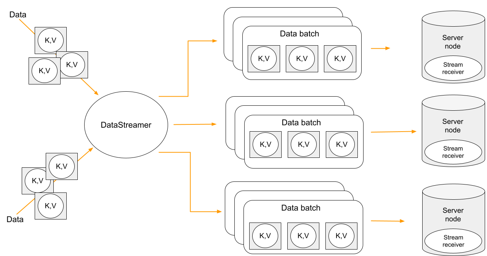

# Streaming Data

Data streaming provides a fast, efficient method for loading, organizing, and distributing large volumes of data across your cluster.
Data streamer accepts a stream of data and distributes data entries across the cluster, where the processing takes place. Data streaming is available in all table views.



Data streaming provides at-least-once delivery guarantee.


The Java examples on this page use the thin client, which requires the `ignite-client` module. For repository and dependency configuration, see [Project Setup and Required Modules](project-setup.md).


## Using Data Streamer API

The [Data Streamer API](https://www.gridgain.com/sdk/gridgain9/latest/javadoc/org/apache/ignite/table/DataStreamerTarget.html) lets you load large amounts of data into your cluster quickly and reliably using a publisher–subscriber model, where you create a publisher that streams your data entries to a table view, and the system distributes these entries across the cluster. You can configure how the data is processed via a `DataStreamerOptions` object that allows to set batch sizes, auto-flush intervals, retry limits.

### Configuring Data Streamer

`DataStreamerOptions` lets you fine-tune how data is streamed into your cluster by setting parameters for batching, retries, parallelism, and auto-flush timing:



```java
DataStreamerOptions options = DataStreamerOptions.builder()
        .pageSize(1000)
        .perPartitionParallelOperations(1)
        .autoFlushInterval(1000)
        .retryLimit(16)
        .build();
```



```csharp
var options = new DataStreamerOptions
{
    PageSize = 1000,
    RetryLimit = 8,
    AutoFlushInterval = TimeSpan.FromSeconds(3)
};
```



- `pageSize`: Specifies the number of entries to process in each page or chunk of data.
- `perPartitionParallelOperations`: Determines the number of parallel operations allowed on each partition.
- `autoFlushInterval`: Defines the time interval (in milliseconds) after which the system automatically flushes any incomplete buffers.
- `retryLimit`: Specifies the maximum number of retry attempts for a failed data submission before giving up.
- `sameKeyUpdateMode`:  Controls how multiple updates to the same key within a single batch are handled, which determines how many [continuous query](continuous-queries.md) events those updates produce. Defaults to `SQUASH`. See [Same-Key Update Mode](#same-key-update-mode).

### Same-Key Update Mode

By default, the data streamer applies each batch as a single implicit transaction with one commit timestamp. When a batch contains several updates to the *same key*, those updates are conflated: only the final state of the key is stored, and a [continuous query](continuous-queries.md) observes a single event for that key. The `sameKeyUpdateMode` option controls this behavior:

- `SQUASH` (default): Multiple updates to the same key within one batch are conflated to the final state. A continuous query observes one event per affected key per batch, carrying the final value. For a key that did not exist before the batch, this is a single `CREATED` event. This is the most performant mode and is recommended when only the final state matters.
- `PRESERVE`: Same-key updates within one batch are detected and the batch is split so that each update lands in a separate transaction with its own commit timestamp. A continuous query observes one event per update, each carrying that update's value. For a new key, the first event is `CREATED` and the subsequent same-key events are `UPDATED`. This mode is more expensive than `SQUASH`, because each same-key collision triggers an additional implicit transaction.

Updates to *different* keys can still share the same implicit transaction and commit timestamp regardless of the mode.

Use `PRESERVE` when a continuous query subscriber must observe every intermediate update to a key — for example, when the data streamer feeds an event pipeline that reacts to each individual change.

```java
DataStreamerOptions options = DataStreamerOptions.builder()
        .sameKeyUpdateMode(DataStreamerSameKeyUpdateMode.PRESERVE)
        .build();
```

### Streaming Data

Before data is streamed to the cluster, each entry must be wrapped in an instance of the `DataStreamerItem<T>` class. This wrapper allows you to perform `PUT` and `REMOVE` operations with data:

- Use `DataStreamerItem.of(entry)` to insert new entries into the table.

- Use `DataStreamerItem.removed(entry)` to delete existing ones.

Wrapped data then can be passed to a publisher and streamed to the table.

The example below demonstrates how to use [`RecordView`](table-api.md#table-views-in-gridgain-9), create a publisher, configure the data streamer, insert account records into the existing `accounts` table and then delete them:



```java
private static final int ACCOUNTS_COUNT = 10;

/* Assuming table Accounts exists */
public static void main(String[] arg) {

    try (IgniteClient client = IgniteClient.builder()
            .addresses("127.0.0.1:10800")
            .build()) {
        System.out.println("Creating Accounts table");
        client.sql().execute(null, "CREATE TABLE IF NOT EXISTS ACCOUNTS (id INT PRIMARY KEY, name VARCHAR(255), balance BIGINT, active BOOLEAN);");

        RecordView<Account> view = client.tables().table("Accounts").recordView(Account.class);

        /* PUT entries into the table*/
        streamAccountDataPut(view);

        /* Verify that table contains these entries by reading them back */
        verifyPut(view);

        /* Remove entries from the table */
        streamAccountDataRemove(view);

        /* Check that table does not contain data */
        verifyRemove(view);

        System.out.println("Dropping Accounts table.");
        client.sql().execute(null, "DROP TABLE IF EXISTS ACCOUNTS;");

    }
}

/* Streaming data using DataStreamerOperationType#PUT operation */
private static void streamAccountDataPut(RecordView<Account> view) {
    DataStreamerOptions options = DataStreamerOptions.builder()
            .pageSize(1000)
            .perPartitionParallelOperations(1)
            .autoFlushInterval(1000)
            .retryLimit(16)
            .build();

    CompletableFuture<Void> streamerFut;
    try (var publisher = new SubmissionPublisher<DataStreamerItem<Account>>()) {

        streamerFut = view.streamData(publisher, options);

        ThreadLocalRandom rnd = ThreadLocalRandom.current();

        for (int i = 0; i < ACCOUNTS_COUNT; i++) {
            Account entry = new Account(i, "name" + i, rnd.nextLong(100_000), rnd.nextBoolean());
            publisher.submit(DataStreamerItem.of(entry));
        }
    }
    streamerFut.join();
}

/* Streaming data using DataStreamerOperationType#REMOVE operation */
private static void streamAccountDataRemove(RecordView<Account> view) {
    DataStreamerOptions options = DataStreamerOptions.builder()
            .pageSize(1000)
            .perPartitionParallelOperations(1)
            .autoFlushInterval(1000)
            .retryLimit(16)
            .build();

    CompletableFuture<Void> streamerFut;
    try (var publisher = new SubmissionPublisher<DataStreamerItem<Account>>()) {
        streamerFut = view.streamData(publisher, options);
        for (int i = 0; i < ACCOUNTS_COUNT; i++) {
            Account entry = new Account(i);
            publisher.submit(DataStreamerItem.removed(entry));
        }
    }
    streamerFut.join();
}

private static void verifyPut(RecordView view) {
    System.out.println("=== Table data after PUT ===");
    for (int i = 0; i < ACCOUNTS_COUNT; i++) {
        Account keyRec = new Account(i);
        if (view.contains(null, keyRec)) {
            Account record = (Account) view.get(null, keyRec);
            System.out.printf("Found: id=%d, name=%s, balance=%d, active=%b%n",
                    record.getId(), record.getName(), record.getBalance(), record.isActive());
        } else {
            System.out.printf("Missing id=%d%n", i);
        }
    }
}

private static void verifyRemove(RecordView<Account> view) {
    System.out.println("=== Table data after REMOVE ===");
    List<Account> keys = IntStream.range(0, ACCOUNTS_COUNT)
            .mapToObj(Account::new)
            .collect(Collectors.toList());
    List<Account> records = view.getAll(null, keys);
    for (int i = 0; i < records.size(); i++) {
        System.out.printf("id=%d exists? %b%n", i, records.get(i) != null);
    }
}
```



```csharp
using Apache.Ignite;
using Apache.Ignite.Table;

using var client = await IgniteClient.StartAsync(new("localhost"));
ITable? table = await client.Tables.GetTableAsync("accounts");
IRecordView<Account> view = table!.GetRecordView<Account>();

var options = new DataStreamerOptions
{
    PageSize = 10_000,
    AutoFlushInterval = TimeSpan.FromSeconds(1),
    RetryLimit = 32
};

await view.StreamDataAsync(GetAccountsToAdd(5_000), options);
await view.StreamDataAsync(GetAccountsToRemove(1_000), options);

async IAsyncEnumerable<DataStreamerItem<Account>> GetAccountsToAdd(int count)
{
    for (int i = 0; i < count; i++)
    {
        yield return DataStreamerItem.Create(
            new Account(i, $"Account {i}"));
    }
}

async IAsyncEnumerable<DataStreamerItem<Account>> GetAccountsToRemove(int count)
{
    for (int i = 0; i < count; i++)
    {
        yield return DataStreamerItem.Create(
            new Account(i, string.Empty), DataStreamerOperationType.Remove);
    }
}

public record Account(int Id, string Name);
```



### Streaming with Receiver

The GridGain 9 streaming API supports advanced streaming scenarios by allowing you to create a custom receiver that defines server-side processing logic. Use a receiver when you need to process or transform data on the server, update multiple tables from a single data stream, or work with incoming data that does not match a table schema.

With a receiver, you can stream data in any format, as it is schema-agnostic.
The receiver also has access to the full GridGain 9 API through the [`DataStreamerReceiverContext`](https://gridgain.com/sdk/gridgain9/latest/javadoc/org/apache/ignite/table/DataStreamerReceiverContext.html).

The data streamer controls data flow by requesting items only when partition buffers have space. `DataStreamerOptions.perPartitionParallelOperations` controls how many buffers can be allocated per partition. When buffers are full, the streamer stops requesting more data until some items are processed.
Additionally, if a `resultSubscriber` is specified, it also applies backpressure on the streamer. If the subscriber is slow at consuming results, the streamer reduces its request rate from the publisher accordingly.

Receivers written in .NET can write to the server node log through `IDataStreamerReceiverContext.LoggerFactory`, which exposes the standard `Microsoft.Extensions.Logging.ILoggerFactory`. Messages are forwarded to the node executing the receiver and appear in its node log under the category name passed to `CreateLogger`. See [Logging from .NET Compute Jobs](compute/compute.md#net-compute-job-logging) for details and examples.

To use a receiver, you need to implement the [`DataStreamerReceiver`](https://gridgain.com/sdk/gridgain9/latest/javadoc/org/apache/ignite/table/DataStreamerReceiver.html) interface. The receiver's `receive` method processes each batch of items streamed to the server, so you can apply custom logic and return results for each item as needed:



```java
@Override
public CompletableFuture<List<Tuple>> receive(List<Tuple> page, DataStreamerReceiverContext ctx, Void arg) {
```



```csharp
ValueTask<IList<TResult>?> ReceiveAsync(
    IList<TItem> page,
    TArg arg,
    IDataStreamerReceiverContext context,
    CancellationToken cancellationToken);
```



- `page`: The current batch of data items to process.
- `ctx`: The receiver context, which lets you interact with GridGain 9 API.
- `arg`: An optional argument that can be used to pass custom parameters to your receiver logic.

### Examples

#### Updating Multiple Tables

The following example demonstrates how to implement a receiver that processes data containing customer and address information, and updates two separate tables on the server:

**1.** First, create the custom receiver that will extract data from the provided source and write it into two separate tables: `customers` and `addresses`.



```java
public class TwoTableReceiver implements DataStreamerReceiver<Tuple, Void, Tuple> {

    public TwoTableReceiver() {
    }
}
```



```csharp
class TwoTableReceiver : IDataStreamerReceiver<IIgniteTuple, object?, object>
{
    public async ValueTask<IList<object>?> ReceiveAsync(
        IList<IIgniteTuple> page,
        object? arg,
        IDataStreamerReceiverContext context,
        CancellationToken cancellationToken)
    {
        IRecordView<IIgniteTuple> customerTable = (await context.Ignite.Tables.GetTableAsync("customers"))!.RecordBinaryView;
        IRecordView<IIgniteTuple> addressesTable = (await context.Ignite.Tables.GetTableAsync("addresses"))!.RecordBinaryView;

        foreach (IIgniteTuple sourceItem in page)
        {
            // For each source item, the receiver extracts customer and address data and upserts it into respective tables.
            var customer = new IgniteTuple
            {
                ["id"] = sourceItem["customerId"],
                ["name"] = sourceItem["customerName"],
                ["addressId"] = sourceItem["addressId"]
            };

            var address = new IgniteTuple
            {
                ["id"] = sourceItem["addressId"],
                ["street"] = sourceItem["street"],
                ["city"] = sourceItem["city"],
            };

            await customerTable.UpsertAsync(null, customer);
            await addressesTable.UpsertAsync(null, address);
        }

        return null;
    }
}
```



**2.** Create a descriptor that refers to your receiver implementation. This descriptor will be passed later to a `SubmissionPublisher` when streaming data.



```java
DataStreamerReceiverDescriptor<Tuple, Void, Tuple> desc = DataStreamerReceiverDescriptor
        .builder(TwoTableReceiver.class)
        .units(new DeploymentUnit(DEPLOYMENT_UNIT_NAME, DEPLOYMENT_UNIT_VERSION))
        .build();
```



```csharp
ReceiverDescriptor<IIgniteTuple, object?, object> descriptor = 
ReceiverDescriptor.Of(new TwoTableReceiver()) with
{
    DeploymentUnits = [new DeploymentUnit("unit1", "1.0.0")]
};
```



**3.** Next, obtain the target table to partition the data for streaming. In this example we partition by `customerId` to ensure the receiver is [colocated](../administrators-guide/colocation.md) with the customer data, enabling local upserts. Then define how to extract keys and payloads from the source, and stream the data using a `SubmissionPublisher`.



```java
List<Tuple> sourceData = IntStream.range(1, 10)
        .mapToObj(i -> Tuple.create()
                .set("customerId", i)
                .set("customerName", "Customer " + i)
                .set("addressId", i)
                .set("street", "Street " + i)
                .set("city", "City " + i))
        .collect(Collectors.toList());

CompletableFuture<Void> streamerFut;

RecordView<Tuple> customersTableView = client.tables().table("Customers").recordView();

/* Extract the target table key from each source item; since the source has "customerId" but the target table uses "id", the function maps customerId to id accordingly */
Function<Tuple, Tuple> keyFunc = sourceItem -> Tuple.create().set("id", sourceItem.intValue("customerId"));

/* Extract the data payload sent to the receiver. In this case, we use the entire source item as the payload */
Function<Tuple, Tuple> payloadFunc = Function.identity();

/* Stream data using a publisher */
try (var publisher = new SubmissionPublisher<Tuple>()) {
    streamerFut = customersTableView.streamData(
            publisher,
            desc,
            keyFunc,
            payloadFunc,
            null, /* Optional receiver arguments */
            null, /* Result subscriber */
            null /* Options */
    );

    for (Tuple item : sourceData) {
        publisher.submit(item);
    }
}

streamerFut.join();
```



```csharp
IAsyncEnumerable<IIgniteTuple> sourceData = GetSourceData();

IRecordView<IIgniteTuple> customersTable = (await client.Tables.GetTableAsync("customers"))!.RecordBinaryView;

IAsyncEnumerable<object> streamerResults = customersTable.StreamDataAsync(
    sourceData,
    desc,
    x => new IgniteTuple { ["id"] = x["customerId"] },
    x => x,
    null,
    DataStreamerOptions.Default,
    CancellationToken.None);

await foreach (object result in streamerResults)
{
    // ...
}

static async IAsyncEnumerable<IIgniteTuple> GetSourceData()
{
    await Task.Yield(); // Simulate async enumeration.

    for (int i = 0; i < 10; i++)
    {
        yield return new IgniteTuple
        {
            ["customerId"] = i,
            ["customerName"] = $"Customer {i}",
            ["addressId"] = i,
            ["street"] = $"Street {i}",
            ["city"] = $"City {i}"
        };
    }
}
```



#### Distributed Computations

You can also use a streamer with a receiver to perform distributed computations, such as per-item calculations and [map-reduce](compute/compute.md#mapreduce-tasks) tasks on the returned results.

This example demonstrates a simulated fraud detection process, which typically involves intensive processing of each transaction using ML models.

**1.** First, create a custom receiver that will handle fraud detection computations on the results:



```java
private static class FraudDetectorReceiver implements DataStreamerReceiver<Tuple, Void, Tuple> {
    @Override
    public CompletableFuture<List<Tuple>> receive(List<Tuple> page, DataStreamerReceiverContext ctx, Void arg) {
        List<Tuple> results = new ArrayList<>(page.size());

        for (Tuple tx : page) {
            results.add(detectFraud(tx));
        }

        return CompletableFuture.completedFuture(results);
    }

    private static Tuple detectFraud(Tuple txInfo) {
        /* Simulate fraud detection processing */
        double fraudRisk = Math.random();

        /* Add result to the tuple and return */
        return txInfo.set("fraudRisk", fraudRisk);
    }
}
```



```csharp
class FraudDetectorReceiver : IDataStreamerReceiver<IIgniteTuple, object?, IIgniteTuple>
{
    public async ValueTask<IList<IIgniteTuple>?> ReceiveAsync(
        IList<IIgniteTuple> page,
        object? arg,
        IDataStreamerReceiverContext context,
        CancellationToken cancellationToken)
    {
        var result = new List<IIgniteTuple>(page.Count);

        foreach (var tx in page)
        {
            IIgniteTuple resTuple = await DetectFraud(tx);
            result.Add(resTuple);
        }

        return result;
    }

    private static async Task<IIgniteTuple> DetectFraud(IIgniteTuple transaction)
    {
        // Simulate fraud detection logic - add a random risk score to the tuple.
        await Task.Delay(10);
        transaction["fraudRisk"] = Random.Shared.NextDouble();
        return transaction;
    }
}
```



**2.** Next, stream a list of sample transactions across the cluster using a dummy table that partitions data by transaction ID and `FraudDetectorReceiver` for fraud detection. Subscribe to the results to log each processed transaction, handle errors, and confirm when streaming completes:



```java
List<Tuple> sourceData = IntStream.range(1, 10)
        .mapToObj(i -> Tuple.create()
                .set("txId", i)
                .set("txData", "{some-json-data}"))
        .collect(Collectors.toList());

DataStreamerReceiverDescriptor<Tuple, Void, Tuple> desc = DataStreamerReceiverDescriptor
        .builder(FraudDetectorReceiver.class)
        .build();

CompletableFuture<Void> streamerFut;

TableDefinition txDummyTableDef = TableDefinition.builder("tx_dummy")
        .columns(column("id", ColumnType.INTEGER))
        .primaryKey("id")
        .build();

Table dummyTable = client.catalog().createTable(txDummyTableDef);

Function<Tuple, Tuple> keyFunc = sourceItem -> Tuple.create().set("id", sourceItem.value("txId"));

/* Payload function is used to extract the payload (data that goes to the receiver) from the source item.
/* In our case, we want to use the whole source item as the payload */
Function<Tuple, Tuple> payloadFunc = Function.identity();

Flow.Subscriber<Tuple> resultSubscriber = new Flow.Subscriber<>() {
    @Override
    public void onSubscribe(Flow.Subscription subscription) {
        subscription.request(Long.MAX_VALUE);
    }

    @Override
    public void onNext(Tuple item) {
        System.out.println("Transaction processed: " + item);
    }

    @Override
    public void onError(Throwable throwable) {
        System.err.println("Error during streaming: " + throwable.getMessage());
    }

    @Override
    public void onComplete() {
        System.out.println("Streaming completed.");
    }
};

try (var publisher = new SubmissionPublisher<Tuple>()) {
    streamerFut = dummyTable.recordView().streamData(
            publisher,
            desc,
            keyFunc,
            payloadFunc,
            null,
            resultSubscriber,
            null
    );

    for (Tuple item : sourceData) {
        publisher.submit(item);
    }
}

streamerFut.join();
```



```csharp
// Source data is a list of financial transactions.
// We want to distribute this processing across the cluster, then gather and return results
IAsyncEnumerable<IIgniteTuple> data = GetSourceData();

ReceiverDescriptor<IIgniteTuple, object?, IIgniteTuple> fraudDetectorReceiverDesc = ReceiverDescriptor.Of(new FraudDetectorReceiver());

// Streaming requires a target table to partition data.
// Use a dummy table for this scenario, because we are not going to store any data.
await client.Sql.ExecuteScriptAsync("CREATE TABLE IF NOT EXISTS TX_DUMMY (ID LONG)");

ITable dummyTable = await client.Tables.GetTableAsync("TX_DUMMY");

// Source data has "txId" field, but target dummy table has "id" column, so keyFunc maps "txId" to "id".
Func<IIgniteTuple, IIgniteTuple> keyFunc = tuple => new IgniteTuple { ["id"] = tuple["txId"] };

// Payload function is used to extract the payload (data that goes to the receiver) from the source item.
// In our case, we want to use the whole source item as the payload.
Func<IIgniteTuple, IIgniteTuple> payloadFunc = tuple => tuple;

IAsyncEnumerable<IIgniteTuple> results = dummyTable.RecordBinaryView.StreamDataAsync(
    data,
    fraudDetectorReceiverDesc,
    keyFunc,
    payloadFunc,
    receiverArg: null);

await foreach (IIgniteTuple processedTx in results)
{
    Console.WriteLine("Transaction processed: " + processedTx);
}

async IAsyncEnumerable<IIgniteTuple> GetSourceData()
{
    await Task.Yield(); // Simulate async data source.

    for (int i = 0; i < 1000; i++)
    {
        yield return new IgniteTuple
        {
            ["txId"] = i,
            ["txData"] = "{some-json-data}"
        };
    }
}
```



#### Custom Marshallers in .NET

In .NET, you can define custom marshallers by implementing the [`IMarshaller`](https://www.gridgain.com/sdk/gridgain9/latest/dotnetdoc/api/Apache.Ignite.Marshalling.IMarshaller-1.html) interface.

For example, the code below demonstrates how to use `JsonMarshaller` to serialize data, arguments, and results.

```csharp
ITable? table = await client.Tables.GetTableAsync("my-table");

ReceiverDescriptor<MyData, MyArg, MyResult> receiverDesc = ReceiverDescriptor.Of(new MyReceiver());

IAsyncEnumerable<MyData> data = Enumerable
    .Range(1, 100)
    .Select(x => new MyData(x, $"Name {x}"))
    .ToAsyncEnumerable();

IAsyncEnumerable<MyResult> results = table!.RecordBinaryView.StreamDataAsync(
    data: data,
    receiver: receiverDesc,
    keySelector: dataItem => new IgniteTuple { ["id"] = dataItem.Id },
    payloadSelector: dataItem => dataItem,
    receiverArg: new MyArg("Some info"));

await foreach (MyResult result in results)
{
    Console.WriteLine(result);
}

public record MyData(int Id, string Name);

public record MyArg(string Info);

public record MyResult(MyData Data, MyArg Arg);

public class MyReceiver : IDataStreamerReceiver<MyData, MyArg, MyResult>
{
    public IMarshaller<MyData> PayloadMarshaller =>
        new JsonMarshaller<MyData>();

    public IMarshaller<MyArg> ArgumentMarshaller =>
        new JsonMarshaller<MyArg>();

    public IMarshaller<MyResult> ResultMarshaller =>
        new JsonMarshaller<MyResult>();

    public ValueTask<IList<MyResult>?> ReceiveAsync(IList<MyData> page, MyArg arg, IDataStreamerReceiverContext context, CancellationToken cancellationToken)
    {
        IList<MyResult> results = page
            .Select(data => new MyResult(data, arg))
            .ToList();

        return ValueTask.FromResult(results)!;
    }
}
```

## Tracking Failed Entries

If the data streamer fails to process any entries, it collects the failed items in a `DataStreamerException`. You can access the failed entries using the `failedItems()` method.

The streamer applies entries in the background, so it does not report a failure from the call that submits an entry.
It completes the streaming operation with the exception instead, so attach your failure handling to that operation.
In Java, this means attaching a handler to the future returned by `streamData()`.
Once the streamer fails, it stops accepting entries, and any remaining `submit()` calls throw an `IllegalStateException`:



```java
RecordView<Account> view = client.tables()
        .table("Accounts")
        .recordView(Account.class);

CompletableFuture<Void> streamerFut;

/* Wrap our stream in a publisher and attach a failure handler */
try (var publisher = new SubmissionPublisher<DataStreamerItem<Account>>()) {

    /* Start streaming once, and report the entries the streamer could not apply */
    streamerFut = view.streamData(publisher, options)
            .exceptionally(e -> {
                DataStreamerException streamerErr = streamerException(e);

                if (streamerErr != null) {
                    System.out.println("Failed items during background streaming: " + streamerErr.failedItems());
                } else {
                    System.out.println("Streaming error: " + e.getMessage());
                }
                return null;
            });

    ThreadLocalRandom rnd = ThreadLocalRandom.current();

    try {
        /* Publish valid entries */
        for (int i = 0; i < ACCOUNTS_COUNT; i++) {
            Account entry = new Account(
                    i,
                    "Account " + i,
                    rnd.nextLong(100_000),
                    rnd.nextBoolean()
            );
            publisher.submit(DataStreamerItem.of(entry));
        }

        /* Publish one entry that the table cannot store: the name exceeds the NAME column length */
        Account oversized = new Account(
                ACCOUNTS_COUNT,
                "N".repeat(OVERSIZED_NAME_LENGTH),
                rnd.nextLong(100_000),
                true
        );
        publisher.submit(DataStreamerItem.of(oversized));
    } catch (IllegalStateException e) {
        /* The streamer stops accepting entries as soon as it fails, so submit() rejects the rest */
        System.out.println("Streamer stopped accepting entries: " + e.getMessage());
    }
}

/*
 * Closing the publisher lets the streamer drain and complete. The handler above reports the failed
 * entries, so join() returns normally instead of rethrowing the DataStreamerException.
 */
streamerFut.join();
```

The streamer completes its future with a `DataStreamerException` directly, but a handler attached further down the chain receives it wrapped in a `CompletionException`. The helper below checks both:

```java
/**
 * Finds the DataStreamerException in a streamer failure.
 *
 * <p>The streamer completes its future with a DataStreamerException directly, but a handler attached further down the
 * chain sees it wrapped in a CompletionException, so check both.
 *
 * @param e Throwable passed to the failure handler.
 * @return The DataStreamerException, or {@code null} if the failure has another cause.
 */
private static DataStreamerException streamerException(Throwable e) {
    if (e instanceof DataStreamerException) {
        return (DataStreamerException) e;
    }

    return e.getCause() instanceof DataStreamerException ? (DataStreamerException) e.getCause() : null;
}
```



```csharp
ITable? table = await Client.Tables.GetTableAsync("my-table");
IRecordView<IIgniteTuple> view = table!.RecordBinaryView;
IList<IIgniteTuple> data = [new IgniteTuple { ["key"] = 1L, ["val"] = "v" }];

try
{
    await view.StreamDataAsync(data.ToAsyncEnumerable());
}
catch (DataStreamerException e)
{
    Console.WriteLine("Failed items: " + string.Join(",", e.FailedItems));
}
```



### Tuning Memory Usage

Data streamer may require significant amount of memory to handle the requests in orderly manner. Depending on your environment, you may want to increase or reduce the amount of memory reserved by the data streamer.

For every node in the cluster, the streamer reserves an amount of memory equal to `pageSize` (1000 entries by default) multiplied by `perPartitionParallelOperations` (1 by default) setting. For example, a 10-partition table with default parameters and average entry size of 1KB will reserve 10MB for operations.

You can change these options while creating a `DataStreamerOptions` object:



```java
DataStreamerOptions options = DataStreamerOptions.builder()
        .pageSize(1000)
        .perPartitionParallelOperations(1)
        .autoFlushInterval(1000)
        .retryLimit(16)
        .build();
```



```csharp
// .NET streamer does not have a perNodeParallelOperations option yet.
var options = new DataStreamerOptions
{
    PageSize = 10_000
};
```



Additionally, the data streamer periodically flushes incomplete buffers to ensure that messages are not delayed indefinitely. This is especially useful when a buffer fills slowly or never completely fills due to uneven data distribution.

This behavior is controlled by the `autoFlushInterval` property, which is set to 5000 ms by default. You can also configure the `retryLimit` parameter to define the maximum number of retry attempts for failed submissions, with a default value of 16.
