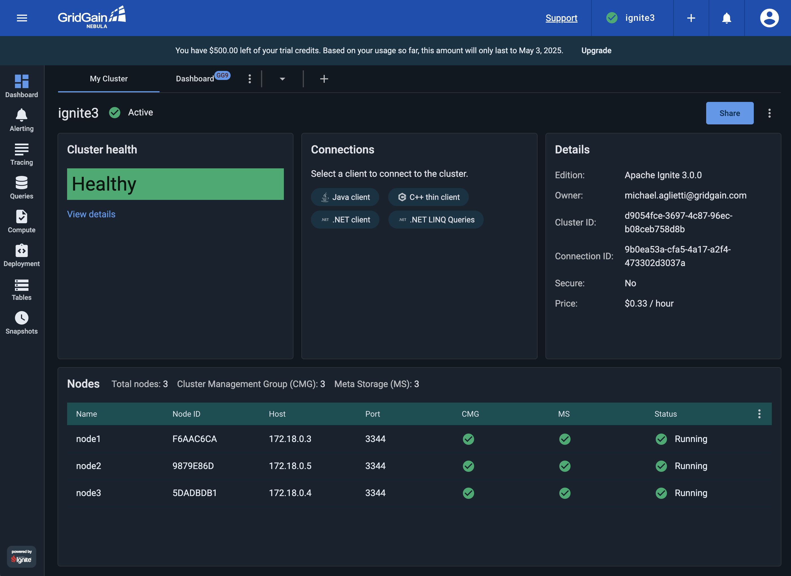

# Connecting GridGain 9 to GridGain Nebula

This guide explains how to set up a local GridGain 9 cluster running in Docker and connect it to GridGain Nebula for monitoring and management. GridGain Control Center provides a web-based interface for monitoring cluster performance, executing SQL queries, and analyzing metrics.

## Prerequisites

* An up-to date Docker and Docker Compose installed on your system;
* Basic knowledge of Docker and GridGain.

## Step 1: Create a GridGain Nebula Account

In this tutorial we will be using GridGain Nebula to monitor the cluster. If you do not already have a GridGain Nebula account, you'll need to create one:

* Sign up for [GridGain Nebula](https://portal.gridgain.com/auth/signup);
* Complete the registration process;
* Verify your email and set up your account.

Once registered, you will have access to the GridGain Nebula [https://portal.gridgain.com](https://portal.gridgain.com).

## Step 2: Set Up Environment Variables

The GridGain Cloud Connector is used to connect to Nebula safely. To connect, you will need to provide your GridGain Nebula credentials in Cloud Connector configuration. Set up environment variables for your username and password:



```bash
export CC_USERNAME=your_email@example.com
export CC_PASSWORD=your_password
```



```bash
set CC_USERNAME=your_email@example.com
set CC_PASSWORD=your_password
```



```bash
$env:CC_USERNAME="your_email@example.com"
$env:CC_PASSWORD="your_password"
```



These environment variables will be used by Docker Compose to pass your credentials to Cloud Connector.

## Step 3: Create the Docker Compose File

Create a file named `docker-compose.yml` with the following content:

```yaml
name: gridgain9

x-gridgain-def: &gridgain-def
  image: gridgain/gridgain9:9.1
  environment:
    JVM_MAX_MEM: "4g"
    JVM_MIN_MEM: "4g"
    BOOTSTRAP_NODE_CONFIG: /opt/gridgain/etc/gridgain-config.conf
  configs:
    - source: node_config
      target: /opt/gridgain/etc/gridgain-config.conf
      mode: 0644

x-cloud-connector-def: &cloud-connector-def
  image: gridgain/cloud-connector:9.1
  environment:
    # The URL of Nebula web page.
    # For Control Center, this is the URL of your Control Center frontend.
    - CONNECTOR_CC_URL=https://portal.gridgain.com
    # The base url of the connector that will be used by nodes to connect to it.
    # This URL must be accessible by all nodes in the cluster.
    # Must match cloud connector profile name specified in the compose file.
    - CONNECTOR_BASE_URL=http://cloud-connector:3200
    # The name of the connector that will be displayed in Nebula.
    - CONNECTOR_NAME=My GridGain 9
    # Username that will be used to authenticate in Nebula.
    - CONNECTOR_USERNAME=${CC_USERNAME}
    # Password that will be used to authenticate in Nebula.
    - CONNECTOR_PASSWORD=${CC_PASSWORD}
services:
  node1:
    <<: *gridgain-def
    command: --node-name node1
    ports:
      - "10300:10300"
      - "10800:10800"
  node2:
    <<: *gridgain-def
    command: --node-name node2
    ports:
      - "10301:10300"
      - "10801:10800"
  node3:
    <<: *gridgain-def
    command: --node-name node3
    ports:
      - "10302:10300"
      - "10802:10800"
  cloud-connector:
    <<: *cloud-connector-def
    profiles:
      - cloud-connector

configs:
  node_config:
    content: |
      ignite {
        network {
          port: 3344
          nodeFinder.netClusterNodes = ["node1:3344", "node2:3344", "node3:3344"]
        }
      }
```


The configuration above provides basic environment configuration. For more configuration options, see the [Cloud Connector](https://www.gridgain.com/docs/nebula/cloud-connector/connect-cloud-connector) configuration.


This configuration sets up:

* Three GridGain 9 nodes;
* A Cloud Connector that connects your cluster to GridGain Nebula, defined in a separate profile for flexibility.

## Step 4: Start the Cluster with Cloud Connector

Launch the GridGain cluster with the Cloud Connector enabled:

```bash
docker compose --profile cloud-connector up -d
```

This command starts the three GridGain nodes and the Cloud Connector instance.

## Step 5: Initialize the GridGain Cluster

Open a new terminal window and start the GridGain CLI:

```bash
docker run --rm -it --network=gridgain9_default -v /opt/etc/license.json:/opt/gridgain/etc/license.json -e LANG=C.UTF-8 -e LC_ALL=C.UTF-8 gridgain/gridgain9:9.1 cli
```

When prompted, refuse to connect to the default node and instead manually connect to the first node:

```
connect http://node1:10300
```

Initialize the cluster:

```
cluster init --name=gridgain --license=/opt/gridgain/etc/license.json
```

You should see a message confirming that the cluster was initialized successfully.

## Step 6: Access GridGain Nebula

Now, log in to your GridGain Nebula account:

* Go to [https://portal.gridgain.com](https://portal.gridgain.com);
* Enter your credentials.

## Step 7: Attach Your Cluster

Right now, your cluster is running locally, but not sending any data to Nebula. To set up connection, click **Attach GridGain** and choose the **My GridGain 9** connector. Specify GridGain base API and `http://node1:10300` as GridGain REST API.

You should see your GridGain cluster appearing in the list of clusters, and the default dashboard. It may take a minute or two for the connection to be established and for data to start flowing.

## Step 8: Explore the Cluster in Control Center

Once your cluster appears, click on it to access the dashboard. From here, you can:

* View cluster topology and node status;
* Monitor performance metrics including CPU, memory, and network usage;
* Execute SQL queries through the web interface;
* Analyze cache and table data;
* Access detailed performance metrics and history.



## Troubleshooting Connection Issues

If your cluster does not appear in the Nebula:

* Check that the environment variables are set correctly
* Examine the cloud connector logs for any error messages:

```bash
docker compose logs cloud-connector
```

* Verify that your Nebula account is active;
* Make sure the Cloud Connector can access the internet to reach GridGain Nebula;
* Check if there are any network restrictions or proxies in your environment.

## Shutting Down

To stop the cluster and the cloud connector:

```bash
docker compose down
```

This command stops and removes all containers defined in the Docker Compose file.

## Advanced Configuration

For production deployments, you might want to customize several aspects:

* Configure data persistence for the GridGain nodes;
* Adjust memory allocation based on your workload;
* Set up node attributes for better resource management;
* Configure additional security settings.

Refer to the [GridGain Control Center documentation]({tools}/control-center/readme) for more advanced configuration options and best practices.

With this setup, you now have a local GridGain 9 cluster that is fully monitored and can be managed through the GridGain Nebula.
