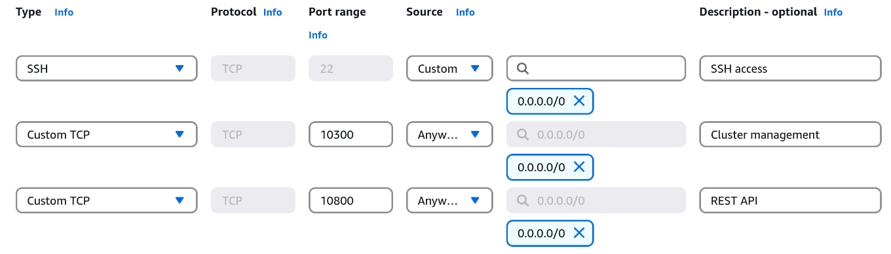

# Using GridGain 9 AMI

GridGain provides an AMI with the latest version of GridGain 9 preinstalled.

## Prerequisites

- An existing AWS account

## Considerations

Choose the right type of instances that suit your needs. The following instance types are supported:

| Instance type family | Instance type |
| --- | --- |
| M6i | m6i.xlarge<br>m6i.2xlarge<br>m6i.4xlarge<br>m6i.8xlarge<br>m6i.12xlarge<br>m6i.16xlarge<br>m6i.24xlarge<br>m6i.32xlarge<br>m6i.metal |
| T3 | t3.large<br>t3.xlarge<br>t3.2xlarge |
| C5 | c5.large<br>c5.xlarge<br>c5.2xlarge<br>c5.4xlarge<br>c5.9xlarge<br>c5.12xlarge<br>c5.18xlarge<br>c5.24xlarge<br>c5.metal |
| C5d | c5d.large<br>c5d.xlarge<br>c5d.2xlarge<br>c5d.4xlarge<br>c5d.9xlarge<br>c5d.12xlarge<br>c5d.18xlarge<br>c5d.24xlarge<br>c5d.metal |
| R5 | r5.large<br>r5.xlarge<br>r5.2xlarge<br>r5.4xlarge<br>r5.8xlarge<br>r5.12xlarge<br>r5.16xlarge<br>r5.24xlarge<br>r5.metal |
| R5d | r5d.large<br>r5d.xlarge<br>r5d.2xlarge<br>r5d.4xlarge<br>r5d.8xlarge<br>r5d.12xlarge<br>r5d.16xlarge<br>r5d.24xlarge<br>r5d.metal |
| R6i | r6i.large<br>r6i.xlarge<br>r6i.2xlarge<br>r6i.4xlarge<br>r6i.8xlarge<br>r6i.12xlarge<br>r6i.16xlarge<br>r6i.24xlarge<br>r6i.32xlarge<br>r6i.metal |

Consider the following points:

- *RAM:* If you are going to use GridGain as an in-memory storage, make sure to select an instance with enough RAM to fit all your data.
- *Disk space:* If you are launching a cluster with a [persistent storage](../../administrators-guide/storage/engines/aipersist.md), provide enough size to accommodate all your data when configuring the instance's volume.

  
  You may want to uncheck the *Delete on Termination* option for your storage.
  
- *Networking:* GridGain nodes discover and communicate with each other by TCP/IP. A number of ports must be open for this communication. See [Configuring Security Group](#configuring-security-group).

## Obtaining GridGain AMI

Visit the [GridGain 9 product page](https://aws.amazon.com/marketplace/pp/prodview-iwhb7epmumffo) corresponding to the edition you need, and launch the AMI from there.

## Providing a license

GridGain 9 AMI image comes with free license. No additional actions are required to start the cluster.

## Configuring IAM Role and Instance Profile

Optionally, you can attach IAM role to instances via Instance Profile. These are recommended policies to attach to this role:

- `arn:aws:iam::aws:policy/AmazonSSMManagedInstanceCore` - to allow [Amazon Systems Manager](https://docs.aws.amazon.com/systems-manager/latest/userguide/what-is-systems-manager.html) to manage the instance and to allow connections from [Amazon Session Manager](https://docs.aws.amazon.com/systems-manager/latest/userguide/session-manager.html);
- `arn:aws:iam::aws:policy/CloudWatchAgentServerPolicy` - to allow [CloudWatch Agent](https://docs.aws.amazon.com/AmazonCloudWatch/latest/monitoring/Install-CloudWatch-Agent.html) on the instance write logs to [CloudWatch Logs](https://docs.aws.amazon.com/AmazonCloudWatch/latest/logs/WhatIsCloudWatchLogs.html).

### Configuring Security Group

When configuring the instances, you will be asked to specify a security group. The security group must allow connection to the following ports:

| Protocol | Port | Description |
| --- | --- | --- |
| SSH | 22 | Used for SSH connection. |
| TCP | 3344 | Communication port for clustering. |
| TCP | 10300 | Cluster management ports. |
| TCP | 10800 | REST API request ports. |

These are the default ports that GridGain nodes use for discovery and communication purposes. If you want to use values other than the default ones, open them.

This is what our security group should look like:



In the security group settings above, we opened connection from any source. Use more secure settings in your production environment!

## Launching GridGain Nodes

You can use [GridGain 9 Terraform AWS Module](https://registry.terraform.io/modules/gridgain/gridgain9/aws/latest) to create EC2 instances and  all supplementary  resources (VPC, EIPs, S3 bucket, ELB, etc). Please refer to [GridGain 9 Terraform AWS Module documentation](terraform.md).

Connect to the EC2 instance via ssh as per the AWS documentation. Make sure to provide the same credentials that were used to launch the EC2 instance.

The default user name is `gridgain`. The ssh command would look like (change the IP address with the actual public IP of your image):

```bash
ssh -i your_key.pem gridgain@54.173.158.228
```

You can change the user name after first login, if needed. For information on how to create a custom user name, see [AWS documentation for Linux user accounts](http://docs.aws.amazon.com/AWSEC2/latest/UserGuide/managing-users.html).

GridGain is [installed as RPM](../deb-rpm.md). It provides [systemd service](../deb-rpm.md#running-gridgain-as-a-service) `gridgain9db` which can be managed using systemctl. Because the service is enabled by default, it should start automatically and be up and running soon after the instance launch.

## Configuring Discovery

Cluster nodes launched in different EC2 instances must be able to connect to each other. Please refer to [Network Configuration](../../administrators-guide/config/node-config.md#network-configuration) to let cluster nodes discover each other.

## Troubleshooting Your AWS Deployment

If you provided [CloudWatch Agent policy](https://docs.aws.amazon.com/AmazonCloudWatch/latest/monitoring/Install-CloudWatch-Agent.html), instances will publish logs to [CloudWatch Logs](https://docs.aws.amazon.com/AmazonCloudWatch/latest/logs/WhatIsCloudWatchLogs.html). Agent on the instances is already pre-configured to publish GridGain node logs. Pre-configured log location is `gridgain9-db-9.1\log`.
