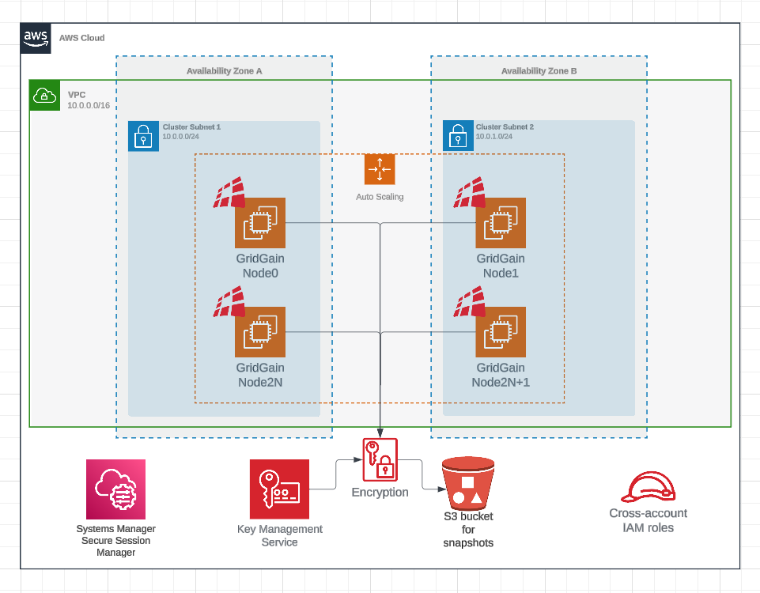

# Using Terraform to Deploy GridGain 9 in AWS

GridGain 9 can be used in your AWS infrastructure. You can provision GridGain 9 cluster using Terraform.

## Overview

To help you launch GridGain in AWS we provide:

- [GridGain 9 image on AWS Marketplace](https://aws.amazon.com/marketplace/pp/prodview-eg47rdkhexe4y)
- [Terraform module on Terraform Registry](https://registry.terraform.io/modules/gridgain/gridgain9/aws/latest)

## Usage Example

Following steps will describe how you can use Terraform module to deploy GridGain cluster.

1. Make sure you have [Terraform](https://www.terraform.io/) installed and [configured to use your AWS credentials](https://registry.terraform.io/providers/hashicorp/aws/latest/docs#authentication-and-configuration);
2. Visit AWS Marketplace to obtain [GridGain AMI ID](gridgain-ami.md);
3. Clone [Terraform module repository from GitHub](https://github.com/gridgain/terraform-aws-gridgain9/);
4. Navigate to `examples/with_license` subdirectory;
5. [Obtain GridGain 9 license](https://www.gridgain.com/tryfree) and place it in `examples/with_license/files/gridgain-license.conf`;
6. Edit `main.tf` file. Set AMI ID and your SSH public key (for accessing the instance);
7. Run `terraform init`. It will download AWS provider and prepare for applying the infrastructure;
8. Run `terraform apply`. It will present you the change plan. Upon your approval, Terraform will create infrastructure in AWS;
9. To delete the cluster created with Terraform, run `terraform destroy`.

You can see the complete list of parameters available for the module on [Terraform Registry](https://registry.terraform.io/modules/gridgain/gridgain9/aws/latest) page.

## Deployment Diagrams

Terraform module is designed to create sufficient infrastructure to run GridGain cluster using the AMI. It will provision VPC and networking, S3 and KMS for encrypted snapshots and cluster nodes themselves as EC2 instances. You can check deployment diagrams below or examples in [Terraform module repository](https://github.com/gridgain/terraform-aws-gridgain9/tree/main/examples).

### Private Cluster Deployment Diagram

Below is the example of the deployment that will be created if the `public_access_enable` variable is set to `false`:

### Public Cluster Deployment Diagram

Below is the example of the deployment that will be created if the `public_access_enable` variable is set to `true`:

