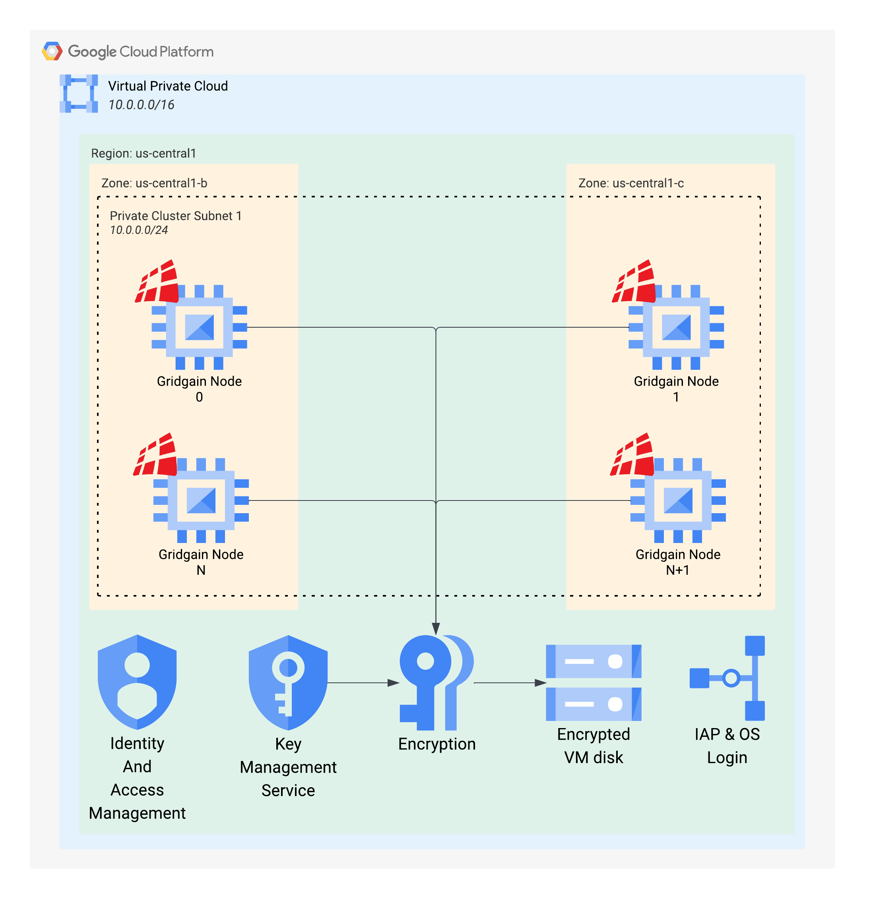
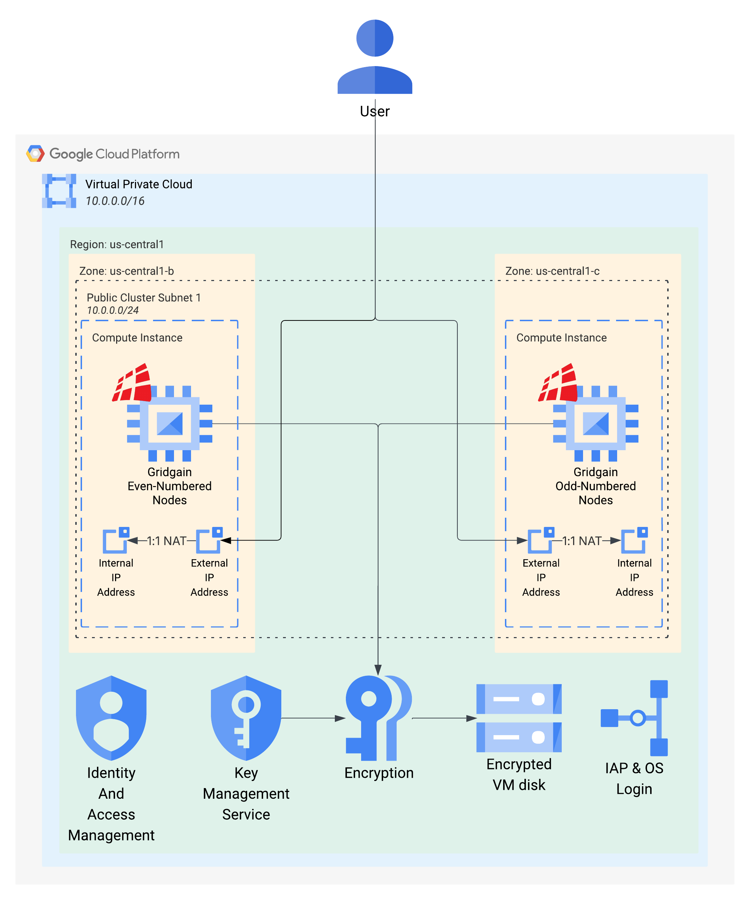

# GridGain 9 GCP Terraform Deployment

## Using Terraform to Deploy GridGain 9 in GCP

GridGain 9 can be used in your GCP infrastructure. You can provision GridGain 9 cluster using Terraform.

## Overview

To help you launch GridGain in GCP we provide:

- GridGain 9 image on GCP Marketplace.
- [Terraform module on Terraform Registry](https://registry.terraform.io/modules/gridgain/gridgain9/google/latest).

## Usage Example

The following steps will describe how you can use Terraform module to deploy GridGain cluster.

1. Make sure you have installed [Terraform](https://www.terraform.io/) and [configured it to use your GCP credentials](https://registry.terraform.io/providers/hashicorp/google/latest/docs/guides/getting_started#configuring-the-provider).
2. Visit GCP Marketplace to obtain the GridGain 9 Machine Image ID.
3. Refer to the terraform module as shown in the [provision configuration](https://registry.terraform.io/modules/gridgain/gridgain9/google/latest) for the terraform module.
4. Create a `files` subdirectory for you license.
5. Obtain a GridGain 9 license and place it in the `files` subdirectory.
6. Edit the `main.tf` file:
   1. Set `project_id` with your Project ID.
   2. Set `image_id` parameter with Machine Image ID (AMI).
   3. Set `ssh_pub_key` with your SSH public key (for accessing the instance), or remove it and just use `oslogin` for connection.
7. Run `terraform init`. It will download GCP provider and prepare for applying the infrastructure.
8. Run `terraform apply`. It will present you the change plan. Upon your approval, Terraform will create infrastructure in GCP.
9. To delete the cluster created with Terraform, run `terraform destroy`.

You can see the complete list of parameters available for the module on [Terraform Registry](https://registry.terraform.io/modules/gridgain/gridgain9/google/latest) page.

## Deployment Diagram

The Terraform module is designed to create sufficient infrastructure to run GridGain cluster using Machine Image. It will provide VPC and network resources, KMS for encryption, an IAP tunnel for secure connection via OS Login, and the cluster nodes themselves as compute instances.

You can see the deployment diagrams below or in the examples in the Terraform module repository.

## Private cluster

Below is the example of the deployment that will be created if the `public_access_enable` variable is set to `false`:

## Public cluster

Below is the example of the deployment that will be created if the `public_access_enable` variable is set to `true`:

