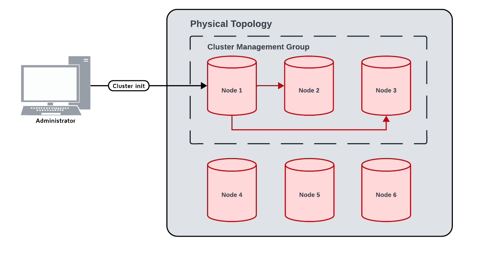
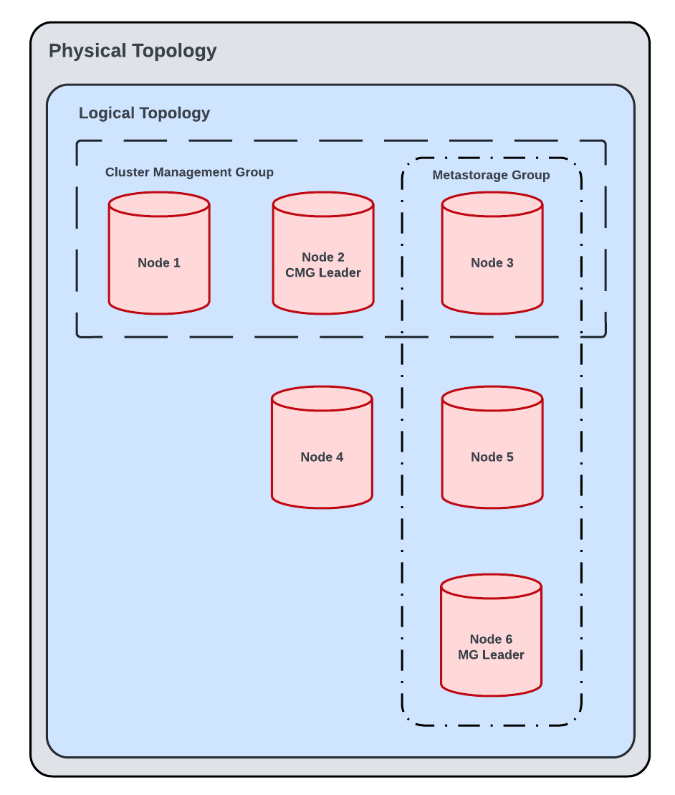

# Cluster Lifecycle

This topic covers the information covering GridGain 9 cluster initialization and lifecycle.

## Node Start Without a Running Cluster

When a node starts, it uses its node finder configuration (`network.nodeFinder`) to discover other nodes and connect to every node it can reach; together these nodes form the *physical topology*. If no cluster is running yet, the nodes only exchange discovery information and start no cluster processes until they receive the cluster initialization command.

### Logical and Physical Topology

GridGain distinguishes between two cluster topologies.

The *physical topology* is the set of nodes that have discovered each other. Discovery information is shared transitively, so the physical topology includes all nodes known to the connected group. Nodes that cannot reach each other form separate physical topologies. For example, if nodes A and B only know about each other, and nodes C and D only know about each other, the result is two independent physical topologies, A–B and C–D.

The *logical topology* is the subset of nodes in the physical topology that have been validated and accepted as members of a running cluster. It is created during [cluster initialization](#cluster-initialization); belonging to a physical topology does not by itself make a node part of a cluster. Nodes in the logical topology are the ones that form the cluster: they participate in the cluster's Raft groups, hold data, and serve requests.

The logical topology is always a subset of the physical topology, so a node can belong to the physical topology without being part of the logical topology. The two are kept in sync automatically: when a node leaves the physical topology, it is immediately removed from the logical topology.

### Cluster Network Topology and Communication Model

The GridGain 9 cluster uses a fully connected peer-to-peer network topology. Each node establishes a TCP connection to every other node in the same [physical topology](../reference/glossary.md#p) using the cluster communication port (`3344` by default).

Nodes discover each other using the configured `network.nodeFinder`. At startup, nodes exchange network addresses and IDs, converge to a shared view of the physical topology, and establish direct peer-to-peer connections with all reachable nodes.

### Node Addresses

The node finder only tells a starting node where to look for other nodes. Once contacted, every node introduces itself with a single published address. The other nodes use that address for all further communication. The published address must therefore be reachable from every other node in the cluster. If it is not, the node can reach the others, but they cannot reach it back, and it never becomes part of the physical topology.

By default, a node publishes the address it listens on. If it listens on all interfaces, it publishes the address that its host name resolves to, or, failing that, one of its network interface addresses. On a machine with several network interfaces, or behind NAT, set `network.advertisedAddress` explicitly. See [Node Address](../reference/configuration/node-configuration-parameters.md#node-address) for the exact rules.

### Node Requirements

All nodes in cluster must have similar time, that can be different by no more than `schemaSync.maxClockSkewMillis`. This is necessary for correct transaction operation.

As network latency can be unpredictable, some requests may take so long to arrive that the time will be different on the receiving node by the time request arrives. To account for the delay, set the `schemaSync.delayDurationMillis` property to the time that is long enough for the schema updates to be delivered to all nodes in the cluster. However, this delay also affects how long it takes for DDL to be executed, as all nodes need to wait for the delay to pass before applying the update.

## Cluster Initialization

When the `cluster init` command is received by any node in the cluster, it starts the initialization process.

First, the nodes specified in the `--cluster-management-group` argument form a RAFT group and take on the role of the *cluster management group* (CMG) -- a group responsible for managing cluster operations.

Next, the nodes specified in the `--metastorage-group` argument form a RAFT group and assume the role of the *metastorage group*. These nodes store the authoritative copy of the cluster's metadata.

If only one of `--cluster-management-group` or `--metastorage-group` is specified, the specified value is used for both. If neither is specified, a set of nodes is automatically selected for both CMG and the metastorage group in alphabetical order. The number of selected nodes is determined as follows:

- If the cluster size is 3 or fewer, all nodes are used for the metastorage group (CMG and metastorage).
- If the cluster size is 4, three nodes are used to maintain an odd number, improving consensus efficiency.
- If the cluster size is 5 or more, five nodes are used to balance fault tolerance and overhead.

Once the 2 raft groups are started and elect their leaders, all other nodes in the topology are notified that the cluster is started, and they can join it. At this point, the cluster is considered *initialized* and can start receiving requests.

Each non-leader node receives the invitation from the CMG to join the cluster and forms a validation request. Then, the request is sent to the CMG, and, after validation, the node receives cluster meta information from the metastorage group and joins the cluster.

The nodes are also added to the cluster *logical topology* - the nodes that are verified and accepted by CMG as part of the cluster. When nodes shut down or leave the physical topology for any other reason, the cluster logical topology is immediately adjusted.

### Conditional Cluster Initialization

A freshly started cluster can only be initialized once. Running `cluster init` against a cluster that is already initialized normally fails with an error. This may cause issues is automation scripts that expect successful initialization.

The following optional flags can be used to make initialization safe to run repeatedly and conditionally:

- `--if-needed`: if the cluster is already initialized, the command does nothing and exits successfully.
- `--if-nodes=<nodeCount>`: initialization proceeds only once at least `<nodeCount>` nodes are present in the physical topology. Otherwise, the command exits successfully without initializing. This argument requires `--if-needed`, and the command fails if the physical topology cannot be retrieved.

For the full command syntax, see [`cluster init`](../reference/cli-tool.md#cluster-init).

### Cluster Management Group

Cluster management group stores information about the cluster, the list of nodes that are in the cluster, and handles all cluster logical topology changes. Due to using RAFT consensus algorithm, the CMG improves the protection from split-brain (as any cluster group losing the CMG majority will no longer be fully functional).

It is recommended to have the CMG of 3, 5 or 7 nodes. For most clusters, going over 7 nodes in your CMG is not recommended. Larger management group improves stability, as it reduces the odds of losing the majority of CMG nodes, but may cause a minor performance hit.

Losing the majority of CMG nodes leaves the cluster mostly functional. The cluster without the CMG majority can  still handle transactions and user requests, but cannot:

- Add new nodes to logical topology.
- Re-add nodes that left the cluster to logical topology.
- Create new table indexes. In this scenario, `CREATE INDEX` DDL operation will never be fully resolved and will hang the application.

To restore full cluster functionality, bring the offline members of CMG back online.

The CMG stores the following information:

- Current cluster state, including what nodes are in CMG and metastorage groups, what GridGain version is used and cluster tag.
- Consistent IDs of all nodes in the logical topology.
- Node validation status.

By default, the information is stored in the `work` folder, but it can be configured on each CMG node by setting the `ignite.system.cmgPath` property.

### Cluster Metastorage Group

Cluster metastorage group stores information about the data stored in the cluster, and handles data distribution.

It is recommended to have the metastorage of 3, 5 or 7 nodes. For most clusters, going over 7 nodes in your metastorage group is not recommended. Larger metastorage group improves stability, as it reduces the odds of losing the majority of metastorage nodes, but may cause a minor performance hit.

Losing the majority of metastorage nodes will turn the cluster inoperable and may lead to data loss.

The metastorage contains the following information:

- Cluster catalog - the single storage of all meta information about the cluster - table schemas, indexes, views, distribution zone information, etc.
- Logical topology history.
- Other data required for cluster operation.

By default, the information is stored in the `work` folder, but it can be configured on each node by setting the `ignite.system.metastoragePath` property. In high load environments, it is recommended to have metastorage located on a separate hard drive, as high workload may cause slowdowns in [partition allocation](storage/data-partitioning.md#primary-replicas-and-leases).

Old versions of data are kept in metastorage for 1 hour. GridGain checks every minute for expired metastorage data and removes it when it is no longer needed.

## Node Join Scenarios

### New Nodes Joining the Cluster

When a new node is started, it adds itself to the physical topology. Then, the CMG receives the event that a new node has joined the topology, and sends it an invitation to join the cluster. Once the node receives it, it sends the validation request with node information, which the CMG verifies and adds the node to the logical topology.

### Node Rejoins the Cluster

If the node leaves the physical topology (for example, because the machine with the node is unreachable), the cluster logical topology is immediately adjusted, and the node is excluded from it. It can no longer rejoin the cluster with the same node ID.

To rejoin the cluster, the node must be restarted. During the restart, a new ID will be generated and the node will be able to join the physical and logical topology.

When a node reappears in the physical topology, the CMG sends it an invitation to join. The node then asks the CMG to validate itself, and, if this is successful, it starts its components (doing local recovery on the way), after which it tells the CMG that it's ready to join. The CMG then adds it to the logical topology. This is the same process as the first join of a blank node.

## Network Segmentation Scenario

If a cluster is partitioned at any point (for example, due to temporary network problems), only the part of the cluster that has the majority of both the cluster management and metastorage groups will continue to operate normally. If this happens, cluster topology will be automatically adjusted to exclude lost nodes, while other parts of the cluster will be inoperable. Nodes that are not part of either cluster management or metastorage group do not contribute to the majorities - only nodes that are part of those groups count.

The part of the cluster that does not have the management group majority, but has metastorage group majority will operate at a limited functionality. It would still be able to perform updates and read data, but not change its topology or create indexes.

The part of the cluster that lost metastorage group majority will be inoperable, even if it has management group majority.

If the cluster is split without a clear majority (for example, 4 cluster management group nodes were split evenly), both sides of the split will lose majority and have corresponding functional limitations.

When a cluster is split, [data partitions](storage/data-partitioning.md) might also be split. As GridGain creates a RAFT group for each partition, only the side that has the majority of partition replicas will be able to continue writing data. If a part of the cluster still maintains metastorage group majority and a majority for one or multiple partitions, it will be able to keep updating data in those partitions, but no other part of the cluster will be able to write conflicting data, thus avoiding potential split-brain scenario.

When [disaster recovery](../gridgain9-management/disaster-recovery/data-recovery.md) is performed on a split cluster, it is important to identify potential sub-clusters that had data updates and recover data from them. If recovery is performed on a side that has the minority of partitions and the other side had data updates, it is possible to manually introduce split-brain.

When connectivity is restored, nodes will attempt to rejoin the cluster. The part of the cluster with the cluster management group majority can be used to restore the cluster without cluster-wide downtime. Nodes in other parts will need to be restarted to join the cluster as described [above](#node-rejoins-the-cluster). Once cluster management group and metastorage group majority is restored on the physical topology, the cluster will restore full functionality. Any data updates from the sub-clusters will be automatically propagated to partition replicas that were not updated.
