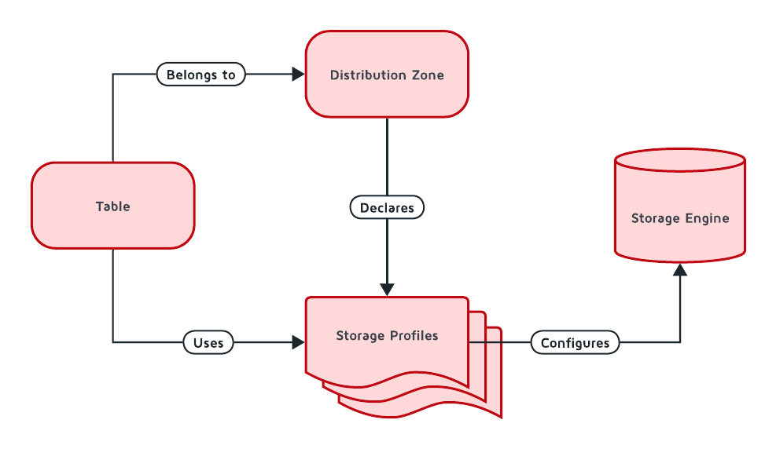

# Storage

GridGain 9 features a modern and highly configurable storage system that allows you to choose where and how your data is stored. This topic provides an overview of storage principles in GridGain.

The diagram below depicts the relationship between tables, distribution zones, storage profiles and storage engines:



In GridGain, storage has both cluster-wide and node-specific components:

- **Cluster-wide Components**: Table definitions, Distribution Zone configurations, and Profile names/types are consistent across the entire cluster.

- **Node-specific Components**: The actual implementation of a Storage Profile is configured locally on each node.

In GridGain's architecture:

- Tables contain your data and are assigned to distribution zones
- Distribution zones determine how data is partitioned and distributed across the cluster
- Storage profiles define which storage engine to use and how to configure it
- Storage engines handle the actual storage and retrieval of data

For example, all nodes using a profile named "fast_storage" must configure it with the same engine type (e.g., `aimem`), but can have different settings in storage profiles (like memory allocation) based on each node's capabilities.

## What is a Storage Engine?

Storage engines handle how your data is physically written to and read from storage media. Each engine has its own approach to organizing and accessing data, optimized for different usage patterns. It defines:

- The binary format of stored data
- Configuration properties for specific data formats

GridGain supports different storage engines that can be used interchangeably, depending on your expected database workload.

## Available Storage Engines

### AIMemory Storage (Volatile)

GridGain Volatile storage provides quick, in-memory storage without persistence guarantees. All data is stored in RAM and will be lost on cluster shutdown.

### AIPersist Storage (B+ tree)

GridGain Persistence provides responsive persistent storage. It stores all data on disk, loading as much as possible into RAM for processing. Each partition is stored in a separate file, along with indexes and metadata.

### RocksDB Storage (LSM tree)

RocksDB is an experimental persistent storage engine based on LSM tree, optimized for environments with a high number of write requests.

### Columnar Storage

GridGain columnar storage is optimized for storing values of a single column for multiple rows. It's always used with persistent storage, with data first written to persistent storage, then replicated to columnar storage. This storage currently only works with AIPersist storage. This approach optimizes analytical query performance.

## Configuring Storage Engines

Storage engine configuration applies to all profiles using that engine. All storage engines start with their respective default configuration. To change storage engine configuration, use the CLI tool:

```bash
node config show ignite.storage.engines
node config update ignite.storage.engines.aipersist.checkpoint.intervalMillis = 16000
```

After updating the configuration, restart the node for changes to take effect.

## What is a Storage Profile?

A storage profile is the GridGain node entity that defines the configuration parameters for a Storage Engine. A [Distribution Zone](distribution-zones.md) must be configured to use a set of Storage Profiles declared in the node configuration. A table can only have a single primary storage profile defined.

Storage profiles define:

- Which storage engine is used to store data
- Configuration values for that storage engine

You can declare any number of storage profiles on a node.

## Default Storage Profile

GridGain creates a `default` storage profile that uses the persistent Apache Ignite storage engine (`aipersist`). Unless otherwise specified, distribution zones will use this storage profile. To check the currently available profiles on a node, use:

```bash
node config show ignite.storage.profiles
```

## Creating and Using Storage Profiles

While GridGain creates the `default` storage profile automatically, you can create additional profiles as needed. To create a new profile, pass the profile configuration to the `storage.profiles` parameter:

```bash
node config update "ignite.storage.profiles:{rocksProfile{engine:rocksdb,sizeBytes:10000}}"
```

After configuration is updated and the node restarted, the new storage profile becomes available for use by distribution zones.

## Defining Tables With Storage Profiles

After defining storage profiles and [distribution zones](distribution-zones.md), you can create tables using SQL or [from code](../../gridgain9-usage/tables-from-java-classes.md). Both zone and storage profile cannot be changed after table creation.

To create a table with a specific storage profile:

```sql
CREATE ZONE IF NOT EXISTS exampleZone STORAGE PROFILES ['default, profile1'];

CREATE TABLE exampleTable (key INT PRIMARY KEY, my_value VARCHAR)
ZONE exampleZone STORAGE PROFILE 'profile1';
```

In this case, `exampleTable` uses the storage engine with parameters specified in the `profile1` storage profile. If a node doesn't have `profile1` configured, the table won't be stored on that node. Each node may have different configuration for `profile1`, and data will be stored according to local configuration.

## Secondary Storage

For certain workloads, it's beneficial to have separate storage for "cold" data while the primary storage handles active data. GridGain supports secondary storage using columnar format to optimize analytical queries.

Create a distribution zone supporting both storage profiles:

```sql
CREATE ZONE MYZONE STORAGE PROFILES ['default, columnar_storage'];
```

Create tables using both primary and secondary storage:

```sql
CREATE TABLE Person (
  id int primary key,
  city_id int,
  name varchar,
  age int,
  company varchar
) PRIMARY ZONE MYZONE PRIMARY STORAGE PROFILE 'default' 
  SECONDARY ZONE MYZONE SECONDARY STORAGE PROFILE 'columnar_storage';
```


Secondary storage can only be specified when creating new tables.


To read from secondary storage, use the `use_secondary_storage` query hint:

```sql
SELECT /*+ use_secondary_storage */ * FROM Person
```

With secondary storage configured, all updates written to the primary storage will be automatically propagated to the secondary storage. While secondary storage data may be slightly behind primary storage (typically by less than a second), it offers significant performance benefits for analytical queries. You can mix primary and secondary storage access in complex queries by specifying the `use_secondary_storage` hint only for the specific tables you want to read from secondary storage. Remember that secondary storage is read-only; all writes must go through the primary storage.
