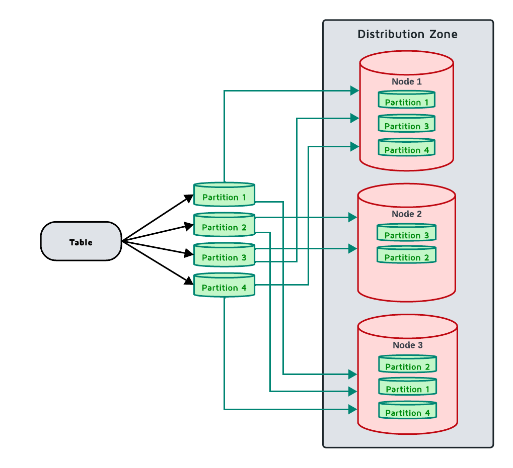

# Data Partitioning

Data partitioning is a method of subdividing large sets of data into smaller chunks and distributing them between all server nodes in a balanced manner.

## How Data is Partitioned

When the table is created, it is always assigned to a [distribution zone](distribution-zones.md). Based on the distribution zone parameters, the table is separated into `PARTITIONS` parts, called *partitions*, stored `REPLICAS` times across the cluster. Each partition is identified by a number from a limited set (0 to 24 for the default zone). Each individual copy of a partition is called a *replica*, and is stored on separate nodes, if possible. Partitions with the same number for all tables in the zone are always stored on the same node.

GridGain 9 uses the *Fair* partition distribution algorithm. It stores information on partition distribution and uses this information for assigning new partitions. This information is preserved in cluster metastorage, and is recalculated only when necessary.

Once partitions and all replicas are created, they are distributed across the available cluster nodes that are included in the distribution zone following the `DATA_NODES_FILTER` parameter and according to the *partition distribution algorithm*. Thus, each key is mapped to a list of nodes owning the corresponding partition and is stored on those nodes. When data is added, it is distributed evenly between partitions.



You can configure the way node stores relevant information in the [node configuration](../../reference/configuration/node-configuration-parameters.md#system-configuration):

- `ignite.system.partitionsBasePath` defines the folder partitions are stored in. By default, partitions are stored in the `work/partitions` folder.
- `ignite.system.partitionsLogPath` defines the folder where partition-specific RAFT logs are stored. These logs contain information on RAFT elections and consensus.
- `ignite.system.metastoragePath` defines the folder where cluster metadata is stored. It is recommended to store metadata on a separate device from partitions.

### Partition Number

When creating a distribution zone, you have an option to manually set the number of partitions with the `PARTITIONS` parameter, for example:

```sql
CREATE ZONE IF NOT EXISTS exampleZone (PARTITIONS 10) STORAGE PROFILES ['default'];
```


The number of partitions cannot be changed after the zone is created. If you add nodes to the cluster, keep the partition count unchanged and GridGain will automatically spread partitions across the new nodes during [Partition Rebalance](#partition-rebalance).


By default, GridGain automatically calculates the recommended number of partitions using the following formula:

```
dataNodesCount * coresOnNode * 2 / replicas
```

In this case, the `dataNodesCount` is the estimated number of nodes that will be in the distribution zone when it is created, according to its [filter](distribution-zones.md#node-filtering) and [storage profiles](README.md). At least 1 partition is always created.

Partition maintenance is mostly CPU-bound, so the optimal number of partitions depends on the total number of CPUs available to the zone, not on the amount of data. In most cases, we recommend using 2, 3, or 4 times the number of total available cores, divided by the number of replicas. For example:

- For a cluster with 3 nodes, 8 cores on each node, and 3 data replicas, the formula gives `3 * 8 * 2 / 3 = 16` partitions. We recommend using 16, 24, or 32 partitions.
- For a cluster with 7 nodes, 16 cores on each node, and 3 data replicas, the formula gives `7 * 16 * 2 / 3 = 75` partitions, rounded up. We recommend using 75, 112, or 150 partitions.

These recommendations work for most cases. To find the number that works best for your application, benchmark it with different partition counts.

If you are migrating from GridGain 8, expect to use significantly fewer partitions. GridGain 9 uses the [Fair distribution algorithm](#fair-distribution-algorithm), which keeps data evenly balanced even with a small number of partitions. A large partition count provides no distribution benefit and only adds maintenance overhead, as maintaining partitions and their distribution can cause a performance drain on the cluster.

### Replica Number

When creating a distribution zone, you can configure the number of *replicas* - individual copies of data on the cluster - by setting the `REPLICAS` parameter. By default, no additional replicas of data are created. As more replicas are added, additional copies of data will be stored on the cluster, and automatically spread to ensure data availability in case of a node leaving the cluster.

Replicas of each partition form a [RAFT group](../raft-consensus.md), and a [quorum](distribution-zones.md#quorum-size) in that group is required to perform updates to the partition. The default quorum size depends on the number of replicas in the distribution zone - 3 replicas are required for quorum if the distribution zone has 5 or more replicas, 2 if there are between 2 and 4 replicas, or 1 if only one data replica exists.

Some replicas will be selected as part of a consensus group. These nodes will be voting members, confirming all data changes in the replication group, while other replicas will be *learners*, only passively receiving data from the group leader and not participating in elections.

Losing the majority of the consensus group leads the partition to enter the `Read-only` state. In this state, no data can be written and only explicit read-only transactions can be used to retrieve data. If the distribution zone [scales](distribution-zones.md#cluster-scaling) up or down (typically, due to a node entering or leaving the cluster), new replicas will be selected as the consensus group.

The size of the consensus group is automatically calculated based on quorum size:

```
quorumSize * 2 - 1
```

For example, with 5 replicas and quorum size of 2, 3 replicas will be part of consensus group, and 2 replicas will be learners. In this scenario, losing 2 nodes will lead to some partitions losing the majority of the consensus group and becoming unavailable. For this reason, it is recommended to have a quorum size of 3 for a 5-node cluster.

It is recommended to always have an odd number of replicas and at least 3 replicas of your data on the cluster. When only 2 data replicas exist, losing one will always lead to losing majority, while having 3 or 5 data replicas will allow the cluster to stay functional in [network segmentation](../cluster-lifecycle.md#network-segmentation-scenario) scenarios.

For maximum read availability, you can create a replicated zone by setting `REPLICAS ALL`, which stores a copy of every partition on every node in the cluster. This provides local data access for read-only queries and eliminates network latency for reads, making it ideal for reference data and lookup tables. However, replicated zones come with storage overhead and write amplification costs. See [Replicated Zones](distribution-zones.md#replicated-zones) for detailed information on when to use this configuration and how to combine it with standard zones.

## Understanding RAFT Consensus

GridGain uses the RAFT consensus protocol to ensure all replicas of a partition stay consistent. This section explains how RAFT works and what it means for your cluster operations.

### RAFT Groups and Roles

Each partition's replicas form a RAFT group. Within the group, replicas have different roles.

- The leader processes all write operations and coordinates replication to other replicas.
- Followers replicate data from the leader and participate in voting during elections.
- Learners receive updates from the leader but do not vote in elections.

### How Writes Are Replicated

When you write data to a partition, the write request goes to the partition's primary replica, which usually is the RAFT group leader. The leader appends the operation to its log and then sends the operation to all followers. Each follower appends the operation to its own log and sends an acknowledgment back to the leader. Once a majority of replicas acknowledge the operation, the leader commits it. The leader then applies the committed operation to storage and responds to the client. Finally, followers apply the operation to their storage. This process ensures all replicas process operations in the same order.

### Leader Election

When a leader fails or becomes unreachable, followers automatically elect a new leader. The followers detect missing heartbeats from the leader, and after an election timeout expires, one follower becomes a candidate and requests votes from other followers. The other followers vote for the candidate, and the candidate with a majority of votes becomes the new leader. Once elected, the new leader resumes processing requests. During the election process, the partition is temporarily unavailable for writes. Once the new leader is established, writes can proceed normally.

### Quorum Requirements

Most operations require majority agreement (quorum) of voting members:

| Replicas | Quorum Size | Voting Members | Can Tolerate |
|---|---|---|---|
| 1 | 1 | 1 | 0 failures |
| 2 | 2 | 2 | 0 failures (not recommended) |
| 3 | 2 | 2 | 1 failure |
| 5 | 3 | 5 or 3 | 2 failures |
| 7 | 3 (default) or 4 (high fault tolerance) | 5 or 7 | 2 failures (with quorum=3) or 3 failures (with quorum=4) |

The quorum size is configured in the [distribution zone](distribution-zones.md#quorum-size). Higher quorum provides better consistency but requires more nodes online for operations.

### Log Replication and Snapshots

RAFT maintains a log of all operations. Each operation is assigned a log index, and logs are persisted to disk for durability. Periodic snapshots compact the log to prevent it from growing indefinitely.

When a replica falls behind, the mechanism for catching up depends on how far behind it is. If the lag is small, the replica catches up via log replication, receiving the operations it missed directly from the log. If the lag is large, the replica first receives a full snapshot of the current state, then catches up with any operations that occurred after the snapshot.

This is why the `Catching-up` and `Snapshot installation` [partition states](../../gridgain9-management/disaster-recovery/data-recovery.md#local-partition-states) exist.

### Monitoring RAFT Health

Healthy RAFT groups show stable leader with no frequent elections, low replication lag, and all replicas in `Healthy` state.

Warning signs include frequent leader elections, which typically indicate network issues or overloaded nodes. Replicas stuck in `Catching-up` state suggest slow nodes or network problems. The `Broken` state indicates serious problems requiring intervention.

Use `recovery partition states` CLI command to monitor partition health.

## Fair Distribution Algorithm

GridGain uses the *Fair* partition distribution algorithm to ensure that data replicas are evenly balanced across all nodes in the cluster. Each node receives an equal number of replicas  (or as close to it as possible), resulting in predictable resource usage and consistent performance. Fair distribution prevents hotspots by giving every node the similar number of replicas from each zone, eliminating situations where individual nodes become overloaded while others are underutilized.

### How Fair Distribution Works

The Fair distribution algorithm operates by evaluating the current placement of all partitions within a distribution zone and balancing replica assignments across the available cluster nodes. When calculating partition placement, the algorithm considers which nodes are overloaded (holding more replicas than the ideal count) and which are underloaded (holding fewer replicas than ideal). The algorithm then assigns partitions to bring each node as close as possible to the ideal replica count.

Unlike simpler distribution approaches that can assign partitions independently, Fair distribution considers all partitions within a zone together to achieve balanced distribution. The algorithm evaluates the complete set of partition assignments for the zone and calculates placements that minimize imbalance across all nodes. This approach ensures that no node becomes a bottleneck due to uneven replica distribution, particularly important in clusters with lower partition counts where uneven distribution can have significant performance impacts.

### Stateful Distribution

Fair distribution maintains information about existing partition assignments in the cluster metastorage and uses this historical state when calculating new assignments. When the cluster topology changes or new partitions are added, the algorithm uses the existing distribution rather than recalculating from scratch. This stateful approach significantly reduces the amount of data that needs to be moved during rebalancing operations, as the algorithm preserves valid assignments and only adjusts placements where necessary to maintain balance.

The stored state includes information about partition assignments. By tracking this state, the algorithm ensures consistent behavior across multiple calculations and can make intelligent decisions about which replicas to relocate when topology changes occur. Without this state information, each topology change could trigger massive data movement as the algorithm recalculates all assignments independently of previous decisions.

### Handling Topology Changes

When nodes join or leave the cluster, the Fair distribution algorithm adapts the partition placement to maintain balanced distribution across the new topology. The algorithm first creates a new distribution map based on the current assignments, adding any new nodes as empty targets and removing departed nodes from consideration. It then identifies partitions that no longer meet the required replica factor and selects target nodes for new replicas based on which nodes are most underloaded.

This approach minimizes unnecessary data movement during cluster scaling operations. Partitions that are already well-placed remain on their current nodes, and only partitions affected by the topology change are reassigned. The algorithm's understanding of the previous state allows it to make targeted adjustments rather than wholesale redistribution, reducing network traffic and storage operations during rebalancing.

### Consensus Group Consideration

The Fair distribution algorithm calculates placement separately for voting replicas and learner replicas to ensure fair load distribution across cluster nodes. As described in the [quorum size](distribution-zones.md#quorum-size) configuration, some replicas participate in the consensus group for each partition while others serve as learners. The algorithm ensures that both types of replicas are evenly distributed, preventing scenarios where certain nodes bear a disproportionate burden of consensus operations while others primarily handle learner workload.

This separation is particularly important for performance management, as voting replicas participate in write coordination and leader election while learners passively receive updates. By balancing both types of replicas independently, the algorithm ensures that consensus-related load is spread evenly across the cluster alongside the overall data storage load.

## Primary Replicas and Leases

Once the partitions are distributed on the nodes, GridGain forms *replication groups* for all partitions of the table, and each group elects its leader. To linearize writes to partitions, GridGain designates one replica of each partition as a *primary replica*, and other replicas as secondary replicas.

To designate a primary replica, GridGain uses a process of granting a *lease*. Leases are granted by the *lease placement driver*, and signify the node that houses the primary replica, called a *lease holder*. Once the lease is granted, information about it is written to the [metastorage](../cluster-lifecycle.md#cluster-metastorage-group), and provided to all nodes in the cluster. Usually, the primary replica will be the same as replication group leader.

Granted leases are valid for a short period of time and are extended every couple of seconds, preserving the continuity of each lease. A lease cannot be revoked until it expires. In exceptional situations (for example, when primary replica is unable to serve as primary anymore, leaseholder node goes offline, replication group is inoperable, etc.) the placement driver waits for the lease to expire and then initiates the negotiation of the new one.

Only the primary replica can handle operations of read-write transactions. Other replicas of the partition can be read from by using read-only transactions.

If a new replica is chosen to receive the lease, it first makes sure it is up-to-date with its replication group by stored data. In scenarios where replication group is no longer operable (for example, a node unexpectedly leaves the cluster and the group loses majority), it follows the [disaster recovery](../../gridgain9-management/disaster-recovery/data-recovery.md) procedure, and you may need to reset the partitions manually.

### Reading Data From Replicas

Reading data as part of a read-write [transaction](../../gridgain9-usage/transactions.md) is always handled by the primary data replica.

Read-only transactions are also handled by the primary replica when you use the table or key-value API. Only SQL can read from non-primary replicas, and only when follower reads are enabled - see the cluster-wide [`sql.allowFollowerReads`](../../reference/configuration/cluster-configuration-parameters.md#sql-configuration) setting and the `allowFollowerReads` statement property.

## Version Storage

As new data is written to the partition, GridGain does not immediately delete the old one. Instead, GridGain stores old keys in a *version chain* within the same partition.

Older key versions can only be accessed by [read-only transactions](../../gridgain9-usage/transactions.md#read-only-transactions), while up-to-date version can be accessed by any transactions.

Older key versions are kept until the *low watermark* point is reached, after which they are considered garbage and removed by the garbage collector. [Dropped tables](../../reference/sql/ddl.md#drop-table) are retained in the same way: they remain on disk until the low watermark passes the point at which they were dropped, though you can no longer write to them.

For how the low watermark controls retention, how to configure it, and the impact of changing those settings, see [Low Watermark and Garbage Collection](low-watermark-and-gc.md).

## Distribution Reset

The SQL query performance can deteriorate in a cluster where tables had been created over a long period, alongside topology changes, due to sub-optimum data colocation. To resolve this issue, you can reset (recalculate) partition distribution using [CLI](../../reference/cli-tool.md#distribution-commands) or [REST API](../../reference/rest-api/overview.md).


Reset is likely to result in [Partition Rebalance](#partition-rebalance) that may take a long time.


## Balancing Leases

Because only the primary replica of a partition handles read-write transactions (see [Primary Replicas and Leases](#primary-replicas-and-leases)), an uneven spread of leases across the cluster can concentrate write load on a subset of nodes. This can happen over time as nodes restart or the cluster topology changes. To redistribute leases so that each alive node holds approximately the same number of them, you can trigger lease balancing with the [`distribution balance-leases`](../../reference/cli-tool.md#distribution-commands) command.

Lease balancing is asynchronous: the operation is initiated immediately, and leases are gradually moved to their target nodes as they expire and are reassigned, respecting partition assignment constraints.

For example, to trigger lease balancing from the CLI:

```bash
distribution balance-leases
```


You can trigger lease balancing from any node; the request is routed to the node that currently manages leases.


## Partition Rebalance

When the [cluster size changes](distribution-zones.md#cluster-scaling), GridGain 9 waits for the timeout specified in the `AUTO SCALE UP` or `AUTO SCALE DOWN` distribution zone properties, and then redistributes partitions according to the partition distribution algorithm and transfers data to make it up-to-date with the replication group.

This process is called *data rebalance*.

## Old Replication Mode (Table-based Replication)

GridGain 9.1.4 introduced *Zone-based Replication* and uses it by default. GridGain 9.1.3 and earlier used *Table-based Replication*, so clusters created on 9.1.3 and earlier and upgraded to 9.1.4+ will still use *Table-based Replication*.

*Table-based Replication* is deprecated in 9.1.11 and was removed in GridGain 9.1.15. If your cluster still uses *Table-based Replication*, you must migrate to new replication mode. Currently, there is no automatic migration tool, so you will need to create a new cluster and move your data there.

If the 9.1.15+ node is still using *Table-based Replication* for persistent storage, it will not start with the `UNSUPPORTED_TABLE_BASED_REPLICATION_ERR` error.
