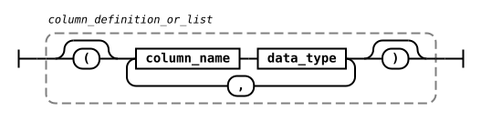
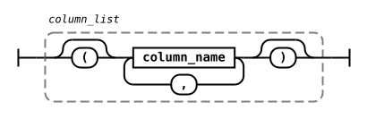
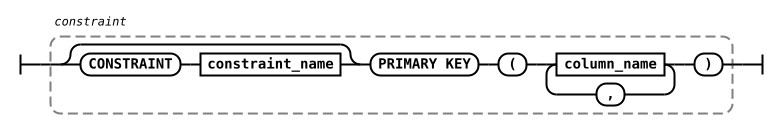

# Grammar Reference

This section describes grammar elements that are common to multiple SQL functions ([DDL](ddl.md), [Distribution Zones](distribution-zones.md), etc.).

## assign

```bnf
identifier = expression
```

<!-- Diagram(
NonTerminal('identifier '),
Terminal('='),
NonTerminal('expression')
) -->

### Parameters

- `identifier` - the name of table, column or other element that will be updated by the operation.
- `expression` - a valid SQL expression that returns the values that must be assigned to the `identifier`.

Referenced by:

- [MERGE](dml.md#merge)
- [UPDATE](dml.md#update)

## column_definition

```bnf
column_name data_type [ [NOT] NULL ]
  [ DEFAULT { rand_uuid()
            | NEXTVAL ( sequence_name )
            | literal_value
            | CURRENT_TIMESTAMP + INTERVAL interval_string interval_qualifier } ]
  [ PRIMARY KEY ]
```


<!-- Diagram(
Sequence(
NonTerminal('column_name'),
NonTerminal('DATA TYPE', {href:'./data-types'}),
Optional(Sequence(Optional('NOT'),Terminal('NULL')))
),
End({type:'complex'})
)

Diagram(
Start({type:'complex'}),
Sequence(
Optional(Sequence(Terminal('DEFAULT'), Choice(1,
NonTerminal('rand_uuid()'),
Sequence(Terminal('NEXTVAL'), Terminal('('), NonTerminal('sequence_name'), Terminal(')')),
NonTerminal('literal_value'),
Sequence(Terminal('CURRENT_TIMESTAMP'), Terminal('+'), Terminal('INTERVAL'), NonTerminal('interval_string'), NonTerminal('interval_qualifier'))
),)),
Optional(Terminal('PRIMARY KEY')),
)) -->

Keywords and parameters:

- `column_name` - a column name.
- `DATA TYPE` - the [data type](data-types.md) allowed in the column.
- `rand_uuid()` - the function that generates a random UUID identifier.
- `sequence_name` - the name of the sequence to use with `NEXTVAL()` function.
- `literal_value` - a value to be assigned as default.
- `CURRENT_TIMESTAMP` - the function that returns current time. Can only be used for `TIMESTAMP WITH LOCAL TIME ZONE` columns.
- `interval_string` - a string literal representing an integer number that specifies the offset amount. For example: `'1'`, `'5'`, or `'30'`. If the interval is `'0'`, current time is used
- `interval_qualifier` - the time unit for the interval offset. Can be one of:
  - `SECOND` or `SECONDS`
  - `MINUTE` or `MINUTES`
  - `HOUR` or `HOURS`
  - `DAY` or `DAYS`
  - `MONTH` or `MONTHS`

Referenced by:

- [CREATE TABLE](ddl.md#create-table)
- [CREATE CACHE](ddl.md#create-cache)
- [ALTER TABLE](ddl.md#alter-table)
- [project_item](#project_item)
- [join_condition](#join_condition)

## column_definition_or_list

```bnf
{ column_name data_type
| ( column_name data_type [, column_name data_type]... ) }
```



<!-- Diagram(
Choice(0,
Sequence(
Choice(0,
Sequence(
Choice(0,Sequence(
NonTerminal('column_name'),
NonTerminal('data_type'))
)),
Sequence(
Terminal('('),
OneOrMore(Sequence(
NonTerminal('column_name'),
NonTerminal('data_type')),
Terminal(',')
),Terminal(')')
))))) -->

Keywords and parameters:

- `column_name` - a column name.
- `data_type` - a valid [data type](data-types.md).

Referenced by:

- [ALTER TABLE](ddl.md#alter-table)
- [with_item](#with_item)

## column_list

```bnf
( column_name [, column_name]... )
```



<!-- Diagram(
Terminal('('),
OneOrMore(Sequence(
NonTerminal('column_name')),
Terminal(',')
),Terminal(')')
) -->

Keywords and parameters:

- `column_name` - a column name.

Referenced by:

- [INSERT](dml.md#insert)
- [join_condition](#join_condition)

## column_name_or_list

```bnf
{ column_name
| ( column_name [, column_name]... ) }
```

<!-- Diagram(
Choice(0,
Sequence(
Choice(0,
Sequence(
Choice(0,Sequence(
NonTerminal('column_name'))
)),
Sequence(
Terminal('('),
OneOrMore(Sequence(
NonTerminal('column_name')),
Terminal(',')
),Terminal(')')
))))) -->

Keywords and parameters:

- `column_name` - a column name.

Referenced by:

- [ALTER TABLE](ddl.md#alter-table)

## constraint

```bnf
[ CONSTRAINT constraint_name ]
  PRIMARY KEY
  [ USING { SORTED sorted_column_list
          | HASH column_list } ]
```



<!-- Diagram(Sequence(
Optional(Sequence(Terminal('CONSTRAINT'),NonTerminal('constraint_name')
)),
Terminal('PRIMARY KEY'),
Optional(
Choice(0,
Sequence(
Terminal('USING'),
Choice (0,
Sequence(Terminal('SORTED'), NonTerminal('sorted_column_list', {href:'./grammar-reference/#sorted_column_list'})
),
Sequence('HASH', NonTerminal('column_list', {href:'./grammar-reference/#column_list'})))
))
))) -->

Keywords and parameters:

- `constraint_name` - a name of the constraint.

Referenced by:

- [CREATE TABLE](ddl.md#create-table)
- [CREATE CACHE](ddl.md#create-cache)

## group_item

```bnf
{ expression
| ( )
| ( expression [, expression]... ) }
```

<!-- Diagram(
Choice(0,
NonTerminal('expression'),
Sequence(
Terminal('('), Terminal(')'),
),
Sequence(
Terminal('('), Sequence(OneOrMore(NonTerminal('expression'), Terminal(',')), ), Terminal(')'),
),
)) -->

### Parameters

- `expression` - a valid SQL expression that returns the values that must be assigned to the `identifier`.

Referenced by:

- [SELECT](operational-commands.md#select)

## join_condition

```bnf
{ ON boolean_expression
| USING column_list }
```

<!-- Diagram(
Choice(0,
Sequence(
Terminal('ON'), NonTerminal('boolean_expression'),
),
Sequence(Terminal('USING'), NonTerminal('column_list', {href:'./grammar-reference/#column_list'})),
)) -->

### Parameters

- `boolean_expression` - an SQL expression that returns a boolean value. Only the records for which `TRUE` was returned will be returned. If not specified, all matching records are returned.

Referenced by:

- [table_expression](#table_expression)

## order_item

```bnf
expression [ ASC | DESC ] [ NULLS FIRST | NULLS LAST ]
```

<!-- Diagram(
NonTerminal('expression'),
Optional(Choice(0,
Terminal('ASC'),
Terminal('DESC')
)),
Optional(Choice(0,
Terminal('NULLS FIRST'),
Terminal('NULLS LAST')
)),
) -->

### Parameters

- `expression` - a valid SQL expression that denotes the specific item in the SELECT clause.

Referenced by:

- [query](#query)

## parameter

```bnf
parameter_name = parameter_value
```

<!-- Diagram(
NonTerminal('parameter_name'),
Terminal('='),
NonTerminal('parameter_value')) -->

Parameters:

- `parameter_name` - the name of the parameter.
- `parameter_value` - the value of the parameter.

When a parameter is specified, you can provide it as a literal value or as an identifier. For example:

```sql
CREATE ZONE test_zone;
CREATE TABLE test_table (id INT PRIMARY KEY, val INT) ZONE test_zone;
```

In this case, `test_zone` is the identifier, and is used as an identifier. When used like this, the parameters are not case-sensitive.

```sql
CREATE ZONE "test_zone";
CREATE TABLE test_table (id INT PRIMARY KEY, val INT) ZONE 'test_zone';
```

In this case, `test_zone` is created as a literal value, and is used as a literal. When used like this, the parameter is case-sensitive.

```sql
CREATE ZONE test_zone;
CREATE TABLE test_table (id INT PRIMARY KEY, val INT) ZONE `TEST_ZONE`;
```

In this case, `test_zone` is created as an identifier, and is case-insensitive. As such, when `TEST_ZONE` is used as a literal, it still matches the identifier.

Referenced by:

- [CREATE ZONE](distribution-zones.md#create-zone)
- [ALTER ZONE](distribution-zones.md#alter-zone)

## project_item

```bnf
{ expression [AS] column_definition
| table_alias . *
| * }
```

<!-- Diagram(
Choice(0,Sequence(
NonTerminal('expression'),
Optional('AS'),
NonTerminal('column_definition', {href:'./grammar-reference/#column_definition'})
),
Sequence(NonTerminal('table_alias'), Terminal('.'), Terminal('\*')),
Terminal('*')
)
) -->

### Parameters

- `expression` - a valid SQL expression that denotes the specific item in the SELECT clause.
- `table_alias` - a qualified table alias to use.

Referenced by:

- [SELECT](operational-commands.md#select)
- [select_without_from](#select_without_from)

## qualified_table_name

```bnf
[ schema . ] table_name
```


<!-- Diagram(Sequence(
Optional(Sequence(NonTerminal('schema'),NonTerminal('.')
),),
NonTerminal('table_name')
),
) -->

Keywords and parameters:

- `schema` - a name of the table schema.
- `table_name` - a name of the table.

Referenced by:

- [CREATE TABLE](ddl.md#create-table)
- [ALTER TABLE](ddl.md#alter-table)
- [DROP TABLE](ddl.md#drop-table)
- [CREATE INDEX](ddl.md#create-index)
- [DELETE](dml.md#delete)
- [INSERT](dml.md#insert)
- [MERGE](dml.md#merge)
- [UPDATE](dml.md#update)
- [table_primary](#table_primary)

## query

```bnf
{ WITH with_item [, with_item]... query
| { SELECT
  | select_without_from
  | query { UNION | EXCEPT | MINUS | INTERSECT } [ ALL | DISTINCT ] query }
  [ ORDER BY order_item [, order_item]... ]
  [ LIMIT [start] { count | ALL } ]
  [ OFFSET start { ROW | ROWS } ]
  [ FETCH { FIRST | NEXT } [count] { ROW | ROWS } ONLY ] }
```

<!-- Diagram(
Choice(0,
Sequence(Terminal('WITH'),
OneOrMore(
NonTerminal('with_item', {href:'./grammar-reference/#with_item'}), Terminal(',')), NonTerminal('query', {href:'./grammar-reference/#query'})),
Sequence(
Choice(1,
Terminal('SELECT', {href:'./operational-commands/#select'}),
Terminal('select_without_from', {href:'./grammar-reference/#select_without_from'}),
Sequence(NonTerminal('query', {href:'./grammar-reference/#query'}), Choice(0, Terminal('UNION'), Terminal('EXCEPT'),Terminal('MINUS'),  Terminal('INTERSECT')), Optional(Choice(0, Terminal('ALL'), Terminal('DISTINCT'))),NonTerminal('query', {href:'./grammar-reference/#query'}))
),
Optional(Sequence(
Terminal('ORDER BY'),
OneOrMore(NonTerminal('order_item', {href:'./grammar-reference/#order_item'}), Terminal(',')),
)),
Optional(Sequence(
Terminal('LIMIT'),
Optional(NonTerminal('start')),
Choice(0, NonTerminal('count'), Terminal('ALL'))
)),
Optional(Sequence(
Terminal('OFFSET'),
NonTerminal('start'),
Choice(0, Terminal('ROW'), Terminal('ROWS'))
)),
Optional(Sequence(
Terminal('FETCH'),
Choice(0, Terminal('FIRST'), Terminal('NEXT')),
Optional(NonTerminal('count')),
Choice(0, Terminal('ROW'), Terminal('ROWS')),
Terminal('ONLY'))
)
),
),
End({type:'complex'})
) -->

### Parameters

- `expression` - a valid SQL expression.
- `start` - the number of result to start the query from.
- `count` - the number of values to fetch.

Referenced by:

- [INSERT](dml.md#insert)
- [with_item](#with_item)
- [table_primary](#table_primary)

## select_without_from

```bnf
SELECT [ ALL | DISTINCT ] project_item [, project_item]...
```

<!-- Diagram(
Terminal('SELECT', {href:'./operational-commands/#select'}),
Optional(
Choice(0,
Terminal('ALL'),
Terminal('DISTINCT'),
)),
OneOrMore(Sequence(
NonTerminal('project_item', {href:'./grammar-reference/#project_item'})),
Terminal(',')
),
) -->

Referenced by:

- [query](#query)

## sorted_column_list

```bnf
( column_name [ ASC | DESC ] [ NULLS { FIRST | LAST } ]
  [, column_name [ ASC | DESC ] [ NULLS { FIRST | LAST } ]]... )
```

<!-- Diagram(
Sequence(
'(',
OneOrMore(
Sequence(
NonTerminal('column_name'),
Optional(
Choice(0, Terminal('ASC'), Terminal('DESC')
)),
Optional(
Sequence(
Terminal('NULLS'),
Choice(0, Terminal('FIRST'), Terminal('LAST'))
))),
','
),
')'
)) -->

Keywords and parameters:

- `column_name` - a column name.
- `NULLS FIRST` - if specified, places any NULL values before all non-NULL in that column's ordering.
- `NULLS LAST` - if specified, places NULLs after all non-NULLs in that column's ordering.

Referenced by:

- [CREATE INDEX](ddl.md#create-index)
- [constraint](#constraint)

## table_expression

```bnf
{ table_expression [NATURAL] [ { LEFT | RIGHT | FULL } [OUTER] ] JOIN table_expression [join_condition]
| table_expression CROSS JOIN table_expression
| table_reference [, table_reference]... }
```

<!-- Diagram(
Choice(0,
Sequence(
Choice(0,
Sequence(
Choice(0,Sequence(
NonTerminal('table_expression', {href:'./grammar-reference/#table_expression'}),
Optional('NATURAL'),
Optional(Sequence(Choice(0,
Terminal('LEFT'),
Terminal('RIGHT'),
Terminal('FULL')
),
Optional('OUTER')
)),
Terminal('JOIN'),
NonTerminal('table_expression', {href:'./grammar-reference/#table_expression'}),
Optional(NonTerminal('join_condition', {href:'./grammar-reference/#join_condition'}))
),
)),
Sequence(
Choice(0,Sequence(
NonTerminal('table_expression', {href:'./grammar-reference/#table_expression'}),
Terminal('CROSS JOIN'),
NonTerminal('table_expression', {href:'./grammar-reference/#table_expression'}))
)),
Sequence(
OneOrMore(Sequence(
NonTerminal('table_reference', {href:'./grammar-reference/#table_reference'})),
Terminal(',')
)
))))) -->

### Parameters

Referenced by:

- [SELECT](operational-commands.md#select)

## table_primary

```bnf
qualified_table_name ( TABLE qualified_table_name )
{ table_primary [hint_comment]
| ( query )
| TABLE ( function_name ( expression [, expression]... ) ) }
```

<!-- Diagram(
NonTerminal('qualified_table_name', {href:'./grammar-reference/#qualified_table_name'}),
Terminal('('),
Terminal('TABLE'),
NonTerminal('qualified_table_name', {href:'./grammar-reference/#qualified_table_name'}),
Terminal(')')
,
End({type:'complex'})
)

Diagram(
Start({type:'complex'}),
Choice(0,
Sequence(
NonTerminal('table_primary', {href:'./grammar-reference/#table_primary'}), Optional(NonTerminal('hint_comment'))),
Sequence(
Terminal('('), NonTerminal('query', {href:'./grammar-reference/#query'}), Terminal(')')
),
Sequence(
Terminal('TABLE'), Terminal('('), NonTerminal('function_name'), Terminal('('), OneOrMore('expression', Terminal(',')),  Terminal(')'),  Terminal(')')
))
) -->

### Parameters

- `hint_comment` - an sql [optimizer hint](../../_pending-merge/sql-tuning-README__from-performance-tuning.md#optimizer-hints).
- `expression` - a valid SQL expression.
- `function_name` - the name of the [SQL function](operators-and-functions.md) to use.

Referenced by:

- [table_reference](#table_reference)

## table_reference

```bnf
table_primary [ [AS] alias [ ( column_alias [, column_alias]... ) ] ]
```

<!-- Diagram(
NonTerminal('table_primary', {href:'./grammar-reference/#table_primary'}),
Optional(Sequence(
Optional('AS'), NonTerminal('alias'), Optional(Sequence(Terminal('('), OneOrMore('column_alias', Terminal(',')),  Terminal(')')))
))
) -->

### Parameters

- `alias` - the alias that will be used for the table.
- `column_alias` - the alias used for column.

Referenced by:

- [table_expression](#table_expression)

## with_item

```bnf
item_name [column_list] AS ( query )
```

<!-- Diagram(
NonTerminal('item_name'),
Optional(NonTerminal('column_list', {href:'./grammar-reference/#column_list'})),
Terminal('AS'),
Terminal('('),
NonTerminal('query', {href:'./grammar-reference/#query'}),
Terminal(')'),
) -->

Referenced by:

- [query](#query)
