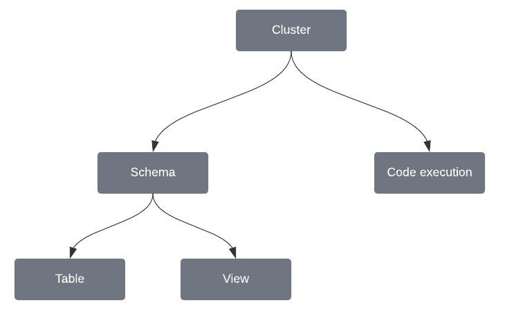

# User Permissions and Roles


This feature is only available as a part of GridGain 9 Enterprise and Ultimate editions.


## User Privileges

Privileges consist of two components: an action and an object. An action refers to a type of operation that is permitted to be carried out on an object:

## List of Actions

Some privileges must specify the exact **object** with which the relation applies to by using a selector.
In this case the object is a specific entity, identified by its name, such as a schema, table, view, configuration, deployment unit and others.
For example, `CLUSTER` - `READ_CLUSTER_CONFIG` does not have a selector. `READ_SCHEMA` - `SCHEMA` needs to specify which schema should be used `(PUBLIC, MY_SCHEMA_NAME)`.
These privileges are listed below as `Has selector`.

### Cluster Configuration

| Name | Has Selector | Description |
|---|---|---|
|READ_CLUSTER_CONFIG|no|Allows the user to access information about cluster configuration.|
|WRITE_CLUSTER_CONFIG|no|Allows the user to change cluster configuration.|
|WRITE_SECURITY_CONFIG|no|Allows the user to change the `ignite.security` part of the cluster configuration, which holds the authentication and authorization settings. Required in addition to `WRITE_CLUSTER_CONFIG`: both privileges must be granted to change these settings. This also covers an update that replaces a parent node, such as `ignite = null`, and so wipes the security settings without naming them. Even with both privileges, user cannot modify the `system` role.|
|READ_NODE_CONFIG|no|Allows the user to access information about individual node configuration.|
|WRITE_NODE_CONFIG|no|Allows the user to change node configuration.|

### Cluster Management

| Name | Has Selector | Description |
|---|---|---|
|RENAME_CLUSTER|no|Allows the user to rename an initialized cluster.|

### Code Deployment

| Name | Has Selector | Description |
|---|---|---|
|DEPLOY_UNIT|yes|Allows the user to send deployment units to the cluster.|
|UNDEPLOY_UNIT|yes|Allows the user to remove deployments units from the cluster.|
|READ_UNIT|no|Allows the user to access information about deployment units.|

### Distributed Computing

| Name | Has Selector | Description |
|---|---|---|
|GET_JOB_STATE|yes|Allows the user to access information about a job user has access to, and their results if any.  User always has access to jobs they started. If allowed on `CLUSTER`, allows to read all jobs.|
|EXEC_JOB|yes|Allows the user to execute a distributed computing job.|
|KILL_JOB|yes|Allows the user to stop a distributed computing job.|

### Metrics

| Name | Has Selector | Description |
|---|---|---|
|ENABLE_METRICS|no|Allows the user to enable metrics on the cluster.|
|DISABLE_METRICS|no|Allows the user to disable metrics on the cluster.|
|LIST_METRICS|no|Allows the user to list the metric sources available on the cluster and see whether each one is enabled.|
|READ_METRICS|no|Allows the user to read metric values.|

### Access Control

| Name | Has Selector | Description |
|---|---|---|
|CREATE_USER|no|Allows the user to create more users.|
|EDIT_USER|no|Allows the user to edit user configuration.|
|READ_USER|no|Allows the user to access information about users.|
|DROP_USER|no|Allows the user to delete users.|
|CREATE_ROLE|no|Allows the user to create roles.|
|READ_ROLE|no|Allows the user to access information about user roles.|
|DROP_ROLE|no|Allows the user to delete roles. Does not apply to [Protected Built-In Roles](#protected-built-in-roles).|
|GRANT_ROLE|no|Allows the user to grant roles to users. Does not apply to [Protected Built-In Roles](#protected-built-in-roles).|
|REVOKE_ROLE|no|Allows the user to revoke roles from users. Does not apply to [Protected Built-In Roles](#protected-built-in-roles).|
|GRANT_PRIVILEGE|no|Allows the user to assign privileges to roles.|
|REVOKE_PRIVILEGE|no|Allows user to revoke privileges from roles.|

### CDC Management

| Name | Has Selector | Description |
|---|---|---|
|MANAGE_CDC|no|Allows the user to manage change data capture sources and sinks, as well as start and stop the CDC process.|

### Data Center Replication

| Name | Has Selector | Description |
|---|---|---|
|MANAGE_DCR|no|Allows the user to run every data center replication operation: creating, starting, stopping, flushing, and deleting replications, and also listing them and viewing their status. There is no separate read-only privilege for replication.|

### Data Import and Export

| Name | Has Selector | Description |
|---|---|---|
|COPY_FROM_FILE|no|Allows the user to name a server-side filesystem path or object-store URI as the source of a `COPY` statement. Reading from a table instead requires `SELECT_FROM_TABLE` on that table.|
|COPY_TO_FILE|no|Allows the user to name a server-side filesystem path or object-store URI as the target of a `COPY` statement. Writing to a table instead requires `INSERT_INTO_TABLE` and `UPDATE_TABLE` on that table.|

Both privileges apply to the cluster and take no selector: they permit file access as such, not
access to a named location. Restrict which locations a user can reach with the `ignite.importExport`
[node configuration](../reference/configuration/node-configuration-parameters.md), which must also enable file
access before either privilege has any effect.

### Distribution Zone

| Name | Has Selector | Description |
|---|---|---|
|CREATE_DISTRIBUTION_ZONE|no|Allows the user to create new distribution zones.|
|ALTER_DISTRIBUTION_ZONE|no|Allows the user to alter distribution zones.|
|DROP_DISTRIBUTION_ZONE|no|Allows the user to delete distribution zones.|

### Rolling Upgrade

| Name | Has Selector | Description |
|---|---|---|
|ROLLING_UPGRADE|no|Allows the user to manage rolling upgrades.|

### Schema

| Name | Has Selector | Description |
|---|---|---|
|READ_SCHEMA|yes|Allows the user to access schema information.|

### Sequence Configuration

| Name | Has Selector | Description |
|---|---|---|
|CREATE_SEQUENCE|yes|Allows the user to create new sequences.|
|ALTER_SEQUENCE|yes|Allows the user to change sequences.|
|USE_SEQUENCE|yes|Allows the user to use sequences.|
|DROP_SEQUENCE|yes|Allows the user to drop sequences.|

### Table

| Name | Has Selector | Description |
|---|---|---|
|CREATE_TABLE|yes|Allows the user to use the `CREATE TABLE` SQL statement.|
|SELECT_FROM_TABLE|yes|Allows the user to use the `SELECT` SQL statement.|
|ALTER_TABLE|yes|Allows the user to use the `ALTER TABLE` SQL statement.|
|DROP_TABLE|yes|Allows the user to use the `DROP TABLE` SQL statement.|
|INSERT_INTO_TABLE|yes|Allows the user to use the `INSERT` SQL statement.|
|DELETE_FROM_TABLE|yes|Allows the user to use the `DELETE` SQL statement.|
|UPDATE_TABLE|yes|Allows the user to use the `UPDATE` SQL statement.|
|CREATE_INDEX|yes|Allows the user to use the `CREATE INDEX` SQL statement.|
|DROP_INDEX|yes|Allows the user to use the `DROP INDEX` SQL statement.|
|USE_INDEX|yes|Allows the user to use the index in their SQL statements.|
|MANAGE_RLS|yes|Allows the user to manage row-level security on a table.|

### System View

| Name | Has Selector | Description |
|---|---|---|
|CREATE_VIEW|yes|Allows the user to create a view.|
|SELECT_FROM_VIEW|yes|Allows the user to select from the view.|
|ALTER_VIEW|yes|Allows the user to change view.|
|DROP_VIEW|yes|Allows the user to delete the view.|

### Snapshots

| Name | Has Selector | Description |
|---|---|---|
|CREATE_SNAPSHOT|no|Allows the user to create a snapshot.|
|RESTORE_SNAPSHOT|no|Allows the user to restore data from snapshot.|
|DELETE_SNAPSHOT|no|Allows the user to delete the snapshot.|
|CHECK_SNAPSHOT|no|Allows the user to access snapshot information.|

### Point-in-Time Recovery

| Name | Has Selector | Description |
|---|---|---|
|RESTORE_PITR|no|Allows the user to restore data to a specific point in time.|
|CHECK_PITR|no|Allows the user to access point-in-time recovery information.|

### Transaction Management

| Name | Has Selector | Description |
|---|---|---|
|GET_TRANSACTION_STATE|no|Allows the user to get status of running transactions.|
|KILL_TRANSACTION|no|Allows the user to stop running transactions.|

### Query Management

| Name | Has Selector | Description |
|---|---|---|
|EXECUTE_SQL|no|Allows the user to execute SQL statements, including over the [REST API](../reference/rest-api/overview.md#running-sql). The user also needs the object privileges that a statement requires, such as `SELECT_FROM_TABLE`.|
|GET_SQL_QUERY_STATE|no|Allows the user to get status of running queries.|
|KILL_SQL_QUERY|no|Allows the user to stop running queries.|

## Protected Built-In Roles

GridGain protects two built-in roles: the `system` super role, which cluster initialization seeds with every action, and the internal `gridgain-system-bypass` role.

The operations below are refused whatever letter case you use, over both SQL and the REST API:

| Operation | `system` | `gridgain-system-bypass` |
|---|---|---|
|Assign to a user|Refused|Refused|
|Revoke from a user|Refused|Refused|
|Drop|Refused|Refused|
|Create|Not applicable: the role is seeded at cluster initialization|Refused|

The privilege check runs before these restrictions, so holding `GRANT_ROLE`, `REVOKE_ROLE`, or `DROP_ROLE` does not permit the operation.
Changing the privileges of the `system` role is also refused, as described for the `WRITE_SECURITY_CONFIG` action in [Cluster Configuration](#cluster-configuration).

A refused assignment or revocation is recorded as a [`USER_OPERATION_REFUSED`](../gridgain9-usage/events/available-events.md) event.

## Object Permission Hierarchy

Objects in GridGain 9 are organized in hierarchy:



Actions allowed on the object are also allowed on its children.
For example, if you have a `PUBLIC` schema and allow the `SELECT_FROM_TABLE` action on it,
the user with the role will be able to perform the `SELECT` SQL action on all tables in the `PUBLIC` schema.

### Schema-level DML Grants

Granting a DML privilege on a **schema** applies to **all existing tables** in that
schema and to **tables created in the future**. Privileges are evaluated **at access time**.

Supported DML privileges:
- `SELECT_FROM_TABLE`
- `INSERT_INTO_TABLE`
- `UPDATE_TABLE`
- `DELETE_FROM_TABLE`

- Applies to all current and future tables in schema `STATICDATA`:

  ```sql
  GRANT SELECT_FROM_TABLE ON STATICDATA TO ROLE analyst;
  ```

- Mixed case requires quoting:

  ```sql
  GRANT UPDATE_TABLE ON "StaticData" TO ROLE data_editor;
  ```


A selector **without a dot** (e.g., `STATICDATA`) targets a **schema**,
and the grant covers both existing and future tables in that schema. For more details check the `role privilege grant` [command syntax](../reference/cli-tool.md).

