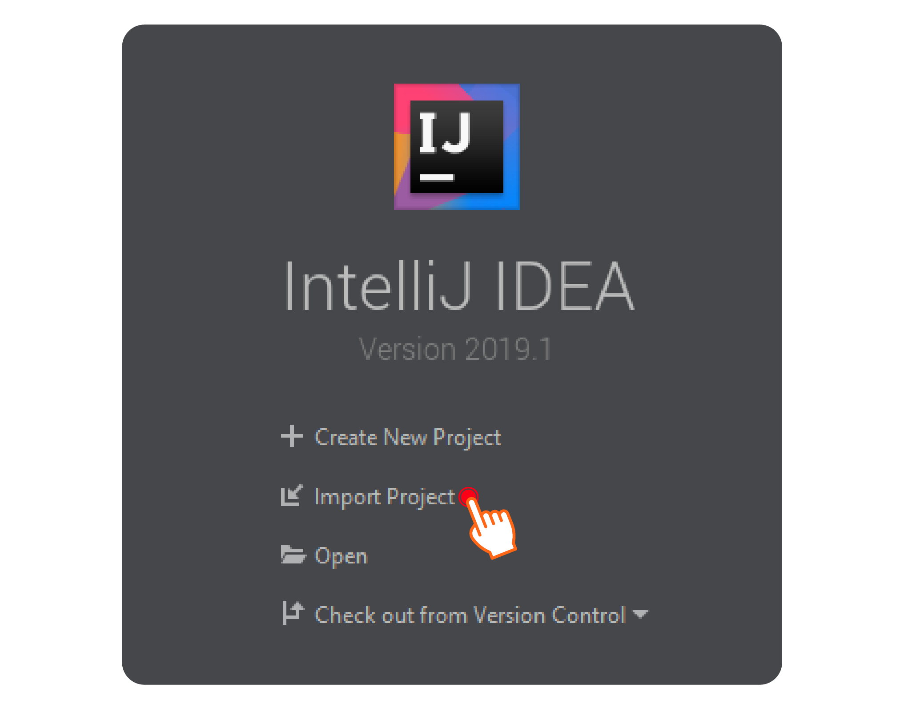
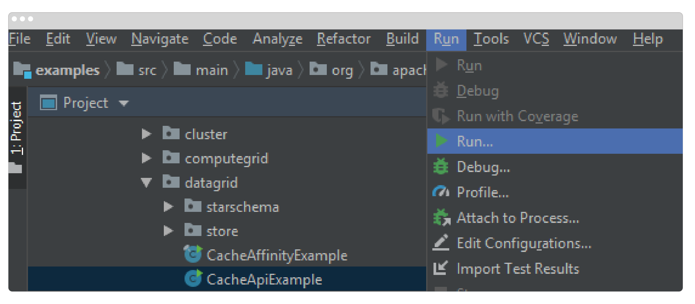
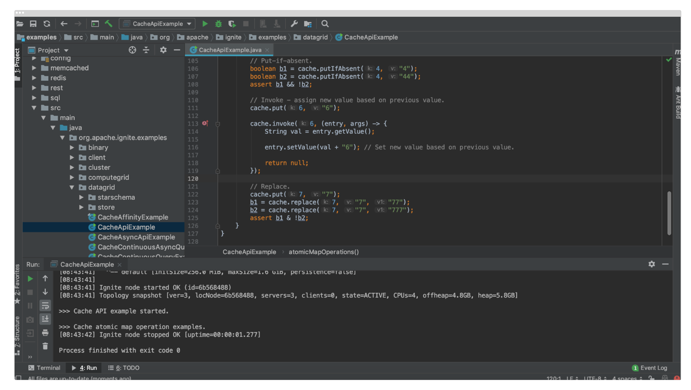

Your GridGain installation includes additional examples. These examples are shipped together with the primary GridGain package you downloaded as part of the GridGain installation above.

To run the examples project please follow these steps (which are provided for IntelliJ IDEA IDE, but should apply to similar IDEs such as Eclipse):

1. Start IntelliJ IDEA, click the "Import Project" button:

   
2. Navigate to the `{gridgain}/examples` folder and select the `{gridgain}/examples/pom.xml` file. Click "OK".
3. Click "Next" on each of the following screens and apply the suggested defaults to the project. Click "Finish".
4. Wait while IntelliJ IDEA finishes setting up Maven, resolving dependencies, and loading modules.
5. Set up JDK if needed.
6. Run `src/main/java/org.apache.examples/datagrid/CacheApiExample`:

   
7. Make sure that the example has been started and executed successfully, as shown in the image below.

   
