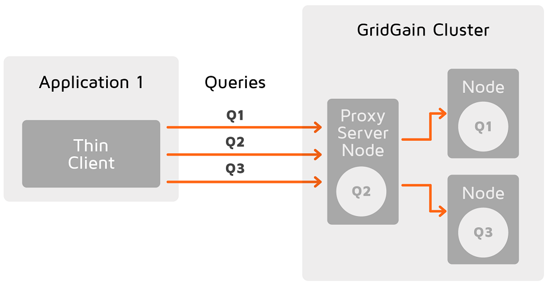
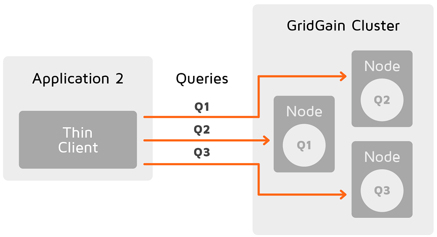

Partition awareness allows the thin client to send query requests directly to the node that owns the queried data.

Without partition awareness, an application that is connected to the cluster via a thin client executes all queries and operations via a single server node that acts as a proxy for the incoming requests. These operations are then re-routed to the node that stores the data that is being requested. This results in a bottleneck that could prevent the application from scaling linearly.

Notice how queries must pass through the proxy server node, where they are routed to the correct node.

With partition awareness in place, the thin client can directly route queries and operations to the primary nodes that own the data required for the queries. This eliminates the bottleneck, allowing the application to scale more easily.

