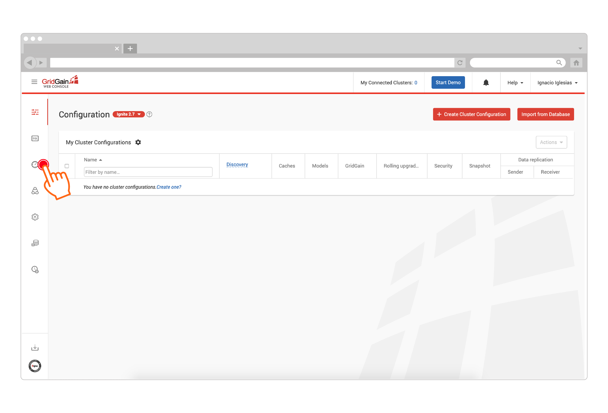
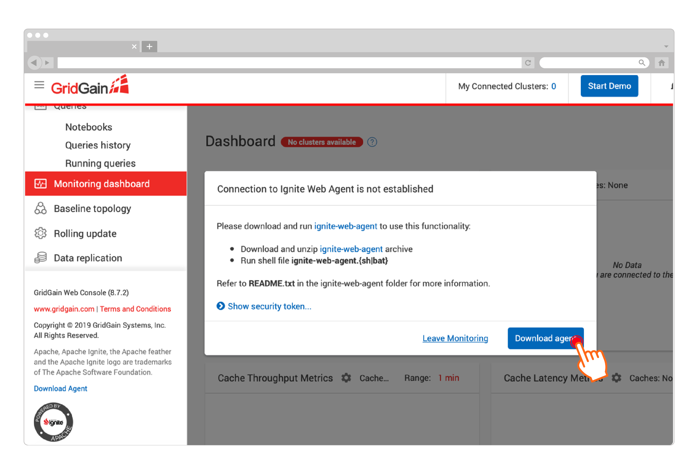
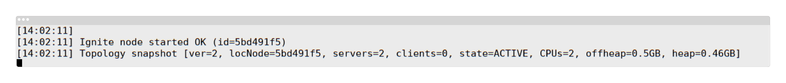

GridGain Web Console is an interactive configuration, management, and monitoring tool, built on top of Apache Ignite Web Console.

1. Go to https://console.gridgain.com and create an account.
2. Log in with your new account and go to the "Monitoring Dashboard" screen. Click the three horizontal lines at the top in order to expand the left-hand menu:

   
3. Click the "Download Agent" button as shown in the screenshot below:

   
4. Extract the web agent into a separate folder.
5. Navigate to the folder where you extracted the web agent files, and execute the `ignite-web-agent.sh` (or `ignite-web-agent.bat`) script.
6. Ensure that the agent can connect to both console.gridgain.com and your single node cluster started earlier. Look for messages similar to the following in the agent's log:

   
7. Go back to the console.gridgain.com Monitoring Dashboard and refresh it. Confirm that the tool successfully displays metrics for your local single node cluster.
