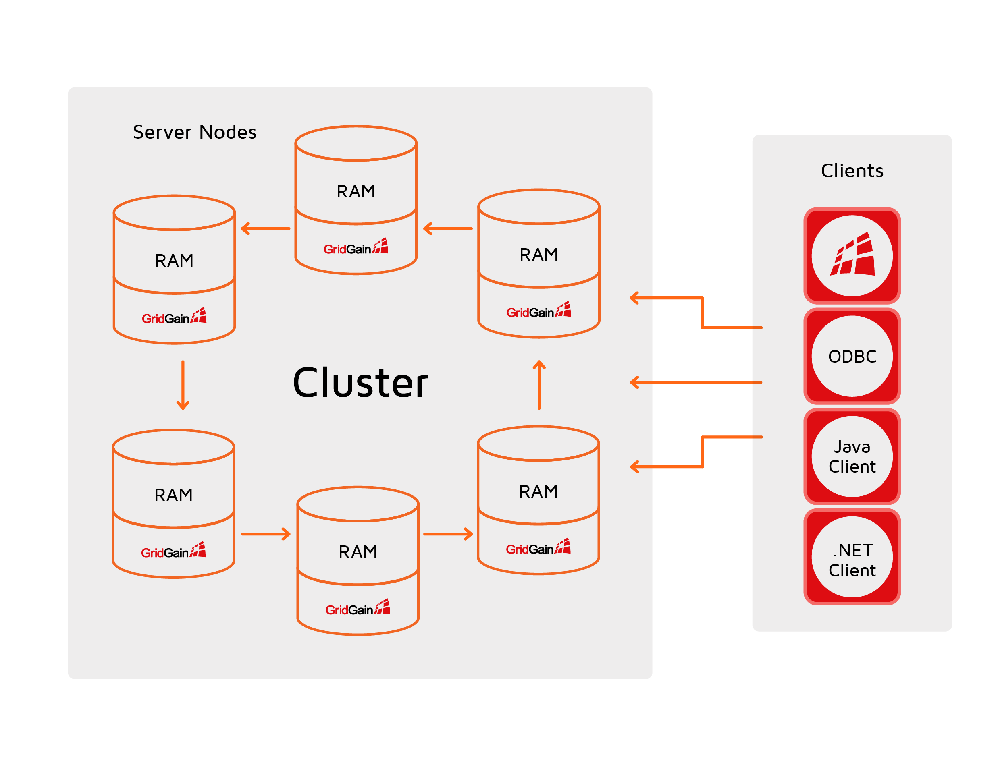

# Clustering

## Clustering (Node Discovery)

To form a cluster, nodes can discover each other in a number of ways.

On start-up, a node is assigned either one of the two roles: _server node_ or _client node_.
Server nodes are the workhorses of the cluster; they cache data, execute compute tasks, etc.
Client nodes join the topology as regular nodes but they do not store data. Client nodes are used to stream data into the cluster and execute user queries.

To form a cluster, each node must be able to connect to all other nodes. To ensure that, a proper discovery mechanism must be configured.

In addition to client nodes, you can use [Thin Clients]({connectors}/thin-clients/getting-started-with-thin-clients) to define and manipulate data in the cluster.
GridGain provides thin clients for a variety of languages, such as java, .NET, C++, Node.JS, python, and PHP.
Unlike regular client nodes, thin clients do not join the cluster topology (i.e. do not start a node); instead, they simply establish a socket connection to one of the cluster nodes​ and perform all operations via the [binary protocol](https://apacheignite.readme.io/docs/binary-client-protocol).


Node.JS, Python, and PHP thin clients are the only way to work with a GridGain cluster from those languages.

For Java, .NET, and C++, the thin clients are a lightweight replacement for thick clients (client nodes).


GridGain nodes can automatically discover each other and form a cluster.
This allows you to scale out when needed without having to restart the whole cluster.
Developers can also leverage GridGain's hybrid cloud support that allows establishing connection between private and public clouds such as Amazon Web Services, providing them with the best of both worlds.

GridGain provides two implementations of the discovery mechanism intended for different usage scenarios:

- [TCP/IP Discovery](../gridgain8-usage/clustering/tcp-ip-discovery.md) is designed and optimized for 100s of nodes.
- [ZooKeeper Discovery](../gridgain8-usage/clustering/zookeeper-discovery.md) that allows scaling GridGain clusters to 100s and 1000s of nodes preserving linear scalability
and performance.

## Cluster Activation

To run workloads on a cluster formed by the node discovery process, you need to _activate_ that cluster. Activation:

- Determines the effective baseline topology (excludes the offline nodes)
- Unlocks APIs to interact with the data that resides on the baseline nodes while discarding the data assigned to those nodes not included in the baseline topology

### New Clusters

Activation for new in-memory clusters (with no persistence) is performed automatically.

Activation for new clusters with persistent regions is manual. You need to activate the cluster when it reaches its _target_ topology, which, upon activation, becomes the cluster's [baseline topology](baseline-topology.md).

Following are the options for first-time activation of persistent clusters.

#### Manual

Because this operation is performed once, it's often convenient to activate a cluster manually. After making sure that all nodes have started and joined the cluster, an administrator can:

- Run a [set-state control.sh command](../reference/cli-tool/README.md#set-state), or
- Initiate activation via the [Control Center GUI]({tools}/control-center/gg8/dashboard/my-cluster#activating-and-deactivating-cluster).

#### Automated with a Deployment or Orchestration Tool

If a cluster is started with an automation tool such as Ansible, you can program the [set-state control.sh command](../reference/cli-tool/README.md#set-state) into the workflow. The above command should be run after all the nodes have started and connected to each other. The deployment / activation tool knows when all nodes have started, so it is in a position to run the command at the right time.

#### Automated by an Application Running Embedded GridGain Nodes

A common way to run GridGain is to have GridGain nodes embedded into application processes, such as Spring Boot applications. In such cases, you may want to automate activation in the applications themselves. After an application starts and joins the rest of the cluster, the application checks the topology. If the topology is as expected (i.e., includes the correct number of nodes), the application triggers the activation via `ignite.cluster().state(ACTIVE)`.


It is not recommended to attempt activating clusters form within application on your own. Should the need arise, we suggest that you contact [GridGain Customer Support](https://www.gridgain.com/contact).


One way to check when a node has joined the cluster is via `LifecycleBean`. This approach requires extra care because an incorrect implementation may lead to disastrous results. Each node makes a decision to activate separately. Therefore, if the status verification logic is flawed, the cluster will be activated at a wrong time, causing issues. It is recommended to activate with a centralized orchestrator or manually whenever possible.


Applications should avoid activating a cluster if it had been activated before. Duplicate activation may lead to issues. It is better to let the cluster auto-activate.


### Existing Clusters

If a persistent cluster is restarted, it will auto-activate upon reaching its baseline topology. Avoid manual activation of existing clusters. Manual activation may lead to the different nodes activating separately from the cluster. This will prevent these nodes from re-joining the cluster and/or cause permanent data loss.

_This page is: Copyright © 2026 MariaDB. All rights reserved._
