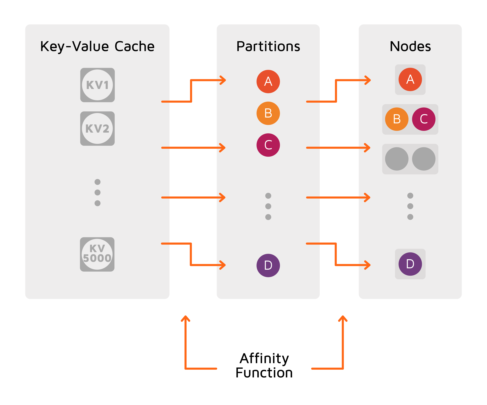
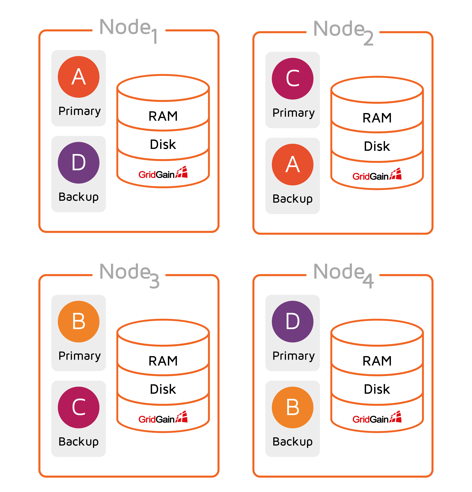
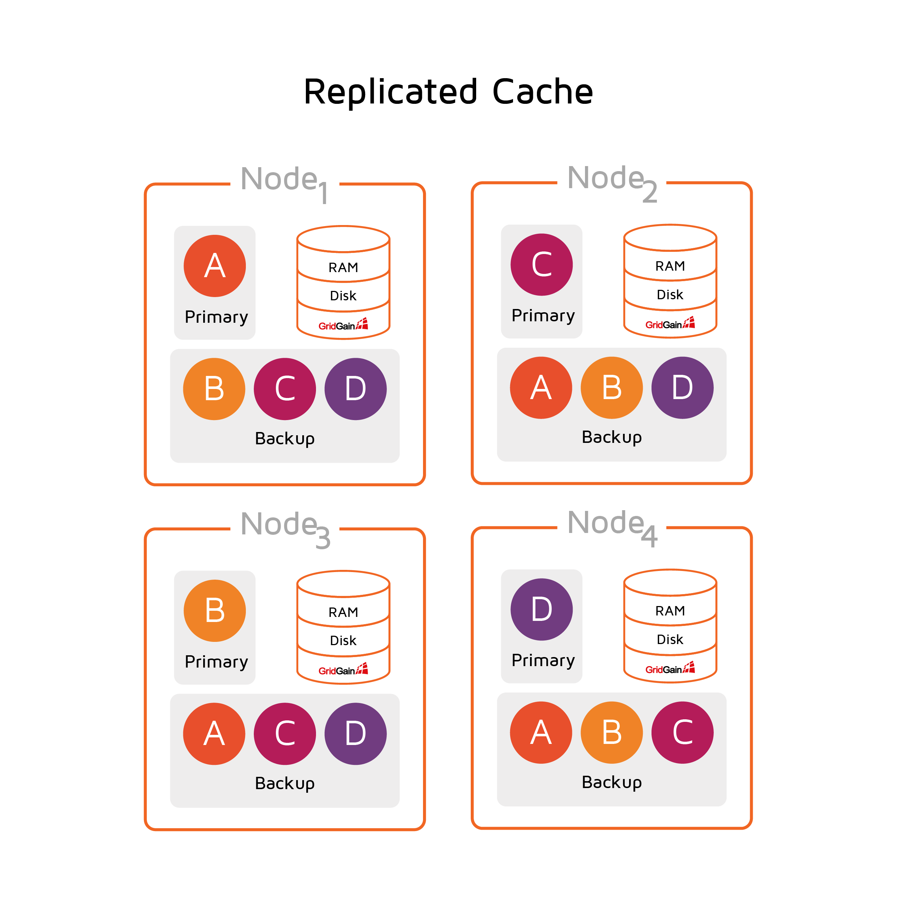

# Data Partitioning

Data partitioning is a method of subdividing large sets of data into smaller chunks and distributing them between all server nodes in a balanced manner.

Partitioning is controlled by the _affinity function_.
The affinity function determines the mapping between keys and partitions.
Each partition is identified by a number from a limited set (0 to 1023 by default).
The set of partitions is distributed between the server nodes available at the moment.
Thus, each key is mapped to a specific node and is stored on that node.
When the number of nodes in the cluster changes, the partitions are re-distributed — through a process called [rebalancing](#rebalancing) — between the new set of nodes.

The affinity function takes the _affinity key_ as an argument.
The affinity key can be any field of the objects stored in the cache (any column in the SQL table).
If the affinity key is not specified, the default key is used (in case of SQL tables, it is the PRIMARY KEY column).


For more information on data partitioning, see the advanced [deep-dive on data partitioning](https://www.gridgain.com/resources/blog/data-distribution-in-apache-ignite) in Ignite.


Partitioning boosts performance by distributing both read and write operations.
Moreover, you can design your data model in such a way that the data entries that are used together are stored together (i.e., in one partition).
When you request that data, only a small number of partitions is scanned.
This technique is called [Affinity Colocation](affinity-colocation.md).

Partitioning helps achieve linear scalability at virtually any scale.
You can add more nodes to the cluster as your data set grows, and GridGain makes sure that the data is distributed "equally" among all the nodes.

## Affinity Function

The affinity function controls how data entries are mapped onto partitions and partitions onto nodes.
The default affinity function implements the _rendezvous hashing_ algorithm.
It allows a bit of discrepancy in the partition-to-node mapping (i.e., some nodes may be responsible for a slightly larger number of partitions than others).
However, the affinity function guarantees that when the topology changes, partitions are migrated only to the new node that joined or from the node that left.
No data exchange happens between the remaining nodes.

## Partitioned/Replicated Mode

When creating a cache or SQL table, you can choose between partitioned and replicated mode of cache operation. The two modes are designed for different use case scenarios and provide different performance and availability benefits.

### PARTITIONED

In this mode, all partitions are split equally between all server nodes.
This mode is the most scalable distributed cache mode and allows you to store as much data as fits in the total memory (RAM and disk) available across all nodes.
Essentially, the more nodes you have, the more data you can store.

Unlike the `REPLICATED` mode, where updates are expensive because every node in the cluster needs to be updated, with `PARTITIONED` mode, updates become cheap because only one primary node (and optionally 1 or more backup nodes) need to be updated for every key. However, reads are somewhat more expensive because only certain nodes have the data cached.


Partitioned caches are ideal when data sets are large and updates are frequent.


The picture below illustrates the distribution of a partitioned cache. Essentially we have key A assigned to a node running in JVM1, key B assigned to a node running in JVM3, etc.

### REPLICATED

In the `REPLICATED` mode, all the data (every partition) is replicated to every node in the cluster. This cache mode provides the utmost availability of data as it is available on every node. However, every data update must be propagated to all other nodes, which can impact performance and scalability.


Replicated caches are ideal when data sets are small and updates are infrequent.


In the diagram below, the node running in JVM1 is a primary node for key A, but it also stores backup copies for all other keys as well (B, C, D).

Because the same data is stored on all cluster nodes, the size of a replicated cache is limited by the amount of memory (RAM and disk) available on the node. This mode is ideal for scenarios where cache reads are a lot more frequent than cache writes, and data sets are small. If your system does cache lookups over 80% of the time, then you should consider using the `REPLICATED` cache mode.

## Backup Partitions

By default, GridGain keeps a single copy of each partition (a single copy of the entire data set). In this case, if one or multiple nodes become unavailable, you lose access to partitions stored on these nodes. To avoid this, you can configure GridGain to maintain backup copies of each partition.


By default, backups are disabled.


Backup copies are configured per cache (table).
If you configure 2 backup copies, the cluster maintains 3 copies of each partition.
One of the partitions is called the _primary_ partition, and the other two are called _backup_ partitions.
By extension, the node that has the primary partition is called the _primary node for the keys stored in the partition_.
The node with backup partitions is called the _backup node_.

When a node with the primary partition for some key leaves the cluster, GridGain triggers the partition map exchange (PME) process.
PME labels one of the backup partitions (if they are configured) for the key as primary.

Backup partitions can increase the availability of your data, and in some cases, the speed of read operations, if you set GridGain to read data from backed-up partitions if they are available on the local node (this is not the default behavior and needs to be enabled. See [Cache Configuration](../../gridgain8-usage/configuring-caches/configuration-overview.md) for details.). However, they also increase memory consumption or the size of the persistent storage (if enabled).


Backup partitions can be configured in PARTITIONED mode only. Refer to the [Configuring Partition Backups](../../gridgain8-usage/configuring-caches/configuring-backups.md) section.


## Partition Map Exchange

Partition map exchange (PME) is a process of sharing information about partition distribution (partition map) across the cluster so that every node knows where to look for specific keys. PME is required whenever the partition distribution for any cache changes, for example, when new nodes are added to the topology or old nodes leave the topology (whether on user request or due to a failure).

Examples of events that trigger PME include (but are not limited to):

- Baseline topology was changed.
- A node joined the cluster, left it, or failed.
- A cache was created or destroyed.
- WAL was disabled or enabled.
- Cluster was activated or deactivated.
- Snapshot got restored.
- Read-only mode was enabled.
- Lost partitions for a group or cache were reset.
- Late affinity assignment was performed.

When one of the PME-triggering events occurs, the cluster waits for all ongoing transactions to complete and then starts PME. Also, during PME, new transactions are postponed until the process finishes.

The PME process works in the following way: The coordinator node requests from all nodes the information about the partitions they own. Each node sends this information to the coordinator. Once the coordinator node receives the messages from all nodes, it merges the information into a full partition map and sends it to all nodes. When the coordinator has received confirmation messages from all nodes, PME is considered completed.

## Rebalancing

Refer to the [Data Rebalancing](../rebalancing/data-rebalancing.md) page for details.

## Partition Loss Policy

It may happen that throughout the cluster’s lifecycle, some of the data partitions are lost due to the failure of some primary node and backup nodes that held a copy of the partitions. Such a situation leads to a partial data loss and needs to be addressed according to your use case. For detailed information about partition loss policies, see [Partition Loss Policy](../rebalancing/partition-loss-policy.md).

_This page is: Copyright © 2026 MariaDB. All rights reserved._
