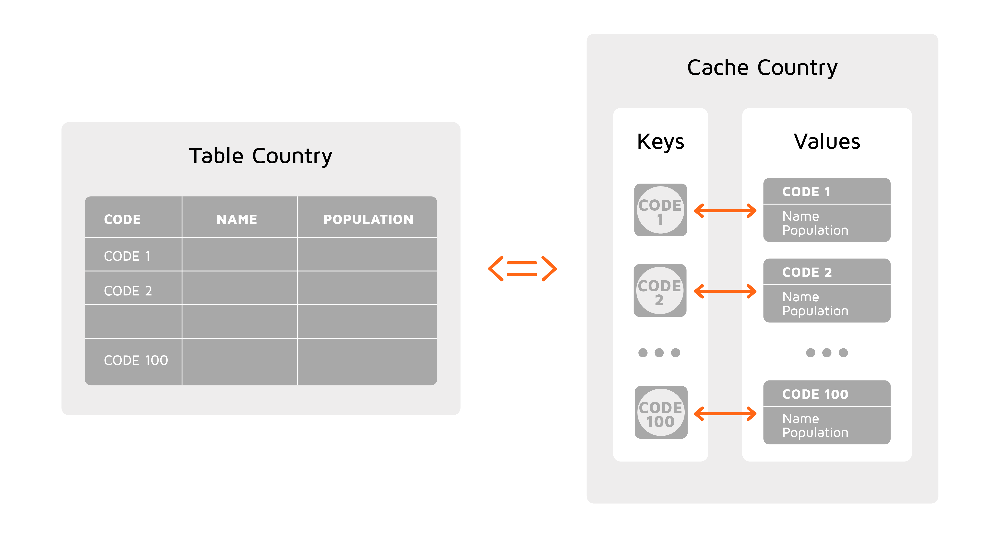

# Data Modeling

A well-designed data model can improve your application's performance, utilize resources more efficiently, and help achieve your business goals. When designing a data model, it is important to understand how data is distributed in a GridGain cluster and the different ways you can access the data.

In this chapter, we discuss important components of the GridGain data distribution model, including partitioning and affinity colocation, as well as the two distinct interfaces that you can use to access your data (key-value API and SQL).

## Overview

To understand how data is stored and used in GridGain, it is useful to draw a distinction between the physical organization of data in a cluster and the logical representation of data, i.e. how users are going to view their data in their applications.

On the physical level, each data entry (either cache entry or table row) is stored in the form of a [binary object](#binary-object-format), and the entire data set is divided into smaller sets called _partitions_. The partitions are evenly distributed between all the nodes. The way data is divided into partitions and partitions into nodes is controlled by the  [affinity function](affinity-colocation.md).

On the logical level, data should be represented in a way that is easy to work with and convenient for end users to use in their applications. GridGain provides two distinct logical representations of data: _key-value cache_ and _SQL tables (schema)_. Although these two representations may seem different, in reality they are equivalent and can represent the same set of data.


Keep in mind that, in GridGain, the concepts of a SQL table and a key-value cache are two equivalent representations of the same (internal) data structure. You can access your data using either the key-value API or SQL statements, or both.


## Key-Value Cache vs. SQL Table

A cache is a collection of key-value pairs that can be accessed through the key-value API. A SQL table in GridGain corresponds to the notion of tables in traditional RDBMSs with some additional constraints; for example, each SQL table must have a primary key.

A table with a primary key can be presented as a key-value cache, in which the primary key column serves as the key, and the rest of the table columns represent the fields of the object (the value).

The difference between these two representations is in the way you access the data. The key-value cache allows you to work with objects via supported programming languages. SQL tables support traditional SQL syntax and can help you, for example, migrate from an existing database. You can combine the two approaches and use either — or both — depending on your use case.

Cache API supports the following features:

- Support for JCache (JSR 107) specification
- ACID Transactions
- Continuous Queries
- Events


Even after you get your cluster up and running, you can create both key-value caches and SQL tables [dynamically](../../gridgain8-usage/key-value-api/basic-cache-operations.md#creating-caches-dynamically).


## Binary Object Format

GridGain stores data entries in a specific format called _binary objects_. This serialization format provides several advantages:

- You can read an arbitrary field from a serialized object without full object deserialization. This completely removes the requirement to have the key and value classes deployed on the server node's classpath.
- You can add or remove fields from objects of the same type. Given that server nodes do not have model classes' definitions, this ability allows dynamic change to the object's structure, and even allows multiple clients with different versions of class definitions to co-exist.
- It enables you to construct new objects based on a type name without having class definitions at all, hence allowing dynamic type creation.
- It allows seamless interoperability between the Java, .NET, and C++ platforms.

Binary objects can be used only when the default binary marshaller is used (i.e., no other marshaller is set in the configuration).

For more information on how to configure and use binary objects, refer to the [Working with Binary Objects](../../gridgain8-usage/key-value-api/binary-objects.md) page.

## Data Partitioning

Data partitioning is a method of subdividing large sets of data into smaller chunks and distributing them between all server nodes in a balanced manner. Data partitioning is discussed at length in the [Data Partitioning](data-partitioning.md) section.

_This page is: Copyright © 2026 MariaDB. All rights reserved._
