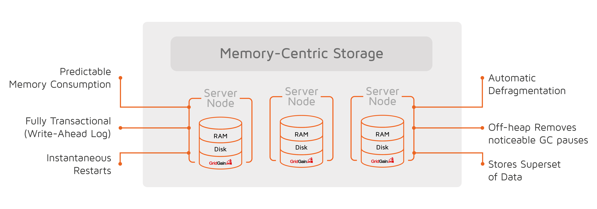
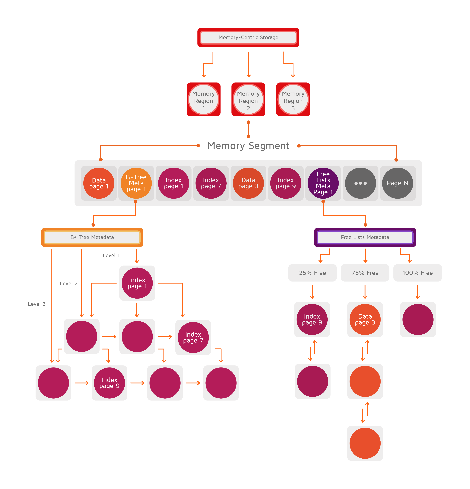
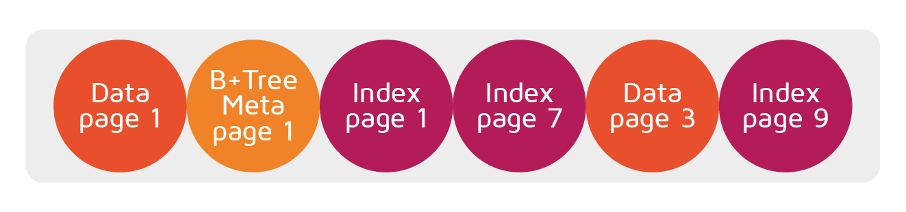
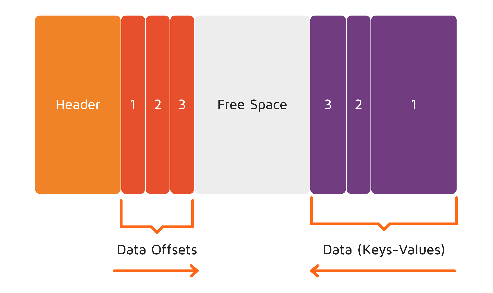
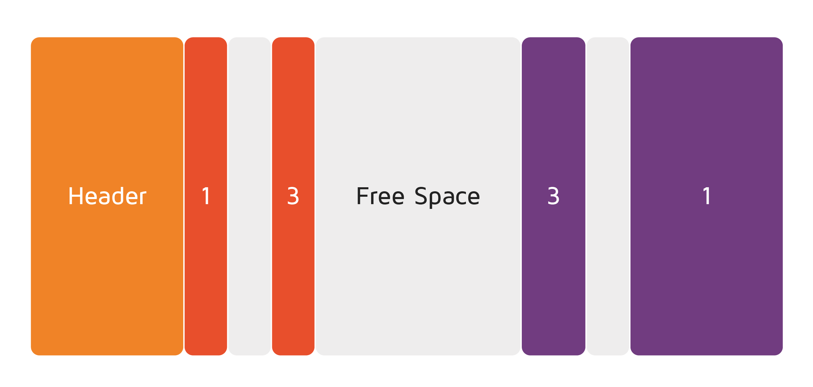

# Memory Architecture

## Overview

GridGain multi-tiered platform allows storing and processing data and indexes both in memory and on disk. The multi-tiered storage helps achieve in-memory performance with the durability of disk using all the available resources of the cluster.

The multi-tiered storage operates in a way similar to the virtual memory of operating systems, such as Linux. However, one significant difference between these two types of architecture is that the multi-tiered storage always treats the disk as the superset of the data (if persistence is enabled), capable of surviving crashes and restarts, while the traditional virtual memory uses the disk only as a swap extension, which gets erased once the process stops.

## Memory Architecture

Multi-tiered architecture is a page-based memory architecture that is split into pages of fixed size. The pages are stored in _managed off-heap regions_ in RAM (outside of Java heap) and are organized in a special hierarchy on disk.

GridGain maintains the same binary data representation both in memory and on disk. This removes the need for costly serialization when moving data between memory and disk.

The picture below illustrates the architecture of the multi-tiered storage.

### Memory Segments

Every data region starts with an initial size and has a maximum size it can grow to. The region expands to its maximum size by allocating continuous memory segments. The region will never shrink - even if all data is removed from a memory segment, the system will not reclaim the memory.

A memory segment is a continuous byte array or physical memory allocated from the operating system. The array is divided into pages of fixed size. There are several types of pages that can reside in the segment, as shown in the picture below.

### Data Pages

A data page stores entries you put into caches from the application side.

Usually, a single data page holds multiple key-value entries in order to use the memory as efficiently as possible and avoid memory fragmentation. When a new entry is added to a cache, GridGain looks for an optimal page that can fit the whole key-value entry.

However, if an entry's total size exceeds the page size configured via the `DataStorageConfiguration.setPageSize(..)` property, then the entry occupies more than one data page.


If you have many cache entries that do not fit in a single page, then it makes sense to increase the page size configuration parameter.


If during an update an entry size expands beyond the free space available in its data page, then GridGain searches for a new data page that has enough room to take the updated entry and moves the entry there.

### Memory Defragmentation

GridGain performs memory defragmentation automatically and does not require any explicit action from a user.

Over time, an individual data page might be updated multiple times by different CRUD operations. This can lead to the page and overall memory fragmentation. To minimize memory fragmentation, GridGain uses _page compaction_ whenever a specific page becomes too fragmented.

A compacted data page looks like the one in the picture below:

The page has a header that stores information needed for internal usage. All key-value entries are always added from right to left. In the picture, there are three entries (1, 2 and 3 respectively) stored in the page. These entries might have different size.

The offsets (or references) to the entries' locations inside the page are stored left-to-right and are always of fixed size. The offsets are used as pointers to look up the key-value entries in a page.

The space in the middle is a free space and is filled in whenever more data is pushed into the cluster.

Next, let's assume that over time entry 2 was removed, which resulted in a non-continuous free space in the page:

This is what a fragmented page looks like.

However, when the whole free space available in the page is needed or some fragmentation threshold is reached, the compaction process defragments the page turning it into the state shown in the first picture above, where the free space is continuous. This process is automatic and doesn't require any action from the user side.

### Free Lists

A free list is a doubly linked list that stores references to memory pages of approximately equal free space.

The concept is shown on the example of how GridGain stores a new cache entry if an operation like `myCache.put(keyA, valueA)` is called. In this scenario, the durable memory relies on the free list data structure. The execution flow of the `myCache.put(keyA, valueA)` operation is below:

1. GridGain looks for a memory region to which `myCache` belongs.
2. The meta page pointing to the hash index B+ Tree of `myCache` is located.
3. Based on the `keyA` hash code, the index page the key belongs to is located in the B+ tree.
4. If the corresponding index page is not found in the memory or on disk, then a new page will be requested from one of the free lists. Once the index page is provided, it will be added to the B+ tree.
5. If the index page is empty (i.e. does not refer to any data page), then the data page will be provided by one of the free lists, depending on the total cache entry size. A reference to the data page will be added to the index page.
6. The cache entry is added to the data page.

## Persistence

GridGain provides a number of features that let you persist your data on disk with consistency guarantees. You can restart the cluster without losing the data, be resilient to crashes, and provide a storage for data when the amount of RAM is not sufficient. When native persistence is enabled, GridGain always stores all the data on disk, and loads as much data as it can into RAM for processing. Refer to the [Ignite Persistence](storage/native-persistence.md) section for further information.

_This page is: Copyright © 2026 MariaDB. All rights reserved._
