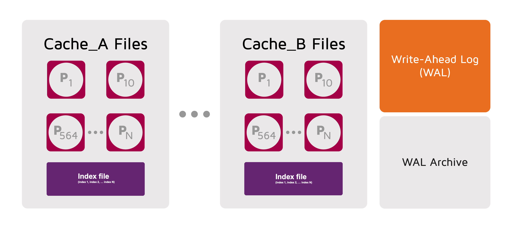
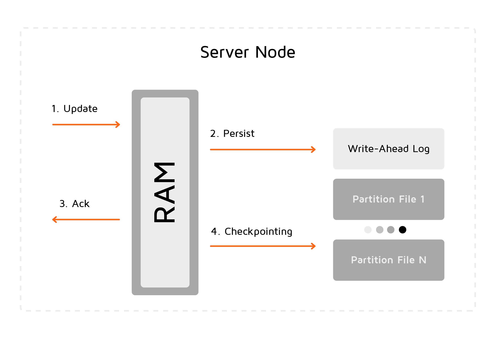

# Ignite Persistence

## Overview

_Ignite Persistence_, or _Native Persistence_, is a set of features designed to provide persistent storage.
When native persistence is enabled, Ignite  stores all the data on disk and loads [as much data as it can](../../gridgain8-usage/memory-configuration/data-regions.md) to RAM for processing.
For example, if there are 100 entries and RAM has the capacity to store only 20, then all 100 are stored on disk and only 20 are cached in RAM for better performance.


For more information on Native Persistence, watch [the architectural deep dive](https://www.youtube.com/watch?v=6Yg5QW-XFVc&list=PLMc7NR20hA-KF8c_hVICKpzKnWkjzfC2V&index=19) on the internals of the Ignite storage engine.


When persistence is disabled, and no external storage is used, GridGain behaves as a pure in-memory store.

When persistence is enabled, every server node persists a subset of the data that only includes the partitions assigned to that node.

The native persistence functionality is based on the following features:

- Storing data partitions on disk
- Checkpointing
- Write-ahead logging (WAL)

GridGain stores each partition in a separate file on disk. The data format of the partition files is the same as that of the data when it is kept in memory.
If partition backups are enabled, they are also saved on disk.
In addition to data partitions, GridGain stores indexes and metadata. It stores all indexes defined for a cache in a single index file.



## Enabling Persistent Storage

Native persistence is configured per [data region](../../gridgain8-usage/memory-configuration/data-regions.md).
To enable persistent storage, set the `persistenceEnabled` property to `true` in the data region configuration.
You can have in-memory data regions and data regions with persistence at the same time.

The following example shows how to enable persistent storage for the default data region.



```xml
<bean class="org.apache.ignite.configuration.IgniteConfiguration">
    <property name="dataStorageConfiguration">
        <bean class="org.apache.ignite.configuration.DataStorageConfiguration">
            <property name="defaultDataRegionConfiguration">
                <bean class="org.apache.ignite.configuration.DataRegionConfiguration">
                    <property name="persistenceEnabled" value="true"/>
                </bean>
            </property>
            <property name="walSegmentSize" value="128 * 1024 * 1024"/>
        </bean>
    </property>
</bean>
```


```java
IgniteConfiguration cfg = new IgniteConfiguration();
//data storage configuration
DataStorageConfiguration storageCfg = new DataStorageConfiguration();

storageCfg.getDefaultDataRegionConfiguration().setPersistenceEnabled(true);
        

cfg.setDataStorageConfiguration(storageCfg);

Ignite ignite = Ignition.start(cfg);
```


```csharp
var cfg = new IgniteConfiguration
{
    DataStorageConfiguration = new DataStorageConfiguration
    {
        DefaultDataRegionConfiguration = new DataRegionConfiguration
        {
            Name = "Default_Region",
            PersistenceEnabled = true
        }
    }
};

Ignition.Start(cfg);
```


unsupported



## Configuring Persistent Storage Directory

By default, nodes stores user data, indexes, and WAL files in the `{IGNITE_WORK_DIR}/db` directory (a.k.a. storage directory). The following sub-directories are included in the storage directory:

| Subdirectory name | Description |
|---|---|
| `{WORK_DIR}/db/{nodeId}` | Contains cache data and indexes |
| `{WORK_DIR}/db/wal/{nodeId}` | Contains WAL files |
| `{WORK_DIR}/db/wal/archive/{nodeId}` | Contains WAL archive files |

The `nodeId` part is either the consistent node ID (if it's defined in the node configuration) or [auto-generated node id](https://cwiki.apache.org/confluence/display/IGNITE/Ignite+Persistent+Store+-+under+the+hood#IgnitePersistentStore-underthehood-SubfoldersGeneration). It is used to ensure uniqueness of the directories for the node.
If multiple nodes share the same work directory, they use different sub-directories.

If the work directory contains persistence files for multiple nodes (there are multiple {nodeId} subdirectories with different nodeIds), the node picks up the first subdirectory that is not being used. A temporary lock file ensures that no subdirectory is claimed by multiple nodes.

To make sure a node always uses a specific subdirectory and, thus, specific data partitions even after a restart, set `IgniteConfiguration.setConsistentId` to a cluster-wide unique value in the node configuration.

### Assigning Consistent ID to Nodes

Each individual node must use a unique consistent id, otherwise it won't be able to join the cluster and form topology.

We strongly recommend user-defined consistent IDs for nodes with persistence in production clusters. To set up the the consistent ID for a node, add `property name="consistentId" value="{value}"` to the node configuration (XML) file.


Currently, auto-generated IDs might cause inconsistent persistence folder naming in PDS cleaning scenarios.


Consider a scenario where multiple nodes with persistence are started on the same machine, then all these nodes are shut down, then they are re-started. If a node doesn't have its consistent ID defined in configuration, re-starting this node will result in locking in to the first available persistent directory, which may cause unwanted/unpredictable node start order. If the same node has its consistent ID defined in configuration, its re-start will lock the predefined/intended persistent folders.



```xml
<bean class="org.apache.ignite.configuration.IgniteConfiguration">
    <property name="consistentId" value="NodeAConsistentId"/>
    <!-- Other properties -->
</bean>
```


```java
IgniteConfiguration nodeCfg = new IgniteConfiguration();
nodeCfg.setConsistentId("NodeAConsistentId");
// Other settings

Ignition.start(nodeCfg);
```


```csharp
var cfg = new IgniteConfiguration
{
    ConsistentId = "NodeAConsistentId"
};

Ignition.Start(cfg);
```



Explicit (via configuration) assignment of a consistent ID to each node results in:

- Fixed work/storage folder paths, which contain the consistent ID that cannot be changed (the node can be only removed from the topology and re-added with a different consistent ID)
- Replacement of node that has consistent ID "A" in the topology with another node that has consistent ID "B" changes the entire partition distribution because this distribution is calculated based on consistent ID values

### Changing Data File Location

You can change the location of data files by modifying the `storagePath` property (see [Configuration Properties](#configuration-properties)).



```xml
<bean class="org.apache.ignite.configuration.IgniteConfiguration">
    <property name="dataStorageConfiguration">
        <bean class="org.apache.ignite.configuration.DataStorageConfiguration">
            <property name="defaultDataRegionConfiguration">
                <bean class="org.apache.ignite.configuration.DataRegionConfiguration">
                    <property name="persistenceEnabled" value="true"/>
                </bean>
            </property>
            <property name="storagePath" value="/opt/storage"/>
            <property name="walSegmentSize" value="128 * 1024 * 1024"/>
        </bean>
    </property>
</bean>
```


```java
IgniteConfiguration cfg = new IgniteConfiguration();
//data storage configuration
DataStorageConfiguration storageCfg = new DataStorageConfiguration();

storageCfg.getDefaultDataRegionConfiguration().setPersistenceEnabled(true);
        
storageCfg.setStoragePath("/opt/storage");

cfg.setDataStorageConfiguration(storageCfg);

Ignite ignite = Ignition.start(cfg);
```


```csharp
var cfg = new IgniteConfiguration
{
    DataStorageConfiguration = new DataStorageConfiguration
    {
        StoragePath = "/ssd/storage",

        DefaultDataRegionConfiguration = new DataRegionConfiguration
        {
            Name = "Default_Region",
            PersistenceEnabled = true
        }
    }
};

Ignition.Start(cfg);
```


unsupported



### Changing WAL Paths

You can change the [Write-Ahead Log (WAL)](#write-ahead-log-wal) and [WAL Archive](#wal-archive) paths to point directories outside of the storage directory.


To estimate the required size of the data storage, refer to the [Empirical Estimation of Disk Capacity Usage](../../ha-and-performance/disk-capacity-estimation.md) section.


## Checkpointing

_Checkpointing_ is designed to ensure durability of data and recovery in case of a node failure. This process synchronizes _dirty_ pages between RAM and the partition files on disk. A dirty page is a page that was updated in RAM but was not written to the respective partition file (the update, however, was appended to the WAL).

After the checkpoint process is started, all changes are persisted to disk. They will be available if the node crashes and is restarted.



This process helps utilize disk space frugally by keeping pages in the most up-to-date state on disk. After a checkpoint is passed, you can delete the WAL segments that were created before that point in time.

The checkpointing frequency is set when a node is created by `DataStorageConfiguration.setCheckpointFrequency`. You can change the initial value in the configuration object (for example, in the XML config file). However, to apply such a change, you would need to restart the node. To override the configuration-defined frequency without node restarting, you can use a dynamic property available through the [control script](../../reference/cli-tool/README.md#checkpoint):



```bash
control.sh --property set --name checkpoint.frequency --val <value in milliseconds>
```


```bash
control.bat --property set --name checkpoint.frequency --val <value in milliseconds>
```




Setting the dynamic `checkpoint.frequency` property to zero (0) or to a negative value disables the override; the node reverts to the checkpointing frequency defined in the configuration file.


You can configure the checkpointing buffer, throttling, etc. For more information, see:

- [Monitoring Checkpointing Operations](../../reference/monitoring/jmx-metrics.md#monitoring-checkpointing-operations)
- [Persistence Tuning](../../ha-and-performance/performance-tuning/persistence-tuning.md)

## Write-Ahead Log (WAL)

The [write-ahead log (WAL)](https://en.wikipedia.org/wiki/Write-ahead_logging#:~:text=A%20write%20ahead%20log%20is,are%20written%20to%20the%20database) is a log of all data modifying operations (including deletes) that happen on a node. When a page is updated in RAM, the update is not directly written to the partition file but is appended to the tail of the WAL.

The purpose of the WAL is to ensure durability of data and to serve as a recovery mechanism when a single node or the whole cluster goes down. In case of a crash or restart, the cluster can always be recovered to the latest successfully committed transaction by relying on the content of the WAL. The WAL is enabled by default. You can disable it - see [Disabling WAL](#disabling-wal).

The WAL consists of several files (called active segments) and an archive. The active segments are filled out sequentially and, if archiving is enabled, are overwritten in a cyclical order. If [WAL Archive](#wal-archive) is enabled, once the 1st segment is full, its content is copied to that archive. While the 1st segment is being copied, the 2nd segment is treated as an active WAL file and accepts all the updates coming from the application side. By default, there are 10 active segments. Yoy can change this value using `walSegments` - see [Configuration Properties](#configuration-properties). WAL cannot be enabled or disabled for a single data region.

By default, WAL segments are copied to a separate archive directory. You can consolidate them with the active WAL to avoid copy overhead - see [Consolidating WAL and WAL Archive](#consolidating-wal-and-wal-archive).

### Disabling WAL

You may disable the WAL to achieve better performance during the initial data loading and re-enable it after the initial loading is complete. If any node fails while loading data, you can safely restart the process from the beginning.


By default, GridGain automatically disables WAL during rebalance whenever possible (for example, when a new node is added to the baseline). You can change this default behavior by setting `IGNITE_DISABLE_WAL_DURING_REBALANCING=false`.




```java
IgniteConfiguration cfg = new IgniteConfiguration();
DataStorageConfiguration storageCfg = new DataStorageConfiguration();
storageCfg.getDefaultDataRegionConfiguration().setPersistenceEnabled(true);

cfg.setDataStorageConfiguration(storageCfg);

Ignite ignite = Ignition.start(cfg);
        
ignite.cluster().state(ClusterState.ACTIVE);
        
String cacheName = "myCache";
        
ignite.getOrCreateCache(cacheName);

ignite.cluster().disableWal(cacheName);

//load data
ignite.cluster().enableWal(cacheName);
```


```csharp
var cacheName = "myCache";
var ignite = Ignition.Start();
ignite.GetCluster().DisableWal(cacheName);

//load data

ignite.GetCluster().EnableWal(cacheName);
```


```sql
ALTER TABLE Person NOLOGGING

//...

ALTER TABLE Person LOGGING
```


unsupported




While you can also set the `walMode` property to `NONE` to disable WAL across the cluster, doing so is not recommended. If an issue happens during the period WAL is disabled, data may become corrupted and lead to extensive loss of data and lengthy recovery. Instead, disable WAL for individual caches during high load, while keeping it on for the rest of the cluster.


### WAL Archive

The WAL archive is used to store WAL segments that may be needed to recover a node after crash, as well as for [PITR (point-in-time recovery)](../../gridgain8-management/snapshots/point-in-time-recovery.md). The number of segments kept in the archive is such that the total size of all segments does not exceed the specified size of the WAL archive.

By default, the maximum size of the WAL archive (total space it occupies on disk) is defined as 1 Gb. You can change this value using `maxWalArchiveSize` - see [Configuration Properties](#configuration-properties).


Setting the WAL archive size to a value lower than the default may impact performance and should be tested before being used in production.


The `minWalArchiveSize`, defines the size starting from which the WAL archive begins self-cleaning to prevent uncontrolled growth. By default, the value of this property is half the `maxWalArchiveSize`, i.e., 500 Mb - for details, see [Configuration Properties](#configuration-properties).

Here is how you can define the WAL archive in the configuration:

```xml
<bean class="org.apache.ignite.configuration.DataStorageConfiguration">
  <property name="walSegments" value="20"/>
  <property name="walSegmentSize" value="2000000"/>
  <property name="walPath" value="db/wal_path"/>
  <property name="maxWalArchiveSize" value="2000000000"/>
  <property name="minWalArchiveSize" value="1000000000"/>
  <property name="walArchivePath" value="db/wal_path/archive"/>
</bean>
```

### WAL Modes

There are three WAL modes. Each mode differs in how it affects performance and provides different consistency guarantees.

| Mode | Description | Consistency Guarantees |
|---|---|---|
| `FSYNC` | The changes are guaranteed to be persisted to disk for every atomic write or transactional commit. | Data updates are never lost surviving any OS or process crashes, or power failure. |
| `LOG_ONLY` | The default mode.<br><br>The changes are guaranteed to be flushed to either the OS buffer cache or a memory-mapped file for every atomic write or transactional commit.<br><br>The memory-mapped file approach is used by default and can be switched off by setting the `IGNITE_WAL_MMAP` system property to `false`. | Data updates survive a process crash. |
| `BACKGROUND` | When the `IGNITE_WAL_MMAP` property is enabled (default), this mode behaves like the `LOG_ONLY` mode.<br><br>If the memory-mapped file approach is disabled then the changes stay in node's internal buffer and are periodically flushed to disk. The frequency of flushing is specified via the `walFlushFrequency` parameter. | When the `IGNITE_WAL_MMAP` property is enabled (default), the mode provides the same guarantees as `LOG_ONLY` mode.<br><br>Otherwise, recent data updates may get lost in case of a process crash or other outages. |
| `NONE` | Not recommended. WAL is disabled. The changes are persisted only if you shut down the node gracefully. Use `Ignite.active(false)` to deactivate the cluster and shut down the node. | Data loss or corruption may occur.<br><br>If a node is terminated abruptly during update operations, it is very likely that the data stored on the disk becomes out-of-sync or corrupted. |

### Changing WAL Segment Size

The default WAL segment size (64 MB) may be inefficient in high load scenarios because it causes WAL to switch between segments too frequently and switching/rotation is a costly operation.
A larger size of WAL segments can help increase performance under high loads at the cost of increasing the total size of the WAL files and WAL archive.

You can change the size of the WAL segment files in the data storage configuration. The value must be between 512KB and 2GB. This change can be made while stopping and restarting nodes one-by-one, rather than restarting the entire cluster.



```xml
<bean class="org.apache.ignite.configuration.IgniteConfiguration">
    <property name="dataStorageConfiguration">
        <bean class="org.apache.ignite.configuration.DataStorageConfiguration">
            <property name="defaultDataRegionConfiguration">
                <bean class="org.apache.ignite.configuration.DataRegionConfiguration">
                    <property name="persistenceEnabled" value="true"/>
                </bean>
            </property>
            <property name="storagePath" value="/opt/storage"/>
            <property name="walSegmentSize" value="128 * 1024 * 1024"/>
        </bean>
    </property>
</bean>
```


```java
IgniteConfiguration cfg = new IgniteConfiguration();
DataStorageConfiguration storageCfg = new DataStorageConfiguration();
storageCfg.getDefaultDataRegionConfiguration().setPersistenceEnabled(true);

storageCfg.setWalSegmentSize(128 * 1024 * 1024);

cfg.setDataStorageConfiguration(storageCfg);

Ignite ignite = Ignition.start(cfg);
```


unsupported


unsupported



#### Node Recovery Without WAL

If a node crashes while WAL is disabled, you may need to do some cleanup to restart the node.

- If the node has crashed outside of checkpointing process, the node will just restart. It will be missing updates since the last checkpoint, but they will be replicated from other nodes.
- If the node has failed during checkpointing, it will restart in _Maintenance Mode_. This node will not connect to the cluster or receive any requests from applications. While in this mode, the caches with disabled WAL need to be cleaned up first by removing all data.


You may try to recover files manually before cleanup although this option is not recommended.


Back up the corrupted data files (optional), then clean up persistence ase described in the [troubleshooting section](../../ha-and-performance/maintenance-mode.md).

### WAL Archive Compaction

You can enable WAL archive compaction to reduce the space the archive occupies.
If compaction is enabled, all archived segments older than the last checkpoint are:

- Compacted - the physical records are removed and only the logical records are left; for details, see [this wiki page](https://cwiki.apache.org/confluence/display/IGNITE/Ignite+Persistent+Store+-+under+the+hood#IgnitePersistentStoreunderthehood-WALrecordsforrecovery)
- Compressed to the ZIP format

Compaction can reduce the archive size by more than an order of magnitude.

If the previously compressed segments are needed (for example, to re-balance data between nodes), they are uncompressed to the RAW format.


WAL compaction adds certain amount of extra CPU work (relatively small).


See the [Configuration Properties](#configuration-properties) section below to learn how to enable WAL archive compaction.

```xml
<bean class="org.apache.ignite.configuration.DataStorageConfiguration">
  <property name="maxWalArchiveSize" value="2000000000"/>
  <property name="walArchivePath" value="db/wal_path/archive"/>
  <property name="walCompactionEnabled" value="true"/>
</bean>
```

### Consolidating WAL and WAL Archive

In high-load environments, copying segments from the active WAL to the WAL archive can saturate disk I/O and, in some scenarios, freeze operations on the node. To eliminate the WAL-to-archive copy step, configure the active WAL and the archive to use the same directory. When `walPath` and `walArchivePath` point to the same location, GridGain skips the copy step. Archived segments remain in place in the WAL folder, and the directory is cleaned up once `maxWalArchiveSize` is reached.

To consolidate WAL and WAL archive, set `walPath` and `walArchivePath` to the same value.

Consolidation has three important trade-offs:

- **No isolation between active and archive storage.** By default, you can place `walPath` and `walArchivePath` on separate disks — a small fast one for active WAL, a larger one for the archive. This isolates their I/O patterns and failure domains. Once consolidated, both share one directory, one filesystem, and one I/O budget.
- **Shorter PITR window for the same `maxWalArchiveSize`.** By default, the active WAL ring (`walSegments` × `walSegmentSize` — for example, 10 × 64 MB = 640 MB) is sized independently of `maxWalArchiveSize`. After consolidation, active and archived segments share the same `maxWalArchiveSize` budget, so less history is retained. To preserve the previous point-in-time recovery range, increase `maxWalArchiveSize` by at least `walSegments` × `walSegmentSize`.
- **Higher risk of losing recoverable history.** With both paths in one directory, a single disk failure, filesystem corruption, or accidental deletion removes both the live tail and the archive at once. [Point-in-time recovery](../../gridgain8-management/snapshots/point-in-time-recovery.md) requires a snapshot plus the WAL chain that follows it. If the WAL chain is lost, you can only restore to the snapshot itself — not to any later moment.

## Configuration Properties

The following table describes native persistence properties.

| Property Name | Description | Default Value |
|---|---|---|
| `persistenceEnabled` | Set this property to `true` to enable Native Persistence. | `false` |
| `storagePath` | The path where data is stored. | `${IGNITE_HOME}/work/db/node{IDX}-{UUID}` |
| `walPath` | The path to the directory where active WAL segments are stored. | `${IGNITE_HOME}/work/db/wal/` |
| `walArchivePath` | The path to the WAL archive. | `${IGNITE_HOME}/work/db/wal/archive/` |
| `walCompactionEnabled` | Set to `true` to enable [WAL archive compaction](#wal-archive-compaction). | `false` |
| `walSegmentSize` | The size of a WAL segment file in bytes. | 64MB |
| `walSegments` | The number of active segments in the WAL. | 10 |
| `walMode` | [Write-ahead logging mode](#wal-modes). | `LOG_ONLY` |
| `walCompactionLevel` | WAL archive compression level. `1` indicates the fastest speed, and `9` indicates the best compression. | `1` |
| `maxWalArchiveSize` | The maximum size (in bytes) the WAL archive can occupy on the file system. Observed as long as it does not prevent completion of a checkpoint. If a specific checkpoint causes the archive to grow beyond the maximum size, the system starts self-cleanup as soon as this checkpoint is completed. "-1" means there is no archive size limit. | 1 Gb |
| `minWalArchiveSize` | The size (in bytes) starting from which the WAL archive begins self-cleanup. | Half the value of `maxWalArchiveSize`; initially, 500 Mb |

<sub>_This page is: Copyright © 2026 MariaDB. All rights reserved._</sub>
