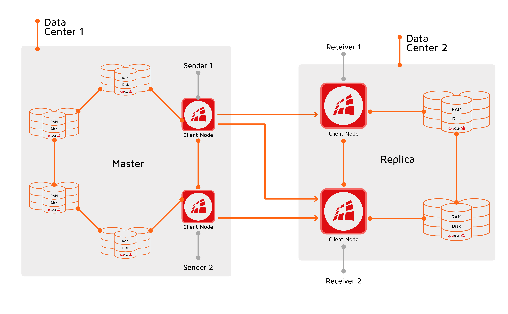

# Introduction


The Data Center Replication functionality is only available in GridGain Enterprise and Ultimate Editions.


## Overview

Data Center Replication (DR) replicates cache data between clusters.

When working with multiple data centers, it is important to make sure that if one data center goes down, another data center is fully capable of picking its load and data.
When data center replication is turned on, GridGain will automatically make sure that each cluster is consistently synchronizing its data to other data centers (there can be one or more).

## Data Replication Modes

GridGain supports _active-passive_ and _active-active_ modes for replication.

In the active-passive mode, only one cluster (the master) interacts with the user application, and the other cluster (the replica) stores data purely for redundancy and failover purposes.

In the active-active mode, both clusters handle user requests independently and propagate changes to each other. In this mode, care must be taken to resolve conflicts between updates that happen on the same cache entry in both clusters. For more information on how to resolve conflicts, refer to the [Conflict Resolution](configuring-replication.md#conflict-resolution) section.

## How Data Replication Works

Let’s consider a simple scenario where data from one cluster (the master) is replicated to another cluster (the replica) in active-passive mode.

In the master cluster, a subset of nodes, called a _sender group_,  is configured to connect to the remote cluster, and all data is transferred through this connection. You can have as many sender groups as you need. For example, you can configure different groups to replicate data to different clusters, or you can replicate different caches with different data transfer properties.

In the replica cluster, a subset of nodes, called _receivers_, is configured to receive data from the master cluster.

Now, when you update a cache entry in the master cluster, the update happens on the node that hosts the entry (the primary node), but the update is not immediately sent to the replica. Instead, this update and other cache entry updates are accumulated into batches on the primary nodes. When the batch reaches its maximum size, or if the batch has been waiting for too long, it is sent to one of the sender nodes in the master cluster. The sender node then transfers the updates to the replica.

When the receiver cluster gets the update, it writes the data in the same way as when the update is performed by the user, triggering all related events and updates (for example, [continuous queries](../../gridgain8-usage/continuous-queries.md) and [events](../../gridgain8-usage/events/README.md)).

Note that DR replicates only the content of caches. It does not copy cluster or cache configuration. This means that the replica cluster has to be configured manually and can have a different topology and settings.

By default, GridGain waits for a receiving node to send a confirmation that data has been transferred. You can configure this behavior with the `awaitAcknowledge` property. It is highly recommended to keep this property at a default value for production environments.

## Supported Scenarios

You can configure DR to replicate clusters in many different combinations. For example, you can have cluster A replicating updates to several other clusters; or cluster A replicating to cluster B, and cluster B replicating to cluster C; or clusters A, B, and C replicating updates to each other.


It is possible to have up to 32 data centers in the replication topology. It is subject to the same configuration principles as a replication topology with two data centers, which requires adding more sender and receiver groups. For example, if you have one active and two passive data centers, you need to configure a receiver group on each of the passive data centers and two separate sender groups, pointing to different receiver groups, on the active data center.


## Recommended Capacity

Below are the recommended minimum for

- Two sender and two receiver nodes to provide redundancy in case of connection issues.

- 2 cores and 8Gb of memory available for each node.
  * Sender nodes need less hardware in general.
  * Receiver nodes need better hardware in general.

## Known Limitations

- The `IgniteCache.clear()` operation does not affect remote clusters when using DR.
- The `GG_DR_FORCE_DC_ID` property is not supported for incremental DR.
- Data replication may not work properly for caches that load data using [Data Streamers that disallow overwriting existing keys](../../gridgain8-usage/data-streaming.md#avoiding-overwriting-existing-keys). If you are going to use data replication with data streamers, make sure the `allowOverwrite` property of the data streamer is set to `true`. If the property is set to `false` when replication is started, correct replication is not guaranteed. Some keys may be not replicated and will be excluded from replication. You would need to manually repopulate the cache on the sender cluster with the `allowOverwrite` property set to `true`.
- Data Center Replication should not be used with caches that have [access-based expiry policy](../../gridgain8-usage/configuring-caches/expiry-policies.md).
- [Cache Interceptors](https://www.gridgain.com/sdk/8.10/javadoc/org/apache/ignite/cache/CacheInterceptor.html) are not invoked in the remote cluster when it receives updates from the master cluster.

_This page is: Copyright © 2026 MariaDB. All rights reserved._
