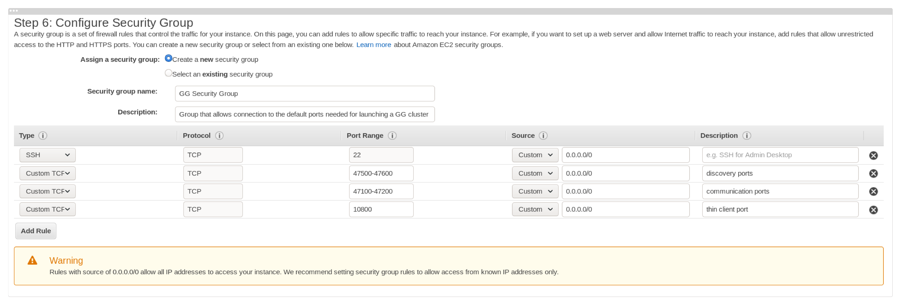
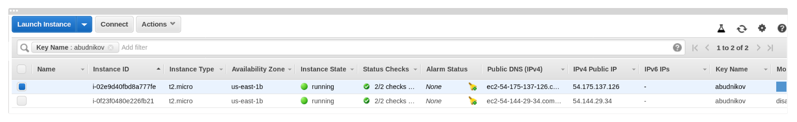
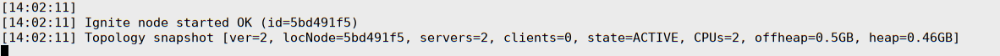
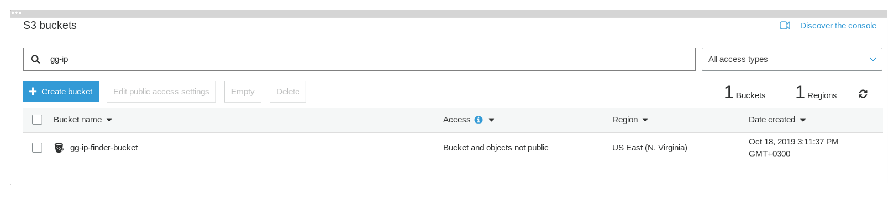

# Manual Install on Amazon EC2

This page is a step by step guide to running a GridGain cluster on Amazon EC2.
Through this guide you will learn how to launch two EC2 instances each running a GridGain node and configure them to join with each other to form a cluster.
You can extend this guide to any number of nodes.


This guide is applicable to [Apache Ignite](https://apacheignite.readme.io) as well.


We will use two `t2.micro` instances, GridGain, and Java 8.

## Prerequisites

- An existing AWS account
- Familiarity with Amazon EC2 Instances:
  - [Amazon EC2 Instances](https://docs.aws.amazon.com/AWSEC2/latest/UserGuide/launching-instance.html)
  - [Connect to Your Linux Instance](https://docs.aws.amazon.com/AWSEC2/latest/UserGuide/AccessingInstances.html?icmpid=docs_ec2_console)

## Considerations

Choose the right type of instances that suit your needs.

Consider the following points:

- **RAM:** If you are going to use GridGain as an in-memory storage, make sure to select an instance with enough RAM to fit all your data.
- **Disk space:** If you are launching a cluster with a [persistent storage](../../../architecture/storage/native-persistence.md), provide enough size to accommodate all your data when configuring the instance's volume.

  You may want to uncheck the **Delete on Termination** option for your storage.
- **Networking:** GridGain nodes discover and communicate with each other by TCP/IP. A number of ports must be open for this communication. See [Configuring Security Group](#configuring-security-group).

Visit our [Capacity Planning](../../../ha-and-performance/capacity-planning.md) page for information about ways to estimate hardware requirements for your use case.


We recommend you should [create an Amazon AMI image](https://docs.aws.amazon.com/toolkit-for-visual-studio/latest/user-guide/tkv-create-ami-from-instance.html) after configuring your first instance with GridGain.
You can reuse the image to launch more instances without repeating the configuration procedure manually.


## Launching Amazon EC2 Instances

Log into [EC2 Management Console](https://us-west-2.console.aws.amazon.com/ec2/v2/home?region=us-west-2) and configure two EC2 instances of your choice.
In this instruction, we use two `t2.micro` instances.

### Configuring Security Group

When configuring the instances, you will be asked to specify a security group. The security group must allow connection to the following ports:

| Protocol | Port | Description |
|---|---|---|
| TCP | 47500-47600 | Discovery ports. |
| TCP | 47100-47200 | Communication ports. |
| TCP | 10800 | Optional. Thin client port. |
| TCP | 8080 | Optional. For REST API requests. |
| TCP | 11211 | For [control.sh](../../../reference/cli-tool/README.md) calls. This port should be opened only for cluster member nodes, from which a user might need to call control.sh. |

These are the default ports that GridGain nodes use for discovery and communication purposes. If you want to use values other than the default ones, open them.

This is what our security group should look like:




In the security group settings above, we opened connection from any source. Use more secure settings in your production environment!


### Starting Instances

Launch the two instances.



Each instance has two IP addresses: public address and private address.
The private IP address is the address of the instance within the cloud. The public address is the address that is available from the Internet.
We will use the private IP addresses to configure the discovery mechanism of the nodes.
Use the public IP addresses when connecting to the instances via SSH.


Public IP addresses change every time you stop and start the instance.
You can assign a static IP address to your instances by using [Amazon's Elastic IP addresses](https://docs.aws.amazon.com/AWSEC2/latest/UserGuide/elastic-ip-addresses-eip.html).


## Setting Up the Environment

Connect to the instance via ssh:

```shell
$ ssh -i privatekey.pem ec2-user2@54.175.137.126
```

If java is not already installed, install it using the package manager of the instance.

```shell
$ sudo yum install java-1.8.0-openjdk.x86_64
```

Upload a GridGain distribution package into the instance. Run the following command from you local machine:

```shell
$ scp -i privatekey.pem gridgain-enterprise-8.10.zip scp://ec2-user@54.175.137.126
```

Login to the instance again and unpack the package:

```shell
$ unzip gridgain-enterprise-8.10.zip
```

If you are going to connect to the cluster via REST API, enable the ['ignite-rest-http'](../../../gridgain8-usage/setup.md#enabling-modules) module:

```shell
$ cp -r gridgain-enterprise-8.10/libs/optional/ignite-rest-http/ gridgain-enterprise-8.10/libs/
```

Repeat the above steps for the second instance.
Now we are ready to configure the cluster nodes.

## Configuring Discovery

Cluster nodes launched in different EC2 instances must be able to connect to each other.
This is achieved by configuring the discovery mechanisms on each node. There are two ways you can do that:

- Manually provide the IP addresses of all instances in the [Static IP Finder configuration](../../../gridgain8-usage/clustering/tcp-ip-discovery.md) of each node.
- Use one of the [IP Finders designed for AWS](../../../gridgain8-usage/clustering/discovery-in-the-cloud.md).


We recommend using one of the [Amazon IP Finders](../../../gridgain8-usage/clustering/discovery-in-the-cloud.md).
They allow you to add more instances to the cluster without updating the discovery configuration of the running nodes.


### Discovering Nodes by TCP/IP

To configure discovery by TCP/IP, specify the private IP addresses of each instance in the node's configuration file.


```xml
<beans xmlns="http://www.springframework.org/schema/beans"
    xmlns:util="http://www.springframework.org/schema/util"
    xmlns:xsi="http://www.w3.org/2001/XMLSchema-instance"
    xsi:schemaLocation="         http://www.springframework.org/schema/beans
    http://www.springframework.org/schema/beans/spring-beans.xsd
    http://www.springframework.org/schema/util
    http://www.springframework.org/schema/util/spring-util.xsd">
    <bean class="org.apache.ignite.configuration.IgniteConfiguration">

        <!-- other properties -->

        <!-- Discovery configuration -->
        <property name="discoverySpi">
            <bean class="org.apache.ignite.spi.discovery.tcp.TcpDiscoverySpi">
                <property name="ipFinder">
                    <bean class="org.apache.ignite.spi.discovery.tcp.ipfinder.vm.TcpDiscoveryVmIpFinder">
                        <property name="addresses">
                            <list>
                                <value>172.31.28.36</value>
                                <value>172.31.23.105</value>
                            </list>
                        </property>
                    </bean>
                </property>
            </bean>
        </property>
    </bean>
</beans>
```



Make sure that the IP finder configuration of at least one node contains the local IP address of the instance. You can specify either the private IP address or `127.0.0.1`.


Connect to each instance via ssh and start a node as follows:

```shell
$ ./gridgain-enterprise-8.10/bin/ignite.sh aws-static-ip-finder.xml
```

After starting the second node, you should see the following message in the console:



`server=2` means that the nodes were able to connect to each other and form a cluster.

### Automatic Discovery Using Amazon S3

You can use the [Amazon S3 IP Finder](../../../gridgain8-usage/clustering/discovery-in-the-cloud.md#amazon-s3-ip-finder) to configure automatic discovery of nodes.

Enable the 'ignite-aws' module:

```shell
$ cp -r gridgain-enterprise-8.10/libs/optional/ignite-aws/ gridgain-enterprise-8.10/libs/
```

Go to the [Amazon S3 Management Console](https://s3.console.aws.amazon.com/s3/home) and create a simple bucket with default settings. Our bucket is named 'gg-ip-finder-bucket':



Provide the name of the bucket in the node's configuration file as follows.


```xml
<beans xmlns="http://www.springframework.org/schema/beans"
    xmlns:util="http://www.springframework.org/schema/util"
    xmlns:xsi="http://www.w3.org/2001/XMLSchema-instance"
    xsi:schemaLocation="         http://www.springframework.org/schema/beans
    http://www.springframework.org/schema/beans/spring-beans.xsd
    http://www.springframework.org/schema/util
    http://www.springframework.org/schema/util/spring-util.xsd">
    <bean class="org.apache.ignite.configuration.IgniteConfiguration">
        <!-- other properties -->
        <property name="discoverySpi">
            <bean class="org.apache.ignite.spi.discovery.tcp.TcpDiscoverySpi">
                <property name="ipFinder">
                    <bean class="org.apache.ignite.spi.discovery.tcp.ipfinder.s3.TcpDiscoveryS3IpFinder">
                        <property name="awsCredentials" ref="aws.creds"/>
                        <property name="bucketName" value="gg-ip-finder-bucket"/>
                    </bean>
                </property>
            </bean>
        </property>
    </bean>
    <!-- AWS credentials. Provide your access key ID and secret access key. -->
    <bean class="com.amazonaws.auth.BasicAWSCredentials" id="aws.creds">
        <constructor-arg value="YOUR_ACCESS_KEY_ID"/>
        <constructor-arg value="YOUR_SECRET_ACCESS_KEY"/>
    </bean>
</beans>
```


Replace the `YOUR_ACCESS_KEY_ID` and `YOUR_SECRET_ACCESS_KEY` values with your access key and secret access key. Refer to the [Where's My Secret Access Key?](https://aws.amazon.com/blogs/security/wheres-my-secret-access-key/) page for details.

Use the following configuration to start nodes:

```shell
$ ./gridgain-enterprise-8.10/bin/ignite.sh aws-s3-ip-finder.xml
```

After starting the second node, you should see the following message in the console:


`server=2` means that the nodes were able to connect to each other and form a cluster.

## Connecting to the Cluster

You can connect to the cluster using various methods, including [thin clients](#connecting-with-a-thin-client), [REST API](../../../reference/rest-api/README.md), [JDBC]({connectors}/sql/jdbc/jdbc-driver)/[ODBC]({connectors}/sql/odbc/odbc-driver).
For each method, you need to open a specific port on the instance. For example, for the REST API the port is 8080, for JDBC and thin clients it's 10800, etc.

### Connecting a Client Node

A client node is a full-featured node in that it supports all APIs available to a server node, but it does not host cache data.
Just like a regular server node, the client node uses the discovery and communication mechanisms to join the cluster.
If you want to run client nodes in AWS, then use the same discovery configuration as for the server nodes.
If you want to connect a client node from your local machine (or any on-premise server), make sure that the discovery and communication ports are opened on the machine and that you can connect to them from the EC2 instances.
Check both the security group of the instances and the firewall configuration on your local machine.


Once again, if you want to connect a client node from your local machine to server nodes running in AWS, make sure that you can _connect to your local machine from the EC2 instances on the discovery and communication ports_.
In most cases this requires that your local machine have a public IP-address.
The security group of the instances must allow connection to external IP addresses.


For a client node to join the cluster from your local machine, perform the following steps:

1. Add an address resolver to the configuration of all nodes running in AWS.

   Because AWS instances are running behind a NAT, you have to map the private IP address of each instance to its public IP address in the node configuration.
   To do this, add an address resolver to `IgniteConfiguration`, as shown in the code snippet below:

   ```xml
   <bean class="org.apache.ignite.configuration.IgniteConfiguration">
       <property name="userAttributes">
           <map>
               <entry key="iaas.vendor" value="amazonaws"/>
           </map>
       </property>
       <property name="addressResolver">
           <bean class="org.apache.ignite.configuration.BasicAddressResolver">
               <constructor-arg>
                   <map>
                       <entry key="172.31.59.27" value="3.93.186.198"/>
                   </map>
               </constructor-arg>
           </bean>
       </property>

       <!-- other properties -->

       <!-- Discovery configuration -->
   </bean>
   ```

   In this example, `172.31.59.27` is the private IP address of the instance, and `3.93.186.198` is its public IP address.
2. The discovery configuration of the client node must contain the IP address of at least one remote node. If the network configuration settings are correct, the node will be able to connect to all remote nodes.

   Your local node configuration might look as follows:

   ```xml
   <bean class="org.apache.ignite.configuration.IgniteConfiguration" id="ignite.cfg">
       <property name="clientMode" value="true"/>

       <!-- Discovery configuration -->
       <property name="discoverySpi">
           <bean class="org.apache.ignite.spi.discovery.tcp.TcpDiscoverySpi">
               <property name="ipFinder">
                   <bean class="org.apache.ignite.spi.discovery.tcp.ipfinder.vm.TcpDiscoveryVmIpFinder">
                       <property name="addresses">
                           <list>
                               <value>3.93.186.198</value>
                           </list>
                       </property>
                   </bean>
               </property>
           </bean>
       </property>
   </bean>
   ```

   If your local machine is also behind a NAT, add an address resolver to its configuration.
3. Start the server nodes first (the nodes running in AWS), and then start your local node. You should see the following message in the console on your local machine.

   

   `client=1` indicates that the client node connected successfully.

### Connecting Using the REST API

If you enabled the 'ignite-rest-http' module and opened port 8080, you can connect to the cluster as follows:

```shell
$ curl http://<instance_public_IP>:8080/ignite?cmd=version
{"successStatus":0,"error":null,"sessionToken":null,"response":"8.10"}
```

### Connecting with a Thin Client

Let's create a simple application that connects to our cluster with a [java thin client]({connectors}/thin-clients/java-thin-client).
You can use other [supported thin clients]({connectors}/thin-clients/getting-started-with-thin-clients).

The default port for client connection is 10800.
You need to tell the thin client the public address of one of your instances and this port.
Make sure to add the 'ignite-core' dependency to your application.

```java
ClientConfiguration cfg = new ClientConfiguration().setAddresses("54.175.137.126:10800");
IgniteClient client = Ignition.startClient(cfg);

ClientCache<Integer, String> cache = client.getOrCreateCache("test_cache");

cache.put(1, "first test value");

System.out.println(cache.get(1));

client.close();
```

This simple piece of code creates a cache in the cluster and puts one key-value pair into it.

<sub>_This page is: Copyright © 2026 MariaDB. All rights reserved._</sub>
