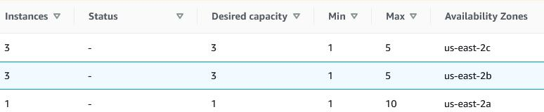
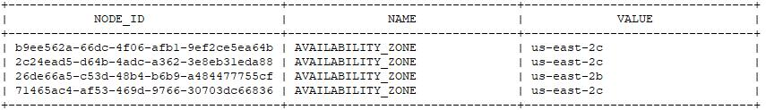

# Deploying GridGain in Multiple Availability Zones Using AWS

To deploy GridGain in multiple availability zones, perform the steps below:

1. Create an EKS cluster with [auto scaling groups](https://docs.aws.amazon.com/autoscaling/ec2/userguide/AutoScalingGroup.html) in different availability zones;
2. Deploy the [Cluster AutoScaler](https://docs.aws.amazon.com/eks/latest/userguide/cluster-autoscaler.html) to work with given autoscaling groups when scheduling nodes;
3. Define an [affinity backup filter](../../../gridgain8-usage/configuring-caches/managing-data-distribution.md#backup-filter) to place backup entries onto availability zones that differ from the primary entries.

## Creating EKS Cluster and Deploying Cluster AutoScaler

To create an EKS cluster and to deploy [Cluster AutoScaler](https://docs.aws.amazon.com/eks/latest/userguide/cluster-autoscaler.html), perform the steps below:

1. Follow the [EKS Cluster availability workshop](https://www.eksworkshop.com/beginner/080_scaling/deploy_ca/) to create an EKS cluster, then [deploy the cluster autoscaler](https://docs.aws.amazon.com/eks/latest/userguide/cluster-autoscaler.html);
2. Configure the autoscaler to use the autoscaling groups that you need.

   ```shell
             command:
               - ./cluster-autoscaler
               - --v=4
               - --stderrthreshold=info
               - --cloud-provider=aws
               - --skip-nodes-with-local-storage=false
               - --expander=least-waste
               - --nodes=1:3:autoScale-group-in-availability-region-a
               - --nodes=1:3:autoScale-group-in-availability-region-b
   ```

   At this point, the autoscaler is directed to create new nodes by using only 2 auto scaling groups.
   An example of a manual auto scaling group config could be found [here](https://github.com/kubernetes/autoscaler/blob/master/cluster-autoscaler/cloudprovider/aws/examples/cluster-autoscaler-multi-asg.yaml).
3. Adjust your auto scaling groups to have the [appropriate capacity](https://docs.aws.amazon.com/autoscaling/ec2/userguide/asg-capacity-limits.html).

## Configuring Backup Filters


Define an [affinity backup filter](../../../gridgain8-usage/configuring-caches/managing-data-distribution.md#backup-filter) to make sure that backup entries are stored in an availability zone that is different from that of your primary entry.


The following sections describe in detail how to set up a back up filter:

### Defining LifeCycle Bean

The Lifecycle bean, which runs before the node is started, issues a REST request for the availability zone of the VM hosting the pod and stores the zone as a user attribute.

Refer to this [section](https://docs.aws.amazon.com/AWSEC2/latest/UserGuide/instancedata-data-retrieval.html) for more information.

```java
public class AvailabilityZoneLifecycleBean implements LifecycleBean {

    @IgniteInstanceResource
    Ignite ignite;

    @LoggerResource
    IgniteLogger log;

    @Override
    public void onLifecycleEvent(LifecycleEventType evt) {
        if (evt == LifecycleEventType.BEFORE_NODE_START) {
            try {
                InputStream response = new URL("http://169.254.169.254/latest/meta-data/placement/availability-zone").openConnection().getInputStream();
                Map<String, String> user_attributes = new HashMap<>();
                String availablity_zone = null;
                try (Scanner scanner = new Scanner(response)) {
                    availablity_zone = scanner.useDelimiter("\\A").next();
                }
                user_attributes.put("AVAILABILITY_ZONE", availablity_zone);
                ignite.configuration().setUserAttributes(user_attributes);
            } catch (IOException e) {
                log.error("error setting AVAILABLITY_ZONE", e);
            }
        }
    }
}
```

### Changing Configuration and Tuning the Backup Filters

This section describes how to change the config to call the lifecycle bean and configure the backup filters to use the availability zone attribute.

For more information, see the [Class ClusterNodeAttributeAffinityBackupFilter](https://www.gridgain.com/sdk/ee/latest/javadoc/org/apache/ignite/cache/affinity/rendezvous/ClusterNodeAttributeAffinityBackupFilter.html) section.
Note the uses of [cache templates](../../../gridgain8-usage/configuring-caches/configuration-overview.md#cache-templates) in the example below:

```xml
<bean id="ignite.cfg" class="org.apache.ignite.configuration.IgniteConfiguration">

      <property name="lifecycleBeans">
         <list>
            <bean class="AvailabilityZoneLifecycleBean"/>
         </list>
      </property>

       <property name="cacheConfiguration">
       <list>
           <bean id="cache-template-bean" abstract="true" class="org.apache.ignite.configuration.CacheConfiguration">
               <property name="name" value="backupFilterTemplate*"/>

               <property name="affinity">
                   <bean class="org.apache.ignite.cache.affinity.rendezvous.RendezvousAffinityFunction">
                       <property name="affinityBackupFilter">
                           <bean class="org.apache.ignite.cache.affinity.rendezvous.ClusterNodeAttributeAffinityBackupFilter">
                               <constructor-arg>
                                   <array value-type="java.lang.String">
                                       <!-- Backups must go to different AZs -->
                                       <value>AVAILABILITY_ZONE</value>
                                   </array>
                               </constructor-arg>
                           </bean>
                       </property>
                   </bean>
               </property>
           </bean>
       </list>
   </property>
```

### Creating a Custom Image Containing the Lifecycle Bean

```shell
    FROM gridgain/enterprise
    COPY mylib.jar /opt/gridgain/libs
    docker build .
```

### Deploying Using GridGain Operator

1. Update the [cluster configuration](../operator/operator-configuration.md#cluster-configuration) to include the config mentioned above;
2. Change the `cluster_image` to the [custom one](../operator/operator-configuration.md#cluster_image);
3. [Deploy the operator](../operator/quick-start.md) using the custom credentials that are configured in steps 1 and 2.

### Deploying GridGain without the Operator

1. Deploy GridGain per the [AWS K8 deployment guide](../kubernetes/amazon-eks-deployment.md), using the custom image and config mentioned above.
2. [Scale the cluster](../kubernetes/generic-configuration.md#scaling-the-cluster): You should be able to see that the nodes are allocated only in the availability zones you specified.

As shown in the example below, all gridgain nodes are deployed either to 2b or 2c, but not to 2a:



## Verifying the Assigned Availability Zones (Optional)

1. Log into one of the pods:

   ```shell
   kubectl exec -it gridgain-readiness-cluster-0 -n gridgain -- /bin/bash
   ```
2. Launch sql line:

   
   
   ```shell
   cd /opt/gridgain/bin
   ./sqlline.sh --verbose=true -u jdbc:ignite:thin://127.0.0.1/
   ```
   

   
   ```shell
   cd /opt/gridgain/bin
   ./sqlline.bat --verbose=true -u jdbc:ignite:thin://127.0.0.1/
   ```
   
   
3. Get the AVAILABLITY_ZONE attribute values

   ```sql
   SELECT * FROM IGNITE.NODE_ATTRIBUTES where NAME like 'AVAILABILITY_ZONE';
   ```

   

<sub>_This page is: Copyright © 2026 MariaDB. All rights reserved._</sub>
