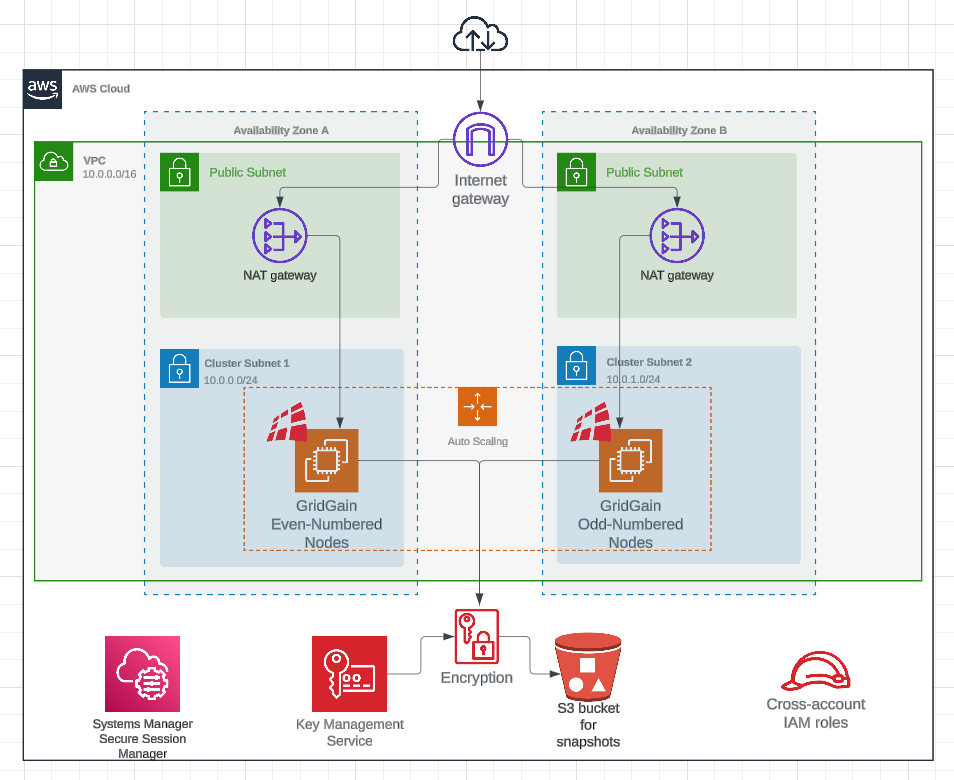

# Using Terraform to Deploy GridGain in AWS

You can provision GridGain cluster using Terraform.

## Overview

To help you launch GridGain in AWS we provide:

- [GridGain 8 image on AWS Marketplace](https://aws.amazon.com/marketplace/pp/prodview-irktgogccfkhs)
- [Terraform module on Terraform Registry](https://registry.terraform.io/modules/gridgain/gridgain/aws/latest)

## Usage Example

Terraform module is designed to create sufficient infrastructure to run GridGain cluster using the AMI. It will provision VPC and networking, S3 and KMS for encrypted snapshots and cluster nodes themselves as EC2 instances. You can check deployment diagrams below or examples in [Terraform module repository](https://github.com/gridgain/terraform-aws-gridgain/tree/main/examples).

The following steps describe how you can use Terraform module to deploy a private GridGain cluster:

- Make sure you have [Terraform](https://www.terraform.io/) installed and [configured to use your AWS credentials](https://registry.terraform.io/providers/hashicorp/aws/latest/docs#authentication-and-configuration);
- Get the [GridGain AMI ID](gridgain-marketplace-ami.md#selecting-and-obtaining-gridgain-ami);
- Clone [Terraform module repository from GitHub](https://github.com/gridgain/terraform-aws-gridgain/);
- Open the `examples/without_ssl` subfolder;
- Set AMI ID and your SSH public key (for accessing the instance) in the `main.tf` file;
- Run the `terraform init` command. It will download the AWS provider and prepare your environment;
- Run the `terraform apply` command. It will present you the plan of changes. Upon your approval, Terraform will create infrastructure in AWS;

When you no longer need the cluster, run the `terraform destroy` command.

You can see the complete list of variables available for the module on [Terraform Registry](https://registry.terraform.io/modules/gridgain/gridgain/aws/latest) page.

### Private Cluster Deployment Diagram

Below is the example of the deployment that will be created if the `public_access_enable` variable is set to `false`:

### Public Cluster Deployment Diagram

Below is the example of the deployment that will be created if the `public_access_enable` variable is set to `true`:

_This page is: Copyright © 2026 MariaDB. All rights reserved._
