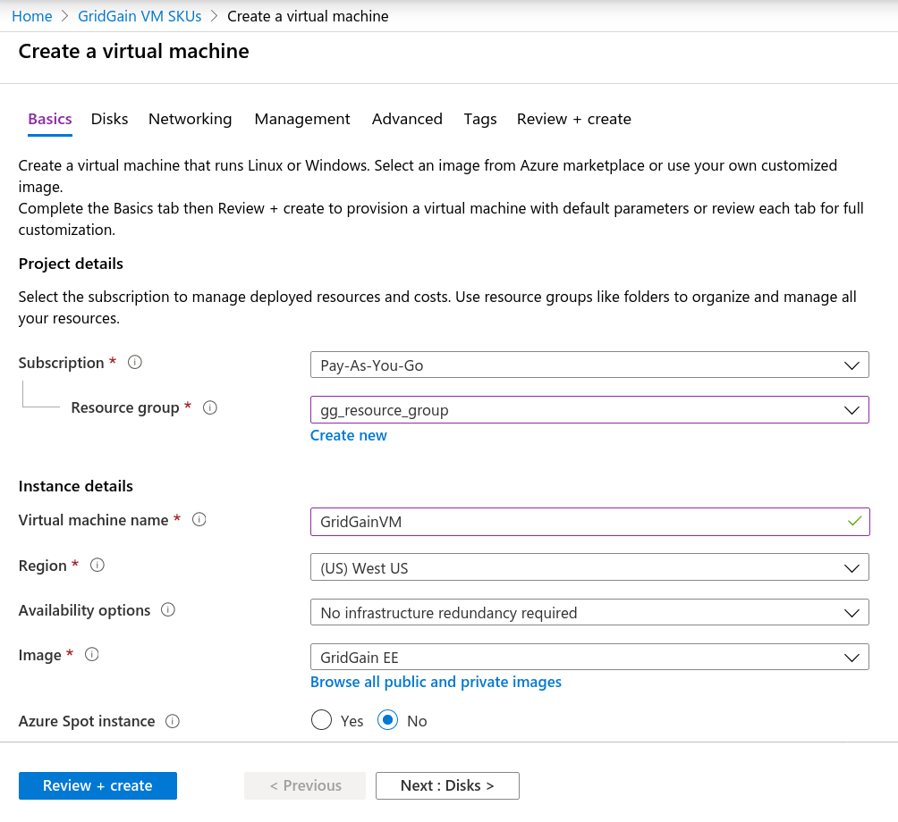
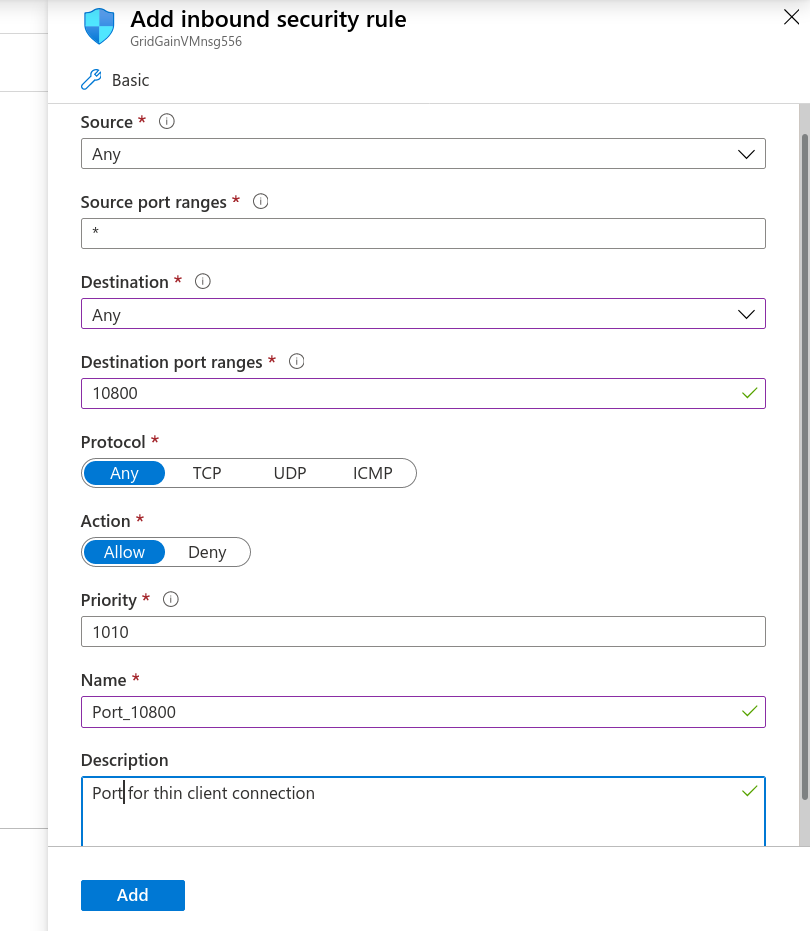
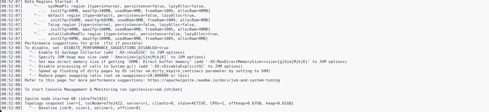
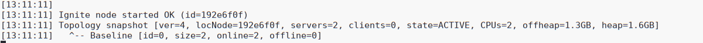
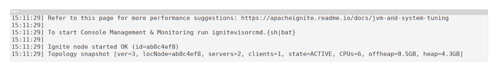

# Microsoft Azure Deployment

This page explains how to launch a GridGain cluster on Microsoft Azure.
GridGain provides Azure images with GridGain Enterprise Edition preinstalled.
You can use the image to launch a GridGain cluster without buying the Enterprise license and only pay for the usage of Azure resources.

## Considerations

- When creating Azure virtual machine, select appropriate VM size for your use case. Consider the amount of RAM/disk space you will need to store all your data.
- If you want to connect your applications to the cluster running on Azure, you will need to open specific ports. Therefore, we strongly recommend you secure your cluster by authorization/authentication. Refer to the [Security](../../../security/README.md) section for details.

## Creating Virtual Machine

1. Go to Azure Marketplace and search for "GridGain In-Memory Computing Platform". After the GridGain offering page is opened, click the **Create** button. This will launch the **Create a virtual machine** configuration wizard:

   
2. On the **Basics** tab, fill in the required fields and make sure:

   - The **Image** field is set to "GridGain EE".
   - The **Size** of the VM matches your use case.

### Configuring Ports

If you want to connect to the cluster from outside of Azure, you need to open specific ports:

- 10800 — thin clients/JDBC/ODBC connection
- 8080 — REST API
- 47100-47200 — Communication ports. Open the communication ports only if you want to connect client nodes to your cluster from outside of Azure.
- 47500-47600 — Discovery ports. Open the discovery ports only if you want to connect client nodes to your cluster from outside of Azure.
- 11211 - For [control.sh](../../../reference/cli-tool/README.md) calls. This port should be opened only for cluster member nodes, from which a user might need to call control.sh.

You can open/close ports later, after the VM is started, by changing the [network security group](https://docs.microsoft.com/en-us/azure/virtual-network/security-overview) associated with the VM.

To open a port, you need to create an inbound rule. Here is how you can do it:

1. Go to the **Networking** tab.
2. Set **NIC network security group** to **advanced**.
3. In the **Configure network security group** option, click **Create new**.
4. In the right-hand panel that appears, click **+ Add an inbound rule**.
5. Fill in the fields as shown the following image. Here we are opening port 10800.

   

   You may want to configure a more secure rule by specifying the **Source** field and other settings.
6. Create inbound rules for other ports you want to open.

### Starting VM

Go to the **Review + create** tab and click **Create**.
After the VM is created, go to its overview page and note the **Public IP address**.

Log in to the VM using credentials provided on the **Basics** tab.

```shell
ssh -i mykey myUserName@40.85.155.154
```

## Launching a GridGain Node

The GridGain Enterprise installation is in the folder `/opt/gridgain/gridgain-enterprise-8.10`
You can start a GridGain node as follows:

1. Go to `/opt/gridgain/gridgain-enterprise-8.10/bin`.
2. Start the node by running `./ignite.sh`. After that, you should see that the GridGain node is up and running.

   

We've successfully started a single GridGain node with the default configuration.
However, in general case you would want to start multiple nodes in individual VMs and connect them into a single cluster.
To do that, you will need change default discovery configuration, which is explained in the following sections.

## Changing Default Properties

If you want to use custom configuration parameters, such as enable [persistence](../../../architecture/storage/native-persistence.md) or change [memory settings](../../../gridgain8-usage/memory-configuration/data-regions.md)
To change the default configuration parameters, you can either:

- modify `/opt/gridgain/gridgain-enterprise-8.10/config/default-config.xml` , or
- create your own file and pass it as a parameter to the start-up script:

  ```shell
  ./ignite.sh your-config-file.xml
  ```

When starting a node with a custom configuration file, add the following property to the `IgniteConfiguration` bean:

```xml
<bean class="org.apache.ignite.configuration.IgniteConfiguration">
    <property name="userAttributes">
        <map>
            <entry key="iaas.vendor" value="azure"/>
        </map>
    </property>
</bean>
```

This attribute is required for proper licensing.

## Configuring Discovery

If you start multiple virtual machines each running a GridGain node, you need to configure the discovery mechanism, so that the nodes can find each other.
The proper way to do it is by configuring a static IP finder with the private IP addresses of all VMs.

The private IP address of a VM can be found on its Configuration Overview page.

Add IP addresses of all VMs to a single configuration file and use this file to start nodes in every VM.

```xml
<beans xmlns="http://www.springframework.org/schema/beans"
    xmlns:util="http://www.springframework.org/schema/util"
    xmlns:xsi="http://www.w3.org/2001/XMLSchema-instance"
    xsi:schemaLocation="         http://www.springframework.org/schema/beans
    http://www.springframework.org/schema/beans/spring-beans.xsd
    http://www.springframework.org/schema/util
    http://www.springframework.org/schema/util/spring-util.xsd">
    <bean class="org.apache.ignite.configuration.IgniteConfiguration">
        <property name="userAttributes">
            <map>
                <entry key="iaas.vendor" value="azure"/>
            </map>
        </property>

        <!-- other properties -->

        <property name="addressResolver">
            <bean class="org.apache.ignite.configuration.BasicAddressResolver">
                <constructor-arg>
                    <map>
                        <entry key="10.0.4.5" value="3.93.186.198"/>
                    </map>
                </constructor-arg>
            </bean>
        </property>

        <!-- Discovery configuration -->
        <property name="discoverySpi">
            <bean class="org.apache.ignite.spi.discovery.tcp.TcpDiscoverySpi">
                <property name="ipFinder">
                    <bean class="org.apache.ignite.spi.discovery.tcp.ipfinder.vm.TcpDiscoveryVmIpFinder">
                        <property name="addresses">
                            <list>
                                <value>10.0.4.5</value>
                                <value>10.0.4.6</value>
                            </list>
                        </property>
                    </bean>
                </property>
            </bean>
        </property>
    </bean>
</beans>
```

When two nodes are started with the above configuration, you should see the following messages in the output:



`server=2` indicates that the nodes were able to connect to each other and form a cluster.

## Connecting to the Cluster

You can connect to the cluster using various methods, including [thin clients](#connecting-with-thin-clients), [REST API](../../../reference/rest-api/README.md), [JDBC]({connectors}/sql/jdbc/jdbc-driver)/[ODBC]({connectors}/sql/odbc/odbc-driver).
For each method, you need to open a specific port on the virtual machine.
For example, for the REST API the port is 8080, for JDBC and thin clients it's 10800, etc.

When connecting to the cluster from the same network in Azure, you can simply use the private IP addresses of the VMs.
For example, if you start a client node in Azure (in the same network the server nodes are using), simply configure the discovery mechanism the same way as for the server nodes.

If you want to connect an application running outside Azure, you'll need to use _public IP addresses_ and open the required ports.

### Connecting a Client Node

A client node is a full-featured node in that it supports all APIs available to a server node, but it does not host cache data.
Just like a regular server node, the client node uses the discovery and communication mechanisms to join the cluster.
If you want to run client nodes in AWS, then use the same discovery configuration as for the server nodes.
If you want to connect a client node from your local machine (or any on-premise server), make sure that the discovery and communication ports are opened on the machine and that you can connect to them from the Azure VMs.
Check both the security group of the Azure VM and the firewall configuration on your local machine.


Once again, if you want to connect a client node from your local machine to server nodes running in Azure, make sure that you can _connect to your local machine from the on the discovery and communication ports_.
In most cases this requires that your local machine have a public IP address.
The security group of the VM must allow connection to external IP addresses.


For a client node to join the cluster from your local machine, perform the following steps:

1. Add an address resolver to the configuration of all nodes running in Azure.

   Because Azure VMs are running behind a NAT, you have to map the private IP address of each VM to its public IP address in the node configuration.
   To do this, add an address resolver to `IgniteConfiguration`, as shown in the code snippet below:

   ```xml
   <bean class="org.apache.ignite.configuration.IgniteConfiguration">
       <property name="userAttributes">
           <map>
               <entry key="iaas.vendor" value="azure"/>
           </map>
       </property>

       <!-- other properties -->

       <property name="addressResolver">
           <bean class="org.apache.ignite.configuration.BasicAddressResolver">
               <constructor-arg>
                   <map>
                       <entry key="10.0.4.5" value="3.93.186.198"/>
                   </map>
               </constructor-arg>
           </bean>
       </property>

       <!-- Discovery configuration -->
       <property name="discoverySpi">
           <bean class="org.apache.ignite.spi.discovery.tcp.TcpDiscoverySpi">
               <property name="ipFinder">
                   <bean class="org.apache.ignite.spi.discovery.tcp.ipfinder.vm.TcpDiscoveryVmIpFinder">
                       <property name="addresses">
                           <list>
                               <value>10.0.4.5</value>
                               <value>10.0.4.6</value>
                           </list>
                       </property>
                   </bean>
               </property>
           </bean>
       </property>
   </bean>
       <!-- Discovery configuration -->
       <property name="discoverySpi">
           <bean class="org.apache.ignite.spi.discovery.tcp.TcpDiscoverySpi">
               <property name="ipFinder">
                   <bean class="org.apache.ignite.spi.discovery.tcp.ipfinder.vm.TcpDiscoveryVmIpFinder">
                       <property name="addresses">
                           <list>
                               <value>10.0.4.5</value>
                               <value>10.0.4.6</value>
                           </list>
                       </property>
                   </bean>
               </property>
           </bean>
       </property>
   ```

   In this example, `10.0.4.5` is the private IP address of the VM, and `3.93.186.198` is its public IP address.
2. The discovery configuration of the client node must contain the IP address of at least one remote node. If the network configuration settings are correct, the node will be able to connect to all remote nodes.

   Your local node configuration might look as follows:

   ```xml
   <bean class="org.apache.ignite.configuration.IgniteConfiguration" id="ignite.cfg">
       <property name="clientMode" value="true"/>

       <!-- Discovery configuration -->
       <property name="discoverySpi">
           <bean class="org.apache.ignite.spi.discovery.tcp.TcpDiscoverySpi">
               <property name="ipFinder">
                   <bean class="org.apache.ignite.spi.discovery.tcp.ipfinder.vm.TcpDiscoveryVmIpFinder">
                       <property name="addresses">
                           <list>
                               <value>3.93.186.198</value>
                           </list>
                       </property>
                   </bean>
               </property>
           </bean>
       </property>
   </bean>
   ```

   If your local machine is also behind a NAT, add an address resolver to its configuration.
3. Start the server nodes first (the nodes running in AWS), and then start your local node. You should see the following message in the console on your local machine.

   

   `client=1` indicates that the client node connected successfully.

### Connecting with Thin Clients

Let's create a simple application that connects to our cluster with a [java thin client]({connectors}/thin-clients/java-thin-client).
You can use other [supported thin clients]({connectors}/thin-clients/getting-started-with-thin-clients).

The default port for client connection is 10800.
You need to tell the thin client the public address of one of your virtual machine and this port.
Make sure to add the 'ignite-core' dependency to your application.

```java
ClientConfiguration cfg = new ClientConfiguration().setAddresses("54.175.137.126:10800");
IgniteClient client = Ignition.startClient(cfg);

ClientCache<Integer, String> cache = client.getOrCreateCache("test_cache");

cache.put(1, "first test value");

System.out.println(cache.get(1));

client.close();
```

This simple piece of code creates a cache in the cluster and puts one key-value pair into it.

### Connecting via REST API

REST API is provided by the 'ignite-rest-http' module. You can enable it by copying module's directory to the `libs` directory in the installation folder:

```shell
cp -r /opt/gridgain/gridgain-enterprise-8.10/libs/optional/ignite-rest-http/ /opt/gridgain/gridgain-enterprise-8.10/libs/
```

If you enabled the 'ignite-rest-http' module and opened port 8080, you can send requests to the node as follows:

```shell
$ curl http://<VM_public_IP>:8080/ignite?cmd=version
{"successStatus":0,"error":null,"sessionToken":null,"response":"8.10"}
```

<sub>_This page is: Copyright © 2026 MariaDB. All rights reserved._</sub>
