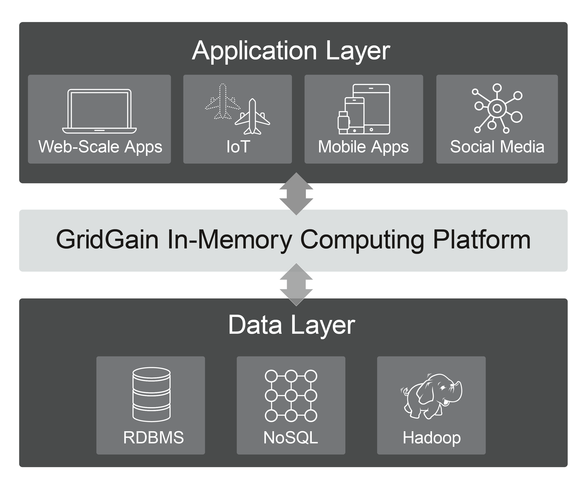
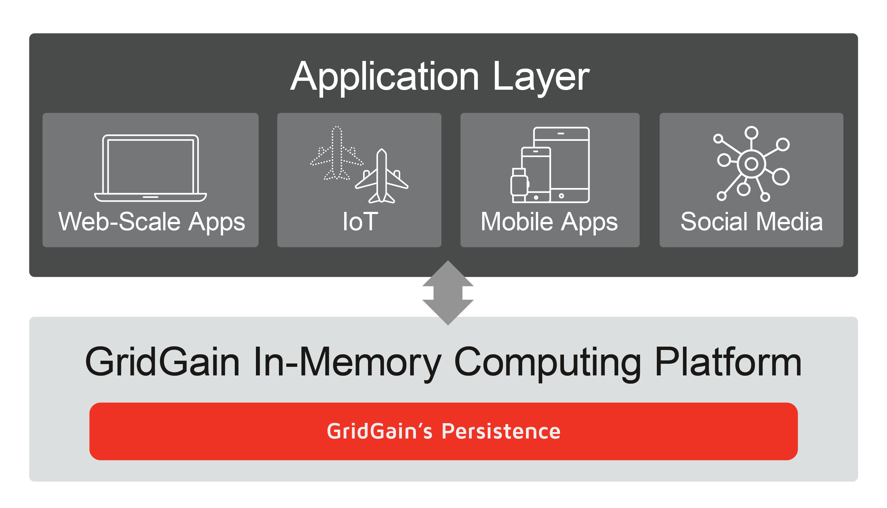

# Deployment Modes

GridGain clusters and applications can be deployed in just about any environment, whether it's [bare-metal](README.md), [cloud](aws/README.md),
[Docker](installing-using-docker.md), or [Kubernetes](kubernetes/README.md). GridGain cluster nodes are simply operating system processes that are interconnected over the
network to form a single cluster with shared resources such as RAM and CPU. Thus, starting a GridGain cluster is
simply a matter of nodes spawning, automatically discovering each other, and forming a shared cluster or storage database.

In this article we discuss primary deployment modes of GridGain _clusters_: an in-memory data grid (IMDG) and a system of record (aka in-memory database with native persistence). Also, we'll review two types of deployments related to applications: classical client-server mode and embedded.

However, before discussing the deployment modes let's review basic concepts such as servers and thick and thin clients.
Skip these sections if you are familiar with them.

## Servers and Clients



## Thick vs Thin Clients



### Choosing a Client

As a rule of thumb, follow this logic if you are in doubt over which client to use:

- Java, .NET, and C++ developers - use thin clients for most APIs including key-value, SQL, continuous queries, transactions, and compute tasks. Use thick clients for more sophisticated compute grid APIs, machine learning capabilities, etc.
- JDBC thin vs JDBC thick - use the thin version by default. Fallback to the thick client only if you need faster performance and enabling partition-awareness for the thin driver hasn't improved performance enough for your use case.
- Python, Node.JS, PHP, and other programming languages developers - you don't have any alternatives so your choice is simple: use the existing [thin clients]({connectors}/thin-clients/getting-started-with-thin-clients).

### Thin Client Proxy and Partition Awareness



## Cluster Deployment Modes

GridGain's unique multi-tiered storage architecture provides two primary modes for deployment. The first mode is as an
in-memory data grid (IMDG) where GridGain is positioned between your application layer and an external database. This
enables in-memory computing for existing solutions in the most straightforward way. The second deployment mode
represents GridGain as a classical system of record/hybrid database where GridGain caches data in RAM and stores the records in a native transactional persistence in non-volatile memory or disk.

### In-Memory Data Grid

When GridGain is used as a caching layer on top of an [external storage](../../gridgain8-usage/persistence/external-storage.md), such as a relational database,
you are dealing with the in-memory data grid (IMDG) use case. In this case, the whole data set is stored in the
external database and what fits in memory is loaded there to boost application performance.

As you can see in the figure above, your applications can start treating a GridGain cluster as a primary storage, using
the cluster to keep an underlying database in sync. That's the easiest and least disruptive way to enable in-memory
computing for existing solutions - position GridGain between your application and database layers, load data into RAM,
and boost performance.

GridGain as an IMDG is different from a simple in-memory cache use case because it allows you to:

- Migrate your applications faster by accessing your data sets with both standard key-value and SQL APIs.
- Gain more performance advantages with colocated processing by running any Java-, .NET-, or C++-based logic on the
cluster end, avoiding data-movement over the network.
- Enforce strong consistency whenever is needed - use distributed ACID transactions for your operations and instruct
GridGain to keep the underlying storage 100% in sync and consistent.

### System of Record

When you use GridGain [native persistence](../../architecture/storage/native-persistence.md) instead of an external storage, then you are enabling the in-memory database
(IMDB) or system of record use case.

In this use case, all of the data is stored on disk and as much as will fit is loaded into RAM. This allows for a much
larger data set as data that does not fit in memory is still available. For example, if your data set is large
enough that only 10% of it can fit in memory, 100% of the data will be stored on disk and 10% is cached in memory
for performance. This configuration, where the data set is stored in bulk on disk, is called GridGain persistence (or
native persistence).

This use case provides the following benefits:

- Multi-tiered storage across RAM and disk: 100% of data is persisted to disk ("warm" and "cold" data sets) while
"hot" data always stays in RAM. You lay out the data the way you need. Applications just run queries and GridGain
internally goes either to RAM or disk, transparently. This property is crucial for real-time analytics and data
warehousing offloading.
- Instantaneous restarts and advanced high-availability: in the case of full cluster restarts, the cluster becomes
fully operational as soon as the nodes are interconnected. No need to preload anything from disk to RAM (based on
the advantage above).

### Heterogeneous

In some cases you might have a mixed deployment configuration when GridGain, for instance, caches RDBMs tables
with read-only access while the tables are updated via the RDBMs directly and all of the changes should be propagated
to the cluster. Or, you might have a GridGain cluster that has a subset of the tables that are persisted in an
external database (IMDG mode) while the others are persisted to the native persistence.

Usually heterogeneous deployment modes are used for projects when it's hard to migrate to a clean IMDG
or system of record mode and a transitioning or custom architecture is developed.

## Application Deployment Modes

When deploying applications that will be interacting with the GridGain cluster, you can
continue using a classical client-server mode that separates the lifecycles of applications and databases or you can
consider the embedded mode, which is useful for ultra low-latency use cases.

### Client-Server Deployment

Client-Server deployment is the classical and most widely used deployment mode, regardless of your deployment environment
(bare-metal, VMs, Kubernetes, etc.). This mode separates the lifecycles of your applications and the GridGain cluster. The
applications are deployed, developed, updated, and redeployed independently of the cluster of server nodes. The
cluster is deployed once and used as a database/storage and computational platform that is restarted only in the case of rare
maintenance events.

Overall, the primary benefits of this standard deployment mode are:

- Separate applications and cluster maintenance lifecycles - as with relational-databases, it lets application developers
  focus on development and delivery of business logic with different deployment and maintenance rules for the
  GridGain cluster.
- Ease of scalability - as long as the cluster is deployed and maintained independently of the applications, it's
easy to scale it out to 10s, 100s, or 1000s of server nodes based on your workloads. The applications connected to
the cluster are not impacted while the latter is being scaled.
- You still can execute custom logic on the cluster end, avoiding data movement over the network by using the
compute grid and machine learning APIs.

### Embedded Deployment

GridGain clients are always embedded into your application code and run as part of the application process. At the
same time it's possible to embed server nodes into the application process. There are two reasons why you would
consider this deployment option.

First, this mode can be used for testing. For instance, you can start a Unit test that will launch several
server nodes and carry on with testing scenarios by using this local in-process cluster. The Apache Ignite community
and GridGain benefit from this deployment mode for functional testing.

Second, the embedded mode is ideal for ultra low-latency use cases like high-performance mission critical
applications or electronic trading. The latency has to stay within the 20-100 _microseconds_ range and any operation that
involves network communication can easily go beyond the range. Server nodes embedded into your application instances
should store a full copy of the data to ensure all of the application calls are local and not directed to other servers over the network.

So, the pros of the embedded mode are that you can easily achieve microseconds SLAs by avoiding network communication
between the applications and the cluster as much as possible. There are, however, some cons to this mode for ultra-low latency
scenarios:

- Limited scalability - as long as each server node needs to store a full copy of the data, it's impossible to scale
the cluster beyond the capacity of a single application instance.
- Performance implications for write/update operations - even though this mode can keep reads down in the 20-100
microseconds range, the writes/updates still have to be propagated to all of the servers storing the same data replica.
- Application lifecycle impacts storage lifecycle - any update or restart of the application instances will cause a
restart of embedded server nodes (your storage).


If there is no need to cache the entire data set on the application end, then consider [near-caches](../../gridgain8-usage/near-caches.md),
which let you keep frequently accessed records on the application end.


_This page is: Copyright © 2026 MariaDB. All rights reserved._
