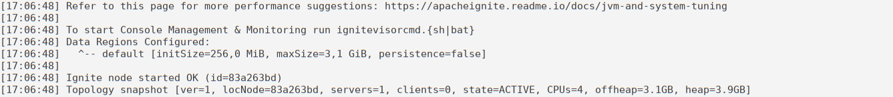

# Installation on z/OS

This section explains system requirements for running GridGain, how to install GridGain, and how to start a GridGain node on z/OS.

## Prerequisites

- Java 8+, tested with IBM J9 VM.

## Installation

1. Log in to your z/OS environment and create an installation directory:

   ```shell
   mkdir <PATH_INSTALLATION_DIRECTORY>
   ```
2. Download the GridGain Enterprise z/OS Edition as a zip archive. Either save it directly to the installation directory, or move it there afterwards. Ask your account manager or contact our sales for the download link.
3. Run the following command in the installation directory to extract your zip archive:

   ```
   jar -xvf gridgain-zos-enterprise-X.X.X.zip
   ```
4. Set the IGNITE_HOME environment variable to point to the installation directory:

   ```
   export IGNITE_HOME=<PATH_INSTALLATION_DIRECTORY>/gridgain-zos-enterprise-X.X.X
   ```

   You can check if the variable is set with the following command:

   ```
   echo $IGNITE_HOME
   ```
5. To enable the HTTPS connection between Control Center Agent and Control Center, set the following JVM option to `true`:

   ```shell
   JVM_OPTS=-Dcom.ibm.jsse2.overrideDefaultTLS=true
   ```
6. (Optional) After extracting the zip archive files, the script files may not have execution or write permissions, which may happen when copying an archive from a remote host. To grant permissions, use the command below:

   ```shell
   chmod -R 0755 $IGNITE_HOME/
   ```
7. (Optional) Move the `ignite-rest-http` directory from `{gridgain}/libs/optional` to `{gridgain}/libs` to enable the Ignite REST library for the cluster. The library is used by GridGain Control Center for cluster management and monitoring needs. To move the directory, use the command below:

   ```shell
   cp -R $IGNITE_HOME/libs/optional/ignite-rest-http $IGNITE_HOME/libs/ignite-rest-http
   ```
8. (Optional) Enable any of the [modules](../../gridgain8-usage/setup.md#enabling-modules) you might want to use.
9. Enable the z/OS Enhanced ASCII support that allows tools to recognize the `chtag` commands by specifying `_BPXK_AUTOCVT=ON`. For more details, click [here](https://www.ibm.com/docs/en/zos/2.4.0?topic=ascii-setting-up-enhanced).
10. (Optional) You can upload your own license file using the [instructions](../licensing.md) or the following command:

    ```shell
    cp <YOUR_LICENSE_FILE> $IGNITE_HOME/gridgain-license.xml
    ```

## Configuring GridGain

- Please refer to [configuration pages](../../gridgain8-usage/understanding-configuration.md) to configure your GridGain nodes. The configuration file provided with GridGain distribution will start an in-memory node with large data region, which should form a single-node cluster after start-up. You may need to tune the size of [default data region](../../gridgain8-usage/memory-configuration/data-regions.md#configuring-default-data-region) to adjust resource usage.
- Most text files are provided in native `EBCDIC 1047` code page. However, some files are required to be in `ASCII`-derived encoding, notably, configuration XML files. If you need to view or edit any of those, consider tagging them using `chtag` command, using the following command as reference:

  ```shell
  chtag -t -R -c ISO8859-1 path/to/file.xml
  ```

  You can also read such files with the `iconv -cf IBM-1047 -t ISO8859-1 path/to/file.xml` command.

## Running GridGain

- Set the `MEMLIMIT` parameter. The parameter defines the limit on memory for a single process. Set it to a value that is larger than the RAM memory required for your GridGain nodes, including Heap and Off-Heap [data regions](../../gridgain8-usage/memory-configuration/data-regions.md).
- We recommend to always specify `-Dfile.encoding=UTF-8` JVM argument. You do not need to specify it if you start GridGain by running `ignite.sh`. However, if you start nodes from custom code, add it to the startup parameters of your application.
- If you are going to use the [native persistence](../../architecture/storage/native-persistence.md) feature, set the `IGNITE_WAL_MMAP` system property (or environment variable) to `false`, for example, by adding `-DIGNITE_WAL_MMAP=false` JVM argument. You do not need to specify it if you start GridGain by running `ignite.sh`.
- Configure [static discovery](../../gridgain8-usage/clustering/tcp-ip-discovery.md#static-ip-finder) instead of the default multicast option. Specify the `TcpDiscoverySpi.localAddress` property and the `IgniteConfiguration.localHost` property with the preferred IP address for the current host. You do not need to specify it if you start GridGain by using provided `config/default-config.xml`.
- If you are going to use [log4j](../../gridgain8-usage/logging.md#using-log4j) for logging, you will need to specify charset/encoding of file appenders as `IBM-1047` in Log2J/Log4J2 configuration. Please use provided `config/ignite-log4j.xml` and `config/ignite-log4j2.xml` as reference.


The GridGain script should be run using Bash shell. Otherwise, the following exception is thrown:

```
checkJava: command not found
setIgniteHome: command not found
```


- To run GridGain normally, please execute the following bash command:

  ```bash
  bash $IGNITE_HOME/bin/ignite.sh -v $IGNITE_HOME/config/default-config.xml
  ```
- Note that running `ignite.sh` blocks the execution flow, so you can also start a node in the nohup mode by executing the command below:

  ```bash
  nohup bash $IGNITE_HOME/bin/ignite.sh -v $IGNITE_HOME/config/default-config.xml 1> log.txt 2>&1 &
  ```
- By default, the GridGain logs are located inside `$IGNITE_HOME/work/logs`. If you start the node with `nohup`, you can redirect `STDOUT` and `STDERR` to a file as it was done in the command above. If the node starts successfully, you will see the `Topology snapshot` message indicating that the cluster is created and it contains one server node:

  

  You can check your log file by using the following command:

  ```bash
  cat <LOG_FILE> |grep "Topology snapshot"
  ```
- To verify normal operation of the cluster, use the [SQLLine tools](http://sqlline.sourceforge.net/#manual):

  ```shell
  bash $IGNITE_HOME/bin/sqlline.sh --verbose=true -u jdbc:ignite:thin://127.0.0.1/
  ```

  ```shell
  CREATE TABLE Person (id LONG, name VARCHAR, city_id LONG, PRIMARY KEY (id, city_id))WITH "backups=1, affinityKey=city_id";
  ```

  ```shell
  INSERT INTO Person (id, name, city_id) VALUES (1, 'John', 1);
  ```

  ```shell
  SELECT * FROM Person;
  ```
- You can also check that your Java process was started successfully by using the following command:

  ```shell
  ps -ef |grep -i ignite |grep -iv grep
  ```

  The result should be similar to the example below:

  ```shell
  RWPAREC   50335493   83889905  - 15:22:38 ttyp0000  0:00 bash /GridGain/gridgain-zos-enterprise-8.8.5/bin/ignite.sh -v /GridGain/gridga...
  ```

## Performance recommendations

- For nodes with a persistent storage, increase the `dataStorage.checkpointThreads` value. The default value is `4`, but we recommend you set it to a value between `16` and `32` on z/OS nodes for best checkpointing speed.
- If your load profile includes intensive network usage, consider the following `TcpCommunicationSpi` parameters: `socketWriteTimeout=5000` (ms), `usePairedConnections=true`, pick the `connectionsPerNode` value from between `2` and `8`.
- Nodes may benefit from a larger [striped pool size](../../ha-and-performance/performance-tuning/thread-pools-tuning.md#striped-pool), increase it by setting `IgniteConfiguration.stripedPoolSize` to 32.

<sub>_This page is: Copyright © 2026 MariaDB. All rights reserved._</sub>
