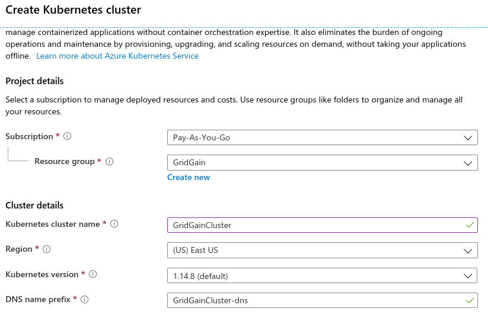
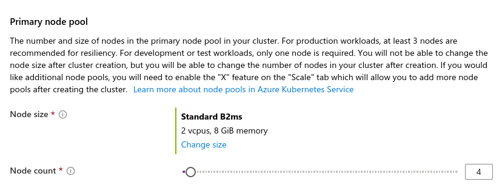

# Microsoft Azure Kubernetes Service Deployment

This page is a step-by-step guide on how to deploy a GridGain cluster on Microsoft Azure Kubernetes Service.


This guide covers the provider-specific steps. It builds on the shared [Generic Kubernetes Instruction](generic-configuration.md), which explains the concepts, prerequisites, and configuration common to all Kubernetes deployments.

## Creating the AKS Cluster

The first step is to configure the Azure Kubernetes Service (AKS) cluster by following one of the Microsoft guidelines:

- [Deploy an AKS cluster using the Azure portal](https://docs.microsoft.com/en-us/azure/aks/kubernetes-walkthrough-portal)
- [Deploy an AKS cluster using the Azure CLI](https://docs.microsoft.com/en-us/azure/aks/kubernetes-walkthrough)

In this guide, we'll be using the Azure portal.

1. Create a Microsoft account if you do not have one. Navigate to [portal.azure.com](https://portal.azure.com) and choose **Create a resource > Kubernetes Service > Create**.
2. On the screen that appears, specify general parameters for your deployment, cluster name as "GridGainCluster", and resource group name as "GridGain".

   
3. On the same screen, pick the required number of nodes for your AKS cluster:

   
4. Configure other parameters as required.
5. When finished with the configuration, click the **Review + create** button.
6. Double check the configuration parameters and click **Create**. Give Azure some time to deploy the cluster.
7. Go to **All Resources > GridGainCluster** to view the state of the cluster.

## Connecting to the AKS Cluster

To configure `kubectl` to connect to your Kubernetes cluster, use the following command:

```shell
az aks get-credentials --resource-group GridGain --name GridGainCluster
```

If you encounter any problems, check out the [official documentation](https://docs.microsoft.com/en-us/azure/aks/kubernetes-walkthrough#connect-to-the-cluster).

Using the following command, check that all the nodes are in "Ready" state:

```shell
$ kubectl get nodes

NAME                                STATUS   ROLES   AGE     VERSION
aks-agentpool-25545244-vmss000000   Ready    agent   6h23m   v1.14.8
aks-agentpool-25545244-vmss000001   Ready    agent   6h23m   v1.14.8
aks-agentpool-25545244-vmss000002   Ready    agent   6h23m   v1.14.8
```

Now you can start creating Kubernetes resources.

## Kubernetes Configuration

The namespace, service, cluster role, ConfigMap, and node configuration file are the same for every Kubernetes deployment. Follow the [Generic Kubernetes Instruction](generic-configuration.md#kubernetes-configuration) to create these resources.
<sub>_This page is: Copyright © 2026 MariaDB. All rights reserved._</sub>
