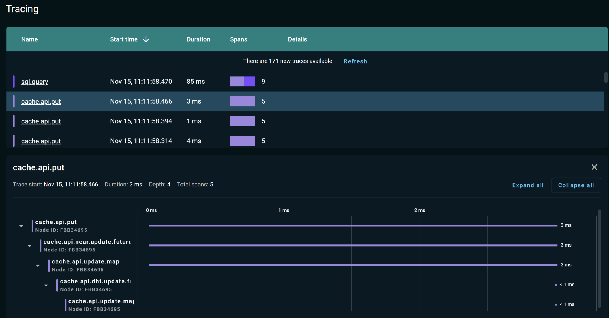

# Tracing

A number of APIs in GridGain are instrumented for tracing with OpenCensus.
You can collect distributed traces of various tasks executed in your cluster and use this information to diagnose latency problems.


We recommend that you get familiar with the [OpenCensus tracing documentation](https://opencensus.io/tracing/) before reading this chapter.


The following Ignite APIs are instrumented for tracing:

* Discovery
* Communication
* Exchange
* Transactions
* SQL

To view traces, export them into external system (see the [Control Center]({tools}/control-center) documentation).
You can use one of the OpenCensus exporters or write your own, but in any case, you need to write code that registers an exporter in Ignite.

## Configuring Tracing

Enable OpenCensus tracing in the node configuration. All nodes in the cluster must use the same tracing configuration. The module is enabled by default if you use the GridGain binary distribution. If you use Maven to start GridGain nodes, add the following property to your cluster configuration:



```xml
<bean class="org.apache.ignite.configuration.IgniteConfiguration">
    <property name="tracingSpi">
        <bean class="org.apache.ignite.spi.tracing.opencensus.OpenCensusTracingSpi"/>
    </property>
</bean>
```


```java
IgniteConfiguration cfg = new IgniteConfiguration();
cfg.setTracingSpi(new org.apache.ignite.spi.tracing.opencensus.OpenCensusTracingSpi());
Ignite ignite = Ignition.start(cfg);
```


unsupported


unsupported



## Enabling Trace Sampling

When you start your cluster with the above configuration, Ignite does not collect traces. You have to enable trace sampling for a specific API at runtime. You can turn trace sampling on and off at will, for example, only for the period when you are troubleshooting a problem.

You can do this in two ways:

* Via the control script from the command line
* Programmatically

Traces are collected at a given probabilistic sampling rate. The rate is specified as a value between 0.0 and 1.0 inclusive: `0` means no sampling, `1` means always sampling. When the sampling rate is set to a value greater than 0, Ignite collects traces.
To disable trace collection, set the sampling rate to 0.

The following sections describe the two ways of enabling trace sampling.

### Using Control Script

Go to the `{IGNITE_HOME}/bin` directory of your Ignite installation. Enable tracing for a specific API:



```shell
control.sh --tracing-configuration set --scope TX --sampling-rate 0.05
```


```shell
control.bat --tracing-configuration set --scope TX --sampling-rate 0.05
```



The `--scope` parameter specifies the API you want to trace.
The following APIs are instrumented for tracing:

* `DISCOVERY` — discovery events
* `EXCHANGE` —  exchange events
* `COMMUNICATION` — communication events
* `TX` — transactions
* `CACHE_API_WRITE` — write events
* `CACHE_API_READ` — read events
* `SQL` — SQL events

The `--sampling-rate` is the probabilistic sampling rate, a number between `0` and `1`:

* `0` — no sampling,
* `1` — always sampling.


High sampling rate may lead to cluster slowdowns, or issues with tracing software. It is recommended to keep the sampling rate low unless high rate is required.


See the [Control Script](../../reference/cli-tool/README.md) section for the list of all parameters.

### Programmatically

Once you start the node, you can enable trace sampling as follows:

```java
Ignite ignite = Ignition.start();

ignite.tracingConfiguration().set(
        new TracingConfigurationCoordinates.Builder(Scope.TX).build(),
        new TracingConfigurationParameters.Builder().withSamplingRate(1).build());
```

## Analyzing Trace Data

A trace is recorded information about the execution of a specific event. Each trace consists of a tree of _spans_. A span is an individual unit of work performed by the system to process the event.

Because of the distributed nature of Ignite, an operation usually involves multiple nodes.
Therefore, a trace can include spans from multiple nodes.
Each span always contains the information about the node where the corresponding operation was executed.



The trace contains spans associated with the following operations:

* acquire locks (`transactions.colocated.lock.map`),
* get (`transactions.near.enlist.read`),
* put (`transactions.near.enlist.write`),
* commit (`transactions.commit`), and
* close (`transactions.close`).

The commit operation, in turn, consists of two operations: prepare and finish. You can click on each span to view the annotations and tags attached to it.

<sub>_This page is: Copyright © 2026 MariaDB. All rights reserved._</sub>
