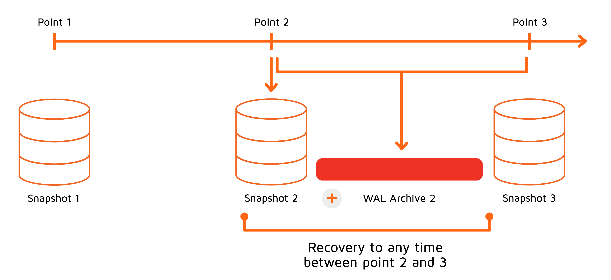

# Point-in-Time Recovery

Continuous Archiving for Point-in-Time Recovery (PITR) makes it easy to recover a cluster to any previous point in time. Basically, using PITR, you can roll back the data in the cluster to any state you want to.

When PITR is enabled, the cluster continually records all operations that modify the data to the write-ahead log (WAL). PITR consists of two stages: first, it restores a full snapshot and then applies all the operations from the WAL from the time the full snapshot was taken up to the required moment. This brings the cluster to the state it was in as of the specified moment.



In the figure above, three snapshots were created during cluster operation, and we want to restore the cluster to a specific moment between point 2 and point 3. In this case, GridGain takes an earlier full snapshot of data (snapshot 2) and then applies the operations from the WAL Archive 2, recreating the required state of the cluster for the given moment.

Because PITR replays the operations starting from the latest available snapshot, the longer the period between the snapshot and the point you want to restore the cluster to, the more operations need to be reapplied and the longer it will take to restore the cluster. Because of this, you should create snapshots on a regular basis. These snapshots will split the lifetime of the cluster into smaller periods, each snapshot serving as a starting point for a recovery process for any time in the subsequent period.

## Write-ahead Log and Continuous Archiving

The [WAL](../../architecture/storage/native-persistence.md#wal-archive) keeps track of all operations that were performed on the data. Log files contain operations for a fixed period of time. However, if PITR is enabled, GridGain keeps all WAL files permanently, archiving them in a directory specified in `DataStorageConfiguration`. This process is known as `continuous archiving`. For more information about WAL files and performance, see [Keep WALs Separate](../../ha-and-performance/performance-tuning/persistence-tuning.md#keep-wals-separately).

If continuous archiving causes the WAL archive to grow beyond the `maxWalArchiveSize` and `minWalArchiveSize` values (see [persistence configuration properties](../../architecture/storage/native-persistence.md#configuration-properties)), self-cleanup of the archive might prevent you from returning to the exact point in time you need. To work around this limitation, you can do one (or both) of the following:

* Configure the `maxWalArchiveSize` and `minWalArchiveSize` values based on WAL statistics in your specific environment. The goal of this empiric configuration is to balance the recovery capability (i.e., PITR) and the disk size limitations of your WAL archive.
* Configure your [snapshot](snapshots-and-recovery.md) mechanism to save snapshots to an "external" location (with no memory limitations), and your PITR mechanism - to look for data in this external location.

* Keep in mind that when `maxWalArchiveSize` is set to `-1` it becomes unlimited, so WAL segments that are copied together with a snapshot during `MOVE` or `DELETE` operations are removed from the local WAL archive after the operation completes. If `maxWalArchiveSize > 0`, WAL segments are retained in the local archive and are removed only when the configured size limit is exceeded.

### Recovery Failure Due to Insufficient WAL History

Point-in-time recovery requires a continuous sequence of WAL segments covering the entire period from the snapshot used as the recovery base to the specified recovery timestamp.
If the WAL archive does not contain all required segments for this interval, recovery may fail with an error:

```bash
Error occur while RECOVERY snapshot operation with id = <snapshot_id>: Local file system has been cleaned manually after snapshot <snapshot_id> was created. Recovery to the point in time cannot be executed on this node with given parameters.
```

This error typically indicates that necessary WAL segments were removed manually or automatically due to WAL archive size limits

## Data Consistency

To ensure data consistency, transactions that have not finished by the time of the recovery will be disregarded. Similarly, if a series of dependent transactions was in progress at the recovery point, all transactions from the series will be ignored and the recovery point will be shifted to the moment before the series begun. This means that with point-in-time recovery the cluster is restored to the _latest consistent state prior to the given point_.

## Requirements

In order to use PITR, you need to make sure your server and cluster configuration meets the following requirements.

### Time Synchronization

All machines running the cluster nodes must be configured to synchronize time via the NTP protocol.


If there is a significant time difference between the nodes, the correctness of data after recovery is not guaranteed.


### Storage Size

When PITR is enabled, the WAL segments will not be automatically deleted. It is, therefore, crucial to make sure that each node has enough disk space.

Consider the following points as general guidelines for managing disk space when PITR is enabled.

**Provide Enough Disk Space**

During point-in-time recovery, the node temporarily preserves the existing persistence data. Additional disk space equal to the restored snapshot size plus WAL replay is required while the recovery process is in progress.

Insufficient disk space during recovery can lead to restore failures, so the required available disk capacity must be at least equal to:

```bash
actual persistence size + snapshot size + WAL replay size
```

**Schedule Periodic Snapshot Creation**

Snapshots should be created periodically to reduce the time it takes to perform a recovery operation and the amount of changes between snapshots. You can use the [Snapshots Management Tool](snapshots-management-tool.md) (or any other scheduler) to schedule snapshot creation.

The following command sets up a schedule that creates a full snapshot every day at 00:00.



```shell
snapshot-utility.sh schedule -command=create -name="snapshot creation schedule"  -full_frequency=daily
```


```shell
snapshot-utility.bat schedule -command=create -name="snapshot creation schedule"  -full_frequency=daily
```



**Move or Delete Old Snapshots Regularly**

Because snapshots and WAL files will take up significant amount of space on your hard drive, make sure you regularly remove the snapshots you no longer need. Snapshot can be moved or deleted using the [Snapshots Management Tool](snapshots-management-tool.md).

To ensure reliable point-in-time recovery, the WAL archive must be large enough to retain all WAL segments generated between `MOVE` operations. This ensures that the WAL is copied to the destination directory along with the snapshot and can later be used for recovery.

For more details on estimating WAL history size based on workload characteristics, refer to [historical rebalancing](../../architecture/rebalancing/historical-rebalancing.md#estimating-the-wal-history-size) documentation.

To remove a specific snapshot, execute the following command:



```shell
snapshot-utility.sh delete -id=snapshot_id
```


```shell
snapshot-utility.bat delete -id=snapshot_id
```



To create a snapshot deletion schedule, use the following command:



```shell
snapshot-utility.sh schedule -command=delete -name="snapshot deletion schedule" -ttl=5d -frequency=hourly
```


```shell
snapshot-utility.bat schedule -command=delete -name="snapshot deletion schedule" -ttl=5d -frequency=hourly
```



This schedule will execute a snapshot deletion command every hour; each command will delete any snapshots that are older than 5 days at the time the command is executed.

### Best Practices for Configuring PITR

To ensure reliable and predictable point-in-time recovery, consider doing the following:

- Use `maxWalArchiveSize = -1` along with scheduled snapshot `MOVE` operations to prevent uncontrolled WAL growth while preserving WAL history required for recovery.

- Ensure sufficient [disk space](#storage-size) is available to store WAL segments until the next `MOVE` is executed.

- If the WAL archive size is limited, make sure the configured limit is appropriate.

## Functional Limitations

Please consider the following limitations before using PITR in a production environment.

- PITR is not supported with caches that have disk page compression enabled. Look for an exception like: "Failed to start cache because disk page compression is enabled."
- When PITR is enabled, you cannot create snapshots with a subset of caches. You can only create snapshots with all the caches stored in the cluster.
- Dynamic caches created within one group of caches will be lost if they are not saved in a full snapshot. In other words, a dynamically created cache can be restored only at a point in time after it has been saved in a full snapshot.
- If you manually remove a snapshot, PITR may fail. Use the provided tools to manage snapshots.
- You will not be able to move or delete the final snapshot using the [Snapshots Management Tool](snapshots-management-tool.md).
- Because PITR always requires a snapshot to be available, a full snapshot is automatically created during the cluster activation. This first snapshot must be preserved at all times.
- If you delete a snapshot using Snapshots Management Tool and want to restore the cluster to any time after that snapshot, an earlier snapshot will be used.

## Enabling Point-in-Time Recovery

To enable continuous archiving for point-in-time recovery, you have to enable snapshots and set `pointInTimeRecoveryEnabled` property in `control.sh`. If the property is not set, the cluster takes the value from the coordinator's config and saves it.



```shell
control.sh --property set --name 'pointInTimeRecoveryEnabled' --val 'true'
```


```shell
control.bat --property set --name 'pointInTimeRecoveryEnabled' --val 'true'
```




When enabling PITR on a running cluster, you must manually trigger `Full Snapshot` to be used as a base for further recovery operations. By default, the snapshot is taken in a way that reduces the network load, but can may require more time to make a snapshot. TO disable this behavior, set the `exchangelessPointInTimeRecoveryEnabled` property to `false`.



`pointInTimeRecoveryEnabled` property set for a node will be ignored in favor of cluster properties set in `control.sh|bat`.


## Recovering to Point in Time

To restore the cluster to a specific point in time, use the `restore` command in the [Snapshots Management Tool](snapshots-management-tool.md),  and specify the `-to` parameter. The time must be specified in `yyyy-MM-dd-HH:mm:ss.SSS` format.


Before initiating point-in-time recovery, ensure the WAL archive contains all segments from the base snapshot up to the specified recovery timestamp. Missing WAL segments will cause recovery to fail.


<sub>_This page is: Copyright © 2026 MariaDB. All rights reserved._</sub>
