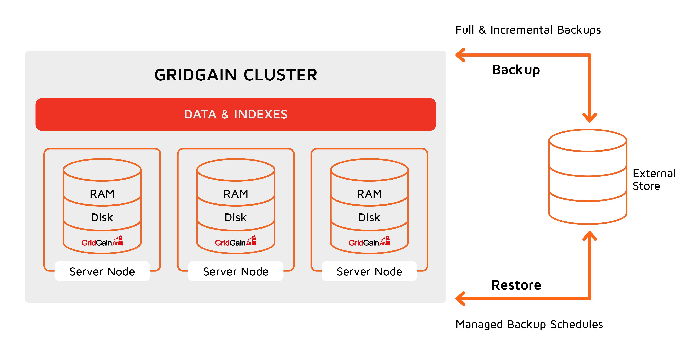

# Data Snapshots and Recovery

GridGain Ultimate Edition provides snapshots and recovery capabilities for the deployments with Ignite native persistence.
You can create, schedule, and manage snapshots and then recover to any point in time on any cluster topology using a combination
of full and incremental snapshots as well as continuous archives.

You can create snapshots of data stored in a GridGain cluster which can be used later to recover a cluster.
Snapshots taken from one GridGain cluster can also be applied on to another GridGain cluster.
Essentially, GridGain snapshots are similar to RDBMS backups.

GridGain snapshots implementation is different from Apache Ignite. If you are currently using Apache Ignite, you will need to change the way you do snapshots when migrating. For more information on the differences between Apache Ignite and GridGain, see the migration guide.


Data Snapshots and Recovery feature is available only with GridGain Ultimate Edition.


_This page is: Copyright © 2026 MariaDB. All rights reserved._
