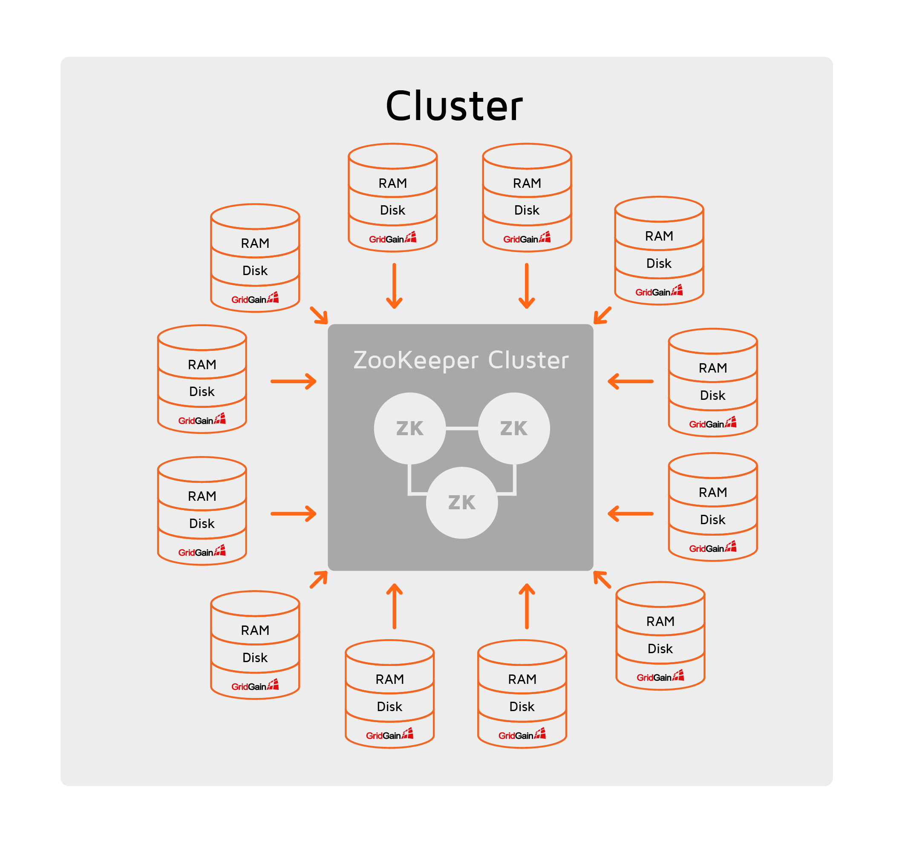
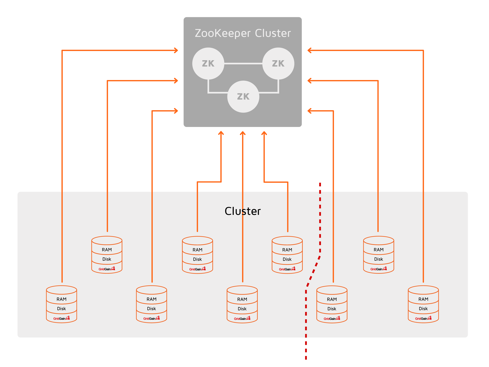
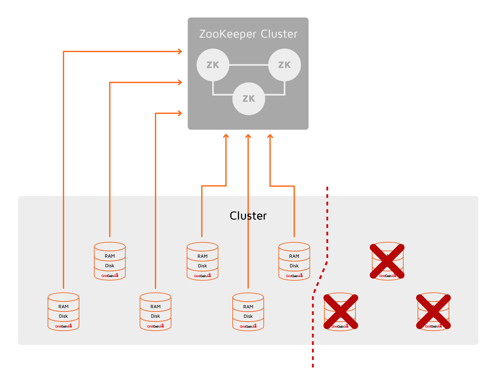
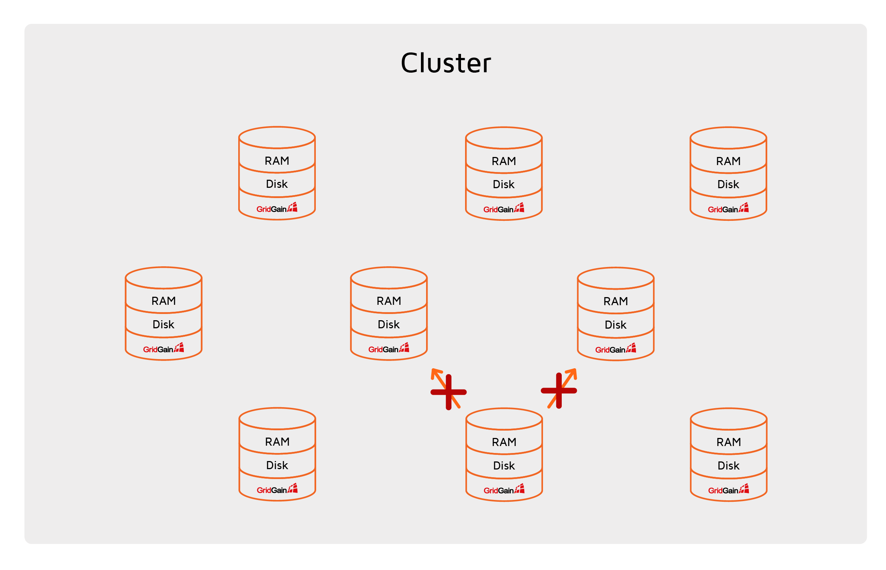
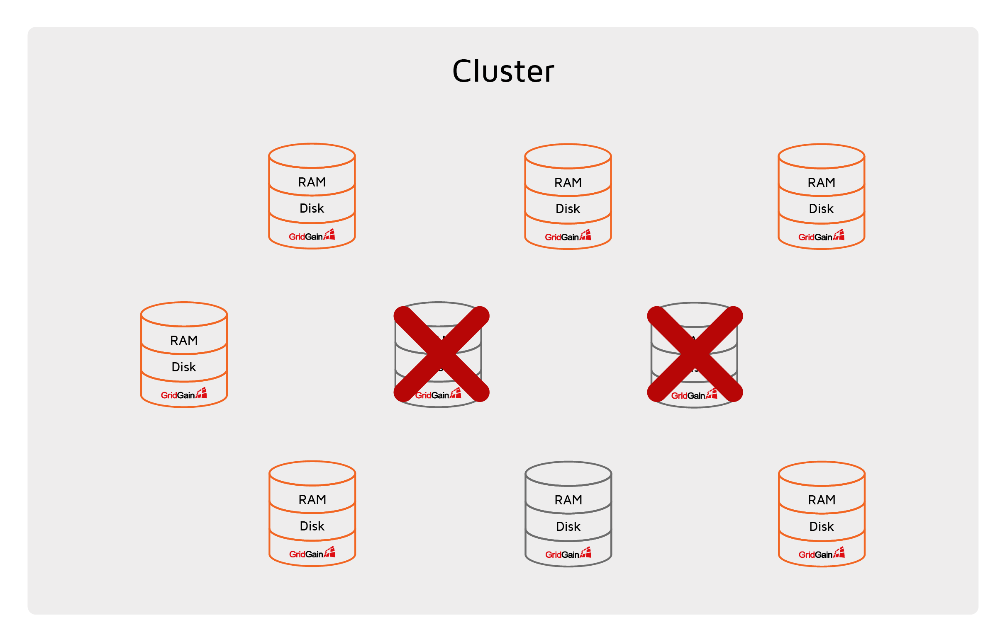
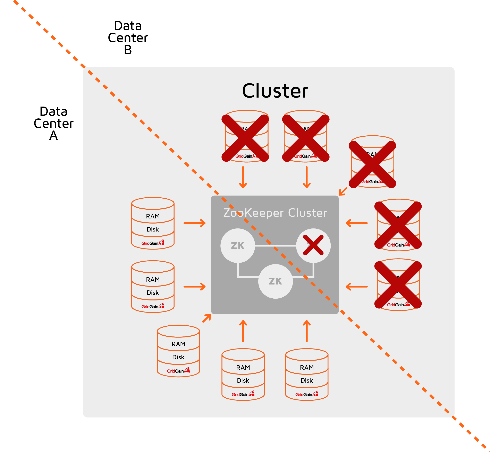

# ZooKeeper Discovery

GridGain's default TCP/IP Discovery organizes cluster nodes into a ring topology that has advantages and
disadvantages. For instance, on topologies with hundreds of cluster
nodes, it can take many seconds for a system message to traverse through
all the nodes. As a result, the basic processing of events such as
joining of new nodes or detecting the failed ones can take a while,
affecting the overall cluster responsiveness and performance.

ZooKeeper Discovery is designed for massive GridGain deployments that
need to preserve ease of scalability and linear performance. However,
using both GridGain and ZooKeeper requires configuring and managing two
distributed systems, which can be challenging. Therefore, we recommend that you use this Discovery SPI only if you plan to scale to
100s or 1000s nodes. Otherwise, it is best to use [TCP/IP Discovery](tcp-ip-discovery.md).

ZooKeeper Discovery uses ZooKeeper as a single point of synchronization
and to organize a GridGain cluster into a star-shaped topology where a
ZooKeeper cluster sits in the center and the GridGain nodes exchange
discovery events through it.



It is worth mentioning that ZooKeeper Discovery is an alternative implementation of GridGain Discovery SPI and doesn’t affect GridGain Communication SPI.
Once the nodes discover each other via ZooKeeper Discovery, they use Communication SPI for peer-to-peer communication.

## Configuration

To enable ZooKeeper Discovery, you need to configure `ZookeeperDiscoverySpi` in a way similar to this:



```xml
<bean class="org.apache.ignite.configuration.IgniteConfiguration">

  <property name="discoverySpi">
    <bean class="org.apache.ignite.spi.discovery.zk.ZookeeperDiscoverySpi">
      <property name="zkConnectionString" value="127.0.0.1:34076,127.0.0.1:43310,127.0.0.1:36745"/>
      <property name="sessionTimeout" value="30000"/>
      <property name="zkRootPath" value="/apacheIgnite"/>
      <property name="joinTimeout" value="10000"/>
    </bean>
  </property>
</bean>
```



```java
ZookeeperDiscoverySpi zkDiscoverySpi = new ZookeeperDiscoverySpi();

zkDiscoverySpi.setZkConnectionString("127.0.0.1:34076,127.0.0.1:43310,127.0.0.1:36745");
zkDiscoverySpi.setSessionTimeout(30_000);

zkDiscoverySpi.setZkRootPath("/ignite");
zkDiscoverySpi.setJoinTimeout(10_000);

IgniteConfiguration cfg = new IgniteConfiguration();

//Override default discovery SPI.
cfg.setDiscoverySpi(zkDiscoverySpi);

// Start a GridGain node.
Ignite ignite = Ignition.start(cfg);
```



unsupported



unsupported



The following parameters are required (other parameters are optional):

* `zkConnectionString` - keeps the list of addresses of ZooKeeper
servers.
* `sessionTimeout` - specifies the time after which a GridGain node is considered disconnected if it doesn’t react to events exchanged via
Discovery SPI.

## Failures and Split Brain Handling

In case of network partitioning, some of the nodes cannot communicate to each other because they are located in separated network segments, which may lead to failure to process user requests or inconsistent data modification.

ZooKeeper Discovery approaches network partitioning (aka. split brain)
and communication failures between individual nodes in the following
way:


It is assumed that the ZooKeeper cluster is always visible to all the
nodes in the cluster. In fact, if a node disconnects from ZooKeeper, it
shuts down and other nodes treat it as failed or disconnected.


Whenever a node discovers that it cannot connect to some of the other
nodes in the cluster, it initiates a communication failure resolution
process by publishing special requests to the ZooKeeper cluster. When
the process is started, all nodes try to connect to each other and send
the results of the connection attempts to the node that coordinates the
process (_the coordinator node_). Based on this information, the
coordinator node creates a connectivity graph that represents the
network situation in the cluster. Further actions depend on the type of
network segmentation. The following sections discuss possible scenarios.

### Cluster is split into several disjoint components

If the cluster is split into several independent components, each
component (being a cluster) may think of itself as a master cluster and
continue to process user requests, resulting in data inconsistency. To
avoid this, only the component with the largest number of nodes is kept
alive; and the nodes from the other components are brought down.



The image above shows a case where the cluster network is split into 2 segments.
The nodes from the smaller cluster (right-hand segment) are terminated.



When there are multiple largest components, the one that has the largest
number of clients is kept alive, and the others are shut down.

### Several links between nodes are missing

Some nodes cannot connect to some other nodes, which means the nodes are
not completely disconnected from the cluster but can’t exchange data
with some of the nodes and, therefore, cannot be part of the cluster. In
the image below, one node cannot connect to two other nodes.



In this case, the task is to find the largest component in which every
node can connect to every other node, which, in the general case, is a
difficult problem and cannot be solved in an acceptable amount of time. The
coordinator node uses a heuristic algorithm to find the best approximate
solution. The nodes that are left out of the solution are shut down.



### ZooKeeper cluster segmentation

In large-scale deployments where the ZooKeeper cluster can span multiple data centers and geographically diverse locations, it can split into multiple segments due to network segmentation.
If this occurs, ZooKeeper checks if there is a segment that contains more than a half of all ZooKeeper nodes (ZooKeeper requires this many nodes to continue its operation), and, if found, this segment takes over managing the Ignite cluster, while other segments are shut down.
If there is no such segment, ZooKeeper shuts down all its nodes.

In case of ZooKeeper cluster segmentation, the GridGain cluster may or may not be split.
In any case, when the ZooKeeper nodes are shut down, the corresponding GridGain nodes try to connect to available ZooKeeper nodes and shut down if unable to do so.

The following image is an example of network segmentation that splits
both the GridGain cluster and ZooKeeper cluster into two segments. This
may happen if your clusters are deployed in two data centers. In this
case, the ZooKeeper node located in Data Center B will shut itself down.
The GridGain nodes located in Data Center B will not be able to connect
to the remaining ZooKeeper nodes and will also shut themselves down.



## Custom Discovery Events

Changing a ring-shaped topology to the star-shaped one affects the way
custom discovery events are handled by the Discovery SPI component. Since
the ring topology is linear, it means that each discovery message is
processed by nodes sequentially.

With ZooKeeper Discovery, the coordinator sends discovery messages to
all nodes simultaneously resulting in the messages to be processed in
parallel. As a result, ZooKeeper Discovery prohibits custom discovery events from being changed. For instance, the nodes are not allowed to add any payload to discovery messages.

## GridGain and ZooKeeper Configuration Considerations

When using ZooKeeper Discovery, you need to be sure that the configuration
parameters of the ZooKeeper cluster and GridGain cluster match each other.

Consider a sample ZooKeeper configuration, as follows:

```shell
# The number of milliseconds of each tick
tickTime=2000

# The number of ticks that can pass between sending a request and getting an acknowledgement
syncLimit=5
```

Configured this way, ZooKeeper server detects its own segmentation from
the rest of ZooKeeper cluster only after `tickTime * syncLimit` elapses.
Until this event is detected at ZooKeeper level, all GridGain nodes
connected to the segmented ZooKeeper server do not try to reconnect to
the other ZooKeeper servers.

On the other hand, there is a `sessionTimeout` parameter on the GridGain
side that defines how soon ZooKeeper closes a GridGain node’s session if
the node gets disconnected from the ZooKeeper cluster. If
`sessionTimeout` is smaller than `tickTime * syncLimit` , then the
GridGain node is notified by the segmented ZooKeeper server too
late — its session expires before it tries to reconnect to other
ZooKeeper servers.

To avoid this situation, `sessionTimeout` should be bigger than
`tickTime * syncLimit`.

<sub>_This page is: Copyright © 2026 MariaDB. All rights reserved._</sub>
