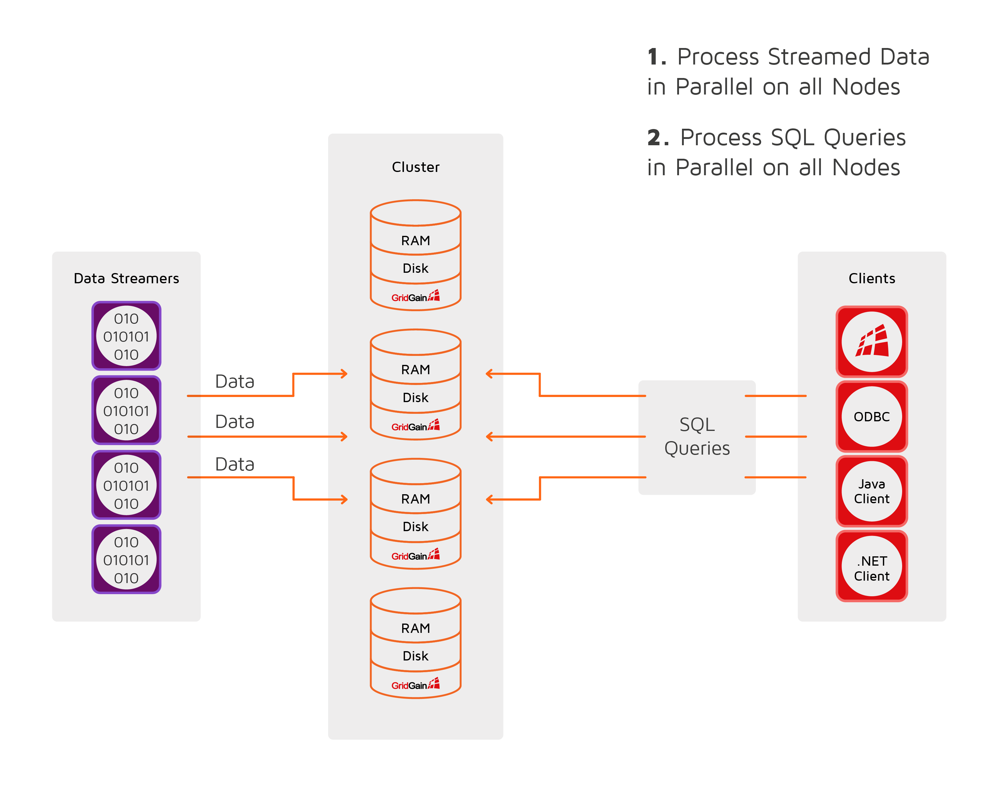

# Data Streaming

## Overview

GridGain provides a Data Streaming API that can be used to inject large amounts of continuous streams of data into a GridGain cluster. The Data Streaming API is designed to be scalable and fault-tolerant, and provides _at-least-once_ delivery semantics for the data streamed into GridGain, meaning each entry is processed at least once.

Data is streamed into a cache via a [data streamer](#data-streamers) associated with the cache. Data streamers automatically buffer the data and group it into batches for better performance and send it in parallel to multiple nodes.

The Data Streaming API provides the following features:

- The data that is added to a data streamer is automatically partitioned and distributed between the nodes.
- You can process the data concurrently in a colocated fashion.
- Clients can perform concurrent SQL queries on the data as it is being streamed in.



## Data Streamers

A data streamer is associated with a specific cache and provides an interface for streaming data into the cache.

In a typical scenario, you obtain a data streamer and use one of its methods to stream data into the cache, and GridGain takes care of data partitioning and colocation by batching data entries according to partitioning rules to avoid unnecessary data movement.

You can obtain the data streamer for a specific cache as follows:



```java
// Get the data streamer reference and stream data.
try (IgniteDataStreamer<Integer, String> stmr = ignite.dataStreamer("myCache")) {
    // Stream entries.
    for (int i = 0; i < 100000; i++)
        stmr.addData(i, Integer.toString(i));
}
System.out.println("dataStreamerExample output:" + cache.get(99999));
```

In the Java version of GridGain, a data streamer is an implementation of the `IgniteDataStreamer` interface. `IgniteDataStreamer` provides a number of `add(...)` methods for adding key-value pairs to caches. Refer to the `IgniteDataStreamer` javadoc for the complete list of methods.



```csharp
using (var stmr = ignite.GetDataStreamer<int, string>("myCache"))
{
    for (var i = 0; i < 1000; i++)
        stmr.Add(i, i.ToString());
}

```



unsupported



## Closing a Data Streamer Asynchronously

In .NET, a data streamer implements `IAsyncDisposable` in addition to `IDisposable`. Use an `await using` block to dispose of the streamer asynchronously: the buffered data is flushed to the cluster without blocking the calling thread, unlike the synchronous `Dispose()`, which blocks while the remaining data is sent.



```csharp
public static async Task DataStreamerAsyncExample()
{
    using (var ignite = Ignition.Start(Util.getIngiteCfg()))
    {
        ignite.GetOrCreateCache<int, string>("myCache");

        await using (var stmr = ignite.GetDataStreamer<int, string>("myCache"))
        {
            for (var i = 0; i < 1000; i++)
                stmr.Add(i, i.ToString());
        }
        // DisposeAsync flushes the buffered data to the cluster asynchronously,
        // so the calling thread is not blocked while the data is sent.
    }
}
```



unsupported



unsupported



## Avoiding Overwriting Existing Keys

By default, data streamers overwrite existing data. You can change that behavior by setting the `allowOverwrite` property of the data streamer to `false`.



```java
stmr.allowOverwrite(false);
```



```csharp
stmr.AllowOverwrite = false;
```



unsupported



## Processing Data

In cases when you need to execute custom logic before adding new data, you can use a stream receiver.
A stream receiver is used to process the data in a colocated manner before it is stored into the cache.
The logic implemented in a stream receiver is executed on the node where data is to be stored.



```java
try (IgniteDataStreamer<Integer, String> stmr = ignite.dataStreamer("myCache")) {

    stmr.allowOverwrite(false);

    stmr.receiver((StreamReceiver<Integer, String>) (cache, entries) -> entries.forEach(entry -> {

        // do something with the entry

        cache.put(entry.getKey(), entry.getValue());
    }));
}
```



```csharp
private class MyStreamReceiver : IStreamReceiver<int, string>
{
    public void Receive(ICache<int, string> cache, ICollection<ICacheEntry<int, string>> entries)
    {
        foreach (var entry in entries)
        {
            // do something with the entry

            cache.Put(entry.Key, entry.Value);
        }
    }
}

public static void StreamReceiverDemo()
{
    var ignite = Ignition.Start();

    using (var stmr = ignite.GetDataStreamer<int, string>("myCache"))
    {
        stmr.AllowOverwrite = false;
        stmr.Receiver = new MyStreamReceiver();
    }
}
```



unsupported




Note that a stream receiver does not put data into the cache automatically. You need to call one of the `put(...)` methods explicitly.



The class definitions of the stream receivers to be executed on remote nodes must be available on the nodes. This can be achieved in two ways:

- Add the classes to the classpath of the nodes;
- Enable [peer class loading](code-deployment/peer-class-loading.md).


### Stream Transformer

A stream transformer is a convenient implementation of a stream receiver, that updates the data in the stream.
Stream transformers take advantage of the colocation feature and update the data on the node where it is going to be stored.

In the example below, we use a stream transformer to increment a counter for each distinct word found in the text stream.



```java
String[] text = { "hello", "world", "hello", "gridgain" };
CacheConfiguration<String, Long> cfg = new CacheConfiguration<>("wordCountCache");

IgniteCache<String, Long> stmCache = ignite.getOrCreateCache(cfg);

try (IgniteDataStreamer<String, Long> stmr = ignite.dataStreamer(stmCache.getName())) {
    // Allow data updates.
    stmr.allowOverwrite(false);

    // Configure data transformation to count instances of the same word.
    stmr.receiver(StreamTransformer.from((e, arg) -> {
        // Get current count.
        Long val = e.getValue();

        // Increment count by 1.
        e.setValue(val == null ? 1L : val + 1);

        return null;
    }));

    // Stream words into the streamer cache.
    for (String word : text)
        stmr.addData(word, 1L);

}
```



```csharp
class MyEntryProcessor : ICacheEntryProcessor<string, long, object, object>
{
    public object Process(IMutableCacheEntry<string, long> e, object arg)
    {
        //get current count
        var val = e.Value;
                
        //increment count by 1
        e.Value = val == 0 ? 1L : val + 1;

        return null;
    }
}

public static void StreamTransformerDemo()
{
    var ignite = Ignition.Start(new IgniteConfiguration
    {
        DiscoverySpi = new TcpDiscoverySpi
        {
            LocalPort = 48500,
            LocalPortRange = 20,
            IpFinder = new TcpDiscoveryStaticIpFinder
            {
                Endpoints = new[]
                {
                    "127.0.0.1:48500..48520"
                }
            }
        }
    });
    var cfg = new CacheConfiguration("wordCountCache");
    var stmCache = ignite.GetOrCreateCache<string, long>(cfg);

    using (var stmr = ignite.GetDataStreamer<string, long>(stmCache.Name))
    {
        //Allow data updates
        stmr.AllowOverwrite = false;
                
        //Configure data transformation to count instances of the same word
        stmr.Receiver = new StreamTransformer<string, long, object, object>(new MyEntryProcessor());
                
        //stream words into the streamer cache
        foreach (var word in GetWords())
        {
            stmr.Add(word, 1L);
        }
    }
            
    Console.WriteLine(stmCache.Get("a"));
    Console.WriteLine(stmCache.Get("b"));
}

static IEnumerable<string> GetWords()
{
    //populate words list somehow
    return Enumerable.Repeat("a", 3).Concat(Enumerable.Repeat("b", 2));
}
```



unsupported



### Stream Visitor

A stream visitor is another implementation of a stream receiver, which visits every key-value pair in the stream. The visitor does not update the cache. If a pair needs to be stored in the cache, one of the `put(...)` methods must be called explicitly.

In the example below, we have 2 caches: "marketData", and "instruments". We receive market data ticks and put them into the streamer for the "marketData" cache. The stream visitor for the "marketData" streamer is invoked on the cluster member mapped to the particular market symbol. Upon receiving individual market ticks it updates the "instrument" cache with the latest market price.

Note, that we do not update the "marketData" cache at all, leaving it empty. We simply use it for colocated processing of the market data within the cluster directly on the node where the data is stored.



```java
static class Instrument {
    final String symbol;
    Double latest;
    Double high;
    Double low;

    public Instrument(String symbol) {
        this.symbol = symbol;
    }

}

static Map<String, Double> getMarketData() {
    //populate market data somehow
    return new HashMap<>();
}

public static void streamVisitorExample() {
    try (Ignite ignite = Ignition.start()) {
        CacheConfiguration<String, Double> mrktDataCfg = new CacheConfiguration<>("marketData");
        CacheConfiguration<String, Instrument> instCfg = new CacheConfiguration<>("instruments");

        // Cache for market data ticks streamed into the system.
        IgniteCache<String, Double> mrktData = ignite.getOrCreateCache(mrktDataCfg);

        // Cache for financial instruments.
        IgniteCache<String, Instrument> instCache = ignite.getOrCreateCache(instCfg);

        try (IgniteDataStreamer<String, Double> mktStmr = ignite.dataStreamer("marketData")) {
            // Note that we do not populate the 'marketData' cache (it remains empty).
            // Instead we update the 'instruments' cache based on the latest market price.
            mktStmr.receiver(StreamVisitor.from((cache, e) -> {
                String symbol = e.getKey();
                Double tick = e.getValue();

                Instrument inst = instCache.get(symbol);

                if (inst == null)
                    inst = new Instrument(symbol);

                // Update instrument price based on the latest market tick.
                inst.high = Math.max(inst.high, tick);
                inst.low = Math.min(inst.low, tick);
                inst.latest = tick;

                // Update the instrument cache.
                instCache.put(symbol, inst);
            }));

            // Stream market data into the cluster.
            Map<String, Double> marketData = getMarketData();
            for (Map.Entry<String, Double> tick : marketData.entrySet())
                mktStmr.addData(tick);
        }
    }
}
```



```csharp
class Instrument
{
    public readonly string Symbol;
    public double Latest { get; set; }
    public double High { get; set; }
    public double Low { get; set; }

    public Instrument(string symbol)
    {
        this.Symbol = symbol;
    }
}

private static Dictionary<string, double> getMarketData()
{
    //populate market data somehow
    return new Dictionary<string, double>
    {
        ["foo"] = 1.0,
        ["foo"] = 2.0,
        ["foo"] = 3.0
    };
}

public static void StreamVisitorDemo()
{
    var ignite = Ignition.Start(new IgniteConfiguration
    {
        DiscoverySpi = new TcpDiscoverySpi
        {
            LocalPort = 48500,
            LocalPortRange = 20,
            IpFinder = new TcpDiscoveryStaticIpFinder
            {
                Endpoints = new[]
                {
                    "127.0.0.1:48500..48520"
                }
            }
        }
    });

    var mrktDataCfg = new CacheConfiguration("marketData");
    var instCfg = new CacheConfiguration("instruments");

    // Cache for market data ticks streamed into the system
    var mrktData = ignite.GetOrCreateCache<string, double>(mrktDataCfg);
    // Cache for financial instruments
    var instCache = ignite.GetOrCreateCache<string, Instrument>(instCfg);

    using (var mktStmr = ignite.GetDataStreamer<string, double>("marketData"))
    {
        // Note that we do not populate 'marketData' cache (it remains empty).
        // Instead we update the 'instruments' cache based on the latest market price.
        mktStmr.Receiver = new StreamVisitor<string, double>((cache, e) =>
        {
            var symbol = e.Key;
            var tick = e.Value;

            Instrument inst = instCache.Get(symbol);

            if (inst == null)
            {
                inst = new Instrument(symbol);
            }

            // Update instrument price based on the latest market tick.
            inst.High = Math.Max(inst.High, tick);
            inst.Low = Math.Min(inst.Low, tick);
            inst.Latest = tick;
        });
        var marketData = getMarketData();
        foreach (var tick in marketData)
        {
            mktStmr.Add(tick);
        }
        mktStmr.Flush();
        Console.Write(instCache.Get("foo"));
    }
}

```



unsupported



## Configuring Data Streamer Thread Pool Size

The data streamer thread pool is dedicated to process messages coming from the data streamers.

The default pool size is `max(8, total number of cores)`.
Use `IgniteConfiguration.setDataStreamerThreadPoolSize(...)` to change the pool size.



```xml
<bean class="org.apache.ignite.configuration.IgniteConfiguration">
    <property name="dataStreamerThreadPoolSize" value="10"/>

    <!-- other properties -->

</bean>
```



```java
IgniteConfiguration cfg = new IgniteConfiguration();
cfg.setDataStreamerThreadPoolSize(10);

Ignite ignite = Ignition.start(cfg);
```



unsupported



unsupported



<sub>_This page is: Copyright © 2026 MariaDB. All rights reserved._</sub>
