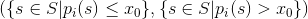
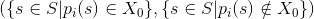

# Decision Trees

## Overview

Decision trees are a simple yet powerful model in supervised machine learning. The main idea is to split a feature space into regions such as that the value in each region varies a little. The measure of the values' variation in a region is called the `impurity` of the region.

Apache Ignite provides an implementation of the algorithm optimized for data stored in rows (see [partition-based dataset](part-based-dataset.md)).

Splits are done recursively and every region created from a split can be split further. Therefore, the whole process can be described by a binary tree, where each node is a particular region and its children are the regions derived from it by another split.

Let each sample from a training set belong to some space `S` and let `p_i` be a projection on a feature with index `i`, then a split by continuous feature with index `i` has the form:



and a split by categorical feature with values from some set `X` has the form:



Here `X_0` is a subset of `X`.

The model works this way - the split process stops when either the algorithm has reached the configured maximal depth, or splitting of any region has not resulted in significant impurity loss. Prediction of a value for point `s` from `S` is a traversal of the tree down to the node that corresponds to the region containing `s` and getting back a value associated with this leaf.

## Model

The Model in a decision tree classification is represented by the class `DecisionTreeNode`. We can make a prediction for a given vector of features in the following way:


```java
DecisionTreeNode mdl = ...
double prediction = mdl.apply(observation);
```


Model is fully independent object and after the training it can be saved, serialized and restored.

## Trainer

A Decision Tree algorithm can be used for classification and regression depending upon the impurity measure and node instantiation approach.

### Classification

The Classification Decision Tree uses the [Gini](https://en.wikipedia.org/wiki/Decision_tree_learning#Gini_impurity) impurity measure and you can use it in the following way:



```java
// Create decision tree classification trainer.
DecisionTreeClassificationTrainer trainer = new DecisionTreeClassificationTrainer(
    4, // Max deep.
    0  // Min impurity decrease.
);

// Train model.
DecisionTreeNode mdl = trainer.fit(
    ignite,
    upstreamCache,
    (k, pnt) -> pnt.coordinates,
    (k, pnt) -> pnt.label
);

// Make a prediction.
double prediction = mdl.apply(coordinates);
```


```java
// Create decision tree classification trainer.
DecisionTreeClassificationTrainer trainer = new DecisionTreeClassificationTrainer(
    4, // Max deep.
    0  // Min impurity decrease.
);

// Train model.
DecisionTreeNode mdl = trainer.fit(
    upstreamMap,
    10,          // Number of partitions.
    (k, pnt) -> pnt.coordinates,
    (k, pnt) -> pnt.label
);

// Make a prediction.
double prediction = mdl.apply(coordinates);
```



### Regression

The Regression Decision Tree uses the [MSE](https://en.wikipedia.org/wiki/Mean_squared_error) impurity measure and you can use it in the following way:



```java
// Create decision tree classification trainer.
DecisionTreeRegressionTrainer trainer = new DecisionTreeRegressionTrainer(
    4, // Max deep.
    0  // Min impurity decrease.
);

// Train model.
DecisionTreeNode mdl = trainer.fit(
    ignite,
    upstreamCache,
    (k, pnt) -> pnt.x,
    (k, pnt) -> pnt.y
);

// Make a prediction.
double prediction = mdl.apply(x);
```


```java
// Create decision tree classification trainer.
DecisionTreeRegressionTrainer trainer = new DecisionTreeRegressionTrainer(
    4, // Max deep.
    0  // Min impurity decrease.
);

// Train model.
DecisionTreeNode mdl = trainer.fit(
    upstreamMap,
    10,          // Number of partitions.
    (k, pnt) -> pnt.x,
    (k, pnt) -> pnt.y
);

// Make a prediction.
double prediction = mdl.apply(x);
```



## Examples

To see how the Decision Tree can be used in practice, try this [classification example](https://github.com/apache/ignite-extensions/tree/master/modules/ml-ext/examples/src/main/java/org/apache/ignite/examples/ml/tree/DecisionTreeClassificationTrainerExample.java) and this [regression example](https://github.com/apache/ignite-extensions/tree/master/modules/ml-ext/examples/src/main/java/org/apache/ignite/examples/ml/tree/DecisionTreeRegressionTrainerExample.java) that are available on GitHub and delivered with every Apache Ignite distribution.

<sub>_This page is: Copyright © 2026 MariaDB. All rights reserved._</sub>
