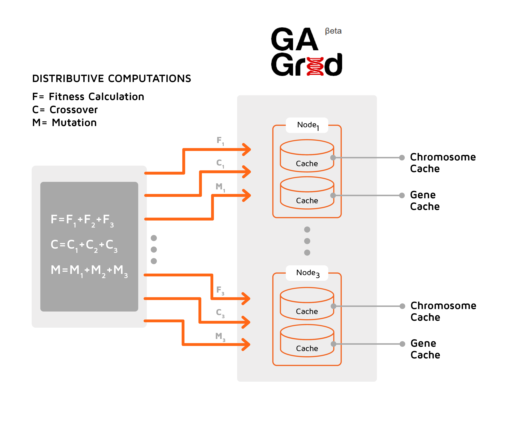
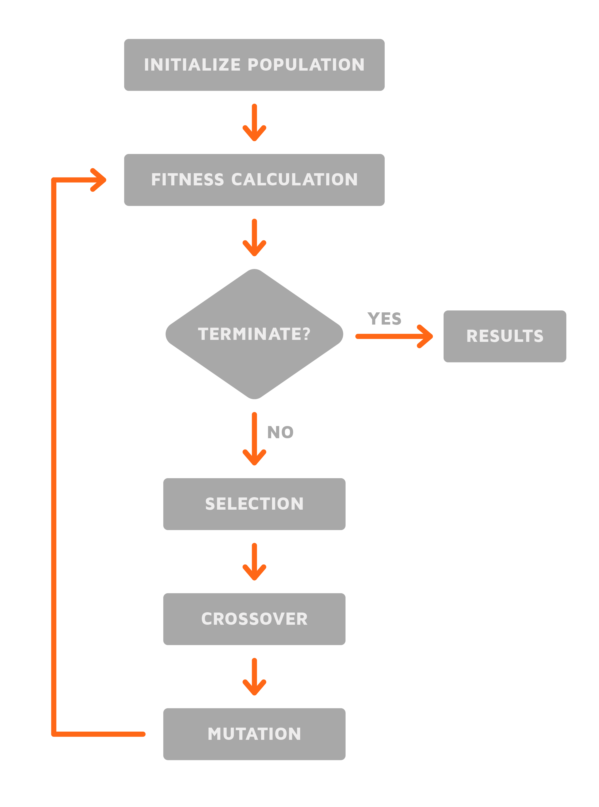
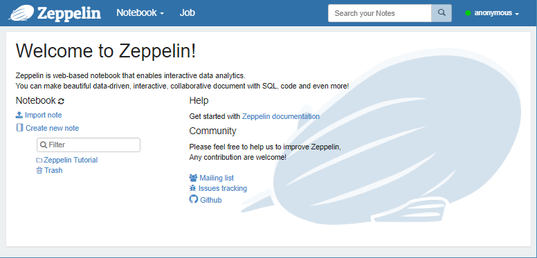
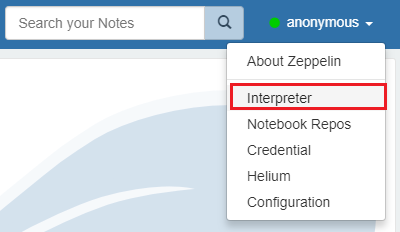
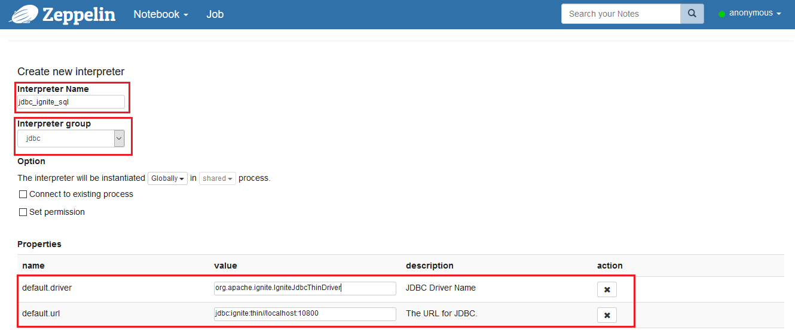
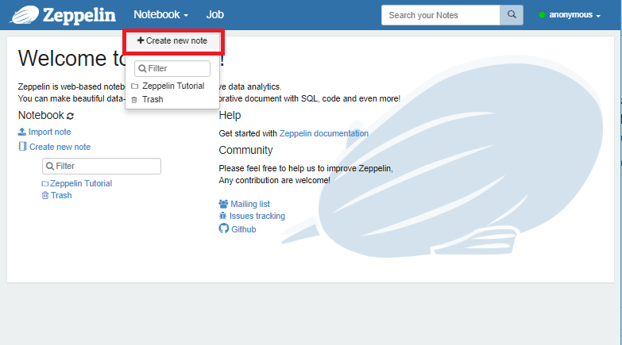
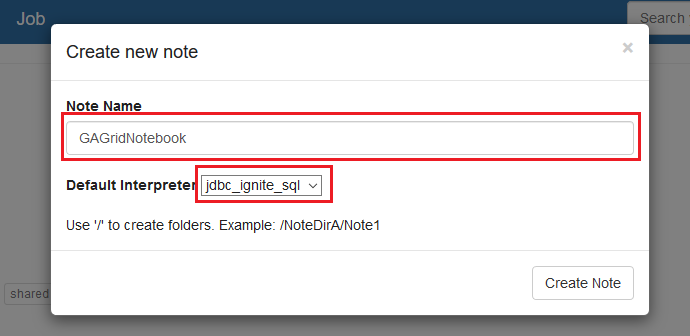
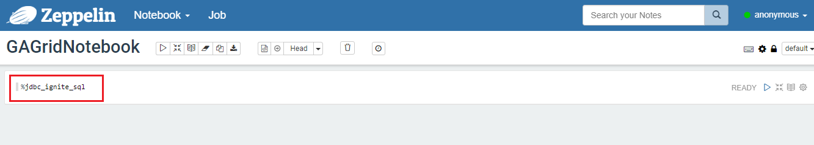
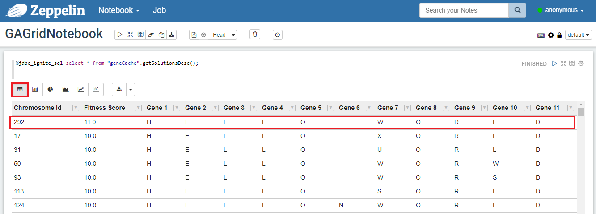

# Genetic Algorithms

## Overview

Genetic Algorithm (GA) represents​ a subset of Ignite Machine Learning APIs. GA is a method of solving optimization problems by simulating the process of biological evolution. GAs are excellent for searching through large and complex data sets for an optimal solution. Real world applications of GAs include automotive design, computer gaming, robotics, investments, traffic/shipment routing and more.

All genetic operations such as Fitness Calculation, Crossover, and Mutation are modeled as a ComputeTask for distributive behavior. Also, these ComputeTasks leverage Apache Ignite's Affinity colocation to route ComputeJobs to respective nodes where Chromosomes are stored.

The following diagram depicts the architecture of Genetic Algorithms:



The following diagram depicts the steps performed by Genetic Algorithm:



## Usage Guide

In order to begin using Genetic Algorithm, follow these steps:

1. [Create a GAConfiguration](#create-a-gaconfiguration)
2. [Define the Gene and Chromosome](#define-the-gene-and-chromosome)
3. [Implement a fitness function](#implement-a-fitness-function)
4. [Define terminate condition](#define-terminate-condition)
5. [Evolve the population](#evolve-the-population)

We will use a `HelloWorldGAExample` to demonstrate.

Our goal will be to derive the phrase: "HELLO WORLD"

### Create a GAConfiguration

To begin, we create a GAConfiguration object. This class is utilized to customize the behavior of GA.


```java
ignite = Ignition.start("examples/config/example-ignite.xml");
// Create GAConfiguration
gaConfig = new GAConfiguration();
```


### Define the Gene and Chromosome

Next, we define our `Gene`. For our problem domain, an optimal solution is the phrase
"HELLO WORLD". Since the discrete parts are letters, we use `Character` to model our `Gene`. Next, we need to initialize a Gene pool of 27 `Gene` objects utilizing Characters. The code below depicts this process.


```java
List<Gene> genePool = new ArrayList();

char[] chars = { 'A', 'B', 'C', 'D', 'E', 'F', 'G', 'H', 'I', 'J', 'K', 'L', 'M', 'N', 'O', 'P', 'Q', 'R', 'S', 'T', 'U', 'V', 'W', 'X', 'Y', 'Z', ' ' };

for (int i = 0; i < chars.length; i++) {
    Gene gene = new Gene(new Character(chars[i]));
    genePool.add(gene);
}

gaConfig.setGenePool(genePool);
```


Next, we define the Chromosome as it is central to a GA, because it models an optimal solution. A Chromosome is made of Gene which represents discrete parts of a particular solution.

For our GA, since the goal is a solution containing the phrase "HELLO WORLD", our Chromosomes should have *11* Genes (i.e. Characters). As a result, we use the `GAConfiguration` to set to our Chromosome length to *11*.


```java
// Set the Chromosome Length to '11' since 'HELLO WORLD' contains 11 characters.
gaConfig.setChromosomeLength(11);
```


During the GA execution, Chromosomes evolve into optimal solutions through the process of crossover and mutation. Next, only the best Chromosomes (ie: solutions) are chosen based on a fitness score.


GA internally stores potential (Chromosomes) in a Chromosome cache.


*Optimal Solution*


### Implement a fitness function

GA is intelligent enough to perform the majority of the process of natural selection. However, GA has no knowledge of the problem domain. For this reason, we need to define a fitness function. We will need to extend GA's IFitnessFunction class to calculate a fitness score for a potential Chromosome. A fitness score is used to determine how optimal the solution is relative to other potential solutions in the population. The code below demonstrates our fitness function.


```java
public class HelloWorldFitnessFunction implements IFitnessFunction {

    private String targetString = "HELLO WORLD";

    @Override
    public double evaluate(List<Gene> genes) {

        double matches = 0;

        for (int i = 0; i < genes.size(); i++) {
            if (((Character) (genes.get(i).getValue())).equals(targetString.charAt(i))) {
                matches = matches + 1;
            }
        }

        return matches;
    }
}
```


Next, we configure `GAConfiguration` with our *HelloWorldFitnessFunction*.


```java
// Create and set Fitness function
HelloWorldFitnessFunction function = new HelloWorldFitnessFunction();
gaConfig.setFitnessFunction(function);
```


### Define terminate condition

The next step is to specify a suitable terminate condition for the GA. The terminate condition will vary depending on the problem domain. For our use case, we want GA to terminate when the Chromosome's fitness score equals 11. We specify a terminate condition by implementing the `ITerminateCriteria` interface which has a single method `isTerminateConditionMet()`.


```java
public class HelloWorldTerminateCriteria implements ITerminateCriteria {

    private IgniteLogger igniteLogger = null;
    private Ignite ignite = null;

    public HelloWorldTerminateCriteria(Ignite ignite) {
        this.ignite = ignite;
        this.igniteLogger = ignite.log();
    }

    public boolean isTerminationConditionMet(Chromosome fittestChromosome, double averageFitnessScore, int currentGeneration) {
        boolean isTerminate = true;
        igniteLogger.info("##########################################################################################");
        igniteLogger.info("Generation: " + currentGeneration);
        igniteLogger.info("Fittest is Chromosome Key: " + fittestChromosome);
        igniteLogger.info("Chromsome: " + fittestChromosome);
        printPhrase(GAGridUtils.getGenesInOrderForChromosome(ignite, fittestChromosome));
        igniteLogger.info("Avg Chromsome Fitness: " + averageFitnessScore);
        igniteLogger.info("##########################################################################################");

        if (!(fittestChromosome.getFitnessScore() > 10)) {
            isTerminate = false;
        }

        return isTerminate;
    }

    /**
     * Helper to print Phrase
     *
     * @param genes
     */
    private void printPhrase(List<Gene> genes) {

        StringBuffer sbPhrase = new StringBuffer();

        for (Gene gene : genes) {
            sbPhrase.append(((Character) gene.getValue()).toString());
        }
        igniteLogger.info(sbPhrase.toString());
    }
}
```


Next, we configure `GAConfiguration` with our *HelloWorldTerminateCriteria*.


```java
// Create and set TerminateCriteria
HelloWorldTerminateCriteria termCriteria = new HelloWorldTerminateCriteria(ignite);
gaConfig.setTerminateCriteria(termCriteria);
```


### Evolve the population

The final step is to initialize a GAGrid instance using our GAConfiguration and Ignite instances. Then we evolve the population by invoking GAGrid.evolve().


```java
// Initialize GAGrid
gaGrid = new GAGrid(gaConfig, ignite);
// Evolve the population
Chromosome fittestChromosome = gaGrid.evolve();
```


## Start GA

To begin using GA, open the command shell and, from your `IGNITE_HOME` directory, type the following:


```shell
$ bin/ignite.sh examples/config/example-ignite.xml
```


Repeat this step for the number nodes you desire in your cluster.

Then, open another shell, go to the `IGNITE_HOME` folder and type:


```shell
mvn exec:java -Dexec.mainClass="org.apache.ignite.examples.ml.genetic.helloworld.HelloWorldGAExample"
```


Upon startup, you should see the following similar output on all nodes in the topology:


```shell
[21:41:49,327][INFO][main][GridCacheProcessor] Started cache [name=populationCache, mode=PARTITIONED]
[21:41:49,365][INFO][main][GridCacheProcessor] Started cache [name=geneCache, mode=REPLICATED]
```


Next, you will see the following output after some number of generations:


```shell
[19:04:17,307][INFO][main][] Generation: 208
[19:04:17,307][INFO][main][] Fittest is Chromosome Key: Chromosome [fitnessScore=11.0, id=319, genes=[8, 5, 12, 12, 15, 27, 23, 15, 18, 12, 4]]
[19:04:17,307][INFO][main][] Chromosome: Chromosome [fitnessScore=11.0, id=319, genes=[8, 5, 12, 12, 15, 27, 23, 15, 18, 12, 4]]
[19:04:17,310][INFO][main][] HELLO WORLD
[19:04:17,311][INFO][main][] Avg Chromosome Fitness: 5.252
[19:04:17,311][INFO][main][]
Tests run: 1, Failures: 0, Errors: 0, Skipped: 0, Time elapsed: 53.883 sec
```


## Apache Zeppelin Integration

Apache Zeppelin is a web-based notebook that enables interactive data analytics. In this section we show how to leverage Zeppelin's visualization features to display optimal solutions generated by GA.


The steps presented in this section apply to all examples included with GA Grid.


### Zeppelin Installation and Configuration

In order to begin utilizing Zeppelin, follow these steps:

1. Download the latest version of Zeppelin from [here](http://zeppelin.apache.org/download.html).

2. Extract Zeppelin into a directory of your choice. This directory will be referred to as `ZEPPELIN_HOME`.

3. Copy `ignite-core-2.6.0.jar` from `IGNITE_HOME/libs` directory, which contains the [JDBC Thin Drive]({connectors}/sql/jdbc/jdbc-driver), to `ZEPPELIN_HOME/interpreter/jdbc` directory.

Zeppelin will utilize this driver to retrieve optimization results from GA Grid.

After Zeppelin is installed and configured, you can start it using the following command:


```shell
./bin/zeppelin-daemon.sh start
```


Once Apache Zeppelin is running, you should see the following start page:



Next, select the *Interpreter* menu item.



This page contains settings for all configured interpreter groups.

Next, click the *Create* button to configure a new JDBC interpreter.
Configure the JDBC Interpreter using the settings shown in the following table:

|Setting|Value|
|---|---|
|Interpreter Name|`jdbc_ignite_sql`|
|Interpreter group|`jdbc`|
|`default.driver`|`org.apache.ignite.IgniteJdbcThinDriver`|
|`default.url`|`jdbc:ignite:thin//localhost:10800`|



Click the *Save* button to update changes in the configuration. Be sure to restart the interpreter after making changes in the configuration.

### Create a New Notebook

To create a new notebook, click the *Create new note* menu item under the *Notebook* tab.



Give your notebook the name *GAGridNotebook* and select `jdbc_ignite_sql` as the default interpreter, as shown in the picture below. Click *Create Note* to continue.



Now, your newly created notebook should be displayed as shown below. In order to execute SQL queries, we must use the `%jdbc_ignite_sql` prefix.



### Using the Notebook

GA provides improved knowledge discovery by adding custom SQL functions to pivot genetic optimization results. Columns in a result set are dynamically driven by the Chromosome size for an individual genetic sample.

*GA Custom SQL Functions*:

The following SQL functions are available in GA's distributive geneCache:

|Function Name|Description|
|---|---|
|`getSolutionsDesc()`|Retrieve optimal solutions in descending order based on fitness score|
|`getSolutionsAsc()`|Retrieve optimal solutions in ascending order based on fitness score|
|`getSolutionById(key)`|Retrieve an optimal solution by Chromosome key|

To begin using your `GAGridNotebook`, start a standalone Ignite node:


```shell
$ bin/ignite.sh IGNITE_HOME/examples/config/example-config.xml
```


Now run the `HelloWorldGAExample` example:


```shell
mvn exec:java -Dexec.mainClass="org.apache.ignite.examples.ml.genetic.helloworld.HelloWorldGAExample"
```


Once GA has begun generating optimal solutions for the first generation, you may begin querying data.

*1st Generation*:


```shell
##########################################################################################
[13:55:22,589][INFO][main][] Generation: 1
[13:55:22,596][INFO][main][] Fittest is Chromosome Key: Chromosome [fitnessScore=3.0, id=460, genes=[8, 3, 21, 5, 2, 22, 1, 19, 18, 12, 9]]
[13:55:22,596][INFO][main][] Chromosome: Chromosome [fitnessScore=3.0, id=460, genes=[8, 3, 21, 5, 2, 22, 1, 19, 18, 12, 9]]
[13:55:22,598][INFO][main][] HCUEBVASRLI
[13:55:22,598][INFO][main][] Avg Chromosome Fitness: 0.408
```


In the Zeppelin paragraph window, simply type the following SQL and click the execute button:


```shell
%jdbc_ignite_sql select * from "geneCache".getSolutionsDesc();
```


After several generations, you will see the solution evolve to the final phrase "HELLO WORLD". For the `HellowWorldGAExample`, GA will maintain a population of 500 solutions for each generation. Also, solutions in this example will contain a total of '11' genes and the highest fitness score is considered 'most fit'.



## Glossary

*Chromosome* is a sequence of Genes. A *Chromosome* represents a potential solution.

*Crossover* is the process in which the genes within chromosomes are combined to derive new chromosomes.

*Fitness Score* is a numerical score that measures the value of a particular Chromosome (ie: solution) relative to other Chromosomes in the population.

*Gene* is the discrete building block that makes up the Chromosome.

*Genetic Algorithm (GA)* is a method of solving optimization problems by simulating the process of biological evolution. A GA continuously enhances a population of potential solutions. With each iteration, a GA selects the best fit individuals from the current population to create offspring for the next generation. After subsequent generations, a GA will evolve the population towards an optimal solution.

*Mutation* is the process where genes within a chromosomes are randomly updated to produce new characteristics.

*Population* is the collection of potential solutions or Chromosomes.

*Selection* is the process of choosing candidate solutions (Chromosomes) for the next generation.

<sub>_This page is: Copyright © 2026 MariaDB. All rights reserved._</sub>
