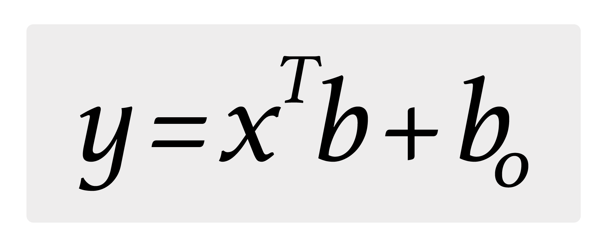
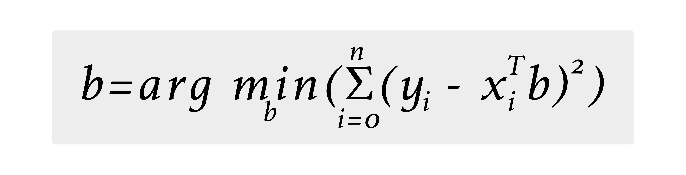

# Linear Regression

## Overview

Apache Ignite supports the ordinary least squares Linear Regression algorithm - one of the most basic and powerful machine learning algorithms. This documentation describes how the algorithm works, and is implemented in Apache Ignite.

The basic idea behind the Linear Regression algorithm is an assumption that a dependent variable `y` and an explanatory variable `x` are in the following relationship:



_Be aware that further documentation uses a dot product of vectors `x` and `b`, and explicitly avoids using a constant term. It is mathematically correct in the case where vector `x` is supplemented by one value equal to 1_.

The above assumption allows us to make a prediction based on a feature vector `x` if a vector `b` is known. This fact is reflected in Apache Ignite in the `LinearRegressionModel` class responsible for making predictions.

## Model

A Model in the case of linear regression is represented by the class `LinearRegressionModel`. It enables a prediction to be made for a given vector of features, in the following way:


```java
LinearRegressionModel model = ...;
double prediction = model.predict(observation);
```


Model is fully independent object and after the training it can be saved, serialized and restored.

## Trainers

Linear Regression is a supervised learning algorithm. This means that to find parameters (vector b), we need to train on a training dataset and minimize the loss function:



Apache Ignite provides two linear regression trainers: trainer based on the LSQR algorithm and another trainer based on the Stochastic Gradient Descent method.

### LSQR Trainer

The LSQR algorithm finds the least-squares solution to a large, sparse, linear system of equations. The Apache Ignite implementation is a distributed version of this algorithm.



```java
// Create linear regression trainer.
LinearRegressionLSQRTrainer trainer = new LinearRegressionLSQRTrainer();

// Train model.
LinearRegressionModel mdl = trainer.fit(
    ignite,
    upstreamCache,
    (k, pnt) -> pnt.coordinates,
    (k, pnt) -> pnt.label
);

// Make a prediction.
double prediction = mdl.apply(coordinates);
```


```java
// Create linear regression trainer.
LinearRegressionLSQRTrainer trainer = new LinearRegressionLSQRTrainer();

// Train model.
LinearRegressionModel mdl = trainer.fit(
    upstreamMap,
    10,          // Number of partitions.
    (k, pnt) -> pnt.coordinates,
    (k, pnt) -> pnt.label
);

// Make a prediction.
double prediction = mdl.apply(coordinates);
```



### SGD Trainer

Another Linear Regression Trainer uses the stochastic gradient descent method to find a minimum of the loss function. The configuration of this trainer is similar to multilayer perceptron trainer configuration and we can specify the type of updater (`SGD`, `RProp`, or `Nesterov`), max number of iterations, batch size, number of local iterations and seed.



```java
// Create linear regression trainer.
LinearRegressionSGDTrainer<?> trainer = new LinearRegressionSGDTrainer<>(
    new UpdatesStrategy<>(
        new RPropUpdateCalculator(),
        RPropParameterUpdate::sumLocal,
        RPropParameterUpdate::avg
    ),
    100000,  // Max iterations.
    10,      // Batch size.
    100,     // Local iterations.
    123L     // Random seed.
);

// Train model.
LinearRegressionModel mdl = trainer.fit(
    ignite,
    upstreamCache,
    (k, pnt) -> pnt.coordinates,
    (k, pnt) -> pnt.label
);

// Make a prediction.
double prediction = mdl.apply(coordinates);
```


```java
// Create linear regression trainer.
LinearRegressionSGDTrainer<?> trainer = new LinearRegressionSGDTrainer<>(
    new UpdatesStrategy<>(
        new RPropUpdateCalculator(),
        RPropParameterUpdate::sumLocal,
        RPropParameterUpdate::avg
    ),
    100000,  // Max iterations.
    10,      // Batch size.
    100,     // Local iterations.
    123L     // Random seed.
);

// Train model.
LinearRegressionModel mdl = trainer.fit(
    upstreamMap,
    10,          // Number of partitions.
    (k, pnt) -> pnt.coordinates,
    (k, pnt) -> pnt.label
);

// Make a prediction.
double prediction = mdl.apply(coordinates);
```



## Examples

To see how the Linear Regression can be used in practice, try these [examples](https://github.com/apache/ignite-extensions/tree/master/modules/ml-ext/examples/src/main/java/org/apache/ignite/examples/ml/regression/linear) that are available on GitHub and delivered with every Apache Ignite distribution.

<sub>_This page is: Copyright © 2026 MariaDB. All rights reserved._</sub>
