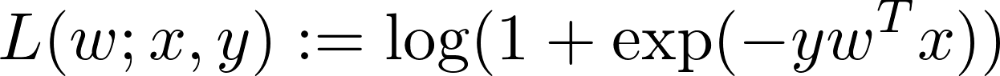
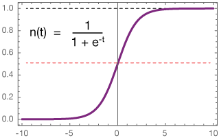

# Logistic Regression

## Binary classification

Binary Logistic Regression is a special type of regression where a binary response variable is related to a set of explanatory variables, which can be discrete and/or continuous. The important point here to note is that in linear regression, the expected values of the response variable are modeled based on a combination of values taken by the predictors. In logistic regression Probability or Odds of the response taking a particular value is modeled based on the combination of values taken by the predictors. In the Apache Ignite ML module it is implemented via `LogisticRegressionModel` that solves the binary classification problem. It is a linear method with the loss function in the formulation given by the logistic loss:



For binary classification problems, the algorithm outputs a binary logistic regression model. Given a new data point, denoted by x, the model makes predictions by applying the logistic function:



By default, if f(wTx)>0.5 or `\mathrm{f}(\wv^T x) > 0.5` (Tex formula), the outcome is positive, or negative otherwise. However, unlike linear SVMs, the raw output of the logistic regression model f(z) has a probabilistic interpretation (i.e., the probability that it is positive).

## Multi-class classification

Multiclass Logistic Regression aims to assign labels to instances by using binary logistic regression, where the labels are drawn from a finite set of several elements. The implemented approach for doing so is to reduce the single multiclass problem into multiple binary classification problems via one-versus-all. The one-versus-all approach is the process of building binary classifiers which distinguish between one of the labels and the rest.

## Model

The model keeps the pairs `<ClassLabel, LogisticRegressionModel>` and it enables a prediction to be made for a given vector of features, in the following way:


```java
LogRegressionMultiClassModel
mdl = …

double prediction = mdl.withRawLabels(true).withThreshold(0.5).apply(observation)
```


Ignite supports these parameters for `LogisticRegressionModel`:

- `isKeepingRawLabels` - controls the output label format: 0 and 1 for false value and raw distances from the separating hyperplane otherwise (default value: `false`)
- `threshold` - a threshold to assign label 1 to the observation if the raw value is more than this threshold (default value: `0.5`)


```java
LogisticRegressionSGDTrainer
mdl = …

double prediction = mdl.withRawLabels(true).withThreshold(0.5).apply(observation)
```


## Trainer

Trainer of the multi-class logistic regression model runs a number of binary logistic regression trainers under the hood.

Ignite supports the following parameters for `LogRegressionMultiClassTrainer`:

- `updatesStgy` - update strategy.
- `maxIterations` - max amount of iterations before convergence.
- `batchSize` - The size of learning batch.
- `locIterations` - the amount of local iterations of SGD algorithm.
- `seed` - seed value for internal random purposes to reproduce training results.


```java
LogRegressionMultiClassTrainer<?> trainer = new LogRegressionMultiClassTrainer<>()
  .withUpdatesStgy(UPDATES_STRATEGY)
  .withAmountOfIterations(MAX_ITERATIONS)
  .withAmountOfLocIterations(BATCH_SIZE)
  .withBatchSize(LOC_ITERATIONS)
  .withSeed(SEED);

// Build the model
LogisticRegressionModel mdl = trainer.fit(
  ignite,
  dataCache,
  featureExtractor,
  labelExtractor
);
```


All properties will be propagated for each pair one-versus-all `LogRegressionMultiClassTrainer`.

<sub>_This page is: Copyright © 2026 MariaDB. All rights reserved._</sub>
