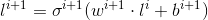

# Multilayer perceptron

## Overview

Multiplayer Perceptron (MLP) is the basic form of neural network. It consists of one input layer and 0 or more transformation layers. Each transformation layer depends of the previous layer in the following way:



In the above equation, the dot operator is the dot product of two vectors, functions denoted by `sigma` are called activators, vectors denoted by `w` are called weights, and vectors denoted by `b` are called biases. Each transformation layer has associated weights, activator, and optionally biases. The set of all weights and biases of MLP is the set of MLP parameters.

## Model

A Model for neural network is represented by class `MultilayerPerceptron`. It allows to make a prediction for a given vector of features in the following way:


```java
MultilayerPerceptron mlp = ...
Matrix prediction = mlp.apply(coordinates);
```


Model is a fully independent object and after training it can be saved, serialized, and restored.

## Trainer

One of the popular methods of supervised model training is batch training. In this approach, training is done in iterations; during each iteration we extract a `subpart(batch)` of labeled data (data consisting of input of approximated function and corresponding values of this function which are often called 'ground truth') on which we train and update model parameters using this subpart. Updates are made to minimize loss function on batches.

Apache Ignite `MLPTrainer` is used for distributed batch training, which works in a map-reduce way. Each iteration (let's call it global iteration) consists of several parallel iterations which in turn consists of several local steps. Each local iteration is executed by its own worker and performs the specified number of local steps (called synchronization period) to compute its update of model parameters. Then all updates are accumulated on the node that started training, and are transformed to global update which is sent back to all workers. This process continues until stop criteria is reached.

`MLPTrainer` can be parameterized by neural network architecture, loss function, update strategy (`SGD`, `RProp`, or `Nesterov`), max number of iterations, batch size, number of local iterations, and seed.



```java
// Define a layered architecture.
MLPArchitecture arch = new MLPArchitecture(2).
    withAddedLayer(10, true, Activators.RELU).
    withAddedLayer(1, false, Activators.SIGMOID);

// Define a neural network trainer.
MLPTrainer<SimpleGDParameterUpdate> trainer = new MLPTrainer<>(
    arch,
    LossFunctions.MSE,
    new UpdatesStrategy<>(
        new SimpleGDUpdateCalculator(0.1),
        SimpleGDParameterUpdate::sumLocal,
        SimpleGDParameterUpdate::avg
    ),
    3000,   // Max iterations.
    4,      // Batch size.
    50,     // Local iterations.
    123L    // Random seed.
);

// Train model.
MultilayerPerceptron mlp = trainer.fit(
    ignite,
    upstreamCache,
    (k, pnt) -> pnt.coordinates,
    (k, pnt) -> pnt.label
);

// Make a prediction.
Matrix prediction = mlp.apply(coordinates);
```


```java
// Define a layered architecture.
MLPArchitecture arch = new MLPArchitecture(2).
    withAddedLayer(10, true, Activators.RELU).
    withAddedLayer(1, false, Activators.SIGMOID);

// Define a neural network trainer.
MLPTrainer<SimpleGDParameterUpdate> trainer = new MLPTrainer<>(
    arch,
    LossFunctions.MSE,
    new UpdatesStrategy<>(
        new SimpleGDUpdateCalculator(0.1),
        SimpleGDParameterUpdate::sumLocal,
        SimpleGDParameterUpdate::avg
    ),
    3000,   // Max iterations.
    4,      // Batch size.
    50,     // Local iterations.
    123L    // Random seed.
);

// Train model.
MultilayerPerceptron mlp = trainer.fit(
    upstreamMap,
    10,          // Number of partitions.
    (k, pnt) -> pnt.coordinates,
    (k, pnt) -> pnt.label
);

// Make a prediction.
Matrix prediction = mlp.apply(coordinates);
```



## Examples

To see how Deep Learning can be used in practice, try [this example](https://github.com/apache/ignite-extensions/tree/master/modules/ml-ext/examples/src/main/java/org/apache/ignite/examples/ml/nn/MLPTrainerExample.java), available on GitHub and delivered with every Apache Ignite distribution.

<sub>_This page is: Copyright © 2026 MariaDB. All rights reserved._</sub>
