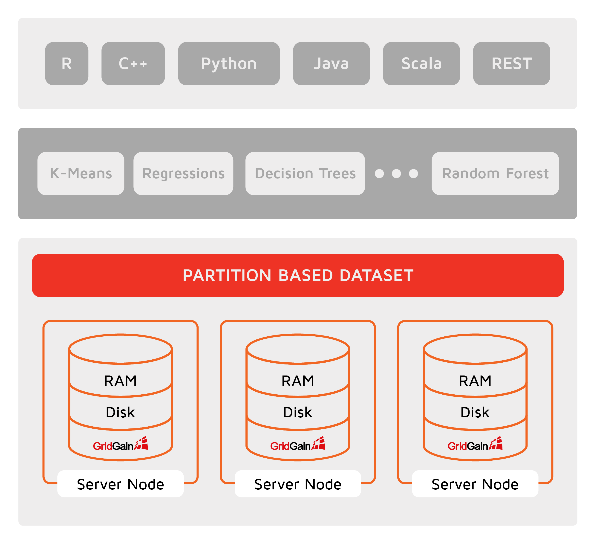

# Machine Learning

## Overview

GridGain Machine Learning (ML) is a set of simple, scalable, and efficient tools that allow the building of predictive Machine Learning models without costly data transfers.

The rationale for adding machine and deep learning (DL) to GridGain is quite simple. Today's data scientists have to deal with two major factors that keep ML from mainstream adoption:

- First, the models are trained and deployed (after the training is over) in different systems. The data scientists have to wait for ETL or some other data transfer process to move the data into a system like Apache Mahout or Apache Spark for a training purpose. Then they have to wait while this process completes and redeploy the models in a production environment. The whole process can take hours moving terabytes of data from one system to another. Moreover, the training part usually happens over the old data set.
- The second factor is related to scalability. ML and DL algorithms that have to process data sets which no longer fit within a single server unit are constantly growing. This urges the data scientist to come up with sophisticated solutions o​r turn to distributed computing platforms such as Apache Spark. However, those platforms mostly solve only a part of the puzzle which is the models training, making it a burden of the developers to decide how do deploy the models in production later.



### Zero ETL and Massive Scalability

The Machine Learning module relies on Ignite's memory-centric storage that brings massive scalability for ML and DL tasks and eliminates the wait imposed by ETL between the different systems. For instance, it allows users to run ML/DL training and inference directly on data stored across memory and disk in an Ignite cluster. Next, Ignite provides a host of ML and DL algorithms that are optimized for Ignite's colocated distributed processing. These implementations deliver in-memory speed and unlimited horizontal scalability when running in place against massive data sets or incrementally against incoming data streams, without requiring the data to be moved into another store. By eliminating the data movement and the long processing wait times, Ignite Machine learning enables continuous learning that can improve decisions based on the latest data as it arrives in real-time.

### Fault Tolerance and Continuous Learning

GridGain ML is tolerant to node failures. This means that in the case of node failures during the learning process, all recovery procedures will be transparent to the user, learning processes won't be interrupted, and we will get results in the time similar to the case when all nodes work fine. For more information please see [Partition-based Dataset](part-based-dataset.md).

## Algorithms and Applicability

### Classification

Identifying to which category a new observation belongs, on the basis of a training set of data.

*Applicability*: spam detection, image recognition, credit scoring, disease identification.
*Algorithms*: SVM, nearest neighbours, decision tree classification and neural network.

### Regression

Modeling the relationship between a scalar dependent variable y and one or more explanatory variables (or independent variables) denoted x.

*Applicability*: drug response, stock prices, supermarket revenue.
*Algorithms*: linear regression, decision tree regression, nearest neighbours and neural network.

### Clustering

Grouping a set of objects in such a way that objects in the same group (called a cluster) are more similar (in some sense) to each other than to those in other groups (clusters).

*Applicability*: customer segmentation, grouping experiment outcomes, grouping of shopping items.
*Algorithms*: K-Means.

### Preprocessing

Feature extraction and normalization.

*Applicability*: transform input data such as text for use with machine learning algorithms, to extract features we need to fit on, to normalize input data.
*Algorithms*: Apache Ignite ML supports custom preprocessing using partition based dataset capabilities and has default preprocessors such as normalization preprocessor.

## Getting Started

The fastest way to get started with the Machine Learning is to build and run existing examples, study their output and keep coding.

Follow the steps below to try out the examples:

1. Download GridGain version 8.10.
2. Download gridgain-ml-8.10.zip from https://gridgain.com/resources/download#extensions. This package contains the ML [modules](../setup.md#enabling-modules) for GridGain.
3. Unpack the gridgain-ml package to the directory with the GridGain installation ($IGNITE_HOME).

### Get it With Maven

Add the Maven dependency below to your project in order to include the ML functionality:

```xml
<dependency>
    <groupId>org.apache.ignite</groupId>
    <artifactId>ignite-ml</artifactId>
    <version>${gridgain.version}</version>
</dependency>
```

Replace `${gridgain.version}` with an actual GridGain version.

<sub>_This page is: Copyright © 2026 MariaDB. All rights reserved._</sub>
