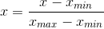
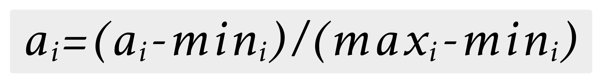
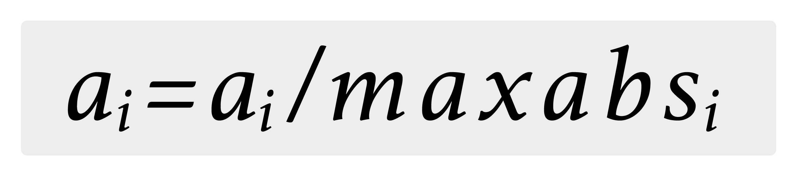

# Preprocessing

## Overview

Preprocessing is required to transform raw data stored in an Ignite cache to the dataset of feature vectors suitable for further use in a machine learning pipeline.

This section covers algorithms for working with features, roughly divided into the following groups:

- Extracting features from “raw” data
- Scaling features
- Converting features
- Modifying features


Usually it starts with label and feature extraction and can be complicated with other preprocessing stages.


## Normalization preprocessor

The normal flow is to extract features from Ignite data​, transform the features and then normalize them. The Trainer API allows compositions of transformers in the following way:


```java
// Define feature extractor.
IgniteBiFunction<Integer, double[], double[]> extractor = (k, v) -> v;

// Define feature transformer on top of extractor.
IgniteBiFunction<Integer, double[], double[]> extractorTransformer =
    extractor.andThen(v -> transform(v));

// Define feature normalizer on top of transformer and extractor.
IgniteBiFunction<Integer, double[], double[]> extractorTransformerNormalizer =
    normalizationTrainer.fit(ignite, upstreamCache, transformer);
```


In addition to the ability to build any custom preprocessor, Apache Ignite provides a built-in normalization preprocessor. This preprocessor makes normalization on a [0, 1] interval in accordance with the following function:



For normalization, you need to create a `NormalizationTrainer` and fit a normalization preprocessor as follows:


```java
// Create normalization trainer.
NormalizationTrainer<Integer, double[]> normalizationTrainer =
    new NormalizationTrainer<>();

// Train normalization preprocessor.
IgniteBiFunction<Integer, double[], double[]> preprocessor =
    normalizationTrainer.fit(
        ignite,
        upstreamCache,
        (k, pnt) -> pnt.coordinates
    );

// Create linear regression trainer.
LinearRegressionLSQRTrainer trainer = new LinearRegressionLSQRTrainer();

// Train model.
LinearRegressionModel mdl = trainer.fit(
    ignite,
    upstreamCache,
    preprocessor,
    (k, pnt) -> pnt.label
);

// Make a prediction.
double prediction = mdl.apply(preprocessor.apply(coordinates));
```


## Examples

To see how the Normalization Preprocessor can be used in practice, try this example available on [GitHub](https://github.com/apache/ignite-extensions/tree/master/modules/ml-ext/examples/src/main/java/org/apache/ignite/examples/ml/preprocessing/NormalizationExample.java) and delivered with every Apache Ignite distribution.

## Binarization preprocessor

Binarization is the process of thresholding numerical features to binary (0/1) features.
Feature values greater than the threshold are binarized to 1.0; values equal to or less than the threshold are binarized to 0.0.

It contains only one significant parameter, which is the threshold.


```java
// Create binarization trainer.
BinarizationTrainer<Integer, double[]> binarizationTrainer=
    new BinarizationTrainer<>().withThreshold(10);

// Train binarization preprocessor.
IgniteBiFunction<Integer, double[], double[]> preprocessor =
    binarizationTrainer.fit(
        ignite,
        upstreamCache,
        (k, pnt) -> pnt.coordinates
    );
```


To see how the Binarization Preprocessor can be used in practice, try this [example](https://github.com/apache/ignite-extensions/tree/master/modules/ml-ext/examples/src/main/java/org/apache/ignite/examples/ml/preprocessing/BinarizationExample.java).

## Imputer preprocessor

The Imputer preprocessor completes missing values in a dataset, either using the mean or another statistic of the column in which the missing values are located. The missing values should be presented as Double.NaN. The input dataset column should be of Double. Currently, the Imputer preprocessor does not support categorical features and possibly creates incorrect values for columns containing categorical features.

During the training phase, the Imputer Trainer collects statistics about the preprocessing dataset and in the preprocessing phase it changes the data according to the collected statistics.

The Imputer Trainer contains only one parameter: imputingStgy that is presented as enum ImputingStrategy with two available values (NOTE: future releases may support more values):

- MEAN: The default strategy. If this strategy is chosen, then replace missing values using the mean for the numeric features along the axis.
- MOST_FREQUENT: If this strategy is chosen, then replace missing values using the most frequent value along the axis.


```java
// Create imputer trainer.
ImputerTrainer<Integer, double[]> imputerTrainer=
    new ImputerTrainer<>().withImputingStrategy(ImputingStrategy.MOST_FREQUENT);

// Train imputer preprocessor.
IgniteBiFunction<Integer, double[], double[]> preprocessor =
    imputerTrainer.fit(
        ignite,
        upstreamCache,
        (k, pnt) -> pnt.coordinates
    );
```


To see how the Imputer Preprocessor can be used in practice, try [this](https://github.com/apache/ignite-extensions/tree/master/modules/ml-ext/examples/src/main/java/org/apache/ignite/examples/ml/preprocessing/ImputingExample.java) example.

## One-Hot Encoder preprocessor

One-hot encoding maps a categorical feature, represented as a label index (Double or String value), to a binary vector with at most a single one-value indicating the presence of a specific feature value from among the set of all feature values.

This preprocessor can transform multiple columns in which indices are handled during the training process. These indexes could be defined via a `.withEncodedFeature(featureIndex)` call.

- Each one-hot encoded binary vector adds its cells to the end of the current feature vector.
- This preprocessor always creates a separate column for NULL values.
- The index value associated with NULL will be located in a binary vector according to the frequency of NULL values.

`StringEncoderPreprocessor` and `OneHotEncoderPreprocessor` use the same `EncoderTraining` to collect data about categorial features during the training phase. To preprocess the dataset with the One-Hot Encoder preprocessor, set the `encoderType` with the value `EncoderType.ONE_HOT_ENCODER` as shown below in the code snippet:


```java
IgniteBiFunction<Integer, Object[], Vector> oneHotEncoderPreprocessor = new EncoderTrainer<Integer, Object[]>()
   .withEncoderType(EncoderType.ONE_HOT_ENCODER)
   .withEncodedFeature(0)
   .withEncodedFeature(1)
   .withEncodedFeature(4)
   .fit(ignite,
       dataCache,
       featureExtractor
);
```


## String Encoder preprocessor

The String Encoder encodes string values (categories) to double values in the range `[0.0, amountOfCategories]` where the most popular value will be presented as 0.0 and the least popular value presented with `amountOfCategories-1` value.

This preprocessor can transform multiple columns in which indices are handled during the training process. These indexes could be defined via a `.withEncodedFeature(featureIndex)` call.


It doesn’t add a new column but changes data in-place.


Examples
Assume that we have the following Dataset with features `id` and `category`:

|ID|Category|
|---|---|
|0|a|
|1|b|
|2|c|
|3|a|
|4|a|
|5|c|

|ID|Category|
|---|---|
|0|0.0|
|1|2.0|
|2|1.0|
|3|0.0|
|4|0.0|
|5|1.0|

"a" gets index 0 because it is the most frequent, followed by "c" with index 1 and "b" with index 2.


There is only a one strategy regarding how `StringEncoder` will handle unseen labels when you have to fit a `StringEncoder` on one dataset and then use it to transform another: put unseen labels in a special additional bucket, at index equal to `amountOfCategories`.


`StringEncoderPreprocessor` and `OneHotEncoderPreprocessor` use the same `EncoderTraining` to collect data about categorial features during the training phase. To preprocess the dataset with the `StringEncoderPreprocessor`, set the `encoderType` with the value `EncoderType.STRING_ENCODER` as shown below in the code snippet:


```java
IgniteBiFunction<Integer, Object[], Vector> strEncoderPreprocessor = new EncoderTrainer<Integer, Object[]>()
   .withEncoderType(EncoderType.STRING_ENCODER)
   .withEncodedFeature(1)
   .withEncodedFeature(4)
   .fit(ignite,
       dataCache,
       featureExtractor
);
```


To see how the String Encoder Preprocessor can be used in practice, try this [tutorial example](https://github.com/apache/ignite-extensions/tree/master/modules/ml-ext/examples/src/main/java/org/apache/ignite/examples/ml/tutorial/Step_3_Categorial.java).

## MinMax Scaler preprocessor

The MinMax Scaler transforms the given dataset, rescaling each feature to a specific range.

From a mathematical point of view, it is the following function which is applied to every element in the dataset:



For all i, where i is a number of column, max_i is the value of the maximum element in this column, min_i is the value of the minimal element in this column.

`MinMaxScalerTrainer` computes summary statistics on a data set and produces a `MinMaxScalerPreprocessor`
The preprocessor can then transform each feature individually such that it is in the given range.

To see how the `MinMaxScalerPreprocessor` can be used in practice, try this [tutorial example](https://github.com/apache/ignite-extensions/tree/master/modules/ml-ext/examples/src/main/java/org/apache/ignite/examples/ml/preprocessing/MinMaxScalerExample.java).

## MaxAbsScaler Preprocessor

The MaxAbsScaler transforms the given dataset, rescaling each feature to the range [-1, 1] by dividing through the maximum absolute value in each feature.


It does not shift/center the data, and thus does not destroy any sparsity.


From a mathematical point of view it is the following function which is applied to every element in a dataset:



For all i, where i is a number of column, maxabs_i is the value of the absolute maximum element in this column.

`MaxAbsScalerTrainer` computes summary statistics on a data set and produces a `MaxAbsScalerPreprocessor`

To see how the `MaxAbsScalerPreprocessor` can be used in practice, try this [tutorial example](https://github.com/apache/ignite-extensions/tree/master/modules/ml-ext/examples/src/main/java/org/apache/ignite/examples/ml/preprocessing/MaxAbsScalerExample.java).

<sub>_This page is: Copyright © 2026 MariaDB. All rights reserved._</sub>
