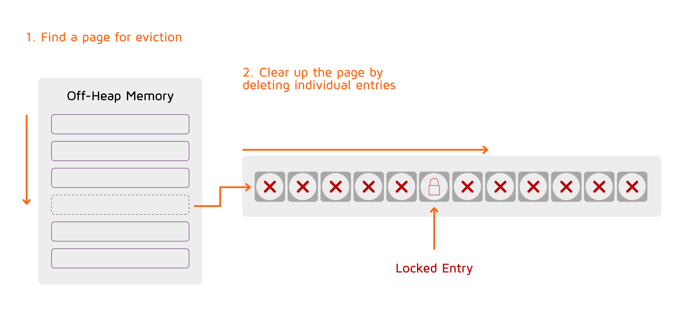

# Eviction Policies

When [Native Persistence](../../architecture/storage/native-persistence.md) is off, GridGain holds all cache entries in the off-heap memory and allocates pages as new data comes in.
When a memory limit is reached and GridGain cannot allocate a page, some of the data must be purged from memory to avoid OutOfMemory errors.
This process is called _eviction_. Eviction prevents the system from running out of memory but at the cost of losing data and having to reload it when you need it again.

Eviction is used in following cases:

* for off-heap memory when [Native Persistence](../../architecture/storage/native-persistence.md) is off;
* for off-heap memory when GridGain is used with an [external storage](../persistence/external-storage.md);
* for [on-heap caches](../configuring-caches/on-heap-caching.md);
* for [near caches](../near-caches.md) if configured.

When Native Persistence is on, a similar process — called _page replacement_ — is used to free up off-heap memory when GridGain cannot allocate a new page.
The difference is that the data is not lost (because it is stored in the persistent storage), and therefore you are less concerned about losing data than about efficiency.

Refer to the [Replacement Policies](replacement-policies.md) page for information about page replacement configuration.

## Off-Heap Memory Eviction

Off-heap memory eviction is implemented as follows.

When memory usage exceeds the preset limit, GridGain applies one of the preconfigured algorithms to select a memory page that is most suitable for eviction.
Then, each cache entry contained in the page is removed from the page.
However, if an entry is locked by a transaction, it is retained.
Thus, either the entire page or a large chunk of it is emptied and is ready to be reused.



By default, off-heap memory eviction is disabled, which means that the used memory constantly grows until it reaches its limit.
To enable eviction, specify the page eviction mode in the [data region configuration](data-regions.md).
Note that off-heap memory eviction is configured per [data region](data-regions.md).
If you don't use data regions, you have to explicitly add default data region parameters in your configuration to be able to configure eviction.


Data eviction is handled on a per-node basis. Different nodes may evict different data, leading to primary and backup partitions storing different data. Certain operations may read data from backup partitions, so you make sure that your application can handle different results before enabling eviction. Alternatively, use native persistence instead of page eviction to scale beyond RAM capacity while ensuring data consistency.


By default, eviction starts when the overall RAM consumption by a region gets to 90%.
Use the `DataRegionConfiguration.setEvictionThreshold(...)` parameter if you need to initiate eviction earlier or later.

GridGain supports two page selection algorithms:

* Random-LRU
* Random-2-LRU

The differences between the two are explained below.

### Random-LRU

To enable the Random-LRU eviction algorithm, configure the data region as shown below:



```xml

<bean class="org.apache.ignite.configuration.IgniteConfiguration">
  <!-- Memory configuration. -->
  <property name="dataStorageConfiguration">
    <bean class="org.apache.ignite.configuration.DataStorageConfiguration">
      <property name="dataRegionConfigurations">
        <list>
          <!--
              Defining a data region that consumes up to 20 GB of RAM.
          -->
          <bean class="org.apache.ignite.configuration.DataRegionConfiguration">
            <!-- Custom region name. -->
            <property name="name" value="20GB_Region"/>

            <!-- 500 MB initial size (RAM). -->
            <property name="initialSize" value="#{500L * 1024 * 1024}"/>

            <!-- 20 GB maximum size (RAM). -->
            <property name="maxSize" value="#{20L * 1024 * 1024 * 1024}"/>

            <!-- Enabling RANDOM_LRU eviction for this region.  -->
            <property name="pageEvictionMode" value="RANDOM_LRU"/>
          </bean>
        </list>
      </property>
    </bean>
  </property>

  <!-- The rest of the configuration. -->
</bean>
```



```java
// Node configuration.
IgniteConfiguration cfg = new IgniteConfiguration();

// Memory configuration.
DataStorageConfiguration storageCfg = new DataStorageConfiguration();

// Creating a new data region.
DataRegionConfiguration regionCfg = new DataRegionConfiguration();

// Region name.
regionCfg.setName("20GB_Region");

// 500 MB initial size (RAM).
regionCfg.setInitialSize(500L * 1024 * 1024);

// 20 GB max size (RAM).
regionCfg.setMaxSize(20L * 1024 * 1024 * 1024);

// Enabling RANDOM_LRU eviction for this region.
regionCfg.setPageEvictionMode(DataPageEvictionMode.RANDOM_LRU);

// Setting the data region configuration.
storageCfg.setDataRegionConfigurations(regionCfg);

// Applying the new configuration.
cfg.setDataStorageConfiguration(storageCfg);
```



```csharp
var cfg = new IgniteConfiguration
{
    DataStorageConfiguration = new DataStorageConfiguration
    {
        DataRegionConfigurations = new[]
        {
            new DataRegionConfiguration
            {
                Name = "20GB_Region",
                InitialSize = 500L * 1024 * 1024,
                MaxSize = 20L * 1024 * 1024 * 1024,
                PageEvictionMode = DataPageEvictionMode.RandomLru
            }
        }
    }
};
```



unsupported



Random-LRU algorithm works as follows:

* Once a memory region defined by a memory policy is configured, an off-heap array is allocated to track the 'last usage' timestamp for every individual data page.
* When a data page is accessed, its timestamp gets updated in the tracking array.
* When it is time to evict a page, the algorithm randomly chooses 5 indexes from the tracking array and evicts the page with the oldest timestamp. If some of the indexes point to non-data pages (index or system pages), then the algorithm picks another page.

### Random-2-LRU

To enable Random-2-LRU eviction algorithm, which is a scan-resistant version of Random-LRU, configure the data region, as shown in the example below:



```xml
<bean class="org.apache.ignite.configuration.IgniteConfiguration">
  <!-- Memory configuration. -->
  <property name="dataStorageConfiguration">
    <bean class="org.apache.ignite.configuration.DataStorageConfiguration">
      <property name="dataRegionConfigurations">
        <list>
          <!--
              Defining a data region that consumes up to 20 GB of RAM.
          -->
          <bean class="org.apache.ignite.configuration.DataRegionConfiguration">
            <!-- Custom region name. -->
            <property name="name" value="20GB_Region"/>

            <!-- 500 MB initial size (RAM). -->
            <property name="initialSize" value="#{500L * 1024 * 1024}"/>

            <!-- 20 GB maximum size (RAM). -->
            <property name="maxSize" value="#{20L * 1024 * 1024 * 1024}"/>

            <!-- Enabling RANDOM_2_LRU eviction for this region.  -->
            <property name="pageEvictionMode" value="RANDOM_2_LRU"/>
          </bean>
        </list>
      </property>
    </bean>
  </property>

  <!-- The rest of the configuration. -->
</bean>
```



```java
// Ignite configuration.
IgniteConfiguration cfg = new IgniteConfiguration();

// Memory configuration.
DataStorageConfiguration storageCfg = new DataStorageConfiguration();

// Creating a new data region.
DataRegionConfiguration regionCfg = new DataRegionConfiguration();

// Region name.
regionCfg.setName("20GB_Region");

// 500 MB initial size (RAM).
regionCfg.setInitialSize(500L * 1024 * 1024);

// 20 GB max size (RAM).
regionCfg.setMaxSize(20L * 1024 * 1024 * 1024);

// Enabling RANDOM_2_LRU eviction for this region.
regionCfg.setPageEvictionMode(DataPageEvictionMode.RANDOM_2_LRU);

// Setting the data region configuration.
storageCfg.setDataRegionConfigurations(regionCfg);

// Applying the new configuration.
cfg.setDataStorageConfiguration(storageCfg);
```



```csharp
var cfg = new IgniteConfiguration
{
    DataStorageConfiguration = new DataStorageConfiguration
    {
        DataRegionConfigurations = new[]
        {
            new DataRegionConfiguration
            {
                Name = "20GB_Region",
                InitialSize = 500L * 1024 * 1024,
                MaxSize = 20L * 1024 * 1024 * 1024,
                PageEvictionMode = DataPageEvictionMode.Random2Lru
            }
        }
    }
};
```



unsupported



In Random-2-LRU, the two most recent access timestamps are stored for every data page. At the time of eviction, the algorithm randomly chooses 5 indexes from the tracking array and the minimum between two latest timestamps is taken for further comparison with corresponding minimums of four other pages that are chosen as eviction candidates.

Random-LRU-2 outperforms LRU by resolving the "one-hit wonder" problem: if a data page is accessed rarely but accidentally accessed once, it's protected from eviction for a long time.

## On-Heap Cache Eviction

Refer to the [Configuring Eviction Policy for On-Heap Caches](../configuring-caches/on-heap-caching.md#configuring-eviction-policy) section for the instruction on how to configure eviction policy for on-heap caches.

<sub>_This page is: Copyright © 2026 MariaDB. All rights reserved._</sub>
